# Books, documentaries & Films

## Hacking resources

Unless otherwise stated:
* all media are English
* all movies are fictional
* all documentaries are non-fictional (duh)

#### RTFM: Red Team Field Manual - Ben Clark
  * Book, [eBook](https://github.com/tanc7/hacking-books/blob/master/RTFM%20-%20Red%20Team%20Field%20Manual%20v3.pdf)
  * Subjects: Hacking
#### BTFM: Blue Team Field Manual - Ben Clark, Alan J White
  * Book
  * Subjects: Hacking, SOC
#### Hacker playbook (versions 1, 2 or 3) - Peter Kim
  * Book, eBook [v2](https://github.com/tanc7/hacking-books/blob/master/The%20Hacker%20Playbook%202%2C%20Practical%20Guide%20To%20Penetration%20Testing%20By%20Peter%20Kim.pdf)
  * Subjects: Hacking, Pentesting
#### Web Application Hacker's Handbook
  * Book Amazon [USA](https://www.amazon.com/The-Web-Application-Hackers-Handbook/dp/1118026470) - [Germany](https://www.amazon.de/The-Web-Application-Hackers-Handbook/dp/1118026470) - [UK](https://www.amazon.co.uk/The-Web-Application-Hackers-Handbook/dp/1118026470)

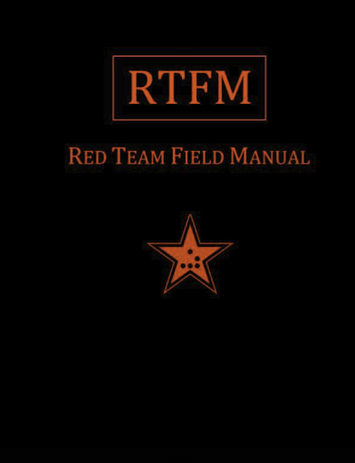
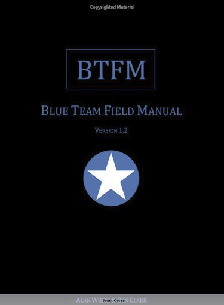
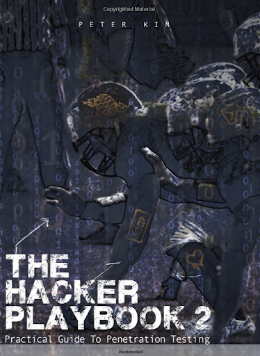

## Defensive resources
* [Firewall fundamentals](https://www.amazon.com/Firewall-Fundamentals-Wes-Noonan/dp/1587052210/ref=cm_cr_pr_sims_t)

## Secure programming:

#### Iron-clad Java - Jim Manico, August Detlefsen
  * Book (Amazon: [USA](https://www.amazon.com/Iron-Clad-Java-Building-Secure-Applications/dp/0071835881/) - [Germany](https://www.amazon.de/Iron-Clad-Java-Building-Secure-Applications/dp/0071835881/)
  * Subjects: Secure Coding, Java
#### The clean coder
  * Book
  * Subjects: Coding
  * Synopsis: On coding best practices and professional behavior

## Security awareness:

#### Komt een vrouw bij de h4cker - Maria Genova
  * Book, Dutch
  * Fictional
  * Subjects: Privacy, Identity-fraude
#### De Rode hack - Brenno de Winter, Victor Broers
  * Book, Dutch
  * Fictional
  * Subjects: Financial Fraude, Hacking
  * Synopsis: Fictional story, which brings true stories together to tell a terrifying (and very possible) story about holes in the financial system that could make it collapse.

## Privacy:

#### Je hebt wel iets te verbergen - Maurits Martijn & Dimitri Tokmetzis
  * Book
  * Subjects: Privacy, Surveillance
  * Synopsis: Most people don't care about privacy, thinking they have nothing to hide. But in truth, everyone has something to hide. "Arguing that you don't care about the right to privacy because you have nothing to hide is no different than saying you don't care about free speech because you have nothing to say," - Edward Snowden | |

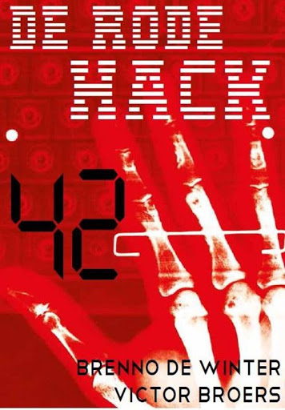
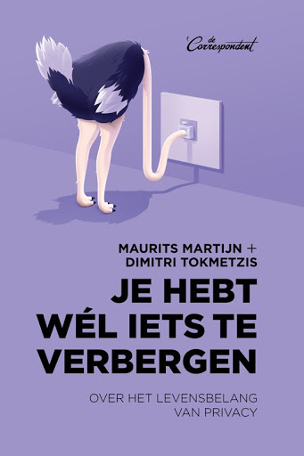

#### 1984 - George Orwell
  * Book, [Movie](https://www.imdb.com/title/tt0087803)
  * Fictional
  * Subjects: Privacy, Politics, Totalitarian state, Surveillance
  * Synopsis: Totalitarion future society of London where thinking, falling in love and any other personal differentiation is highly illegal.
#### The Circle - Dave Eggers
  * Book, [Movie](https://www.imdb.com/title/tt4287320/)
  * Fictional
  * Subjects: Privacy, Politics, Totalitarian state, Surveillance
  * Synopsis: Facebook-like company tries to record, store and make public all information, both public and private "for the greater good". But how good is a world where a single company has a monopoly on all information. | |
#### Snowden
  * [Movie](https://www.imdb.com/title/tt3774114)
  * Based on true events
  * Subjects: Privacy, Politics, Totalitarian state, Surveillance, NSA, Whistleblower, 
  * Synopsis: The story about how Edward Snowden became an NSA agent, leaked to the public details about illegal surveillance programs and had him fleeing to Hong Kong
#### Das Leben der Anderen
  * [Movie](https://www.imdb.com/title/tt0405094)
  * German (The lives of others)
  * Based on true events
  * Subjects: Privacy, Politics, Totalitarian state, Surveillance
  * Synopsis: About a Stasi agent surveilling a writer and his lover

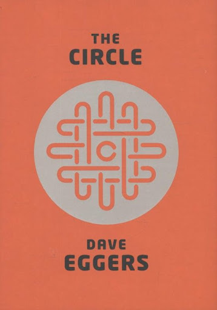
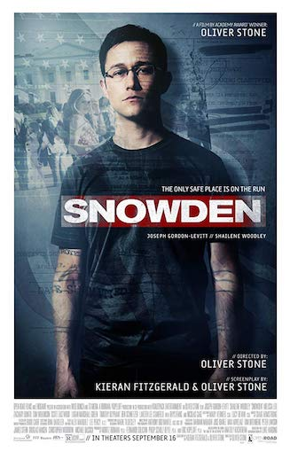
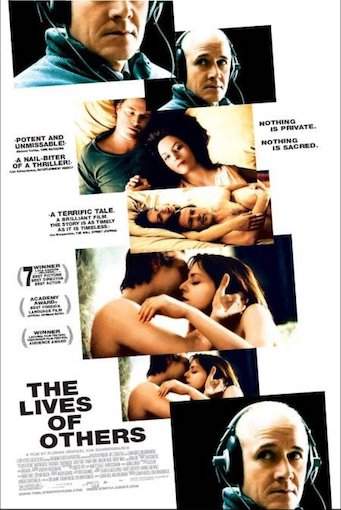

#### Citizenfour - Laura Poitras
  * [Documentary](https://www.imdb.com/title/tt4044364)
  * Documentary by Laura Poitras on the story of Edward Snowden, includes footage of interviews with Edward Snowden
  
## Darknet & Hacker stories

#### The darknet - [Jamie Bartlett](https://twitter.com/jamiejbartlett)
  * Book
  * Synopsis: Stories about the excesses of a free internet. Shows both sides of mostly controversial phenomenon, like webcam girls, crypto-currencies, information freedom, privacy
#### The World's most dangerous geek, [David Kushner](https://twitter.com/davidkushner)
  * Book, Audiobook
  * Synopsis: Several stories of controversial crime enabled by technology, internet connectivity and sometimes hacking

 
 

## Movies

#### Minority Report
  * [Movie](https://www.imdb.com/title/tt0181689)
  * Subjects: Surveillance, Predictive policing, Personalized advertising
  * Synopsis: Science fiction which has mostly become reality: drones scan retina -> facial recognition, personalized shopping experience -> instore WiFi tracking and crime-prediction through oracles -> big-data
#### Mr. Robot
  * [TV-series](https://www.imdb.com/title/tt4158110/)
  * Fictional
  * Subjects: Hacking
  * Synopsis: Highly realistic series on a vigilante hacker a corrupt company
#### Black Mirror
  * [TV-Series](https://www.imdb.com/title/tt2085059)
  * Fictional
  * Subjects: Hacking, Identity Fraude, Surveillance, Privacy, VR, Social Media, etc.
  * Synopsis: Series of isolated stories on how existing technologies could backfire when gone unchecked.
  * Cross-references: a number of episodes closely resemble story-elements of The Circle, namely:
    * [S1E3](https://www.imdb.com/title/tt2089050/) - The entire history of you (recording your entire life)
    * [S3E1](https://www.imdb.com/title/tt5497778/) - Nosedive (drive to boost social media ratings)
    * [S4E2](https://www.imdb.com/title/tt5709250/) - Arkangel (GPS tracking children for safety)

### Isaac Asimov - Law of Robotics
On robots in the following movies:
[Asimov](https://en.wikipedia.org/wiki/Isaac_Asimov)'s first [law of robotics](https://en.wikipedia.org/wiki/Three_Laws_of_Robotics), what if those laws fail?

#### Ex Machina
  * [Movie](https://www.imdb.com/title/tt0470752)
  * Subject: AI, Asimov's law of robotics
  * Synopsis: Mark Zuggerberg-like hermit invites employee to test his AI robot.
#### I, Robot
  * Book (Isaac Asimov), [movie](https://www.imdb.com/title/tt0343818)
  * Subject: AI, Asimov's law of robotics
  * Technophobic police officer investigates a crime apparently committed by a robot.
#### Westworld
  * [TV-Series](https://www.imdb.com/title/tt0475784)
  * Subject: AI, Asimov's law of robotics
  * Synopsis: In a real-life Wild-west themepark, guests can do whatever they like to the robotic hosts. Westworld questions the definition of life, existentialism and ethics regarding AI lifeforms. 

### Transhumanism
* [Transhumanism](https://en.wikipedia.org/wiki/Transhumanism)
* [Ray Kurzweil](https://en.wikipedia.org/wiki/Ray_Kurzweil) is a well known transhumanist who predicts that 2045 AI will surpass humans in both intelligence and development speed. He also predicts a future in which humans
will have eternal life either by continuously reparing diseases and aging by the use of nanobots or by transcending into the virtual world of the (successor of) the internet.

#### Transcendence
  * [Movie](https://www.imdb.com/title/tt2209764)
  * Synopsis: Futurologist and transhumanist scientist is forced to backup his conscienceness into a computer and gains omnipotence and omniscience.
#### Chappie
  * [Movie](https://www.imdb.com/title/tt1823672)
  * Subjects: AI, Transhumanism
  * Synopsis: Mark Zuggerberg-like wunderkind invented semi-AI which is used in a 100% robotized police-force, but has his Eureka moment when he gets real AI working.
#### The Matrix
  * [Movie](https://www.imdb.com/title/tt0133093)
  * Subjects: AI, VR
  * Synopsis: Computer hacker finds out reality as we know it, may just be a virtual cage to keep humans quiet.
#### Ghost in the shell
  * Manga book (1989), [Animated Movie](https://www.imdb.com/title/tt0113568) (1995), [Live action Movie](https://www.imdb.com/title/tt1219827) (2017)
  * Subjects: AI, Transhumanism, Cyborg / Cyber enhancements, Brain interfacing
  * Synopsis: The line between human and cyborg is blurred when many humans are transhumanized with cyber-enhanced brains, direct brain-internet connections and other body-enhancements. Cyborg Kusanagi finds out hacking brain and memories is a real thing.
#### The Transcendant Man
  * Documentary on Ray Kurzweil
  * Subjects: AI, Transhumanism, Cyborg / Cyber enhancements, Brain interfacing

## Entertainment

#### We are legion (we are Bob), Bobiverse #1 - [Dennis E. Taylor](https://twitter.com/Dennis_E_Taylor)
  * Book, Audiobook
  * Fictional
  * Subjects: Cryogenics, AI, Interstellar travel, Terraforming, Von Neumann probes
  * Synopsis: Dot-com billionaire buys cryogenic-treatment and instantly dies only to wake up as a Von Neumann AI
  * For we are many - Bobiverse #2, Dennis E. Taylor 
  * All these worlds - Bobiverse #3, Dennis E. Taylor
#### Ready player one - [Ernest Cline](https://twitter.com/erniecline)
  * Book, [Movie](https://www.imdb.com/title/tt1677720/)
  * Fictional
  * Subject: Privacy, Politics, Surveillance, SciFi, VR
  * Synopsis: Ultimate easter-egg adventure: Facebook-VR world inventor dies and gives his heritage to the one who finds the ultimate easter egg. Filled with 70's and 80's retro-references

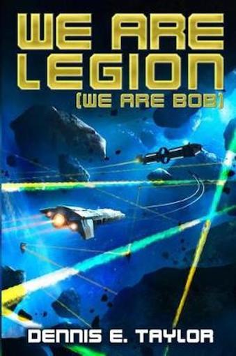
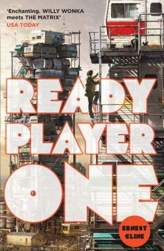

## Non-fiction / other
These are non-fiction books on subjects like Console gaming, Lego, Leadership and assertiveness:

#### Console wars - Tom Kalinski
  * Book
  * Subjects: Marketing, Console Gaming, SEGA, Nintendo, Brand management, Public Relations
  * Synopsis: Former Mattel CEO is tasked to challenge Goliath Nintendo - Great marketing book and flashback to 16-bit gaming era

#### Brick by brick - 
  * Book
  * Subjects: Marketing, innovation & leadership within The Lego Group
  * Synopsis: How The Lego Company was saved from bankruptcy, twice.

### Ricardo Semler
  * [TED-talk](https://www.ted.com/talks/ricardo_semler_how_to_run_a_company_with_almost_no_rules)

#### Seven day weekend
  * Book (Amazon [Germany](https://www.amazon.de/Seven-Day-Weekend-Better-Work-Century/dp/0099425238/) - [USA](https://www.amazon.com/Seven-Day-Weekend-Better-Work-Century/dp/0099425238/) )
  * Subjects: Leadership, Self-management, Work-life balance

#### Maverick
  * Book (Amazon [Germany](https://www.amazon.de/Maverick-Success-Behind-Unusual-Workshop/dp/0712678867/) - [USA](https://www.amazon.com/Maverick-Success-Behind-Unusual-Workshop/dp/0712678867/) )

#### Start with Why - Simon Sinek
  * Subjects: Leadership, Customer Satisfaction, Employee Satisfaction, Marketing, Brand Management
  * Synopsis: The golden circle of Why, How, What (in that order) to create loyal employees and customers

#### Hack your career - Troy Hunt
  * [Hack your career](https://www.youtube.com/watch?v=-MUhcgXBj_A)
  * Troy Hunt's view on how you can control your career and life satisfaction
  * Subjects: Leadership, career building, Personal brand management
  * Also see: The clean coder

#### The life-changing magic of Not giving a F*ck - Sarah Knight
  * Synopsis: Parody on Marie Kondo's The life-changing magic of Tidying up, Sarah Knight's version of not giving an F, may be even more useful to live a happy life and just say "No" to the things you don't want, so you have more time to say "Yes" to the things that make you happy. Being honest, but polite has never been (described as) so easy.

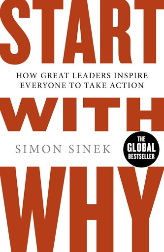
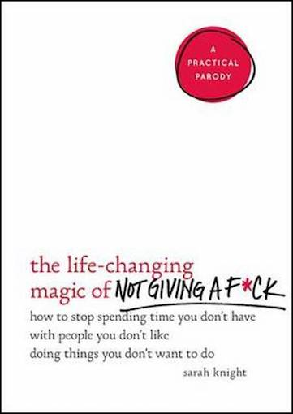

