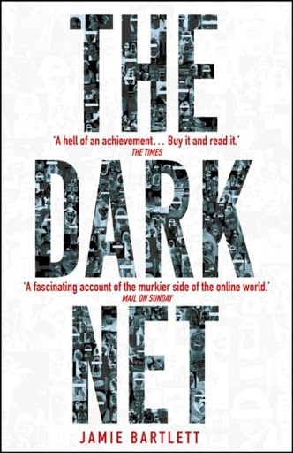
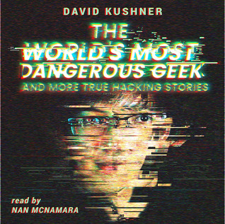

# Books, documentaries & Films

## Hacking resources
* RTFM: Red Team Field Manual, Ben Clark [Download](h)
* BTFM: Blue Team Field Manual, 
* Hacker playbook (2 or 3), Peter Kim [Download of v2](https://github.com/tanc7/hacking-books/blob/master/The%20Hacker%20Playbook%202%2C%20Practical%20Guide%20To%20Penetration%20Testing%20By%20Peter%20Kim.pdf)

## Secure Coding

* Iron-clad Java, Jim Manico & August Detlefsen - Amazon [USA](https://www.amazon.com/Iron-Clad-Java-Building-Secure-Applications/dp/0071835881/) | [Germany](https://www.amazon.de/Iron-Clad-Java-Building-Secure-Applications/dp/0071835881/)

| Title     | Book  | eBook | Audiobook | Movie | Fiction   | Subjects                      | Description                   | Downloads |
| --------- | ----- | ----- | --------- | ----- | --------- | ----------------------------- | ----------------------------- | --------- |
| RTFM      | ✅    | ✅    |           |       |           | Security, Hacking             | Red Team Field Manual         | [here](https://github.com/tanc7/hacking-books/blob/master/RTFM%20-%20Red%20Team%20Field%20Manual%20v3.pdf) |
| BTFM      | ✅    |       |           |       |           |

## Fiction
* Komt een vrouw bij de hacker (Dutch), Maria Genova
* De Rode hack (Dutch), Brenno de Winter & Victor Broers - Fictional story, which brings true stories together to tell a terrifying (and very possible) story about holes in the financial system that could make it collapse.

## Privacy
* The circle, Dave Eggers - Facebook-like company tries to record, store and make public all information, both public and private "for the greater good". But how good is a world where a single company has a monopoly on all information.
* Je hebt wel iets te verbergen (Dutch: You DO have something to hide),  Maurits Martijn & Dimitri Tokmetzis - Most people don't care about privacy, thinking they have nothing to hide. But in truth, everyone has something to hide. "Arguing that you don't care about the right to privacy because you have nothing to hide is no different than saying you don't care about free speech because you have nothing to say," - Edward Snowden
* [1984](https://www.imdb.com/title/tt0087803): Totalitarion future society of London where thinking, falling in love and any other personal differentiation is highly illegal.
* [Das Leben der Anderen](https://www.imdb.com/title/tt0405094) (German, The lives of others): About a Stasi agent surveilling a writer and his lover
* [Snowden](https://www.imdb.com/title/tt3774114): The story about how Edward Snowden became an NSA agent, leaked to the public details about illegal surveillance programs and had him fleeing to Hong Kong
* [Citizenfour](https://www.imdb.com/title/tt4044364): Documentary by Laura Poitras on the story of Edward Snowden

## Non-hacking resources
* The darknet, Jamie Bartlett - Stories about the excesses of a free internet. Shows both sides of mostly controversial phenomenon, like webcam girls, crypto-currencies, information freedom, privacy
* The World's most dangerous geek, David Kushner - Several stories of controversial crime enabled by technology, internet connectivity and sometimes hacking
* The clean coder - On coding best practices and professional behavior

 
 

## SciFi
These are non-security or privacy book and movies that are quite interesting reads (beware: some minor spoilers)
* We are legion (we are Bob) - Bobiverse #1,  Dennis E. Taylor - Dot-com billionaire buys cryogenic-treatment and instantly dies only to wake up as a Von Neumann AI
  * For we are many - Bobiverse #2, Dennis E. Taylor 
  * All these worls - Bobiverse #3, Dennis E. Taylor
* Ready player one, Ernest Cline - Ultimate easter-egg adventure: Facebook-VR world inventor dies and gives his heritage to the one who finds the ultimate easter egg. Filled with 70's and 80's retro-references

* [Minority report](https://www.imdb.com/title/tt0181689): Science fiction which has mostly become reality: drones scan retina -> facial recognition, personalized shopping experience -> instore WiFi tracking and crime-prediction through oracles -> big-data
* [Mr. Robot](https://www.imdb.com/title/tt4158110/): Highly realistic series on a vigilante hacker a corrupt company
* [Black Mirror](https://www.imdb.com/title/tt2085059): Series of isolated stories on how existing technologies could backfire when gone unchecked.
  * Cross-references: a number of episodes closely resemble story-elements of The Circle, namely:
    * S1E3 - The entire history of you (recording your entire life)
    * S3E1 - Nosedive (drive to boost social media ratings)
    * S4E2 - Arkangel (GPS tracking children for safety)

On robots in the following movies:
[Asimov](https://en.wikipedia.org/wiki/Isaac_Asimov)'s first [law of robotics](https://en.wikipedia.org/wiki/Three_Laws_of_Robotics), what if those laws fail?
* [Ex Machina](https://www.imdb.com/title/tt0470752): Mark Zuggerberg-like hermit invites employee to test his AI robot.
* [I, Robot](https://www.imdb.com/title/tt0343818): Technophobic police officer investigates a crime apparently committed by a robot (book by Asimov).
* [Westworld](https://www.imdb.com/title/tt0475784): In a real-life Wild-west themepark, guests can do whatever they like to the rootic hosts. Westworld questions about life, existentialism and ethics against AI lifeforms. 

On [transhumanism](https://en.wikipedia.org/wiki/Transhumanism) in the following movies:
[Ray Kurzweil](https://en.wikipedia.org/wiki/Ray_Kurzweil) is a well known transhumanist who predicts that 2045 AI will surpass humans in both intelligence and development speed. He also predicts a future in which humans
will have eternal life either by continuously reparing diseases and aging by the use of nanobots or by transcending into the virtual world of the (successor of) the internet.

* [Transcendence](https://www.imdb.com/title/tt2209764): Futurologist and transhumanist scientist is forced to backup his conscienceness into a computer and gains omnipotence and omniscience.
* [Chappie](https://www.imdb.com/title/tt1823672): Mark Zuggerberg-like wunderkind invented semi-AI which is used in 1 100% robotized police-force, but has his Eureka moment when he gets real AI working.
* [The Matrix](https://www.imdb.com/title/tt0133093): Computer hacker finds out reality as we know it, may just be a virtual cage to keep humans quiet.
* [Ghost in the shell](https://www.imdb.com/title/tt0113568): First manga book 1989 !! The line between human and cyborg is blurred when many humans are transhumanized with cyber-enhanced brains, direct brain-internet connections and other body-enhancements. Cyborg Kusanagi finds out hacking brain and memories is a real thing.
* [Ghost in the Shell](https://www.imdb.com/title/tt1219827): 2017 live-action movie with Scarlett Johansson

## Non-fiction / other
These are non-fiction books on subjects like Console gaming, Lego, Leadership and assertiveness:

* Console wars - Tom Kalinski, former Mattel CEO is tasked to challenge Goliath Nintendo - Great marketing book, but flashback to 16-bit gaming era
* Brick by brick - Marketing, innovation & leadership within The Lego Group
* Start with Why, Sinom Sinek - The golden circle of Why, How, What (in that order) to create loyal employees and customers
* The life-changing magic of Not giving a F*ck, Sarah Knight - Parody on Marie Kondo's The life-changing magic of Tidying up, Sarah Knight's version of not giving an F, may be even more useful to live a happy life and just say "No" to the things you don't want, so you have more time to say "Yes" to the things that make you happy. Being honest, but polite has never been (described as) so easy.

