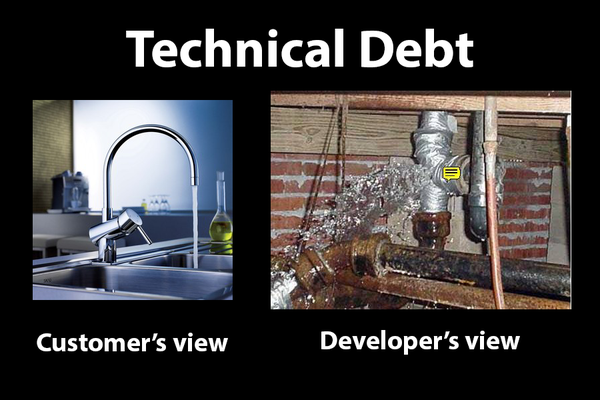
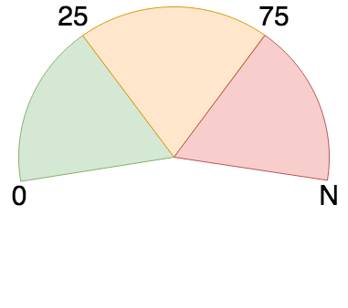
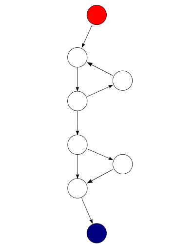
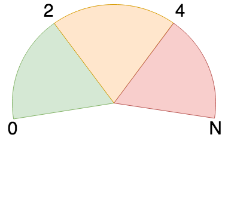
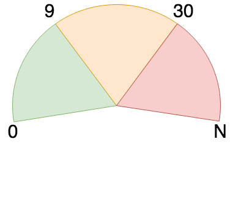
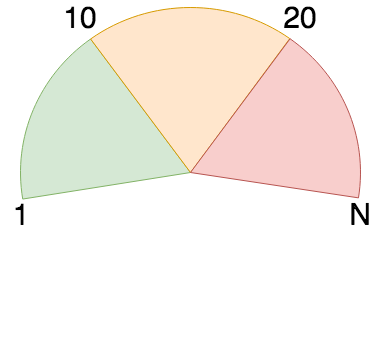
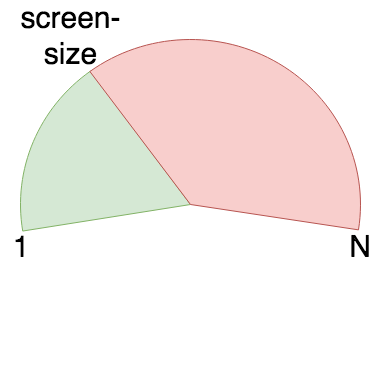
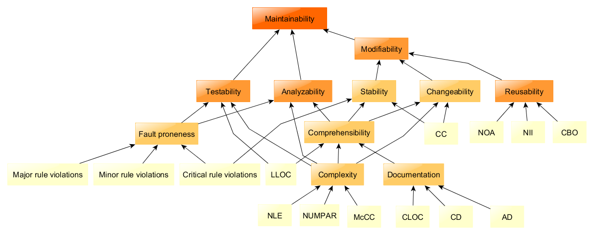

# Code Quality



## Restaurant Metaphore

Sources:
* [comment](https://news.ycombinator.com/item?id=25008587) as listed below
* [Blog](https://www.defmyfunc.com/2019-08-28_an_analogy_for_software_development/)

"If you run a commercial kitchen and you only ever cook food, because selling cooked food is your business -- if you never clean the dishes, never scrape the grill, never organize the freezer -- the health inspector will shut your shit down pretty quickly.
 
 Software, on the other hand, doesn't have health inspectors. It has kitchen staff who become more alarmed over time at the state of the kitchen they're working in every day, and if nothing is done about it, there will come a point where the kitchen starts failing to produce edible meals.
 
 Generally, you can either convince decision makers that cleaning the kitchen is more profitable in the long run or you can dust off your resume and get out before it burns down."


# Code metrics

Code quality metrics and standards in general can have a serious indirect influence on how secure specific code is. Code quality can be divided into several subjects which influence the ease with which code can be maintained.

* [Top 15 best practices for readable code](https://code.tutsplus.com/tutorials/top-15-best-practices-for-writing-super-readable-code--net-8118)
* [Code C.R.A.P.](https://www.artima.com/weblogs/viewpost.jsp?thread=215899): Change Risk Analysis and Predictions / Change Risk Anti-Patterns
  * [CRAP 4 Java](http://www.crap4j.org/)

## Definitions

* System: The system or application under review
* Component: Code grouped together based on common traits. Mostly corresponds with a package. Eg. A Java package like ```java.util``` or ```org.apache.commons.collections```.
* Module: A delimited group of declaration. Mostly corresponds with a class or file.
* Unit: The smallest named piece of code. Mostly corresponds with a method or function.


## Code quality

Here are the five basic code quality metrics: 

### Maintainability

Maintainability measures the ease with which code can be changed, bugs can be fixed and extended. 

#### .NET

Using Visual Studio, the maintainability score can be calculated. This produces an integer value of 0 to 100, whereby larger values indicate a higher (better) maintainability. Microsoft advises to keep the score above 20, though I'ld advise to also look at code that scores between 20-50. The index is an aggregated score of several indexes, including cyclomatic complexity, lines of code and the Halstead volume. 



* Maintainability index: See Visual Studio support
  * 0-24: Low
  * 25-74: Moderate
  * 75-100: Good

* [source](https://blogs.msdn.microsoft.com/zainnab/2011/05/26/code-metrics-maintainability-index/)


### Cyclomatic Complexity

This metric indicated the complexity of code and is best calculated per unit (method). The index is calculated by defining the total number of independent branches or possible paths within a method. More paths means a higher index, which indicates higher complexity. The expressions and operands that increase the index are:
* ```if```
* Each ```case``` and ```default``` in a ```switch```
* ```for```, ```foreach``` and ```while```
* ```catch``` and ```throw``` or ```throws```
* ```&&```, ```&```, ```||```, ```|```, , ```^```, ```a ? b : c```, ```x ?? y```


Cyclomatic complexity can be calculated using the formula below. The formal definition of the cyclomatic complexity v(G) is based on the representation of a method's control flow graph as a directed graph, where

* E is the number of edges
* N the number of nodes
* P is the number of connected components 
```
v(G) = E - N + 2P
```
Since we will only review complexity of methods, which always connect all code from start to end, P will always be 1 and we can simplify the formula to:
```
v(G) = E - N + 2
```

This results in a value of 2 or higher. Keeping the index below 11 for scope of methods is best, though experienced teams could choose to set the threshold to 15 if done with care.



In this graph, we see 9 edges and 8 nodes. Therefore the complexity is ```9 - 8 + 2 = 3```

Cyclomatic complexity directly influences the minimum number of tests required to potentially cover all the code in unit-tests.


### MSDN

Based on Microsoft Developer Network best practices, the following rating is used to rank units:
* 2-10: Good
* 11-20: Okay
* 21+: Avoid


### SIG

Rate all units based on the following table: 

| Cyclomatic Complexity | Complexity   | Risk              |
|-----------------------|--------------|-------------------|
| 1-10                  | Simple       | Without much risk |
| 11-20                 | More Complex | Moderate risk     |
| 21-50                 | Complexity   | High risk         |
| >50                   | Untestable   | Very high risk    |

* For each unit, if this unit has risk (CC of 11+), add the number of lines of that unit to the corresponding risk category. 
* Calculate the total number of lines of the system
* Relate the total number of lines for each risk category as a percentage of the total lines of code.
* Review the lowest rank based on the table below:
  * For each risk category, take the percentage of code that falls into that risk category and rank it to the maximum allowed percentages in the table below.
  * Take the lowest rank rated over all risk categories. The system as a whole has this ranking

| Rank | Score | Moderate | High   | Very High |
|------|-------|----------|--------|-----------|
| ++   | 1     | 25.00%   | 0.00%  | 0.00%     |
| +    | 0.5   | 30.00%   | 5.00%  | 0.00%     |
| 0    | 0     | 40.00%   | 10.00% | 0.00%     |
| -    | -0.5  | 50.00%   | 15.00% | 5.00%     |
| --   | -1    | -%       | -%     | -%        |

Example:
* A system with 10000 lines of code in total
* Lines of code in units with:
  * simple complexity total 6700
  * moderate complexity total 2600
  * high complexity total 700
  * there are no lines with very high complexity
* Percentages calculate the following ratings:
  * 67% with no risk: ++
  * 26% with moderate risk: +
  * 7% with high risk: 0
* This rates the system into the 0 rank
* If the code is refactored to limit the high complexity code to 500 lines of code, this will improve the rating to +

### Sources
* [Wikipedia](https://en.wikipedia.org/wiki/Cyclomatic_complexity)

#### Java

JaCoCo calculates cyclomatic complexity of a method with the following equivalent formula where:
* B is the number of branches
* D is the number of decision points

```
v(G) = B - D + 1
```

Tools to calculate Cyclomatic complexity for your code:
* [SonarQube](https://docs.sonarqube.org/latest/user-guide/metric-definitions/)
  * Works with the [SQALE](https://en.wikipedia.org/wiki/SQALE) model, which maps reasonably well on ISO-25010
* [JaCoCo](https://www.eclemma.org/jacoco/)
* [Eclipse Metrics plugin](https://github.com/qxo/eclipse-metrics-plugin)

#### .NET

Visual Studio contains the Code Metrics functionality to calculate Cyclomatic Complexity

* [MSDN Blog](https://blogs.msdn.microsoft.com/zainnab/2011/05/17/code-metrics-cyclomatic-complexity/)
* [C-Sharp corner](https://www.c-sharpcorner.com/article/code-metrics-cyclomatic-complexity/)

### Unit Size

Rate all units based on the following table: 

| Unit Size | Risk              |
|-----------|-------------------|
| 1-24      | Without much risk |
| 25-31     | Moderate risk     |
| 32-48     | High risk         |
| 49+       | Very high risk    |

* For each unit, if this unit has risk (Unit Size of 25+), add the number of lines of that unit to the corresponding risk category. 
* Calculate the total number of lines of the system
* Relate the total number of lines for each risk category as a percentage of the total lines of code.
* Review the lowest rank based on the table below:
  * For each risk category, take the percentage of code that falls into that risk category and rank it to the maximum allowed percentages in the table below.
  * Take the lowest rank rated over all risk categories. The system as a whole has this ranking

| Rank | Score | Moderate | High   | Very High |
|------|-------|----------|--------|-----------|
| ++   | 1     | 25.00%   | 0.00%  | 0.00%     |
| +    | 0.5   | 30.00%   | 5.00%  | 0.00%     |
| 0    | 0     | 40.00%   | 10.00% | 0.00%     |
| -    | -0.5  | 50.00%   | 15.00% | 5.00%     |
| --   | -1    | -%       | -%     | -%        |

Example:
* A system with 10000 lines of code in total
* Lines of code in units with:
  * small units up to 24 lines total 6700 lines of code
  * medium sized units of 25 to 31 lines total 2600 lines of code
  * large units of 32 to 48 lines total 700 lines of code
  * there are no lines with very high complexity
* Percentages calculate the following ratings:
  * 67% with no risk: ++
  * 26% with moderate risk: +
  * 7% with high risk: 0
* This rates the system into the 0 rank
* If the code is refactored to limit the large units to total 500 lines of code, this will improve the rating to +

### Inheritence

The depth of inheritance metric indicates the depth of the inheritance chain, including classes and interfaces. Higher inheritence depth means a more complex object hierarchy. Lower values are better because it will be easier to follow the flow of the code when debugging or analyzing. 



Code Metrics Viewer rates the metric value the following way:
* 1-2 base types are good
* 3-4 base types are still okay
* everything above 4 is critical and should be reviewed and possibly refactored

[Source](https://codemetricsviewer.wordpress.com/2011/06/26/how-to-interpret-received-results/)

### Class coupling

Class coupling indicates how dependent a class is upon other classes. 

This metric can be used as an indicator of how evolvable a function, a class, or at least an assembly project actually is. 
It is calculated for each level and represents the number of types (excluding built-in language types) being used by a method, class, etc.. 
Lower values are better. 

Code Metrics Viewer rates this metric value the following way: 

* Per member (method) 


* Per type (class, interface, enum)

  
* [source](https://blogs.msdn.microsoft.com/zainnab/2011/05/25/code-metrics-class-coupling/)

### Lines of code

Lines of code is both a measurement of quality and readability. This will mean that there are two thresholds to adhere to. Always take the lower threshold.
For both criteria, the lines of code are measured in context of a single method. For the quality criteria, a method with more lines of code will often 
fulfil more than one purpose and will therefore be much harder to test. Keeping a method simple and focused will result in smaller methods.

Code Metrics Viewer rates this metric value the following way: 



## Additional metrics
* Number of methods per class:
  * Aim for max 20
* Number of fields per class:
  * Aim for max 20
* Number of Parameters per method: too many parameters are more complex.
* Number of Variables per method: Larger numbers is more difficult to maintain.
* Class Coupling: number of unique classes used in a class as parameters, local vars, return types etc
  * Low coupling (low number of references classes) is better
* Afferent coupling: Inbound coupling from types outside of the assembly
* Efferent Coupling: Outbound coupling, determined by the number of types outside an assembly that are used by child types of the assembly
* Relational Cohesion: Average number of internal relationships per type

# Reusability

TODO:
* [Measuring Code reusability](https://stackoverflow.com/questions/3184432/measuring-code-reusability)
* [Code Reuse is not a good goal](https://blog.ndepend.com/code-reuse-not-good-goal/)


# Readability

```
//When I wrote this, only God and I understood what I was doing
//Now, God only knows
```

[Source](https://stackoverflow.com/questions/184618/what-is-the-best-comment-in-source-code-you-have-ever-encountered/316233#316233)

## Inline comments

* [Comments tell you why](https://blog.codinghorror.com/code-tells-you-how-comments-tell-you-why/)
* [Wikipedia](https://en.wikipedia.org/wiki/Comment_\(computer_programming\))
* [Coding standards for clarity](https://softwareengineering.stackexchange.com/questions/336430/coding-standard-for-clarity-comment-every-line-of-code)
* [Force people to read and understand code](https://softwareengineering.stackexchange.com/questions/201657/forcing-people-to-read-and-understand-code-instead-of-using-comments-function-s)

## Formatting


## Code grouping
Grouping code and methods in classes based on functionality

## Naming conventions


## Duplicate code / DRY
[Artima](https://www.artima.com/intv/dry.html)


## Nesting

Ternary operator:

Use with caution and basically never nest this, because it will become complex very soon.

```
a = (condition) ? 10 : 20
// A will be 10 if condition is true, otherwise 20
```

[DNA Web Agency](http://www.dnawebagency.com/ternary-operator/)

## Structure


## Separation of concerns

Sources:
* [Wikipedia](https://en.wikipedia.org/wiki/Separation_of_concerns)
* [Stackexchange](https://softwareengineering.stackexchange.com/questions/81899/how-should-i-organize-my-source-tree) discussion


## Lines of code

For readability lines of code is a heavily debated metric. The threshold for an acceptable number of lines of code is dependant on a number of factors, 
including screen-size / resolution, team preference, IDE's used etc. The threshold is measured in context of a single method. The threshold is simply 
having all lines of code for a single method be visible without having to scroll. Always reason from the least optimistic scenario. So take the screen, 
IDE etc. from the team-member who can display the least number of lines on his / her screen.



## Line length

TODO

# Generic sources:

* Wikipedia [List](https://en.wikipedia.org/wiki/List_of_tools_for_static_code_analysis) of Static Code Analysis Tools
* [Awesome Static Analysis](https://github.com/mre/awesome-static-analysis) list of tools
* [ISO 25010](https://edisciplinas.usp.br/pluginfile.php/294901/mod_resource/content/1/ISO%2025010%20-%20Quality%20Model.pdf)
* [Visual Studio Code Metrics](http://www.blackwasp.co.uk/VSCodeMetrics.aspx)
* [Static Code Analysis and Quality Metrics](https://ardalis.com/static-code-analysis-and-quality-metrics)
* [CodeMetrics viewer](https://codemetricsviewer.wordpress.com/2011/06/26/how-to-interpret-received-results/)


## Java

* List of Java tools by [Martin Monperrus](https://www.monperrus.net/martin/java-metrics)
* Blog by Eugen Paraschiv on [Baeldung](https://www.baeldung.com/java-static-analysis-tools) on Java static analysis tools
* [JavaNCSS](http://www.kclee.de/clemens/java/javancss/), sourcecode [here](https://github.com/nokia/javancss)
  * Languages: Java
  * Metrics: Non Commenting Source Statements (NCSS), Cyclomatic Complexity, Count Packages, classes, functions, inner classes, formal Javadoc comments per class and method.
  * Formats: XML, HTML, SVG
  * Licence: GNU GPL
  * Runs on: JVM
* [SpotBugs](https://github.com/spotbugs/spotbugs) (successor to FindBugs), Official [site](https://spotbugs.github.io/) and [documentation](https://spotbugs.readthedocs.io/en/latest/)
  * Languages: Java
  * Metrics: Potential bugs, Access to foreign Data, Cyclomatic Complexity, Lines of Code, Non-commenting source statements, NPath complexity, Number of Public Attributes, Number of Accessor Methods, Tight Class Cohesion, Weighted Method Count, Weight of Class (full [list](https://pmd.github.io/pmd-6.15.0/pmd_java_metrics_index.html) and descriptions)
  * Formats: 
  * Licence: GNU LGPL
  * Runs on: JVM
* [PMD](https://pmd.github.io/)
  * Languages: Java, JavaScript, Salesforce.com Apex and Visualforce, PLSQL, Apache Velocity, XML, XSL 
  * Metrics: Common programming flaws
  * Formats: 
  * Licence: [BSD-style](https://pmd.github.io/pmd-6.25.0/license.html) / Apache License
  * Runs on: Linux, Mac OSX, Windows, [IntelliJ](https://pmd.github.io/pmd-6.15.0/pmd_userdocs_tools.html#idea), [Eclipse](https://pmd.github.io/pmd-6.15.0/pmd_userdocs_tools.html#eclipse), [Maven](https://pmd.github.io/pmd-6.15.0/pmd_userdocs_tools_maven.html)
* [JaCoCo](https://www.eclemma.org/jacoco/)
  * Languages: Java
  * Metrics: Code Test coverage
  * Formats: 
  * Licence: [Eclipse Public License](https://www.jacoco.org/jacoco/trunk/doc/license.html)
  * Runs on: JVM
* [Cobertura](https://cobertura.github.io/cobertura/) Code Coverage tool
  * Languages: Java
  * Metrics: Code Test coverage
  * Formats: 
  * Licence: [GNU GPL v2.0](https://github.com/cobertura/cobertura/blob/master/LICENSE.txt/)
  * Runs on: JVM
* [Checkstyle](http://checkstyle.sourceforge.net/)
  * Languages: Java
  * Metrics: Code quality metrics, customizable using rules-sets
  * Formats: HTML [Example](http://maven.apache.org/plugins/maven-checkstyle-plugin/checkstyle.html)
  * Licence: [LGPL](http://checkstyle.sourceforge.net/license.html)
  * Runs on: JVM

## Line Counters

* [SLOCCount](https://dwheeler.com/sloccount/)
  * Languages: C, C++, C#, Java, Python, Ruby, PHP etc. Full [list](https://dwheeler.com/sloccount/)
  * Metrics: Count physical Source Lines of Code (SLOC)
  * Formats: 
  * Licence: GNU GPL
  * Runs on: Linux, FreeBSD, Apple Mac OS X, Windows
* [Cloc](http://cloc.sourceforge.net/)
  * Languages: Java, C, C++, C#, VB, Ruby, Groovy, etc. Full [list](http://cloc.sourceforge.net/#Languages)
  * Metrics: Blank lines, Comment lines, Physical lines of source code
  * Formats: plain text, SQL, XML, YAML, comma separated values
  * Licence: [GNU GPL](http://cloc.sourceforge.net/#License)
  * Runs on: Windows, Linux, Mac OS X, FreeBSD, NetBSD, OpenBSD, AIX, HP-UX, Solaris, IRIX, z/OS systems with Perl 5.6 or higher 
* [Code Analyzer](http://www.codeanalyzer.teel.ws/)
  * Languages: C, C++, Java
  * Metrics: Total Files, Total Lines, Code Lines, Comment Lines, Whitespace Lines, Average Line Length, Code Lines/File (For multiple file metrics), Comment Lines/File, Code/Comments Ratio, Code/Whitespace Ratio, Code/(Comments + Whitespace) Ratio
  * Formats: CSV, Excel, OpenOffice, HTML
  * Licence: GNU GPL
  * Runs on: JVM

## Code Quality metrics

* [SourceMonitor](http://www.campwoodsw.com/sourcemonitor.html)
  * Languages: C++, C, C#, VB.NET, Java, Delphi, Visual Basic (VB6) or HTML
  * Metrics: 
  * Formats: XML, CSV
  * Licence: Custom [FreeWare](http://www.campwoodsw.com/smlicense.html) licencse from Campwood Software
  * Runs on: Windows
* [NDepend](https://www.ndepend.com/)
  * Languages: C#, .NET
  * Metrics: 
  * Formats: 
  * Licence: [Commercial](https://www.ndepend.com/purchase)from Euro 399,- per dev. to Euro 999,- per pack of 5 devs
  * Runs on: 
* [CMTJava](http://www.testwell.fi/cmtjdesc.html)
  * Languages: Java
  * Metrics:
    * McCabe's cyclomatic number
    * Halstead's software science metrics
    * Lines of code metrics
    * Number of semicolons
    * Number of Java comment blocks /** ... */
    * Number of method parameter
    * Depth of control structure nesting
    * Maintainability Index
  * Formats:
    * Textual
    * HTML
    * XML
    * Excel
  * Licence: 
  * Runs on: Windows, Linux, HP-UX, Solaris
* [CTC++](http://www.testwell.fi/ctcdesc.html)
  * Languages: C, C++
  * Metrics: 
  * Formats: 
  * Licence: 
  * Runs on: 
* [CMT++](http://www.testwell.fi/cmtdesc.html)
  * Languages: C, C++, C#
  * Metrics:
    * McCabe's cyclomatic number
    * Halstead's software science metrics
    * Lines of code metrics
    * Number of semicolons
    * Number of function parameter
    * Depth of control structure nesting
    * Maintainability Index
  * Formats: 
    * Textual
    * HTML
    * XML
    * Excel
  * Licence: 
  * Runs on: 
* [JHawk](http://www.virtualmachinery.com/Jhawkmetricslist.htm)
  * Languages: 
  * Metrics: (complete list [here](http://www.virtualmachinery.com/Jhawkmetricslist.htm))
    * McCabes Cyclomatic Complexity
    * Number of Arguments
    * Number of Comments
    * Number of Comment Lines
    * Variable Declarations
    * Variable References
    * Number of statements
    * Number of expressions
    * Max depth of nesting
    * Halstead's software science metrics
    * Total depth of nesting
    * Number of class casts
    * Number of loops
    * Number of operators
    * Number of operands
    * Class References referenced in the method
    * External methods called by the method
    * Local methodscalled by the method
    * Exceptions referenced
    * Exceptions thrown
    * Modifiers (static, public etc)
    * Lines of Code
  * Formats: 
  * Licence: [Commercial](http://www.virtualmachinery.com/jhawklicensing.htm) ranging from $30 (limited) to $145 (professional) up to $900 (corporate)
  * Runs on: 
* [Klocwork Insight](https://www.roguewave.com/products-services/klocwork)
  * Languages: C, C++, C#, Java
  * Metrics: 
  * Formats: 
  * Licence: [Commercial]() (not listed on site)
  * Runs on: 
* [CAST AIP](https://www.castsoftware.com/products/application-intelligence-platform)
  * Languages: 
  * Metrics: 
  * Formats: 
  * Licence: []
  * Runs on: 

# 12 ways to make your code suck less
[Source](https://www.youtube.com/watch?v=nVZE53IYi4w) by [Venkat Subramaniam](https://www.twitter.com/venkat_s)

## Intro
* We can't be agile if our code sucks
* Code is how we tell our colleagues how we feel about them
* "Lowering quality lengthens development time" - First law of Programming, [source](http://c2.com/cgi/wiki?FirstLawOfProgramming)
* What's Quality Code?
  * The quality of code is inversely proportional to the effort it takes to understand it - [source](http://blog.agiledeveloper.com/2010/05/thoughts-through-tweets_15.html)
  * "If only we could compare the cost of quality with the cost of not having it..."

## Twelve ways we can help

### 12: Schedule time to lower technical debt
* What is technical debt? [Ward Cunningham](http://c2.com/cgi/wiki?WardExplainsDebtMetaphor)

### 11: Favor high cohesion
* High cohesion == low cyclomatic complexity

### 10: Favor loose coupling
* Tight coupling makes code:
  * Hard to extend
  * Hard to test

### 09: Program with intention
```
//When I wrote this, only God and I understood what I was doing
//Now, God only knows
```
[source](https://stackoverflow.com/questions/184618/what-is-the-best-comment-in-source-code-you-have-ever-encountered)

Beck's rule for simple design (in this order):
* Passes the tests
* Reveals intention
* No duplication
* Fewest elements

[source](http://martinfowler.com/bliki/BeckDesignRules.html)

Program deliberately: write tests before writing code. This forces you to think about how the code will be used.

### 08: Avoid primitive obsession
Good code should read like a story, not a puzzle

### 07: Prefer clear code over clever code

* Programs must be written for people to read, and only incidentally for machines to execute - Abelson and Sussman
* 10% of the time, we write ugly code for performance reasons, the other 90% of the time, we write ugly code to be consistent
* Those who sacrifice quality to get performance may end up getting neither
* There are two ways of constructing software design.
  * One way is to make it so simple that there are obviously no deficiencies
  * and the other is to make it so complicated that there are no obvious deficiencies - Tony Hoare

### 06: Apply Zinsser's principle on writing

On writing well, the classic guide to writing nonfiction - William Zinsser

* Simplicity
* Clarity
* Brevity
* Humanity

### 05: Comment why, not what
* Don't comment to cover up bad code
* Write expressive self-documenting code
* Good code is like a good joke, Writing comments is like explaining a joke

### 04: Avoid long methods - Apply SLAP
* Single Level of Abstraction Principle (SLAP)
* Keep indention / levels to a minimum (Limited width)

Perils of Long methods:
* Hard to understand
* Hard to test
* Lead to duplication
* Hard to reuse
* Become longer
* Low cohesion
* Increase coupling

### 03: Give good meaningful names
* Programmer: person who can name their children quite easily but has a hard time naming their variables
* Variable names represent abstraction
* If we can't name a variable or function properly, it may be a sign we've not yet understood its true purpose

### 02: Do tactical code reviews
* Peer reviews catch 60% of defects
* Perspective-based reviews catch 35% more defects than non-directed reviews
* Peer reviews complement testing
* Technical and social activity

### 01: Reduce state & state mutation


## Sources

### ISO
* [ISO 9126](https://en.wikipedia.org/wiki/ISO/IEC_9126)
* ISO-25010




### SIG

Software Improvement Group
* [Software analysis based on international standards](https://www.softwareimprovementgroup.com/methodologies/iso-iec-25010-2011-standard/)
* [SIG/TÜViT Evaluation Criteria Trusted Product Maintainability: Guidance for producers](https://www.softwareimprovementgroup.com/wp-content/uploads/2020-SIG-TUViT-Evaluation-Criteria-Trusted-Product-Maintainability-Guidance-for-producers.pdf) v12.0 (2020)
* [SIG/TÜViT Evaluation Criteria Trusted Product Maintainability: Guidance for producers](https://www.softwareimprovementgroup.com/wp-content/uploads/2019/11/20190919-SIG-TUViT-Evaluation-Criteria-Trusted-Product-Maintainability-Guidance-for-producers.pdf) v11.0 (2019)
* [A-Practical-Model-for-Measuring-Maintainability.pdf](https://www.softwareimprovementgroup.com/wp-content/uploads/2019/10/APracticalModelForMeasuringMaintainability.pdf)

### Microsoft Develop Network

* [MSDN Blog](https://blogs.msdn.microsoft.com/zainnab/2011/05/17/code-metrics-cyclomatic-complexity/)