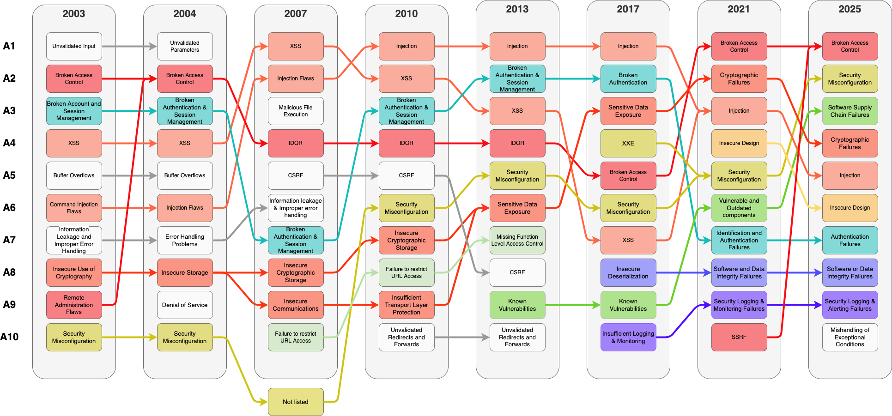

# OWASP Top 10


Version 2025 found [here](https://owasp.org/Top10/2025/)
Version 2021 found [here](https://owasp.org/Top10/2021/)
Version 2017 found [here](https://www.owasp.org/images/7/72/OWASP_Top_10-2017_%28en%29.pdf.pdf)



## Broken Access Control

[Source](https://owasp.org/Top10/2025/A01_2025-Broken_Access_Control/)

### Description

Restrictions on what authenticated users are allowed to do are often not properly enforced.
Attackers can exploit these flaws to access unauthorized functionality and/or data, such as access
other users' accounts, view sensitive files, modify other users’ data, change access rights, etc.


### Mitigation

Access control is only effective if enforced in trusted server-side code or server-less API, where the attacker cannot modify the access control check or metadata.
* With the exception of public resources, deny by default.
* Implement access control mechanisms once and re-use them throughout the application, including minimizing CORS usage.
* Model access controls should enforce record ownership, rather than accepting that the user can create, read, update, or delete any record.
* Unique application business limit requirements should be enforced by domain models.
* Disable web server directory listing and ensure file metadata (e.g. .git) and backup files are not present within web roots.
* Log access control failures, alert admins when appropriate (e.g. repeated failures).
* Rate limit API and controller access to minimize the harm from automated attack tooling.
* JWT tokens should be invalidated on the server after logout.

Developers and QA staff should include functional access control unit and integration tests.

### Position

Merges the following items from OWASP Top 2013:
* A4 - Insecure Direct Object References
* A7 - Missing Function Level Access Control


| Year | Position | Name                                                                      |
|-----:|---------:|---------------------------------------------------------------------------|
| 2025 |       A1 | Broken Access Control                                                     |
| 2021 |       A1 | Broken Access Control                                                     |
| 2017 |       A5 | Broken Access Control                                                     |
| 2013 |  A4 - A7 | Insecure Direct Object References - Missing Function Level Access Control |
| 2010 |  A4 - A8 | Insecure Direct Object References – Failure to Restrict URL Access        |
| 2007 | A4 - A10 | Insecure Direct Object References – Failure to Restrict URL Access        |
| 2004 |       A2 | Broken Access Control                                                     |
| 2003 |  A2 - A9 | Broken Access Control - Remote Administration Flaws                       |

## Security Misconfiguration

[Source](https://owasp.org/Top10/2025/A02_2025-Security_Misconfiguration/)

### Description

Security misconfiguration is the most commonly seen issue. This is commonly a result of insecure
default configurations, incomplete or ad hoc configurations, open cloud storage, misconfigured
HTTP headers, and verbose error messages containing sensitive information. Not only must all
operating systems, frameworks, libraries, and applications be securely configured, but they must
be patched and upgraded in a timely fashion.

### Mitigation

Secure installation processes should be implemented, including:

* A repeatable hardening process that makes it fast and easy to deploy another environment that is properly locked down. Development, QA, and production environments should all be configured identically, with different credentials used in each environment. This process should be automated to minimize the effort required to setup a new secure environment.
* A minimal platform without any unnecessary features, components, documentation, and samples. Remove or do not install unused features and frameworks.
* A task to review and update the configurations appropriate to all security notes, updates and patches as part of the patch management process (see A9:2017-Using Components with Known Vulnerabilities). In particular, review cloud storage permissions (e.g. S3 bucket permissions).
* A segmented application architecture that provides effective, secure separation between components or tenants, with segmentation, containerization, or cloud security groups.
* Sending security directives to clients, e.g. Security Headers.
* An automated process to verify the effectiveness of the configurations and settings in all environments.

### Position

| Year | Position | Name                      |
|-----:|---------:|---------------------------|
| 2025 |       A2 | Security Misconfiguration |
| 2021 |       A5 | Security Misconfiguration |
| 2017 |       A6 | Security Misconfiguration |
| 2013 |       A5 | Security Misconfiguration |
| 2010 | A6 (new) | Security Misconfiguration |
| 2007 |          |                           |
| 2004 |          |                           |
| 2003 |          |                           |

## Software Supply Chain Failures

Renamed to Software Supply Chain Failures from 2021: Using Components with Known Vulnerabilities

[A03:2025 - Software Supply Chain Failures](https://owasp.org/Top10/2025/A03_2025-Software_Supply_Chain_Failures/) is an expansion of [A06:2021-Vulnerable and Outdated Components](https://owasp.org/Top10/2021/A06_2021-Vulnerable_and_Outdated_Components/index.html) to include a broader scope of compromises occurring within or across the entire ecosystem of software dependencies, build systems, and distribution infrastructure. This category was overwhelmingly voted a top concern in the community survey. This category has 5 CWEs and a limited presence in the collected data, but we believe this is due to challenges in testing and hope that testing catches up in this area. This category has the fewest occurrences in the data, but also the highest average exploit and impact scores from CVEs.

### Description

Software supply chain failures are breakdowns or other compromises in the process of building, distributing, or updating software. They are often caused by vulnerabilities or malicious changes in third-party code, tools, or other dependencies that the system relies on.

You are likely vulnerable if:
* you do not carefully track the versions of all components that you use (both client-side and server-side). This includes components you directly use as well as nested (transitive) dependencies.
* the software is vulnerable, unsupported, or out of date. This includes the OS, web/application server, database management system (DBMS), applications, APIs and all components, runtime environments, and libraries.
* you do not scan for vulnerabilities regularly and subscribe to security bulletins related to the components you use.
* you do not have a change management process or tracking of changes within your supply chain, including tracking IDEs, IDE extensions and updates, changes to your organization's code repository, sandboxes, image and library repositories, the way artifacts are created and stored, etc. Every part of your supply chain should be documented, especially changes.
* you have not hardened every part of your supply chain, with a special focus on access control and the application of least privilege.
* your supply chain systems do not have any separation of duty. No single person should be able to write code and promote it all the way to production without oversight from another human being.
* components from untrusted sources, across any part of the tech stack, are used in or can impact on production environments.
* you do not fix or upgrade the underlying platform, frameworks, and dependencies in a risk-based, timely fashion. This commonly happens in environments when patching is a monthly or quarterly task under change control, leaving organizations open to days or months of unnecessary exposure before fixing vulnerabilities.
* software developers do not test the compatibility of updated, upgraded, or patched libraries.
* you do not secure the configurations of every part of your system (see A02:2025-Security Misconfiguration).
* your CI/CD pipeline has weaker security than the systems it builds and deploys, especially if it is complex.

[source](https://owasp.org/Top10/2025/A03_2025-Software_Supply_Chain_Failures/)

### Mitigation

There should be a patch management process in place to:

* Centrally generate and manage the Software Bill of Materials (SBOM) of your entire software.
* Track not just your direct dependencies, but their (transitive) dependencies, and so on.
* Reduce attack surface by removing unused dependencies, unnecessary features, components, files, and documentation.
* Continuously inventory the versions of both client-side and server-side components (e.g., frameworks, libraries) and their dependencies using tools like OWASP Dependency Track, OWASP Dependency Check, retire.js, etc.
* Continuously monitor sources like Common Vulnerability and Exposures (CVE), National Vulnerability Database (NVD), and Open Source Vulnerabilities (OSV) for vulnerabilities in the components you use. Use software composition analysis, software supply chain, or security-focused SBOM tools to automate the process. Subscribe to alerts for security vulnerabilities related to components you use.
* Only obtain components from official (trusted) sources over secure links. Prefer signed packages to reduce the chance of including a modified, malicious component (see A08:2025-Software and Data Integrity Failures).
* Deliberately choose which version of a dependency you use and upgrade only when there is need.
* Monitor for libraries and components that are unmaintained or do not create security patches for older versions. If patching is not possible, consider migrating to an alternative. If that is not possible, consider deploying a virtual patch to monitor, detect, or protect against the discovered issue.
* Update your CI/CD, IDE, and any other developer tooling regularly
* Avoid deploying updates to all systems simultaneously. Use staged rollouts or canary deployments to limit exposure in case a trusted vendor is compromised.

There should be a change management process or tracking system in place to track changes to:
* CI/CD settings (all build tools and pipelines)
* Code repositories
* Sandbox areas
* Developer IDEs
* SBOM tooling, and created artifacts
* Logging systems and logs
* Third party integrations, such as SaaS
* Artifact repositories
* Container registries

Harden the following systems, which includes enabling MFA and locking down IAM:
* Your code repository (which includes not checking in secrets, protecting branches, backups)
* Developer workstations (regular patching, MFA, monitoring, and more)
* Your build server & CI/CD (separation of duties, access control, signed builds, environment-scoped secrets, tamper-evident logs, more)
* Your artifacts (ensure integrity via provenance, signing, and time stamping, promote artifacts rather than rebuilding for each environment, ensure builds are immutable)
* Infrastructure as code (managed like all code, including use of PRs and version control)

Every organization must ensure an ongoing plan for monitoring, triaging, and applying updates or configuration changes for the lifetime of the application or portfolio.

### Position


| Year | Position | Name                                        |
|-----:|---------:|---------------------------------------------|
| 2025 |       A3 | Software Supply Chain Failures          |
| 2021 |       A6 | Vulnerable and Outdated Components          |
| 2017 |       A9 | Using Components with Known Vulnerabilities |
| 2013 | A9 (new) | Using Components with Known Vulnerabilities |
| 2010 |          |                                             |
| 2007 |          |                                             |
| 2004 |          |                                             |
| 2003 |          |                                             |

## Cryptographic Failures

* Merged from the following items in 2010:
    * A7 – Insecure Cryptographic Storage
    * A9 - Insufficient Transport Layer Protection

Data exposure is a breach of confidentiality. This can be prevented by securing data both at rest and in transit.
The former OWASP 2010 vulnerabilities A7 and A9 handle these separately. In OWASP 2013 these vulnerabilities were merged into A6 - Sensitive Dtaa Exposure

[source](https://owasp.org/Top10/2025/A04_2025-Cryptographic_Failures/)

### Description

Many web applications and APIs do not properly protect sensitive data, such as financial,
healthcare, and PII. Attackers may steal or modify such weakly protected data to conduct credit
card fraud, identity theft, or other crimes. Sensitive data may be compromised without extra
protection, such as encryption at rest or in transit, and requires special precautions when
exchanged with the browser.

### Mitigation

Do the following, at a minimum, and consult the references:
* Classify data processed, stored, or transmitted by an application. Identify which data is sensitive according to privacy laws, regulatory requirements, or business needs.
* Apply controls as per the classification.
* Don’t store sensitive data unnecessarily. Discard it as soon as possible or use PCI DSS compliant tokenization or even truncation. Data that is not retained cannot be stolen.
* Make sure to encrypt all sensitive data at rest.
* Ensure up-to-date and strong standard algorithms, protocols, and keys are in place; use proper key management.
* Encrypt all data in transit with secure protocols such as TLS with perfect forward secrecy (PFS) ciphers, cipher prioritization by the server, and secure parameters. Enforce encryption using directives like HTTP Strict Transport Security (HSTS).
* Disable caching for responses that contain sensitive data.
* Store passwords using strong adaptive and salted hashing functions with a work factor (delay factor), such as Argon2, scrypt, bcrypt, or PBKDF2.
* Verify independently the effectiveness of configuration and settings.

### Position

|  Year | Position | Name                                                                     |
|------:|---------:|--------------------------------------------------------------------------|
| 2025 |       A4 | Cryptographic Failures                                                   |
|  2021 |       A2 | Cryptographic Failures                                                   |
|  2017 |       A3 | Sensitive Data Exposure                                                  |
|  2013 |       A6 | Sensitive Data Exposure                                                  |
|  2010 |  A7 - A9 | Insecure Cryptographic Storage - Insufficient Transport Layer Protection |
|  2007 |  A8 - A9 | Insecure Cryptographic Storage - Insecure Communications                 |
|  2004 |       A8 | Insecure Storage - (new in 2007)                                         |
|  2003 |       A8 | Insecure Use of Cryptography                                             |

## Injection

[Source](https://owasp.org/Top10/2025/A05_2025-Injection/)

### Description

An injection vulnerability is an application flaw that allows untrusted user input to be sent to an interpreter (e.g. a browser, database, the command line) and causes the interpreter to execute parts of that input as commands.

An application is vulnerable to attack when:

* User-supplied data is not validated, filtered, or sanitized by the application.
* Dynamic queries or non-parameterized calls without context-aware escaping are used directly in the interpreter.
* Unsanitized data is used within object-relational mapping (ORM) search parameters to extract additional, sensitive records.
* Potentially hostile data is directly used or concatenated. The SQL or command contains the structure and malicious data in dynamic queries, commands, or stored procedures.

Some of the more common injections are SQL, NoSQL, OS command, Object Relational Mapping (ORM), LDAP, and Expression Language (EL) or Object Graph Navigation Library (OGNL) injection. The concept is identical among all interpreters. Detection is best achieved by a combination of source code review along with automated testing (including fuzzing) of all parameters, headers, URL, cookies, JSON, SOAP, and XML data inputs. The addition of static (SAST), dynamic (DAST), and interactive (IAST) application security testing tools into the CI/CD pipeline can also be helpful to identify injection flaws before production deployment.

A related class of injection vulnerabilities has become common in LLMs. These are discussed separately in the [OWASP LLM Top 10](https://genai.owasp.org/llm-top-10/), specifically [LLM01:2025 Prompt Injection](https://genai.owasp.org/llmrisk/llm01-prompt-injection/).

### Mitigation

The best means to prevent injection requires keeping data separate from commands and queries:
* The preferred option is to use a safe API, which avoids using the interpreter entirely, provides a parameterized interface, or migrates to Object Relational Mapping Tools (ORMs). Note: Even when parameterized, stored procedures can still introduce SQL injection if PL/SQL or T-SQL concatenates queries and data or executes hostile data with EXECUTE IMMEDIATE or exec().

When it is not possible to separate the data from commands, you can reduce threats using the following techniques.
* Use positive server-side input validation. This is not a complete defense as many applications require special characters, such as text areas or APIs for mobile applications.
    For any residual dynamic queries, escape special characters using the specific escape syntax for that interpreter. Note: SQL structures such as table names, column names, and so on cannot be escaped, and thus user-supplied structure names are dangerous. This is a common issue in report-writing software.

Warning these techniques involve parsing and escaping complex strings, making them error-prone and not robust in the face of minor changes to the underlying system.

### Position

| Year | Position | Name                      |
|-----:|---------:|---------------------------|
| 2025 |       A5 | Injection                 |
| 2021 |       A3 | Injection                 |
| 2017 |       A1 | Injection                 |
| 2013 |       A1 | Injection                 |
| 2010 |       A1 | Injection                 |
| 2007 |       A2 | Injection Flaws           |
| 2004 |       A6 | Injection Flaws           |
| 2003 |       A6 | Command Injection Flaws   |

### Resources
* [SQL Injection cheat sheet](https://www.netsparker.com/blog/web-security/sql-injection-cheat-sheet/?utm_source=hacksplaining&utm_medium=post&utm_campaign=articlelink) by Netspraker

## Insecure design

[Source](https://owasp.org/Top10/2025/A06_2025-Insecure_Design/)

### Description
Insecure design is a broad category representing different weaknesses, expressed as “missing or ineffective control design.” Insecure design is not the source for all other Top Ten risk categories. Note that there is a difference between insecure design and insecure implementation. We differentiate between design flaws and implementation defects for a reason, they have different root causes, take place at different times in the development process, and have different remediations. A secure design can still have implementation defects leading to vulnerabilities that may be exploited. An insecure design cannot be fixed by a perfect implementation as needed security controls were never created to defend against specific attacks. One of the factors that contributes to insecure design is the lack of business risk profiling inherent in the software or system being developed, and thus the failure to determine what level of security design is required.

Three key parts of having a secure design are:
* Gathering Requirements and Resource Management
* Creating a Secure Design
* Having a Secure Development Lifecycle


### Mitigation

* Establish and use a secure development lifecycle with AppSec professionals to help evaluate and design security and privacy-related controls
* Establish and use a library of secure design patterns or paved-road components
* Use threat modeling for critical parts of the application such as authentication, access control, business logic, and key flows
* User threat modeling as an educational tool to generate a security mindset
* Integrate security language and controls into user stories
* Integrate plausibility checks at each tier of your application (from frontend to backend)
* Write unit and integration tests to validate that all critical flows are resistant to the threat model. Compile use-cases and misuse-cases for each tier of your application.
* Segregate tier layers on the system and network layers, depending on the exposure and protection needs
* Segregate tenants robustly by design throughout all tiers


### Position
| Year | Position | Name |
|-----:|---------:|------|
| 2025 |       A6 |      |
| 2021 |       A4 | New  |

## Authentication Failures

[Source](https://owasp.org/Top10/2025/A07_2025-Authentication_Failures/)


### Description

When an attacker is able to trick a system into recognizing an invalid or incorrect user as legitimate, this vulnerability is present. There may be authentication weaknesses if the application:
* Permits automated attacks such as credential stuffing, where the attacker has a breached list of valid usernames and passwords. More recently this type of attack has been expanded to include hybrid password attacks credential stuffing (also known as password spray attacks), where the attacker uses variations or increments of spilled credentials to gain access, for instance trying Password1!, Password2!, Password3! and so on.
* Permits brute force or other automated, scripted attacks that are not quickly blocked.
* Permits default, weak, or well-known passwords, such as "Password1" or "admin" username with an "admin" password.
* Allows users to create new accounts with already known-breached credentials.
* Allows use of weak or ineffective credential recovery and forgot-password processes, such as "knowledge-based answers," which cannot be made safe.
* Uses plain text, encrypted, or weakly hashed passwords data stores (see [A04:2025-Cryptographic Failures](https://owasp.org/Top10/2025/A04_2025-Cryptographic_Failures/)).
* Has missing or ineffective multi-factor authentication.
* Allows use of weak or ineffective fallbacks if multi-factor authentication is not available.
* Exposes session identifier in the URL, a hidden field, or another insecure location that is accessible to the client.
* Reuses the same session identifier after successful login.
* Does not correctly invalidate user sessions or authentication tokens (mainly single sign-on (SSO) tokens) during logout or a period of inactivity.
* Does not correctly assert the scope and intended audience of the provided credentials.


### Mitigation

* Where possible, implement and enforce use of multi-factor authentication to prevent automated credential stuffing, brute force, and stolen credential reuse attacks.
* Where possible, encourage and enable the use of password managers, to help users make better choices.
* Do not ship or deploy with any default credentials, particularly for admin users.
* Implement weak password checks, such as testing new or changed passwords against the top 10,000 worst passwords list.
* During new account creation and password changes validate against lists of known breached credentials (eg: using [haveibeenpwned.com](https://haveibeenpwned.com/)).
* Align password length, complexity, and rotation policies with National Institute of Standards and Technology [(NIST) 800-63b's guidelines](https://pages.nist.gov/800-63-3/sp800-63b.html#:~:text=5.1.1%20Memorized%20Secrets) in section 5.1.1 for Memorized secrets or other modern, evidence-based password policies.
* Do not force human beings to rotate passwords unless you suspect breach. If you suspect breach, force password resets immediately.
* Ensure registration, credential recovery, and API pathways are hardened against account enumeration attacks by using the same messages for all outcomes (“Invalid username or password.”).
* Limit or increasingly delay failed login attempts but be careful not to create a denial of service scenario. Log all failures and alert administrators when credential stuffing, brute force, or other attacks are detected or suspected.
* Use a server-side, secure, built-in session manager that generates a new random session ID with high entropy after login. Session identifiers should not be in the URL, be securely stored in a secure cookie, and invalidated after logout, idle, and absolute timeouts.
* Ideally, use a premade, well-trusted system to handle authentication, identity, and session management. Transfer this risk whenever possible by buying and utilizing a hardened and well tested system.
* Verify the intended use of provided credentials, e.g. for JWTs validate aud, iss claims and scopes


### Position

| Year | Position | Name                                         |
|-----:|---------:|----------------------------------------------|
| 2025 |       A7 | Authentication Failures                      |
| 2021 |       A7 | Identification and Authentication Failures   |
| 2017 |       A2 | Broken Authentication                        |
| 2013 |       A2 | Broken Authentication and Session Management |
| 2010 |       A3 | Broken Authentication and Session Management |
| 2007 |       A7 | Broken Authentication and Session Management |
| 2004 |       A3 | Broken Authentication and Session Management |
| 2003 |       A3 | Broken Account and Session Management        |

## Software or Data Integrity Failures

[Source](https://owasp.org/Top10/2025/A08_2025-Software_or_Data_Integrity_Failures/)

### Description
Software and data integrity failures relate to code and infrastructure that does not protect against invalid or untrusted code or data being treated as trusted and valid. An example of this is where an application relies upon plugins, libraries, or modules from untrusted sources, repositories, and content delivery networks (CDNs). An insecure CI/CD pipeline without consuming and providing software integrity checks can introduce the potential for unauthorized access, insecure or malicious code, or system compromise. Another example of this is a CI/CD that pulls code or artifacts from untrusted places and/or doesn’t verify them before use (by checking the signature or similar mechanism). Lastly, many applications now include auto-update functionality, where updates are downloaded without sufficient integrity verification and applied to the previously trusted application. Attackers could potentially upload their own updates to be distributed and run on all installations. Another example is where objects or data are encoded or serialized into a structure that an attacker can see and modify is vulnerable to insecure deserialization.

### Mitigation

* Use digital signatures or similar mechanisms to verify the software or data is from the expected source and has not been altered.
* Ensure libraries and dependencies, such as npm or Maven, are only consuming trusted repositories. If you have a higher risk profile, consider hosting an internal known-good repository that's vetted.
* Ensure that there is a review process for code and configuration changes to minimize the chance that malicious code or configuration could be introduced into your software pipeline.
* Ensure that your CI/CD pipeline has proper segregation, configuration, and access control to ensure the integrity of the code flowing through the build and deploy processes.
* Ensure that unsigned or unencrypted serialized data is not received from untrusted clients and subsequently used without some form of integrity check or digital signature to detect tampering or replay of the serialized data.


### Position
| Year | Position | Name                                            |
|-----:|---------:|-------------------------------------------------|
| 2025 |       A8 |                                                 |
| 2021 |       A8 | New (includes A08:2017 Insecure Deserialization |

## Security Logging & Monitring Failures

[Source](https://owasp.org/Top10/2025/A09_2025-Security_Logging_and_Alerting_Failures/)

### Description

Without logging and monitoring, attacks and breaches cannot be detected, and without alerting it is very difficult to respond quickly and effectively during a security incident. Insufficient logging, continuous monitoring, detection, and alerting to initiate active responses occurs any time:
* Auditable events, such as logins, failed logins, and high-value transactions, are not logged or logged inconsistently (for instance, only logging successful logins, but not failed attempts).
* Warnings and errors generate no, inadequate, or unclear log messages.
* The integrity of logs is not properly protected from tampering.
* Logs of applications and APIs are not monitored for suspicious activity.
* Logs are only stored locally, and not properly backedup.
* Appropriate alerting thresholds and response escalation processes are not in place or effective. Alerts are not received or reviewed within a reasonable amount of time.
* Penetration testing and scans by dynamic application security testing (DAST) tools (such as Burp or ZAP) do not trigger alerts.
* The application cannot detect, escalate, or alert for active attacks in real-time or near real-time.
* You are vulnerable to sensitive information leakage by making logging and alerting events visible to a user or an attacker (see [A01:2025-Broken Access Control](https://owasp.org/Top10/2025/A01_2025-Broken_Access_Control/)), or by logging sensitive information that should not be logged (such as PII or PHI).
* You are vulnerable to injections or attacks on the logging or monitoring systems if log data is not correctly encoded.
* The application is missing or mishandling errors and other exceptional conditions, such that the system is unaware there was an error, and is therefore unable to log there was a problem.
* Adequate ‘use cases’ for issuing alerts are missing or outdated to recognize a special situation.
* Too many false positive alerts make it impossible to distinguish important alerts from unimportant ones, resulting in them being recognized too late or not at all (physical overload of the SOC team).
* Detected alerts cannot be processed correctly because the playbook for the use case is incomplete, out of date, or missing.


### Mitigation
Developers should implement some or all the following controls, depending on the risk of the application:
* Ensure all login, access control, and server-side input validation failures can be logged with sufficient user context to identify suspicious or malicious accounts and held for enough time to allow delayed forensic analysis.
* Ensure that every part of your app that contains a security control is logged, whether it succeeds or fails.
* Ensure that logs are generated in a format that log management solutions can easily consume.
* Ensure log data is encoded correctly to prevent injections or attacks on the logging or monitoring systems.
* Ensure all transactions have an audit trail with integrity controls to prevent tampering or deletion, such as append-only database tables or similar.
* Ensure all transactions that throw an error are rolled back and started over. Always fail closed.
* If your application or its users behave suspiciously, issue an alert. Create guidance for your developers on this topic so they can code against this or buy a system for this.
* DevSecOps and security teams should establish effective monitoring and alerting use cases including playbooks such that suspicious activities are detected and responded to quickly by the Security Operations Center (SOC) team.
* Add ‘honeytokens’ as traps for attackers into your application e.g. into the database, data, as real and/or technical user identity. As they are not used in normal business, any access generates logging data that can be alerted with nearly no false positives.
* Behavior analysis and AI support could be optionally an additional technique to support low rates of false positives for alerts.
* Establish or adopt an incident response and recovery plan, such as National Institute of Standards and Technology (NIST) 800-61r2 or later. Teach your software developers what application attacks and incidents look like, so they can report them.

There are commercial and open-source application protection products such as the OWASP ModSecurity Core Rule Set, and open-source log correlation software, such as the Elasticsearch, Logstash, Kibana (ELK) stack, that feature custom dashboards and alerting that may help you combat these issues. There are also commercial observability tools that can help you respond to or block attacks in close to real-time.

### Position

| Year |  Position | Name                                  |
|-----:|----------:|---------------------------------------|
| 2025 |        A9 |                                       |
| 2021 |        A9 | Security Logging & Monitring Failures |
| 2017 | A10 (new) | Insufficient Logging & Monitoring     |
| 2013 |           |                                       |
| 2010 |           |                                       |
| 2007 |           |                                       |
| 2004 |           |                                       |
| 2003 |           |                                       |

## Mishandling of Exceptional Conditions

[Source](https://owasp.org/Top10/2025/A10_2025-Mishandling_of_Exceptional_Conditions/)

### Description
Mishandling exceptional conditions in software happens when programs fail to prevent, detect, and respond to unusual and unpredictable situations, which leads to crashes, unexpected behavior, and sometimes vulnerabilities. This can involve one or more of the following 3 failings; the application doesn’t prevent an unusual situation from happening, it doesn’t identify the situation as it is happening, and/or it responds poorly or not at all to the situation afterwards.

Exceptional conditions can be caused by missing, poor, or incomplete input validation, or late, high level error handling instead at the functions where they occur, or unexpected environmental states such as memory, privilege, or network issues, inconsistent exception handling, or exceptions that are not handled at all, allowing the system to fall into an unknown and unpredictable state. Any time an application is unsure of its next instruction, an exceptional condition has been mishandled. Hard-to-find errors and exceptions can threaten the security of the whole application for a long time.

Many different security vulnerabilities can happen when we mishandle exceptional conditions,

such as logic bugs, overflows, race conditions, fraudulent transactions, or issues with memory, state, resource, timing, authentication, and authorization. These types of vulnerabilities can negatively affect the confidentiality, availability, and/or integrity of a system or it’s data. Attackers manipulate an application's flawed error handling to strike this vulnerability.

### Mitigation
In order to handle an exceptional condition properly we must plan for such situations (expect the worst). We must ‘catch’ every possible system error directly at the place where they occur and then handle it (which means do something meaningful to solve the problem and ensure we recover from the issue). As part of the handling, we should include throwing an error (to inform the user in an understandable way), logging of the event, as well as issuing an alert if we feel that is justified. We should also have a global exception handler in place in case there is ever something we have missed. Ideally, we would also have monitoring and/or observability tooling or functionality that watches for repeated errors or patterns that indicate an on-going attack, that could issue a response, defense, or blocking of some kind. This can help us block and respond to scripts and bots that focus on our error handling weaknesses.

Catching and handling exceptional conditions ensures that the underlying infrastructure of our programs are not left to deal with unpredictable situations. If you are part way through a transaction of any kind, it is extremely important that you roll back every part of the transaction and start again (also known as failing closed). Attempting to recover a transaction part way through is often where we create unrecoverable mistakes.

Whenever possible, add rate limiting, resource quotas, throttling, and other limits wherever possible, to prevent exceptional conditions in the first place. Nothing in information technology should be limitless, as this leads to a lack of application resilience, denial of service, successful brute force attacks, and extraordinary cloud bills. \ Consider whether identical repeated errors, above a certain rate, should only be outputted as statistics showing how often they have occurred and in what time frame. This information should be appended to the original message so as not to interfere with automated logging and monitoring, see [A09:2025 Security Logging & Alerting Failures](https://owasp.org/Top10/2025/A09_2025-Security_Logging_and_Alerting_Failures/).

On top of this, we would want to include strict input validation (with sanitization or escaping for potentially hazardous characters that we must accept), and centralized error handling, logging, monitoring, and alerting, and a global exception handler. One application should not multiple functions for handling exceptional conditions, it should be performed in one place, the same way each time. We should also create project security requirements for all the advice in this section, perform threat modelling and/or secure design review activities in the design phase of our projects, perform code review or static analysis, as well as execute stress, performance, and penetration testing of the final system.

If possible, your entire organization should handle exceptional conditions in the same way, as it makes it easier to review and audit code for errors in this important security control.

### Position

| Year | Position | Name |
|-----:|---------:|------|
| 2025 |      A10 | New  |


## Insecure Direct Object References

* Formerly split in 2007 through 2013 from ```Broken Access Control```
* Re-merged in 2017 with ```Missing Function Level Access Control```
* Merged with ```Remote Administration Flaws``` in 2004

### Description

A direct object reference occurs when a developer exposes a reference to an internal implementation object, such as a file, directory, or database key. Without an access control check or other protection, attackers can manipulate these references to access unauthorized data.

[source](https://www.owasp.org/index.php/Top_10_2013-A4-Insecure_Direct_Object_References)

### Position

| Year | Position | Name                                                  |
|-----:|---------:|-------------------------------------------------------|
| 2021 |       A1 | Broken Access Control                                 |
| 2017 |       A5 | Broken Access Control                                 |
| 2013 |       A4 | Insecure Direct Object References                     |
| 2010 |       A4 | Insecure Direct Object References                     |
| 2007 |       A4 | Insecure Direct Object References                     |
| 2004 |       A2 | Broken Access Control                                 |
| 2003 |  A2 - A9 | Broken Access Control - Remote Administration Flaws   |

## Missing Function Level Access Control

* Formerly split in 2007 through 2013 from ```Broken Access Control```
* Re-merged in 2017 with ```Insecure Direct Object References```
* Merged with ```Remote Administration Flaws``` in 2004

### Description

Most web applications verify function level access rights before making that functionality visible in the UI. However, applications need to perform the same access control checks on the server when each function is accessed. If requests are not verified, attackers will be able to forge requests in order to access functionality without proper authorization.

[source](https://www.owasp.org/index.php/Top_10_2013-A7-Missing_Function_Level_Access_Control)

### Position

|    Year | Position | Name                                                  |
|--------:|---------:|-------------------------------------------------------|
|    2021 |       A1 | Broken Access Control                                 |
|    2017 |       A5 | Broken Access Control                                 |
|    2013 |       A7 | Missing Function Level Access Control                 |
|    2010 |       A8 | Failure to Restrict URL Access                        |
|    2007 |      A10 | Failure to Restrict URL Access                        |
|    2004 |       A2 | Broken Access Control                                 |
|    2003 |  A2 - A9 | Broken Access Control - Remote Administration Flaws   |

## Insecure Cryptographic Storage

* Formerly known as:
  * 2004 - Insecure Storage
  * 2003 - Insecure Use of Cryptography
* Merged in 2013 into ```Sensitive Data Exposure``` with ```Insufficient Transport Layer Protection```

### Description

Many web applications do not properly protect sensitive data, such as credit cards, SSNs, and authentication credentials, with appropriate encryption or hashing. Attackers may steal or modify such weakly protected data to conduct identity theft, credit card fraud, or other crimes.

[source](https://www.owasp.org/index.php/Top_10_2010-A7-Insecure_Cryptographic_Storage)

### Position

| Year | Position | Name                             |
|-----:|---------:|----------------------------------|
| 2021 |       A2 | Cryptographic Failures           |
| 2017 |       A3 | Sensitive Data Exposure          |
| 2013 |       A6 | Sensitive Data Exposure          |
| 2010 |       A7 | Insecure Cryptographic Storage   |
| 2007 |       A8 | Insecure Cryptographic Storage   |
| 2004 |       A8 | Insecure Storage                 |
| 2003 |       A8 | Insecure Use of Cryptography     |

## Insufficient Transport Layer Protection

* Formerly known in 2007 as ```Insecure Communications``` when it was introduced
* Merged in 2013 into ```Sensitive Data Exposure``` with ```Insecure Cryptographic Storage```

### Description

Applications frequently fail to authenticate, encrypt, and protect the confidentiality and integrity of sensitive network traffic. When they do, they sometimes support weak algorithms, use expired or invalid certificates, or do not use them correctly.

[source](https://www.owasp.org/index.php/Top_10_2010-A9-Insufficient_Transport_Layer_Protection)

### Position

| Year  | Position  | Name                                      |
|------:|----------:|-------------------------------------------|
| 2017  | A3        | Sensitive Data Exposure                   |
| 2013  | A6        | Sensitive Data Exposure                   |
| 2010  | A9        | Insufficient Transport Layer Protection   |
| 2007  | A9 (new)  | Insecure Communications                   |
| 2004  |           |                                           |
| 2003  |           |                                           |

## XML External Entities (XXE)

### Description

Many older or poorly configured XML processors evaluate external entity references within XML
documents. External entities can be used to disclose internal files using the file URI handler,
internal file shares, internal port scanning, remote code execution, and denial of service attacks.

[source](https://www.owasp.org/index.php/Top_10-2017_A4-XML_External_Entities_%28XXE%29)

### Mitigation

Developer training is essential to identify and mitigate XXE. Besides that, preventing XXE requires:
* Whenever possible, use less complex data formats such as JSON, and avoiding serialization of sensitive data.
* Patch or upgrade all XML processors and libraries in use by the application or on the underlying operating system. Use dependency checkers. Update SOAP to SOAP 1.2 or higher.
* Disable XML external entity and DTD processing in all XML parsers in the application, as per the OWASP Cheat Sheet 'XXE Prevention'.
* Implement positive ("whitelisting") server-side input validation, filtering, or sanitization to prevent hostile data within XML documents, headers, or nodes.
* Verify that XML or XSL file upload functionality validates incoming XML using XSD validation or similar.
* SAST tools can help detect XXE in source code, although manual code review is the best alternative in large, complex applications with many integrations.

If these controls are not possible, consider using virtual patching, API security gateways, or Web Application Firewalls (WAFs) to detect, monitor, and block XXE attacks.

### Position

| Year | Position | Name                        |
|-----:|---------:|-----------------------------|
| 2021 |     A5   | Security Misconfiguration   |
| 2017 | A4 (new) | XML External Entities (XXE) |
| 2013 |          |                             |
| 2010 |          |                             |
| 2007 |          |                             |
| 2004 |          |                             |
| 2003 |          |                             |

## Cross-Site Scripting (XSS)

### Description

XSS flaws occur whenever an application includes untrusted data in a new web page without
proper validation or escaping, or updates an existing web page with user-supplied data using a
browser API that can create HTML or JavaScript. XSS allows attackers to execute scripts in the
victim’s browser which can hijack user sessions, deface web sites, or redirect the user to
malicious sites.

[source](https://www.owasp.org/index.php/Top_10-2017_A7-Cross-Site_Scripting_(XSS))

### Mitigation

Preventing XSS requires separation of untrusted data from active browser content. This can be achieved by:
* Using frameworks that automatically escape XSS by design, such as the latest Ruby on Rails, React JS. Learn the limitations of each framework's XSS protection and appropriately handle the use cases which are not covered.
* Escaping untrusted HTTP request data based on the context in the HTML output (body, attribute, JavaScript, CSS, or URL) will resolve Reflected and Stored XSS vulnerabilities. The OWASP Cheat Sheet 'XSS Prevention' has details on the required data escaping techniques.
* Applying context-sensitive encoding when modifying the browser document on the client side acts against DOM XSS. When this cannot be avoided, similar context sensitive escaping techniques can be applied to browser APIs as described in the OWASP Cheat Sheet 'DOM based XSS Prevention'.
* Enabling a Content Security Policy (CSP) is a defense-in-depth mitigating control against XSS. It is effective if no other vulnerabilities exist that would allow placing malicious code via local file includes (e.g. path traversal overwrites or vulnerable libraries from permitted content delivery networks).

### Position

| Year | Position | Name                       |
|-----:|---------:|----------------------------|
| 2021 |       A3 | Injection                  |
| 2017 |       A7 | Cross-Site Scripting (XSS) |
| 2013 |       A3 | Cross-Site Scripting (XSS) |
| 2010 |       A2 | Cross-Site Scripting (XSS) |
| 2007 |       A1 | Cross-Site Scripting (XSS) |
| 2004 |       A4 | Cross-Site Scripting (XSS) |
| 2003 |       A4 | Cross-Site Scripting (XSS) |

## Insecure Deserialization

### Description

Insecure deserialization often leads to remote code execution. Even if deserialization flaws do not
result in remote code execution, they can be used to perform attacks, including replay attacks,
injection attacks, and privilege escalation attacks. 

[source](https://www.owasp.org/index.php/Top_10-2017_A8-Insecure_Deserialization)

### Mitigation

The only safe architectural pattern is not to accept serialized objects from untrusted sources or to use serialization mediums that only permit primitive data types. If that is not possible, consider one of more of the following:
* Implementing integrity checks such as digital signatures on any serialized objects to prevent hostile object creation or data tampering.
* Enforcing strict type constraints during deserialization before object creation as the code typically expects a definable set of classes. Bypasses to this technique have been demonstrated, so reliance solely on this is not advisable.
* Isolating and running code that deserializes in low privilege environments when possible.
* Logging deserialization exceptions and failures, such as where the incoming type is not the expected type, or the deserialization throws exceptions.
* Restricting or monitoring incoming and outgoing network connectivity from containers or servers that deserialize.
* Monitoring deserialization, alerting if a user deserializes constantly.

### Position

| Year | Position | Name                                 |
|-----:|---------:|--------------------------------------|
| 2021 |       A8 | Software and Data Integrity Failures |
| 2017 | A8 (new) | Insecure Deserialization             |
| 2013 |          |                                      |
| 2010 |          |                                      |
| 2007 |          |                                      |
| 2004 |          |                                      |
| 2003 |          |                                      |

## Cross-Site Request Forgery (CSRF)

### Description

A CSRF attack forces a logged-on victim’s browser to send a forged HTTP request, including the victim’s session cookie and any other automatically included authentication information, to a vulnerable web application. This allows the attacker to force the victim’s browser to generate requests the vulnerable application thinks are legitimate requests from the victim.

[source](https://www.owasp.org/index.php/Top_10_2013-A8-Cross-Site_Request_Forgery_(CSRF))

### Mitigation

Preventing CSRF usually requires the inclusion of an unpredictable token in each HTTP request. Such tokens should, at a minimum, be unique per user session.
1. The preferred option is to include the unique token in a hidden field. This causes the value to be sent in the body of the HTTP request, avoiding its inclusion in the URL, which is more prone to exposure.
2. The unique token can also be included in the URL itself, or a URL parameter. However, such placement runs a greater risk that the URL will be exposed to an attacker, thus compromising the secret token. \*
3. Requiring the user to reauthenticate, or prove they are a user (e.g., via a CAPTCHA) can also protect against CSRF.

\* OWASP’s CSRF Guard can automatically include such tokens in Java EE, .NET, or PHP apps. OWASP’s ESAPI includes methods developers can use to prevent CSRF vulnerabilities.

### Position

| Year  | Position  | Name                                  |
|------:|----------:|---------------------------------------|
| 2017  | -         |                                       |
| 2013  | A8        | Cross-Site Request Forgery (CSRF)     |
| 2010  | A5        | Cross-Site Request Forgery (CSRF)     |
| 2007  | A5 (new)  | Cross-Site Request Forgery (CSRF)     |
| 2004  |           |                                       |
| 2003  |           |                                       |

## Unvalidated Redirects and Forwards

### Description

Web applications frequently redirect and forward users to other pages and websites, and use untrusted data to determine the destination pages. Without proper validation, attackers can redirect victims to phishing or malware sites, or use forwards to access unauthorized pages.

[source](https://www.owasp.org/index.php/Top_10_2013-A10-Unvalidated_Redirects_and_Forwards)

### Mitigation

Safe use of redirects and forwards can be done in a number of ways:
1. Simply avoid using redirects and forwards.
2. If used, don’t involve user parameters in calculating the destination. This can usually be done.
3. If destination parameters can’t be avoided, ensure that the supplied value is valid, and authorized for the user. It is recommended that any such destination parameters be a mapping value, rather than the actual URL or portion of the URL, and that server side code translate this mapping to the target URL.
Applications can use ESAPI to override the sendRedirect() method to make sure all redirect destinations are safe.

Avoiding such flaws is extremely important as they are a favorite target of phishers trying to gain the user’s trust.

### Position

| Year  | Position  | Name                                  |
|------:|----------:|---------------------------------------|
| 2017  | -         |                                       |
| 2013  | A10       | Unvalidated Redirects and Forwards    |
| 2010  | A10 (new) | Unvalidated Redirects and Forwards    |
| 2007  |           |                                       |
| 2004  |           |                                       |
| 2003  |           |                                       |

## Malicious File Execution

### Description

Code vulnerable to remote file inclusion (RFI) allows attackers to include hostile code and data, resulting in devastating attacks, such as total server compromise. Malicious file execution attacks affect PHP, XML and any framework which accepts filenames or files from users.

[source](https://www.owasp.org/index.php/Top_10_2007-A3)

### Position

| Year  | Position  | Name                      |
|------:|----------:|---------------------------|
| 2017  | -         |                           |
| 2013  | -         |                           |
| 2010  | -         |                           |
| 2007  | A3 (new)  | Malicious File Execution  |
| 2004  |           |                           |
| 2003  |           |                           |

## Information Leakage and Improper Error Handling

Renamed each year and disappeared from the OWASP Top 10 since 2010

### Description

Applications can unintentionally leak information about their configuration, internal workings, or violate privacy through a variety of application problems. Attackers use this weakness to steal sensitive data, or conduct more serious attacks.

[source](https://www.owasp.org/index.php/Top_10_2007-A6)

### Position

| Year  | Position  | Name                                              |
|------:|----------:|---------------------------------------------------|
| 2017  | -         |                                                   |
| 2013  | -         |                                                   |
| 2010  | -         |                                                   |
| 2007  | A6        | Information Leakage and Improper Error Handling   |
| 2004  | A7        | Improper Error Handling                           |
| 2003  | A7        | Error Handling Problems                           |

## Unvalidated Input

Renamed each year and disappeared from the OWASP Top 10 since 2007

### Description

Information from web requests is not validated before being used by a web application. Attackers can use these flaws to attack backend components through a web application.

[source](https://www.owasp.org/index.php/A1_2004_Unvalidated_Input)

### Position

| Year  | Position  | Name                      |
|------:|----------:|---------------------------|
| 2017  | -         |                           |
| 2013  | -         |                           |
| 2010  | -         |                           |
| 2007  | -         |                           |
| 2004  | A1        | Unvalidated Input         |
| 2003  | A1        | Unvalidated Parameters    |

## Buffer Overflows

### Description

Web application components in some languages that do not properly validate input can be crashed and, in some cases, used to take control of a process. These components can include CGI, libraries, drivers, and web application server components.

[source](https://www.owasp.org/index.php/A5_2004_Buffer_Overflow)

### Position

| Year  | Position  | Name                      |
|------:|----------:|---------------------------|
| 2017  |           |                           |
| 2013  |           |                           |
| 2010  |           |                           |
| 2007  |           |                           |
| 2004  | A5        | Buffer Overflows          |
| 2003  | A5        | Buffer Overflows          |

## Denial of Service

### Description

Attackers can consume web application resources to a point where other legitimate users can no longer access or use the application. Attackers can also lock users out of their accounts or even cause the entire application to fail.

[source](https://www.owasp.org/index.php/A9_2004_Application_Denial_of_Service)

### Position

| Year  | Position  | Name                      |
|------:|----------:|---------------------------|
| 2017  | -         |                           |
| 2013  | -         |                           |
| 2010  | -         |                           |
| 2007  | -         |                           |
| 2004  | A9 (new)  | Denial of Service         |
| 2003  |           |                           |

## Insecure Configuration Management

### Description

Having a strong server configuration standard is critical to a secure web application. These servers have many configuration options that affect security and are not secure out of the box.

[source](https://www.owasp.org/index.php/A10_2004_Insecure_Configuration_Management)

### Position

| Year  | Position  | Name                                          |
|------:|----------:|-----------------------------------------------|
| 2017  | -         |                                               |
| 2013  | -         |                                               |
| 2010  | -         |                                               |
| 2007  | -         |                                               |
| 2004  | A10       | Insecure Configuration Management             |
| 2003  | A10       | Web and Application Server Misconfiguration   |


Sources:
* [OWASP 2017](https://www.owasp.org/index.php/Category:OWASP_Top_Ten_2017_Project)
* [OWASP 2013](https://www.owasp.org/index.php/Top_10_2013)
* [OWASP 2010](https://www.owasp.org/index.php/Top_10_2010)
* [OWASP 2007](https://www.owasp.org/index.php/Top_10_2007)
* [OWASP 2004](https://www.owasp.org/index.php/Top_10_2004)
* OWASP Top 10 examples by 
  * [QuanHeng Lim](https://blog.horangi.com/real-life-examples-of-web-vulnerabilities-2017)
  * George Mathias: 
    * [Part 1](https://medium.com/@cxosmo/owasp-top-10-real-world-examples-part-1-a540c4ea2df5)
    * [Part 2](https://medium.com/@cxosmo/owasp-top-10-real-world-examples-part-2-3cdb3bebc976)
* 