# Passwords

## Short version

### Don'ts

* Don't use complicated composition rules
* Don't force password change
* Don't limit password length to anything less than 64 characters
* Don't truncate passwords
* Don't limit special characters
* Don't use password hints
* Don't block password managers
* Don't block password copy-pasting
* Don't force periodic password reset

### Maybe's

* Be careful with the use of password strength indicators (See "Analyzing password-strength meters" below)

### Do's

* Educate users in password hygiene
* Only use passwords when needed
* Use technical solutions to reduce burden on users
* Only ask for password resets in case of breaches / possible compromise
* Allow / support easy password reset (but safe)
* Use proper ("slow") hashing to store passwords (bcrypt / scrypt)
* Use dynamic salt
* Use static salt (pepper)
* Use throttling and / or temporary lockout
* Monitor abnormal activity server-side to detect attacks

### Tops
* Block common passwords (enough, but be careful with blocking all. Could frustrate users)
* Notify users of abnormal behaviour
  * Could be unknown location, device, browser / client etc.
* Support MFA / 2FA


## Long version

Most attacks listed below can be mitigated in several different ways. The most effective defense would possibly be Multi factor authentication (MFA). This mitigation forces an attacker to not only crack the password, but also steal / acquire the other factor(s) to validate identity.

### Current state

#### Top 25 most used passwords

The top 25 most common passwords cover up to 10% of all passwords surveyed. This means that (based on surveyed data) only testing these 25 passwords, most _trial-and-error_ attacks can successfully guess 10% of all passwords, when no other countermeasures are implemented. Obviously, survey data may be skewed as in reality passwords not surveyed may be significantly more unique. That would decrease the 10% a bit, though the message is clear: it is alarming that just 25 common passwords are re-used for so many accounts.

Source [Wikipedia](https://en.wikipedia.org/wiki/List_of_the_most_common_passwords)

#### HaveIBeenPwned
This site started as a try-out project by [Troy Hunt](https://haveibeenpwned.com/About) to combine some cloud-technologies, including optimizing caching with Cloudflare and (eventually) serverless architecture with Azure functions.

It also happened to streamline his research and analysis of data-breaches. The site offers a free notification-service for internet users to learn more about breaches they may have been subject of.

Aside from the breach-notification, it also provides a way to [validate](https://www.troyhunt.com/ive-just-launched-pwned-passwords-version-2/) safely if a password has ever appeared in a breach known by Troy Hunt. This can be used to block commonly used passwords.

[HaveIBeenPwned](https://haveibeenpwned.com/)

#### Collection1-5 and others
With regular intervals, email & password pairs are leaked or sold onto the web or darkweb. These lists are often used for credential-stuffing attacks (see below) or extortion-schemes. Lists often range in size but are mostly data from breaches, "unhashed" using dictionary or brute-force attacks. Depending on different factors (password strength and defenses descibed below) these attacks may or may not reveal passwords from breaches.

#### Password-managers
The most important defense a user can employ to prevent account takeover or password leakage is using a strong password. In recent years, the definition of a strong password has changed a bit, though most systems use or enforce the older definition, which forces users into bad habits.

A strong password does not necessarily include all or as much of the following:
* lowercase characters
* uppercase characters
* decimals
* symbols
* have at least 8 length

Although all of the above help in creating a strong password, none of these are essential, except maybe for length. Given the above rules, a password using these minimum requirements could be "cracked" in a fraction of a second or it could take up to [28 years](../../publications/2019-02-20_passwords_fun_with_numbers/README.md). It all depends on how the password is constructed.
For example, the following passwords both adhere to the above rules as a minimum, though there is a big difference in cracking speed:
* P@ssw0rd
* Bx9X}1Hv

Both passwords have a lowercase, uppercase character, decimal and symbol and have a length of exactly 8. So both would probably pass most systems based on conventional password requirements. But the first password will probably be cracked within under a second, because of its predictability.

So the most important factor of a strong password is unpredictability. The important factors to achieve unpredictability include:
* length
* randomness
* no re-use

If these factors are included, even a decimal only password can be [strong enough](../../publications/2019-02-20_passwords_fun_with_numbers/README.md#professional-cracking). At length 23 even a "simple" decimal password hashed in weak MD5 can withstand a $847k intelligence agency grade password-cracking machine. These scenario's describe pure brute-forcing in which systems try out every conceivable password possible, which is often not a feasible attack because of its CPU (time) or storage intensive requirements.

### Online attacks:
These attacks describe online attacks performed against running systems, including websites, online API's, backends exposed to outside connections or apps. Attacks like this use automated tools to fire multiple password-guesses per second to the system using lists of credentials to try out, reading the response to scan for valid credentials. Tools like Burp-suite's Repeater can launch these attacks.

#### Credential stuffing
Credential stuffing is an attack where known credential-pairs (eg. from previous leaks) are used to perform an automated attack on login-systems of the same or other services.

##### How it works
Credential pairs consisting of email and password (or sometimes username and password) are used to perform login-attempts to try to gain access to accounts. When successful accounts can be ransomed, resources (assets like private messages, pictures or financial resources) can be stolen, deleted or copied.

##### Pro's & Con's

Pro's
* High success-rate 
* Fast

Con's
* Success-rate will evaporate when users use unique passwords or MFA
* Can easily be detected
  * Generates high traffic and abnormal behavior, like numerous failed logins from single source
* Easily defended
  * See below

##### Defense

###### Strong passwords
Most attacks simply lift off of simple attacks like SQL-injection to leak credentials from one site and try those credentials on other, better secured websites, where SQLi doesn't work.

A user can defend against these attacks by using strong passwords. Passwords should never be re-used to prevent these attacks. 

###### 2FA or MFA
Users can enable 2-factor or multi-factor authentication to prevent access to sites even when the correct credentials are entered. Some 2FA/MFA systems also notify the user for account activity on new devices, thereby notifying users that something unexpected is happening and the user should take action accordingly. If a user receives 2FA codes or notifications on his or her device when not logging in him/herself, the user can assume credentials are successfully used to try to login, but are safely blocked by 2FA. The user should then still change credentials as soon as possible.

###### Throttling
When receiving multiple login-attempts for a single user or from single sources, a website may throttle those attempts to prevent a possible attack. Normal behavior of legitimate users will not bombard a site with many login-attempts.

###### Blocking Common or leaked passwords
A website may opt to disallow certain passwords, because of their predictability. A balance between blacklisting enough passwords to be effective and not too much to frustrate users should be made. Having password complexity rules may not be the best option for enforcing password-strength, but it is much easier to explain to the user why a certain password is not allowed. Explaining why a password is not allowed because it is one of billions of leaked passwords is hard for users to understand. 

#### SQL injection
See [here](../../techniques/sql-injection/README.md) for explanation of the attack

##### Pro's & Con's

Pro's
* High success-rate (still)
* No passwords needed if login-form is vulnerable
* Enables login for any user (not using MFA)

Con's
* Awareness is growing
* Easily defended

##### Defense

Use prepared statements with named parameters. This way developers can define a single statement with specified parameters to be replaced before execution. The code expects (and checks for) a single executable statement and replaces the named or numbered parameters with the content of the rquest-parameter.

PHP:
```php
$stmt = $pdo->prepare('SELECT U.USERNAME FROM USERS U WHERE U.USERNAME = :username AND U.PASSWORD = :password');
$stmt->execute(array('username' => $_POST['username'], 'password' => $_POST['password']));
```

Java:
```java
Connection conn = DriverManager.getConnection(URL, USER, PASS);
String sql = "SELECT U.USERNAME FROM USERS U WHERE U.USERNAME = :username AND U.PASSWORD = :password";
PreparedStatement prepStmt = conn.prepareStatement(sql);
prepStmt.setString("username", request.getParameter("username"));
prepStmt.setString("password", request.getParameter("password"));
ResultSet resultSet = prepStmt.executeQuery();
prepStmt.close();
```

ASP.net
```asp
SqlConnection objCon = new SqlConnection(ConnectionString);
objCon.Open();
SqlCommand objCommand = new SqlCommand(“SELECT * FROM User WHERE Username = @Username AND Password = @Password”, objConnection);
objCommand.Parameters.Add(“@Username”, Request.Form["username"]);
objCommand.Parameters.Add(“@Password”, Request.Form["password"]);
SqlDataReader objReader = objCommand.ExecuteReader();
```

OWASP SQL injection prevention [cheatsheet](https://github.com/OWASP/CheatSheetSeries/blob/master/cheatsheets/SQL_Injection_Prevention_Cheat_Sheet.md) lists other options:
* Stored procedures: 
  * Java: use ```CallableStatement```
  * VB.NET: use ```SqlCommand```
* Whitelist input validation: using a switch-case construct to limit the number of options a request may supply. For instance when supplying the order-column
* Escape all user-supplied input: escaping user-input is a good practice in general, but is not the best option for protection against SQL-injection, since it can be database-specific. OWASP [ESAPI](https://www.owasp.org/index.php/Category:OWASP_Enterprise_Security_API) can be used for escaping user-input.

There's even a site specifically for SQL-injection called [Booby-tables](http://bobby-tables.com), referencing the famous comic:


#### Encoding, encryption & hashing

Let's sidestep for a bit and explain these terms, because they are important for understanding password storage. 

In general terms, these techniques are used for converting the format of data. They have different properties and serve very different purposes. Let's first explain each in more detail. 

[source](https://danielmiessler.com/study/encoding-encryption-hashing-obfuscation/)

##### Encoding

Encoding is used to transform data to properly and safely store for, or send to another application or system. Encoding is done with publicly available schemes and can easily be undone using decoding with the same scheme, but in reverse. Ther is no key needed to decode data. Only knowing the encoding algorithm is sufficient, which can often be derived from the encoded data.

Examples: ASCII, Unicode, URL Encoding, base64, ROT13


[Base64](https://www.base64decode.org/) encoder / decoder

##### Encryption

Encryption transforms data to keep that data confidential. The primary goal of encryption is to prevent unauthorized persons or organizations to be able to read the data, even when intercepted.

Encryption can use a single (symmetric) key where the same key is used to both encrypt and decrypt a message. It can also use asymmetrical keys (2 or more) to encrypt data, where the key to encrypt is different from the key to decrypt.

The CAESAR-cipher is a very simple (and very unsafe) encryption method used by [Caesar](https://en.wikipedia.org/wiki/Caesar_cipher) to send secret military messages. Since his opponents were mostly illiterate, this encryption method was probably sufficient for that situation.
ROT13 is identical to CAESAR13. Since this encryption method includes the key within its name, it would strictly be considered encoding rather than encryption. The special property of ROT13 / CAESAR13 is that the first half (13 characters) of the alphabet is mapped to the second half and vice versa:


Examples: CAESAR-cipher, PGP, 3DES, RSA, Blowfish, Twofish, AES

[5 common ecryption algorithms](https://blog.storagecraft.com/5-common-encryption-algorithms/)

##### Hashing

Hashing creates a digest of data so that digest can be used to validate the origin or integrity of the data. Hashing takes arbitrary input and produces a fixed-length string that has the following attributes:
* The same input will always produce the same output.
* Multiple disparate inputs should not produce the same output.
* It should be impossible to go from the output to the input.
* Any modification of a given input should result in drastic change to the hash.

Once again: a Hash-functions are implicitly irreversible, though flawed Hash-functions could cause collisions. This happens when two different inputs generate an identical hash. Collisions can attacked, but are still not usable to reverse a hash.

As an example, consider the MOD operator, which calculates the remainder of a division.

```
10 MOD 3 = 1
```
If we only know the MOD with operand 3 and the solution 1, we cannot possibly reverse the formula to find 10. It could just as well have been 1, 4 or 7.

In this same way, consider a hash-function like this:

```
<password> DO_HASH <algorithm> = <HASH>
```

When we know both the algorithm and the HASH, we cannot reverse and find the password.

Since hash-functions always produce the same has for any given input, hashing is often used to validate the integrity of data. A common example is validating downloaded software using a hash of the software. Fast hash-functions are optimal for this scenario.

##### Message integrity

Hashing is also used in conjunction with asymmetric encryption to produce strong evidence that a message has not been modified. Review the example below. Here are the steps to produce the message:
1. Create the message
1. Hash the message
1. Encrypt the hash with asymetric key encryption using the sender's private key
1. Attach the encrypted hash to the message as the message's signature

To verify the message:
1. Extract the signature from the message
1. Decrypt the signature using the sender's public key
1. Hash the message itself
1. Compare the message's hash with the decrypted signature. If they match, the message is from the sender (or someone who has access to the sender's private key)


This method can be extended to achieve both integrity and confidentiality:
* Encrypt the signature using the sender's private key, so anyone can verify that the message came from the sender using the sender's public key
* Encrypt the message using the receiver's public key, so only the receiver can decrypt the message using his / her's private key.

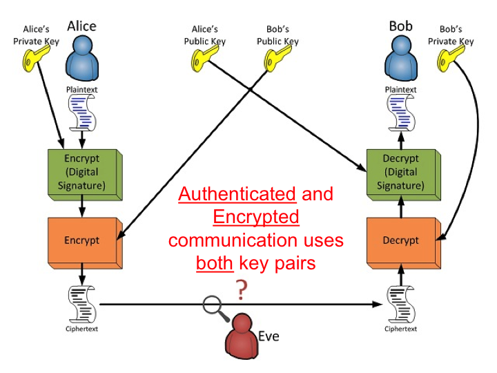


Examples: sha-3, md5 (now obsolete), etc.

##### Summary

| Type          | Reversible    | Keys needed                   | Usage                                                                                                                     | Examples                                          |
| ------------- | ------------- | ----------------------------- | ------------------------------------------------------------------------------------------------------------------------- | ------------------------------------------------- |
| Encoding      | Yes           | No                            | Efficiency of transmission or storage of data, mostly text, but some encoding schemes also support binary format          | ASCII, Unicode, Base64, ROT13, HTML               |
| Encryption    | Yes           | Yes (symetric or asymetric)   | Protect confidentiality of information                                                                                    | PGP, 3DES, RSA, Blowfish, Twofish, AES            |
| Hashing       | No            | -                             | Proof of integrity or password storage                                                                                    | MD5, SHA1, SHA2 (256, 512 etc), Bcrypt, Scrypt    |

##### Sources
* [Slides](https://www.slideshare.net/sas3/secure-password-storage-management) from Sastry Tumuluri
* [Asymmetric Encryption](https://www.usna.edu/CyberDept/sy110/lec/cryptAsymmEnc/lec.html)
* [Public-private key cryptography](https://en.m.wikipedia.org/wiki/Public-key_cryptography) on Wikipedia
* [Digital Signatures](https://en.m.wikipedia.org/wiki/Digital_signature) on Wikipedia


### Offline attacks:

#### Brute-forcing

Given unlimited CPU power and unlimited storage space, a pure brute-force attack can find any password. It simply tries out every possible password combination in existence and continues until a match is found. Pre-calculating tables of password/hash combinations also helps so an attacker can reuse those combinations for later attacks or decrease the time of the attack by preparing those tables beforehand.

Note that a pure brute-force attack is not feasible because of the time required to calculate all possible passwords' hashes. There simply isn't enough time to brute-force all possible passwords. For example, calculating the full password-space for a length 10 alphanumeric password takes more than 3 millennia when using bcrypt. 

##### How it works

* Write an algorithm that generates the entire password-space
* For each password generated, calculate its hash
* Compare the hash to the hash to crack

Example of a simple password-space looper in Groovy:

```groovy
static List<String> calculate(int min, int max, char[] chars) {
    assert min <= max
    List<String> results = []
    for (int length = min; length <= max; ++length) {
        results.addAll(generateAllPasswordsForLength(length, chars))
    }
    return results
}

static List<String> generateAllPasswordsForLength(int length, char[] chars) {
    switch (length) {
        case 0: // <== No length means no passwords
            return []
        case 1: // <== Length 1 means all single chars make up the full password-space
            return chars.toList()
        default: // <== Length X means: recursively combine the list of chars with the list of chars until you have the desired length
            return generateAllPasswordsForLength(length - 1, chars).collectMany{ pass ->
                chars.collect { "${pass}${it}"}
            }
    }
}
```

##### Pro's & Con's

Pro's:
* Should in theory always find the password

Con's:
* Takes unlimited amounts of time (see statistics in [this blog](../../publications/2019-02-20_passwords_fun_with_numbers/README.md))
* Depending on method, takes incredible amount of storage

##### Pre-calculate or not

There are two ways to approach this attack.
* Pre-calculate all hashes before-hand, then do a lookup
* Calculate and compare each hash on the fly.

###### Pre-calculate

With a pre-calculated approach, the attacker performs the following steps in order:
1. Iterate over each possible password
1. Calculate a hash for that password
1. Store the password with its hashes in an indexed database
1. Start attack
1. Perform lookup in database using a hash to crack
1. Repeat until all desired accounts are hacked
1. End attack
1. Start another attacks
1. Perform lookup in database using a hash to crack
1. Repeat until all desired accounts are hacked
1. End attack

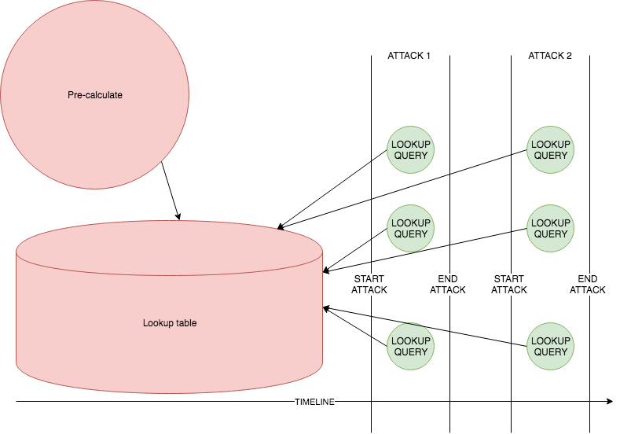

This method requires incredible amounts of time beforehand to pre-calculate and incredible amounts of storage for the lookup-table. But once that has been achieved, each attack can be performed using a simple lookup with negligible time compared to the preparation time.

###### Regular Brute force
 
With a regular brute-force approach, the attacker performs the following steps in order:
1. Start attack
1. Iterate over each possible password
1. Calculate a hash for that password
1. Compare that hash with each of the hashes to crack
1. Repeat until all desired accounts are hacked
1. End attack
1. Start another attacks
1. Perform lookup in database using a hash to crack
1. Repeat until all desired accounts are hacked
1. End attack

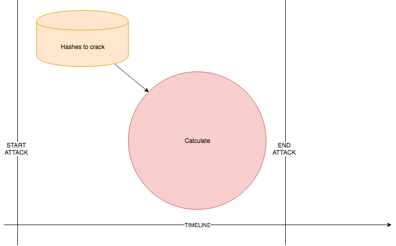

This method requires incredible amounts of time for each attack, but doesn't require much of storage. But every attack should re-calculate all hashes for each password, so each attack will take an incredible amount of time.

###### Comparing

Each method has advantages and disadvantages:
* Pre-calculation:
  * Pro's:
    * Only calculate hashes once and reuse for all attacks
    * Very fast cracking once lookup table is available
  * Con's:
    * Incredible amount of storage needed
* On the fly:
  * Pro's:
    * No storage needed
  * Con's:
    * Re-calculate for each attack / password

##### Defense

* Hardened hash-functions
* Salt increases the time needed exponentially

#### Lookup Table or Dictionary attacks

Since we don't have theoretically unlimited time and we don't have unlimited storage space either, we'll have to customize our attacks, so it becomes practically feasible. The trade-off will be a lower success-rate and no guaranteed crack.
Using lists of common or leaked passwords can decrease both CPU time and storage space needed, compared to a pure brute-force attack. By concentrating on only passwords with a high probability to be used, an attacker can eliminate a large part of the password-space and therefore decrease CPU time to hash. This also makes pre-calculating feasible since the storage is much smaller. For example, calculating the hashes (including slow bcrypt) for the full Pwned Password list of 500 million passwords takes only minutes to a few hours depending on the hardware.

##### How it works

1. Download or generate a list of common and / or leaked passwords
1. Iterate over the list of passwords
1. Calculate a hash for that password
1. Store the password with its hashes in an indexed database
1. Start attack
1. Perform lookup in database using a hash to crack
1. Repeat until all desired accounts are hacked
1. End attack
1. Start another attacks
1. Perform lookup in database using a hash to crack
1. Repeat until all desired accounts are hacked
1. End attack

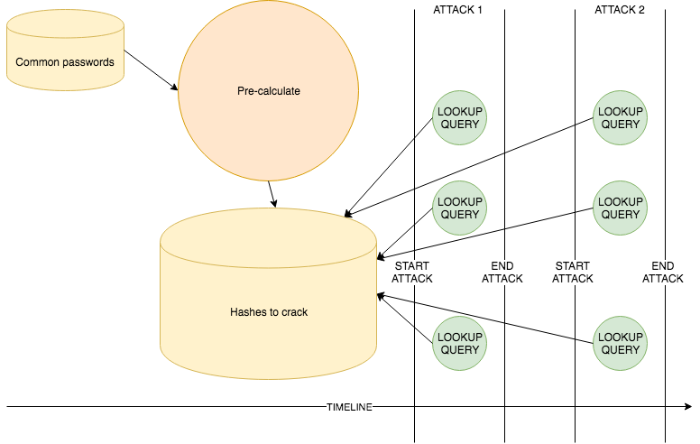

A lookup table can be used to revert hashed passwords to their original input. By pre-calculating hashes for a limited list of passwords, cracking a password becomes a lookup based on the hash for a specific password.

This requires a feasible amount of storage of about 142 GB\* to store both passwords and all corresponding hashes:

| Hash      | Storage   | Bits          | Bytes         | KB            | MB        | GB    |
|-----------|-----------|--------------:|--------------:|--------------:|----------:|------:|
| Password  | 80        | 40000000000   | 5000000000    | 5000000       | 5000      | 5     |
| MD5       | 128       | 64000000000   | 8000000000    | 8000000       | 8000      | 8     |
| SHA1      | 160       | 80000000000   | 10000000000   | 10000000      | 10000     | 10    |
| SHA256    | 256       | 128000000000  | 16000000000   | 16000000      | 16000     | 16    |
| SHA512    | 512       | 256000000000  | 32000000000   | 32000000      | 32000     | 32    |
| SCRYPT    | 656       | 328000000000  | 41000000000   | 41000000      | 41000     | 41    |
| BCRYPT    | 480       | 240000000000  | 30000000000   | 30000000      | 30000     | 30    |
| Total     | 2272      | 1136000000000 | 142000000000  | 142000000     | 142000    | 142   |

\* No compression, average of 10 characters per password, 500M passwords in total

If you are wondering how much time it would take to hash 500M passwords, compared to pure brute-forcing of different password patterns, have a look at this table\*:

|        |  10x Lowercase |  Random pattern like 'Ullllldd' | Pwned Password dictionary |  8x alphanumeric or symbol |  4x English words |  4x English Dictionary |
|--------|---------------:|--------------------------------:|--------------------------:|---------------------------:|------------------:|-----------------------:|
| MD5    |     30 minutes |                       0 seconds |                 0 seconds |                     1 days |          226 days |              358 years |
| SHA1   |        1 hours |                       1 seconds |                 0 seconds |                     2 days |           1 years |            1 millennia |
| SHA512 |       12 hours |                       9 seconds |                 0 seconds |                    23 days |          14 years |            8 millennia |
| SHA256 |        4 hours |                       3 seconds |                 0 seconds |                     8 days |           5 years |            2 millennia |
| SCRYPT |        2 years |                         4 hours |                 4 minutes |                  112 years |      25 millennia |        14642 millennia |
| BCRYPT |      102 years |                          8 days |                   3 hours |                4 millennia |    1092 millennia |       629518 millennia |

\* No overhead for storing, using a $5000,- system

As you can see in the column labelled "Pwned Password dictionary", that full list of passwords is hashed using "slow" BCrypt hash in about 3 hours. 

##### Pro's & Con's

Pro's:
* Fast
* High probability of success
* Storage needed is manageable

Con's:
* No guaranteed success
* Only cracks common or leaked passwords from the list used

##### Defense
* Strong passwords
* Block common and leaked passwords
* Salting

#### Rainbow tables:

To increase the chances of success of a dictionary attack, we can find a middle ground between both brute-force attacks and dictionary attacks. Let's again compare regular brute-force and a pre-calculated brute-force attack:

##### Regular brute-force:
In a regular brute force, we calculate all hashes on-the-fly, which takes incredible amounts of time. Also, we have to repeat this for each attack, which is not practical. We do however require just a small amount of memory. CPU time is our limiting factor.

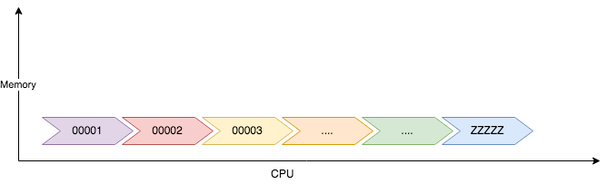

##### Pre-calculated brute-force:
In a brute-force attack using pre-calculated hashes, the attack itself uses just a small amount of CPU, but to store the pre-calculated hashes (and corresponding passwords), we need incredible amounts of storage.

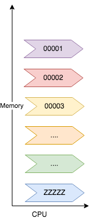

##### Dictionary attack:

This attack is only different from a Pre-calc brute-force in the way it uses only a limited set of passwords and hashes to make the storage (and pre-calc time) manageable. As seen in the Pwned Password timing example, CPU time for a set that limited is not an issue. An attacker could even hash some more passwords without worrying too much about time needed. The only limiting factor would quickly become storage.

So what if we would increase the number of passwords up to a moderately but manageable CPU time and decrease the storage requirements so that it becomes manageable as well? Here's the plan:

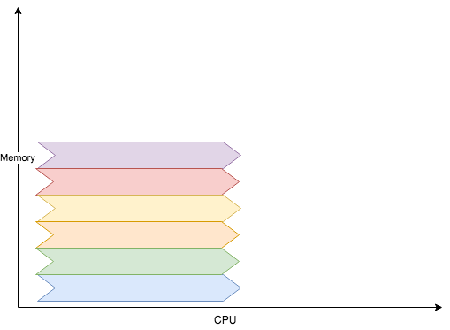

##### How it works

* Consider a pre-calculated brute-force attack
* Limit the total number of passwords to only include certain patterns we assume to have a high success-rate.
* Store the passwords along with their hash in a large table.
* Then chunk that table into smaller tables

To do so, we use a method called rainbow tables.

###### Preparation

Before the attack, we can either pre-calculate a rainbow-table or use a rainbow table available from various sources.

A rainbow table is calculated using this method:

1. Choose a password pattern
2. Choose a hash-method
3. Determine a reduction method to reduce a hash-output of the hash-method to a password conforming to the chosen password pattern
4. Choose a base-password
5. Hash the base-password to an intermediate Hash
5. Take this hash and reduce it to a new password
6. Hash the new password
7. Repeat steps 5-6 any number of times
   * The number of times repeated determines the length X of the chains
   * More repeats means longer preparation-time and longer time of the actual attack, but less storage space required for the rainbow-table and higher change of success
8. Store the final hashed from step 6 together with the base-password from step 4
9. Choose a different base-password and repeat steps 5 through 8
10. Repeat step 9 any number of time.

###### Details on step 3

We chose MD5 as the hash-method and 8 character passwords containing lowercase or numbers.
```
hashMD5(12345678) = 25d55ad283aa400af464c76d713c07ad
```

We reduce the hash by taking only the first 8 characters.

```
reduce(25d55ad283aa400af464c76d713c07ad) = 25d55ad2
```

###### Details on step 8

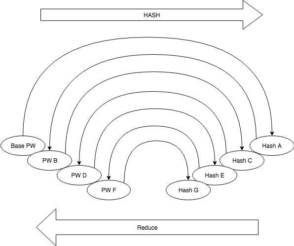

You then store only the base password and the eventual hashed password, for which you don't store the actual password. This is called a chain. When using the same reduce-function, the resulting chains are vulnerable to merging and looping, which frustrates the cracking method. By using a different reduce-function in each iteration, we reduce the chances of merges and completely prevent loops.


You now have a single chunk of X passwords stored as a single Password-Hash combination, which do not match. Repeat this process for M different base passwords:

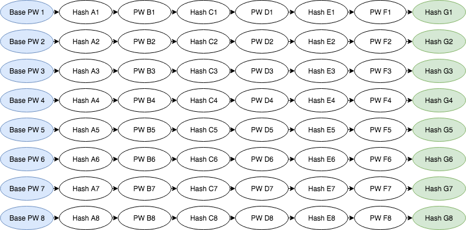

And store their Password-Hash combinations resulting in a rainbow table.

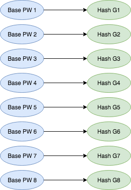

This way, we have M chains of N passwords, stored in M records of 2 items per record.

###### Cracking
Proceed to the cracking stage:

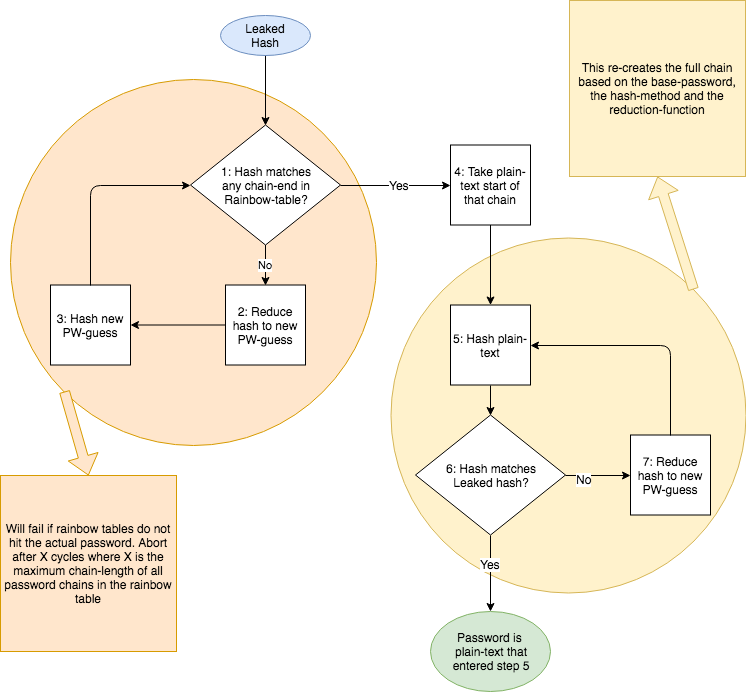

Input:
* Leaked hash you want to crack
* Rainbow-table
* Hash-method used to pre-calculate the rainbow-table and which matches the hash-method for the leaked password
* Reduce-function used to pre-calculate the rainbow-table

1. Compare the hash to all hashes at the chain-ends from the rainbow-table.
  * If found, the password you want to crack is in that chain. Proceed to step 4
  * If not, proceed to step 2
2. Reduce the hash to a new password-guess using the reduce-function
3. Hash the new password-guess and use it to repeat step 1 until the hash is found at a chain-end or after X times where X is the (maximum) chain-length.
4. Take the base-password from this chain.
5. Hash it
6. Compare the hash to the leaked hash. Does it match?
   * If they match, the password is the last used input for step 5.
   * If they don't match, proceed to step 7
7. Reduce the hash to a new password-guess

Note on step 1-3: If the actual password corresponding to the leaked hash is never hit during the creation of the rainbow-table, steps 1 to 3 will be repeated infinitely. After X repeats (where X is the chain-length), we can safely assume the password is not hit by the rainbow table and stop cracking.

Note on step 4-7: The hash was found in the rainbow table. The Base-password / End-hash combination is the only relevant information to crack this specific leaked hash. 

##### Things to consider
* Chain merges and loops caused by hash collisions will negatively influence rainbow-tables
* Increasing chain-length and number of chains will increase the success-rate of the table, but will increase preparation-time.
* Increasing number of chains will require more storage.
* Increasing chain-length will require more CPU time during the attack.

##### Pros and Cons
Pros:
* Limited and manageable storage needed
* Limited and manageable CPU time needed
* Rainbow-tables are available pre-calculated online

Cons:
* No guarantee to find all passwords
* Optimizing rainbow-tables is complex and hard
* Still easily defended against with salting

Sources:
* [Blog](http://kestas.kuliukas.com/RainbowTables/)
* [Wikipedia](https://en.m.wikipedia.org/wiki/Rainbow_table)
* [The Security Blogger](https://www.thesecurityblogger.com/understanding-rainbow-tables/)
* [Geeks for Geeks](https://www.geeksforgeeks.org/understanding-rainbow-table-attack/)

##### Defense
* Strong passwords
* Block common and leaked passwords
* Salting (Dynamic)

## References
* [Passwords evolved](https://www.troyhunt.com/passwords-evolved-authentication-guidance-for-the-modern-era/) by [Troy Hunt](https://twitter.com/troyhunt)
* [Administrator's guide to password research](https://www.microsoft.com/en-us/research/publication/an-administrators-guide-to-internet-password-research/)
* NIST Digital Identity Guidelines [800-63B](https://pages.nist.gov/800-63-3/sp800-63b.html)
* [Effectiveness of several MFA types](https://security.googleblog.com/2019/05/new-research-how-effective-is-basic.html) by Google

### Password strength
* Why [length beats complexity](https://malwarejake.blogspot.com/2015/10/why-is-length-complexity-because-math.html) in password strength by Malware Jake
* [Analyzing password-strength meters](https://www.ndss-symposium.org/ndss2014/programme/very-weak-very-strong-analyzing-password-strength-meters/)

### Password rotation
* [Frequent Password changes is a bad security idea](https://www.schneier.com/blog/archives/2016/08/frequent_passwo.html) by [Bruce Schneier](https://www.schneier.com/)
* The [Nonsense of Password rotation](https://johnopdenakker.com/the-non-sense-of-password-rotation/) by [John Opdenakker](https://twitter.com/j_opdenakker)
* SANS Debate around [Password Rotation](https://www.sans.org/blog/the-debate-around-password-rotation-policies/) Policies

### Password Managers
Note that the use of password-managers to manage strong (long, unique and random) passwords is almost always much more secure than reusing weak passwords.
Flaws in password managers often can only be exploited when the device has been compromised by malicious software, in which case the security of the password manager is not the thing to worry about.
* [Choosing](https://freedom.press/training/blog/choosing-password-manager/) a Password manager
* [Password manager hacking](https://www.securityevaluators.com/casestudies/password-manager-hacking/)
* Several [security flaws](https://www.welivesecurity.com/2020/03/19/security-flaws-found-in-popular-password-managers/) found in popular Password Managers
* Password managers can be [hacked](https://www.tomsguide.com/news/password-manager-hacks). What to do now. An article based on research from 2017-ish, sounding like it wants to spread FUD. The article missed the "Flawed PW Managers are almost always better than weak password reuse"-message
* Password managers [easily compromised](https://www.itproportal.com/news/passwords-managers-easily-compromised-by-illegitimate-apps/) by illegitimate apps. Research addressing a flaw in app-identification by Password managers.
