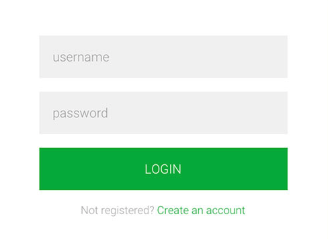

# Passwords

## Short version

### Don'ts

* Don't use complicated composition rules
* Don't force password change
* Don't limit password length to anything less than 64 characters
* Don't truncate passwords
* Don't limit special characters
* Don't use password hints
* Don't block password managers
* Don't block password copy-pasting
* Don't force periodic password reset

### Maybe's

* Be careful with the use of password strength indicators (See "Analyzing password-strength meters" below)

### Do's

* Educate users in password hygiene
* Only use passwords when needed
* Use technical solutions to reduce burden on users
* Only ask for password resets in case of breaches / possible compromise
* Allow / support easy password reset (but safe)
* Use proper ("slow") hashing to store passwords (bcrypt / scrypt)
* Use dynamic salt
* Use static salt (pepper)
* Use throttling and / or temporary lockout
* Monitor abnormal activity server-side to detect attacks

### Tops
* Block common passwords (enough, but be careful with blocking all. Could frustrate users)
* Notify users of abnormal behaviour
  * Could be unknown location, device, browser / client etc.
* Support MFA / 2FA


## Long version

### Current state

#### Top 25 most used passwords

The top 25 most common passwords cover up to 10% of all passwords surveyed. This means that (based on surveyed data) only testing these 25 passwords, most _trial-and-error_ attacks can successfully guess 10% of all passwords, when no other countermeasures are implemented. Obviously, survey data may be skewed as in reality passwords not surveyed may be significantly more unique. That would decrease the 10% a bit, though the message is clear: it is alarming that just 25 common passwords are re-used for so many accounts.

[source](https://en.wikipedia.org/wiki/List_of_the_most_common_passwords)

#### HaveIBeenPwned
This site started as a try-out project by [Troy Hunt](https://haveibeenpwned.com/About) to combine some cloud-technologies, including optimizing caching with Cloudflare and (eventually) serverless architecture with Azure functions.

It also happened to streamline his research and analysis of data-breaches. The site offers a free notification-service for internet users to learn more about breaches they may have been subject of.

Aside from the breach-notification, it also provides a way to [validate](https://www.troyhunt.com/ive-just-launched-pwned-passwords-version-2/) safely if a password has been breached. This can be used to block commonly used passwords.

[HaveIBeenPwned](https://haveibeenpwned.com/)

#### Collection1-5 and others
With regular intervals, email & password pairs are leaked or sold onto the web or darkweb. These lists are often used for credential-stuffing attacks (see below) or extortion-schemes. Lists often range in size but are mostly data from breaches, "unhashed" using dictionary or brute-force attacks. Depending on different factors (password strength and defenses descibed below) these attacks may or may not reveal passwords from breaches.

#### Password-managers
The most important defense a user can employ to prevent account takeover or password leakage is using a strong password. In recent years, the definition of a strong password has changed a bit, though most systems use or enforce the older definition, which forces users into bad habits.

A strong password does not necessarily include all or as much of the following:
* lowercase characters
* uppercase characters
* decimals
* symbols
* have at least 8 length

Although all of the above help in creating a strong password, none of these are essential, except for length. But most importantly a password should be unpredictable. The most important factors in unpredictability include:
* length
* randomness
* no re-use

If these factors are included, even a decimal only password can be [strong enough](../../blogs/2019-02-20_passwords_fun_with_numbers/README.md) (see final table: 23 length decimal password can withstand a $847k intelligence agency grade password-cracking machine).  

### Online attacks:
These attacks describe online attacks performed against running systems, including websites, online API's, backends exposed to outside connections or apps. These attacks use automated tools to fire multiple password-guesses per second to the system using lists of credentials to try out, reading the response to scan for valid credentials. Tools like Burp-suite's Repeater can launch these attacks.

#### Credential stuffing
Credential stuffing is an attack where known credential-pairs (eg. from previous leaks) are used to perform an automated attack on loging-systems of the same or other services.

##### How it works
Credential pairs consisting of email and password (or sometimes username and password) are used to perform login-attempts to try to gain access to accounts. When successful accounts can be ransomed, resources (assets like private messages, pictures or financial resources) can be stolen, deleted or copied.

##### Defense

##### Strong passwords
Most attacks simply lift off of simple attacks like SQL-injection to leak credentials from one site and try those credentials on other, better secured websites, where SQLi doesn't work.

A user can defend against these attacks by using strong passwords. Passwords should never be re-used to prevent these attacks. 

##### 2FA or MFA
Users can enable 2-factor or multi-factor authentication to prevent access to sites even when the correct credentials are entered. Some 2FA/MFA systems also notify the user on account activity on new devices, thereby notifying users that something unexpected is happening and the user should take action accordingly. If a user receives 2FA codes or notifications on his or her device when not logging in him/herself, the user can assume credentials are successfully used to try login, but are safely blocked by 2FA. The user should then change credentials as soon as possible.

###### Throttling
When receiving multiple login-attempts for a single user or from single sources, a website may throttle those attempts to prevent a possible attack. Normal behavior of legitimate users will not bombard a site with many login-attempts.

###### Common-passwords blocking
A website may opt to disallow certain passwords, because of their predictability. A balance between blacklisting enough passwords to be effective and not too much to frustrate users should be made. Having password complexity rules may not be the best option for enforcing password-strength, but it is much more easily explained to the user why a certain password is not allowed. Explaining why a password is not allowed becasue it is one of billions of leaked passwords is hard for users to understand. 

#### SQL injection
This attack is mostly employed on insecure websites or systems that use databases to store data like credentials, forum-posts, messages, online catalogue-data etc.

##### How it works
An attacker may use malformed data in a request, using a query-field, a search-box or login-fields to abuse unsafe SQL-code and inject malicious SQL-code on the server. This can be abused to gain access to user accounts, retrieve data from or change data in the database of the application.

###### Account takeover
For example, consider a simple login-form:



Now consider the following code to validate the credentials:

```SQL
SELECT U.USERNAME FROM USERS U WHERE U.USERNAME = '" + $_POST['username'] + "' AND U.PASSWORD = '" + $_POST['password'] + "' 
```

When used as intended, this statement will result in the following example query:

```SQL
SELECT U.USERNAME FROM USERS U WHERE U.USERNAME = 'foo' AND U.PASSWORD = 'bar' 
```

If there is a user with username 'foo' and password 'bar', this query returns a single result and the user is authenticated. But consider the following malicious input:

Username: ```admin'--```
Password: ```doesnt matter```

This will result in the following SQL statement
```SQL
SELECT U.USERNAME FROM USERS U WHERE U.USERNAME = 'admin'--' AND U.PASSWORD = 'doesnt matter' 
```

The password-check is now commented out, including the hardcoded end-of-string quote directly following the username param. This will result in the query just checking for the corresponding username and logging in as that user.
Since the query is constructed using String concatenation, with malicious input, the attacker can re-structure the SQL-statement to perform the unintended behavior.


##### Defense

Use prepared statements with named parameters. This way developers can define a single statement with specified parameters to be replaced before execution. The code expects (and checks for) a single executable statement and replaces the named or numbered parameters with the content of the rquest-parameter.

PHP:
```php
$stmt = $pdo->prepare('SELECT U.USERNAME FROM USERS U WHERE U.USERNAME = :username AND U.PASSWORD = :password');
$stmt->execute(array('username' => $_POST['username'], 'password' => $_POST['password']));
```

Java:
```java
Connection conn = DriverManager.getConnection(URL, USER, PASS);
String sql = "SELECT U.USERNAME FROM USERS U WHERE U.USERNAME = :username AND U.PASSWORD = :password";
PreparedStatement prepStmt = conn.prepareStatement(sql);
prepStmt.setString("username", request.getParameter("username"));
prepStmt.setString("password", request.getParameter("password"));
ResultSet resultSet = prepStmt.executeQuery();
prepStmt.close();
```

ASP.net
```asp
SqlConnection objCon = new SqlConnection(ConnectionString);
objCon.Open();
SqlCommand objCommand = new SqlCommand(“SELECT * FROM User WHERE Username = @Username AND Password = @Password”, objConnection);
objCommand.Parameters.Add(“@Username”, Request.Form["username"]);
objCommand.Parameters.Add(“@Password”, Request.Form["password"]);
SqlDataReader objReader = objCommand.ExecuteReader();
```

OWASP SQL injection prevention [cheatsheet](https://github.com/OWASP/CheatSheetSeries/blob/master/cheatsheets/SQL_Injection_Prevention_Cheat_Sheet.md) lists other options:
* Stored procedures: 
  * Java: use ```CallableStatement```
  * VB.NET: use ```SqlCommand```
* Whitelist input validation: using a switch-case construct to limit the number of options a request may supply. For instance when supplying the order-column
* Escape all user-supplied input: escaping user-input is a good practice in general, but is not the best option for protection against SQL-injection, since it can be database-specific. OWASP [ESAPI](https://www.owasp.org/index.php/Category:OWASP_Enterprise_Security_API) can be used for escaping user-input.

#### Encoding, encryption & hashing

All these techniques are used for converting the format of data. 

Encoding transforms data into another format using a scheme that is publicly available so that it can easily be reversed. It does not require a key. 
Encryption transforms data into another format and it is used for keeping the data secret. 
In Hashing technique, data is converted to a message digest or hash, which is usually a number generated from a string of text. Hashing is not reversible.


[source](https://danielmiessler.com/study/encoding-encryption-hashing-obfuscation/)

##### Encoding

Encoding is used to transform data to properly and safely send and process to another application or system. Encoding is done by publicly available schemes and can easily be undone by decoding using the same scheme in reverse. A key is not needed to decode data. Only knowing the encoding algorithm is sufficient, which can often be derived from the encoded data.

Examples: ASCII, Unicode, URL Encoding, base64, ROT13


[Base64](https://www.base64decode.org/) encoder / decoder

##### Encryption

Encryption transforms data to keep that data confidential. The primary goal of encryption is to prevent unauthorized persons or organizations to be able to read the data, even when intercepted.

Encryption can use a single (symmetric) key where the same key is used to both encrypt and decrypt a message. It can also use asymmetrical keys (2 or more) to encrypt data, where the key to encrypt is different from the key to decrypt.

The CAESAR-cipher is a very simple (and unsafe) encryption method used by [Caesar](https://en.wikipedia.org/wiki/Caesar_cipher) to send secret military messages. Since his opponents were mostly illiterate, this encryption method was probably sufficient for that situation.
ROT13 is identical to CAESAR13. Since this encryption method includes the key within its name, it would strictly be an encoding rather than an encryption. The special property of ROT13 / CAESAR13 is that the first half (13 characters) of the alphabet is mapped to the second half and vice versa:


Examples: CAESAR-cipher, PGP, 3DES, RSA, Blowfish, Twofish, AES

[5 common ecryption algorithms](https://blog.storagecraft.com/5-common-encryption-algorithms/)

##### Hashing

Hashing creates a digest of data so that digest can be used to validate the origin or integrity of the data. Hashing takes arbitrary input and produce a fixed-length string that has the following attributes:
* The same input will always produce the same output.
* Multiple disparate inputs should not produce the same output.
* It should not be possible to go from the output to the input.
* Any modification of a given input should result in drastic change to the hash.

Hashing is used in conjunction with authentication to produce strong evidence that a given message has not been modified. This is accomplished by taking a given input, hashing it, and then signing the hash with the sender’s private key.

When the recipient opens the message, they can then validate the signature of the hash with the sender’s public key and then hash the message themselves and compare it to the hash that was signed by the sender. If they match it is an unmodified message, sent by the correct person.

Examples: sha-3, md5 (now obsolete), etc.

##### Summary

| Type          | Reversible    | Keys needed                   | Usage                                                                                                                     | Examples                                          |
| ------------- | ------------- | ----------------------------- | ------------------------------------------------------------------------------------------------------------------------- | ------------------------------------------------- |
| Encoding      | Yes           | No                            | Efficiency of transmission or storage of data, mostly text, but some encoding schemes also support binary format          | ASCII, Unicode, Base64, ROT13, HTML               |
| Encryption    | Yes           | Yes (symetric or asymetric)   | Protect confidentiality of information                                                                                    | PGP, 3DES, RSA, Blowfish, Twofish, AES            |
| Hashing       | No            | -                             | Password storage, file and application integrity validation                                                               | MD5, SHA1, SHA2 (256, 512 etc), Bcrypt, Scrypt    |


### Offline attacks:

#### Rainbow tables:

##### How it works

##### Defense
Salting (Dynamic & Static)

#### Dictionary attacks

##### How it works

#### Brute-forcing

##### How it works

##### Statistics

Full analysis: see [this blog](../../blogs/2019-02-20_passwords_fun_with_numbers/README.md)

##### Defense

Hardened hash-algorithms


## References
* [Passwords evolved](https://www.troyhunt.com/passwords-evolved-authentication-guidance-for-the-modern-era/)
* [Administrator's guide to password research](https://www.microsoft.com/en-us/research/publication/an-administrators-guide-to-internet-password-research/)
* [Analyzing password-strength meters](https://www.ndss-symposium.org/ndss2014/programme/very-weak-very-strong-analyzing-password-strength-meters/)
* [Password manager hacking](https://www.securityevaluators.com/casestudies/password-manager-hacking/)