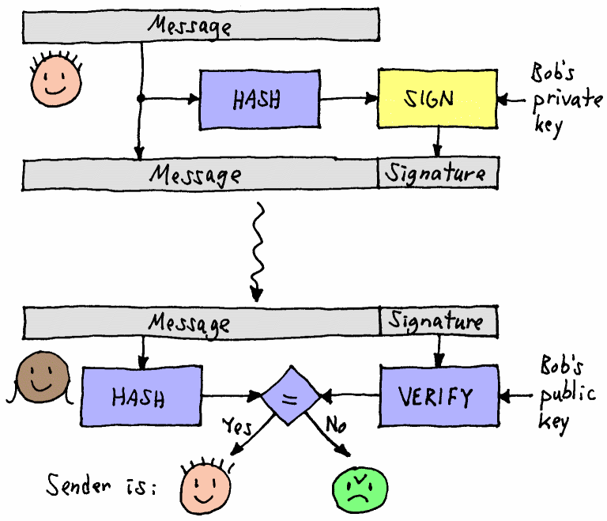

# Passwords

## Short version

### Don'ts

* Don't use complicated composition rules
* Don't force password change
* Don't limit password length to anything less than 64 characters
* Don't truncate passwords
* Don't limit special characters
* Don't use password hints
* Don't block password managers
* Don't block password copy-pasting
* Don't force periodic password reset

### Maybe's

* Be careful with the use of password strength indicators (See "Analyzing password-strength meters" below)

### Do's

* Educate users in password hygiene
* Only use passwords when needed
* Use technical solutions to reduce burden on users
* Only ask for password resets in case of breaches / possible compromise
* Allow / support easy password reset (but safe)
* Use proper ("slow") hashing to store passwords (bcrypt / scrypt)
* Use dynamic salt
* Use static salt (pepper)
* Use throttling and / or temporary lockout
* Monitor abnormal activity server-side to detect attacks

### Tops
* Block common passwords (enough, but be careful with blocking all. Could frustrate users)
* Notify users of abnormal behaviour
  * Could be unknown location, device, browser / client etc.
* Support MFA / 2FA


## Long version

Most attacks listed below can be mitigated in several different ways. The most effective defense would possibly be Multi factor authentication (MFA). This mitigation forces an attacker to not only crack the password, but also steal / acquire the other factor(s) to validate identity.

### Current state

#### Top 25 most used passwords

The top 25 most common passwords cover up to 10% of all passwords surveyed. This means that (based on surveyed data) only testing these 25 passwords, most _trial-and-error_ attacks can successfully guess 10% of all passwords, when no other countermeasures are implemented. Obviously, survey data may be skewed as in reality passwords not surveyed may be significantly more unique. That would decrease the 10% a bit, though the message is clear: it is alarming that just 25 common passwords are re-used for so many accounts.

[source](https://en.wikipedia.org/wiki/List_of_the_most_common_passwords)

#### HaveIBeenPwned
This site started as a try-out project by [Troy Hunt](https://haveibeenpwned.com/About) to combine some cloud-technologies, including optimizing caching with Cloudflare and (eventually) serverless architecture with Azure functions.

It also happened to streamline his research and analysis of data-breaches. The site offers a free notification-service for internet users to learn more about breaches they may have been subject of.

Aside from the breach-notification, it also provides a way to [validate](https://www.troyhunt.com/ive-just-launched-pwned-passwords-version-2/) safely if a password has ever appeared in a breach known by Troy Hunt. This can be used to block commonly used passwords.

[HaveIBeenPwned](https://haveibeenpwned.com/)

#### Collection1-5 and others
With regular intervals, email & password pairs are leaked or sold onto the web or darkweb. These lists are often used for credential-stuffing attacks (see below) or extortion-schemes. Lists often range in size but are mostly data from breaches, "unhashed" using dictionary or brute-force attacks. Depending on different factors (password strength and defenses descibed below) these attacks may or may not reveal passwords from breaches.

#### Password-managers
The most important defense a user can employ to prevent account takeover or password leakage is using a strong password. In recent years, the definition of a strong password has changed a bit, though most systems use or enforce the older definition, which forces users into bad habits.

A strong password does not necessarily include all or as much of the following:
* lowercase characters
* uppercase characters
* decimals
* symbols
* have at least 8 length

Although all of the above help in creating a strong password, none of these are essential, except maybe for length. Given the above rules, a password using these minimum requirements could be "cracked" in a fraction of a second or it could take up to 28 years. It all depends on how the password is constructed.
For example, the following passwords both adhere to the above rules as a minimum, though there is a big difference in cracking speed:
* P@ssw0rd
* Bx9X}1Hv

Both passwords have a lowercase, uppercase character, decimal and symbol and have a length of exactly 8. So both would probably pass most systems based on conventional password requirements. But the first password will probably be cracked within under a second, because of its predictability.

So the most important factor of a strong password is unpredictability. The important factors to achieve unpredictability include:
* length
* randomness
* no re-use

If these factors are included, even a decimal only password can be [strong enough](../../publications/2019-02-20_passwords_fun_with_numbers/README.md) (see final table). At length 23 even a "simple" decimal password can withstand a $847k intelligence agency grade password-cracking machine. These scenario's describe pure brute-forcing in which systems try out every conceivable password possible, which is often not a feasible attack because of its CPU (time) or storage intensive requirements.

### Online attacks:
These attacks describe online attacks performed against running systems, including websites, online API's, backends exposed to outside connections or apps. Attacks like this use automated tools to fire multiple password-guesses per second to the system using lists of credentials to try out, reading the response to scan for valid credentials. Tools like Burp-suite's Repeater can launch these attacks.

#### Credential stuffing
Credential stuffing is an attack where known credential-pairs (eg. from previous leaks) are used to perform an automated attack on login-systems of the same or other services.

##### How it works
Credential pairs consisting of email and password (or sometimes username and password) are used to perform login-attempts to try to gain access to accounts. When successful accounts can be ransomed, resources (assets like private messages, pictures or financial resources) can be stolen, deleted or copied.

##### Pro's & Con's

Pro's
* High success-rate 
* Fast

Con's
* Success-rate will evaporate when users use unique passwords or MFA
* Can easily be detected
  * Generates high traffic and abnormal behavior, like numerous failed logins from single source
* Easily defended
  * See below

##### Defense

###### Strong passwords
Most attacks simply lift off of simple attacks like SQL-injection to leak credentials from one site and try those credentials on other, better secured websites, where SQLi doesn't work.

A user can defend against these attacks by using strong passwords. Passwords should never be re-used to prevent these attacks. 

###### 2FA or MFA
Users can enable 2-factor or multi-factor authentication to prevent access to sites even when the correct credentials are entered. Some 2FA/MFA systems also notify the user for account activity on new devices, thereby notifying users that something unexpected is happening and the user should take action accordingly. If a user receives 2FA codes or notifications on his or her device when not logging in him/herself, the user can assume credentials are successfully used to try to login, but are safely blocked by 2FA. The user should then still change credentials as soon as possible.

###### Throttling
When receiving multiple login-attempts for a single user or from single sources, a website may throttle those attempts to prevent a possible attack. Normal behavior of legitimate users will not bombard a site with many login-attempts.

###### Blocking Common or leaked passwords
A website may opt to disallow certain passwords, because of their predictability. A balance between blacklisting enough passwords to be effective and not too much to frustrate users should be made. Having password complexity rules may not be the best option for enforcing password-strength, but it is much easier to explain to the user why a certain password is not allowed. Explaining why a password is not allowed because it is one of billions of leaked passwords is hard for users to understand. 

#### SQL injection
See [here](../../techniques/sql-injection/README.md) for explanation of the attack

##### Pro's & Con's

Pro's
* High success-rate (still)
* No passwords needed if login-form is vulnerable
* Enables login for any user (not using MFA)

Con's
* Awareness is growing
* Easily defended

##### Defense

Use prepared statements with named parameters. This way developers can define a single statement with specified parameters to be replaced before execution. The code expects (and checks for) a single executable statement and replaces the named or numbered parameters with the content of the rquest-parameter.

PHP:
```php
$stmt = $pdo->prepare('SELECT U.USERNAME FROM USERS U WHERE U.USERNAME = :username AND U.PASSWORD = :password');
$stmt->execute(array('username' => $_POST['username'], 'password' => $_POST['password']));
```

Java:
```java
Connection conn = DriverManager.getConnection(URL, USER, PASS);
String sql = "SELECT U.USERNAME FROM USERS U WHERE U.USERNAME = :username AND U.PASSWORD = :password";
PreparedStatement prepStmt = conn.prepareStatement(sql);
prepStmt.setString("username", request.getParameter("username"));
prepStmt.setString("password", request.getParameter("password"));
ResultSet resultSet = prepStmt.executeQuery();
prepStmt.close();
```

ASP.net
```asp
SqlConnection objCon = new SqlConnection(ConnectionString);
objCon.Open();
SqlCommand objCommand = new SqlCommand(“SELECT * FROM User WHERE Username = @Username AND Password = @Password”, objConnection);
objCommand.Parameters.Add(“@Username”, Request.Form["username"]);
objCommand.Parameters.Add(“@Password”, Request.Form["password"]);
SqlDataReader objReader = objCommand.ExecuteReader();
```

OWASP SQL injection prevention [cheatsheet](https://github.com/OWASP/CheatSheetSeries/blob/master/cheatsheets/SQL_Injection_Prevention_Cheat_Sheet.md) lists other options:
* Stored procedures: 
  * Java: use ```CallableStatement```
  * VB.NET: use ```SqlCommand```
* Whitelist input validation: using a switch-case construct to limit the number of options a request may supply. For instance when supplying the order-column
* Escape all user-supplied input: escaping user-input is a good practice in general, but is not the best option for protection against SQL-injection, since it can be database-specific. OWASP [ESAPI](https://www.owasp.org/index.php/Category:OWASP_Enterprise_Security_API) can be used for escaping user-input.

There's even a site specifically for SQL-injection called [Booby-tables](http://bobby-tables.com), referencing the famous comic:


#### Encoding, encryption & hashing

Let's sidestep for a bit and explain these terms, because they are important for understanding password storage. 

In general terms, these techniques are used for converting the format of data. They have different properties and serve very different purposes. Let's first explain each in more detail. 

[source](https://danielmiessler.com/study/encoding-encryption-hashing-obfuscation/)

##### Encoding

Encoding is used to transform data to properly and safely store for, or send to another application or system. Encoding is done with publicly available schemes and can easily be undone using decoding with the same scheme, but in reverse. Ther is no key needed to decode data. Only knowing the encoding algorithm is sufficient, which can often be derived from the encoded data.

Examples: ASCII, Unicode, URL Encoding, base64, ROT13


[Base64](https://www.base64decode.org/) encoder / decoder

##### Encryption

Encryption transforms data to keep that data confidential. The primary goal of encryption is to prevent unauthorized persons or organizations to be able to read the data, even when intercepted.

Encryption can use a single (symmetric) key where the same key is used to both encrypt and decrypt a message. It can also use asymmetrical keys (2 or more) to encrypt data, where the key to encrypt is different from the key to decrypt.

The CAESAR-cipher is a very simple (and very unsafe) encryption method used by [Caesar](https://en.wikipedia.org/wiki/Caesar_cipher) to send secret military messages. Since his opponents were mostly illiterate, this encryption method was probably sufficient for that situation.
ROT13 is identical to CAESAR13. Since this encryption method includes the key within its name, it would strictly be considered encoding rather than encryption. The special property of ROT13 / CAESAR13 is that the first half (13 characters) of the alphabet is mapped to the second half and vice versa:


Examples: CAESAR-cipher, PGP, 3DES, RSA, Blowfish, Twofish, AES

[5 common ecryption algorithms](https://blog.storagecraft.com/5-common-encryption-algorithms/)

##### Hashing

Hashing creates a digest of data so that digest can be used to validate the origin or integrity of the data. Hashing takes arbitrary input and produces a fixed-length string that has the following attributes:
* The same input will always produce the same output.
* Multiple disparate inputs should not produce the same output.
* It should be impossible to go from the output to the input.
* Any modification of a given input should result in drastic change to the hash.

Once again: a Hash-functions are implicitly irreversible, though flawed Hash-functions could cause collisions. This happens when two different inputs generate an identical hash. Collisions can attacked, but are still not usable to reverse a hash.

As an example, consider the MOD operator, which calculates the remainder of a division.

```
10 MOD 3 = 1
```
If we only know the MOD with operand 3 and the solution 1, we cannot possibly reverse the formula to find 10. It could just as well have been 1, 4 or 7.

In this same way, consider a hash-function like this:

```
<password> DO_HASH <algorithm> = <HASH>
```

When we know both the algorithm and the HASH, we cannot reverse and find the password.

Since hash-functions always produce the same has for any given input, hashing is often used to validate the integrity of data. A common example is validating downloaded software using a hash of the software. Fast hash-functions are optimal for this scenario.

Hashing is also used in conjunction with asymmetric encryption to produce strong evidence that a message has not been modified. Review the example below. Here are the steps to produce the message:
* Create the message
* Hash the message
* Encrypt the hash with asymetric key encryption using the sender's private key
* Attach the encrypted hash to the message as the message's signature

To verify the message:
* Extract the signature from the message
* Decrypt the signature using the sender's public key
* Hash the message itself
* Compare the message's hash with the decrypted signature. If they match, the message is from the sender (or someone who has access to the sender's private key)



Examples: sha-3, md5 (now obsolete), etc.

##### Summary

| Type          | Reversible    | Keys needed                   | Usage                                                                                                                     | Examples                                          |
| ------------- | ------------- | ----------------------------- | ------------------------------------------------------------------------------------------------------------------------- | ------------------------------------------------- |
| Encoding      | Yes           | No                            | Efficiency of transmission or storage of data, mostly text, but some encoding schemes also support binary format          | ASCII, Unicode, Base64, ROT13, HTML               |
| Encryption    | Yes           | Yes (symetric or asymetric)   | Protect confidentiality of information                                                                                    | PGP, 3DES, RSA, Blowfish, Twofish, AES            |
| Hashing       | No            | -                             | Proof of integrity or password storage                                                                                    | MD5, SHA1, SHA2 (256, 512 etc), Bcrypt, Scrypt    |

[Slides](https://www.slideshare.net/sas3/secure-password-storage-management) from Sastry Tumuluri


### Offline attacks:

#### Brute-forcing

Given unlimited CPU power and unlimited storage space, a pure brute-force attack can find any password. It simply tries out every possible password combination in existence and continues until a match is found. Pre-calculating tables of password/hash combinations also helps so an attacker can reuse those combinations for later attacks or decrease the time of the attack by preparing those tables beforehand.

Note that a pure brute-force attack is not feasible when strong (unique and random) passwords are used. There simply isn't enough time the universe exists to brute-force any reasonably strong password.

##### How it works

* Write an algorithm that generates the entire password-space
* For each password generated, calculate its hash
* Compare the hash to the hash to crack

Example of a simple password-space looper

##### Pro's & Con's

Pro's:
* Should always find the password

Con's:
* Takes incredible amount of time (see statistics in [this blog](../../publications/2019-02-20_passwords_fun_with_numbers/README.md))
* Depending on method, takes incredible amount of storage

##### Pre-calculate or not

There are two ways to approach this attack.
* Pre-calculate all hashes before-hand, then do a lookup
* Calculate and compare each hash on the fly.

Each method has advantages and disadvantages:
* Pre-calculation:
  * Pro's:
    * Only calculate hashes once and reuse for all attacks
    * Very fast cracking once lookup table is available
  * Con's:
    * Incredible amount of storage needed
* On the fly:
  * Pro's:
    * No storage needed
  * Con's:
    * Re-calculate for each atack / password

##### Defense

* Hardened hash-functions

#### Lookup Table or Dictionary attacks

Using lists of common or leaked passwords can decrease both CPU time and storage space needed, compared to a pure brute-force attack. By concentrating on only passwords with a high probability to be used, an attacker can eliminate a large part of the password-space and therefore decrease CPU time to hash. This also makes pre-calculating feasible since the storage is much smaller.

##### How it works

* Download or generate a list of common and / or leaked passwords
* For each password in the list, calculate its hash or several hashes for different hash-functions
* Store the passwords with its hashes
* Do a lookup in the list using a hash to crack

A lookup table can be used to revert hashed passwords to their original input. By pre-calculating hashes for an entire password-space, cracking a password becomes a lookup based on the hash for a specific password. This method requires incredible amounts of storage if an attacker wants to precalculate the entire password space. 

##### Pro's & Con's

Pro's:
* Fast
* High probability of success

Con's:


##### Defense
* Strong passwords
* Block common and leaked passwords
* Salting

#### Rainbow tables:

Sources:
* [Blog]](http://kestas.kuliukas.com/RainbowTables/)
* [Wikipedia](https://en.m.wikipedia.org/wiki/Rainbow_table)

##### How it works

##### Defense
* Strong passwords
* Block common and leaked passwords
* Salting (Dynamic)

## References
* [Passwords evolved](https://www.troyhunt.com/passwords-evolved-authentication-guidance-for-the-modern-era/)
* [Administrator's guide to password research](https://www.microsoft.com/en-us/research/publication/an-administrators-guide-to-internet-password-research/)
* [Analyzing password-strength meters](https://www.ndss-symposium.org/ndss2014/programme/very-weak-very-strong-analyzing-password-strength-meters/)
* [Password manager hacking](https://www.securityevaluators.com/casestudies/password-manager-hacking/)