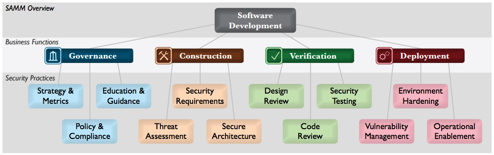

# Secure Coding

Most coding will be in context of web-application development.

## Web-development:

### Securing web-servers
* [HTTPS in 6 steps](https://www.troyhunt.com/the-6-step-happy-path-to-https/) by Troy Hunt

### Cookies
* HTTP is stateless, a web-application by definition does not save state between requests. This means, each request is
independent from another request. So for example, there's no auto-save for the shopping-cart in a webshop.
* Cookies can be set to "save" some state, but this isn't practical in all situations
* Sessions can be set up server-side to save state. This needs a (secured!) session-id cookie. The downside is: for each 
  client / user at a time, you need server-side storage and memory. Also, how long do you save session-data on the server? 
  Also: make sure you securely handle session-cookies, as they are essentially the authentication to your user's actions.
  This means: send them over HTTPS only (secure-flag) and make sure they cannot be read by external factors (HTTP-only flag)
  * SESSION by default
  * PHPSESSID for PHP
  * JSESSIONID for Java, JSP
* Client-side storage doesn't have this downside. Each client can save it's own state. But, client-side data can be manipulated 
  and cannot be trusted
* SOP: Same Origin Policy prevents cookies from being read by scripts outside of the same origin. The reading code should match
  the cookie's protocol, host-name and port. It is not necessary to match the full path on the server.
* Flag http-only: prevents a cookies from being read by non-html resources like JavaScript, Flash, Java
* Secure flag: prevents the cookie to be sent over non-secure (HTTPS) connection

## Security standards / models

* Video's from [SecAppDev](https://www.youtube.com/channel/UCSii2fuiLLlGqaR6sR_y0rA/videos)
  * [OWASP Top 10 Proactive controls](https://www.youtube.com/watch?v=-tF-ZkzdThI) by [Jim Manico](https://twitter.com/manicode)
  * [Secure Development Lifecycles](https://www.youtube.com/watch?v=L-gL1YQUrwg) by Bart de Win
* [OWASP Encoding project](https://www.owasp.org/index.php/Category:OWASP_Encoding_Project)
* [ASVS](https://github.com/OWASP/ASVS/tree/master/4.0/en) Application Security Verification Standard: For verification of security maturity
* [OpenSAMM](http://www.opensamm.org/) OWASP Software Assurance Maturity Model: For measuring maturity of secure software deveopment.
  * SAMM defines four business functions each with three security practices. Each of the twelve practices are divided into three maturity levels.O
  
* [OpenSAMM PDF](https://opensamm.org/downloads/SAMM-1.0.pdf): SAMM in a PDF 
* [SAMM Self Assessment](https://github.com/AsteriskLabs/ssa): (dormant since 2014) Tool to assist in Self-assessment on OpenSAMM (built in Rails).
* [Cybrary Secure coding](https://www.cybrary.it/course/secure-coding/): OWASP Top 10 and SANS Top 25 vulnerabilities and defenses