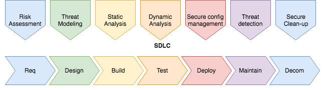

# Secure Software Development Lifecycle

## CI/CD

* Hacking Jenkins part [1](https://blog.orange.tw/2019/01/hacking-jenkins-part-1-play-with-dynamic-routing.html) and [2](http://blog.orange.tw/2019/02/abusing-meta-programming-for-unauthenticated-rce.html)
* [CI/CD hardening](https://snyk.io/blog/so-you-think-your-ci-cd-environment-is-secure/) by [Snyk.io](https://snyk.io)
* [Github Security Best practices](https://snyk.io/blog/ten-git-hub-security-best-practices/) by [Snyk.io](https://snyk.io)
* [Creating AppSec training that developers love](https://www.youtube.com/watch?v=cnz4X3yoI08) by [Leif Dreizler](https://twitter.com/leifdreizler)
* [Pushing Left like a Boss](https://code.likeagirl.io/pushing-left-like-a-boss-part-1-80f1f007da95) by [Tanya Janca](https://twitter.com/shehackspurple)
  * Part 2: [Security Requirements](https://code.likeagirl.io/pushing-left-like-a-boss-part-2-security-requirements-a71b86f6dd3f)
  * Part 3: [Secure Design](https://code.likeagirl.io/pushing-left-like-a-boss-part-3-secure-design-16d729453afa)
  * Part 4: [Secure Coding Concepts](https://code.likeagirl.io/pushing-left-like-a-boss-part-4-secure-coding-3a544dd30e20)
  * Part 5.1: [Input Validation, Output Encoding & Parameterized queries](https://code.likeagirl.io/pushing-left-like-a-boss-part-5-1-input-validation-output-encoding-and-parameterized-queries-ad1d4e7136c9)
  * Part 5.2: [Safe Dependencies](https://code.likeagirl.io/pushing-left-like-a-boss-part-5-2-use-safe-dependencies-5bda811506)
  * Part 5.3: [Browser & Client-side Hardening](https://code.likeagirl.io/pushing-left-like-a-boss-part-5-3-browser-and-client-side-hardening-e7bdd6596ab3)
  * Part 5.4: [Session Management](https://code.likeagirl.io/pushing-left-like-a-boss-part-5-4-session-management-ad441942511c)
  * Part 5.5: [File Uploads](https://code.likeagirl.io/pushing-left-like-a-boss-part-5-5-file-uploads-c2b1ee17f2d6)
  * Part 5.6: [Redirects and Forwards](https://code.likeagirl.io/pushing-left-like-a-boss-part-5-6-redirects-and-forwards-3d97bf46609c)
  * Part 5.7: [URL Parameters](https://code.likeagirl.io/pushing-left-like-a-boss-part-5-7-url-parameters-ac77c83b3d10)
  * Part 5.8: [Securing your Cookies](https://code.likeagirl.io/pushing-left-like-a-boss-part-5-8-securing-your-cookies-1c4391b10f88)
  * Part 5.9: [Error Handling & Logging](https://code.likeagirl.io/pushing-left-like-a-boss-part-5-9-error-handling-and-logging-28e9b8267c56)
  * Part 5.10: [Handling Untrusted Data](https://code.likeagirl.io/pushing-left-like-a-boss-part-5-10-untrusted-data-786b857255e0)
  * Part 5.11: [Authorization](https://code.likeagirl.io/pushing-left-like-a-boss-part-5-11-authorization-authz-58d81d387536)
  * Part 5.12: [Authentication, Identity & Access Control](https://code.likeagirl.io/pushing-left-like-a-boss-part-5-12-authentication-authn-identity-and-access-control-165cd2f23110)
  * Part 5.13: [HTTPS only](https://code.likeagirl.io/pushing-left-like-a-boss-part-5-13-https-only-e4fd3b881519)
 * [Security Learns to Sprint](https://www.youtube.com/watch?v=g3wCiEEiZmI) Adding Sec to DevSecOps by [Tanya Janca](https://twitter.com/shehackspurple)
* CI/CD Pipeline  starting at 30min.

## Agile software development

Modern & Secure development: a mismatch ?

| Agile Dev.            | Security              |
|-----------------------|-----------------------|
| Speed & Flexibility   | Stable & Rigorous     |  
| Short cycles          | Extra activities      |
| Limited documentation | Extensive analysis    |
| Functionality-driven  | Non-functional        |

## Secure Agile Manifesto

1. Our highest priority is to satisfy the customer through early and continuous delivery of valuable software.
2. Working valuable software is the primary measure of progress.
3. Security is a shared responsibility between everybody involved in the life cycle of the product.
4. Welcome changing (security) requirements, even late in development, taking into account that enough security is enough.
5. Dare to deploy software. Not every release requires full assurance.
6. Provide security elements to use in development projects. These elements should be known, readily available and continuously evolving.
7. Security should be automated and incorporated in the development practices.
8. Build projects around motivated individuals. Knowing how to build secure software is an intrinsic motivator.
9. The most effective solution emerges from self-organizing teams able to call upon security experts when needed.
10. At regular intervals, the team reflects on how to become more effective, adjusting its processes and technical solutions accordingly.

## SSDLC steps

Often in organisations, the only effort (if any) with regards to secure software development is the execution of a pentest, just before deployment to production. This will then result into a list of issues, prioritized and crisis management to mitigate at least the high-critical issues, as to not delay the deadline too much.

As with all bugs, the earlier you can find them, the less effort it will cost to fix them.

For security bugs, this is no different. Security bugs are no different than any other bugs, whether it be functional bugs or other non-functional bugs, like performance and usability bugs. Also, there are lots of activities to execute in each stage of the software lifecycle to increase security.

Here, you can see the different stages of a software development lifecycle from requirements to decommissioning. For each stage, a corresponding stage in security activities can be added. Below, I will detail each stage's security activities. Please note, this is not a comprehensive list of activities. 

### Requirements
* Risk Analysis
* Threat Identification
* Threat Impact Probability
* Abuse Cases
* Usability Guidelines

[Sub-page](security_requirements.md)

### Design

During the design phase of the application or separate functionality, the team again assisted by the CISO can Sollic
* Threat analysis
* Design Security Requirements
* Architecture & Design Review
* Threat Modelling
* Abuse cases

[Sub-page](secure_design.md)

### Build
* Secure Coding
* Risk Based Security Tests
* Static analysis
  * SAST tools

Some security measures:
* Encrypt data at rest (in database or other storage)
* Encrypt data in transit (between all of users, application, data store, API's etc)
* Validate and Sanitize all data coming into the system from anywhere. Even systems you control / own, because they might also become compromised. Security in-depth to prevent indirect compromise.
* Validate and scan all file-uploads properly
* Encode all output and escape when needed
* Scan dependencies for vulnerabilities
* Use security headers
* Use security measures to properly store passwords (proper hashing, salting)
* Only allow HTTPS for all resources
* Ensure TLS version 1.2 or higher is used
* Never hardcode secrets, certificates, data, references like connection strings etc.
* Never put sensitive information in code-comments
* Use security frameworks whenever possible. If you cannot find it, you either need to rethink your architecture or search harder.
* Use the latest version of frameworks and say up-to-date.
* Log errors, aggregate logs and have proper analysis and alerts. Do not log sensitive information
* Perform sanitization server-side and use a whitelist approach
* Perform Security testing on both code (SAST: Static Analysis Security Testing) and executable (DAST: Dynamic Anaysis Security Testing)

### Test
* Risk Analysis
* Vulnerability Assessment & Penetration Testing

[Sub-page](secure_test.md)

### Deploy
* Secrets management
* Secure config
  * Configuration Review
  * Network Configuration Review 
* Pentest

### Maintain

* Threat detection / Monitor
  * Log aggregation
  * SIEM
  * IDS

### Decommision

Take the application out of service, which includes:

* Secure deletion
 
Details [here](secure_decommission.md) 