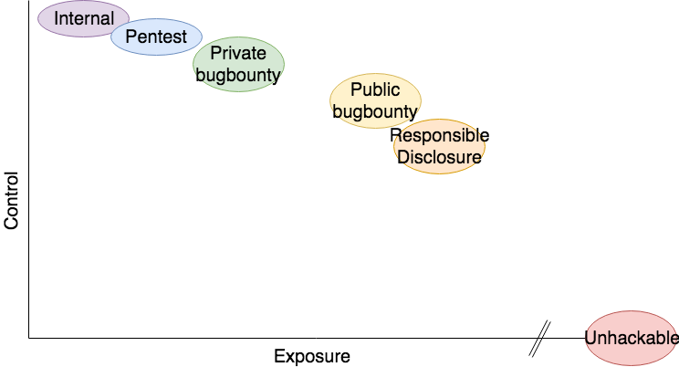
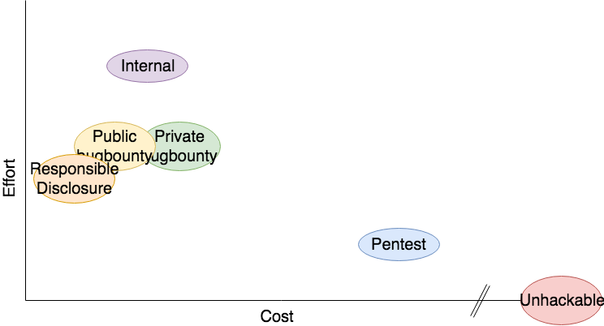

# Secure testing
* Risk Analysis
* Vulnerability Assessment & Penetration Testing

## Five ways

There are a number of ways to get your software tested. Some work well, some don't. All methods have their strengths and weaknesses.

We'll review each method based on the following criteria:

* Effort: How much effort does it cost to start testing your application using this method
* Control: How much control can you expect over the process
* Cost: How much monetary cost should you expect (apart from the effort to put in) to do this method
* Exposure: How much exposure to the public can you expect when using this method

For these criteria, we aim for a high level of control, but preferably a low cost and effort as well as exposure when things go wrong.

### Say It's unhackable

Declaring your software, product or service is unhackable or 100% secure will surely attract a number of (external) testers. They will probably test for free, albeit without adhering to ethical and responsible standards.

This is also the major downside as these testers will only be drawn in to prove you are wrong since nothing is 100% unhackable. The only outcome that you should expect from this approach is that your product or service will be hacked. The bad PR that will flow out of this will add to the cost.

So, this method may have low effort and cost to set up, but the cost of the inevitable outcome is much greater. You will have no control over this and it will probably result in major exposure if your product or service is expected to be secure.

* Effort to say you're unhackable is really low: post on Social media will land with the correct hackers very quickly
  * But costs will be high or gigantic, depending on how ethical they handle it
  * Prepare for PR backlash and bad publicity in news

#### Conclusion
* Low effort
* No control
* High cost: PR, damage, recalls / panic fixes
* High exposure

Examples of these are:

* [Bitfi](https://www.zdnet.com/article/unhackable-bitfi-cryptocurrency-wallet-just-got-hacked/) crypto-wallet
* [eyeDisk](https://www.zdnet.com/article/unhackable-biometric-drive-exposed-passwords-in-clear-text/) flashdrive

### Responsible disclosure process

Have a responsible disclosure policy and hope someone (everyone) uses it. This requires very little effort and cost:
* Security.txt proposed standard at [IETF.org](https://tools.ietf.org/html/draft-foudil-securitytxt-06)
* Generate one at [securitytxt.org](https://securitytxt.org/)
* But handling them requires a business process to communicate between external researchers of various levels (in experience and communication) and development teams that should solve the issues in a timely manner
  * Effort to handle is dependent on dev-team's ability to communicate with bug-reporters and fix bugs
* Control depends on responsible disclosure rules
  * Make them easy to read, though clear on feasible requirements
  * Make sure you can fix bugs within short time-frame
  * Fixing in very short time-frame is PR bonus
  * Allow for flexibility in disclosure deadline based on these factors:
    * Is the issue already publicly disclosed?
    * Severity of the issue
    * Impact on critical infrastructure
    * Threat to public health and safety
    * Workarounds and ad-hoc mitigation
    * Feasibility of upgrade, update or patch
    * Time needed to roll out the patch
* Cost depends on bounties:
  * Small thank-you's, acknowledgements, mentions
  * Stickers and t-shirts (geeky stuff or self-references for bonus-points)
  * Products, especially if the product is relevant to the researcher, like computer-hardware
  * Actual bounties
  * Doesn't have to be $100k budget (unless you're Google / Facebook)
* Exposure depends on product, PR, handling etc.
  * If you handle it badly, you WILL get exposure
  * If you have a security-related product, you WILL get exposure: see BitFi, but also Tesla, secure USB's etc.

More on [responsible disclosure](responsible_disclosure.md)

#### Conclusion
* Medium effort
* Medium control
* Low cost
* Medium exposure

Sources:
* [ICS-CERT](https://ics-cert.us-cert.gov/ICS-CERT-Vulnerability-Disclosure-Policy) Disclosure procedure where ICS-CERT acts as intermediary
* [Tesla](https://www.tesla.com/about/security) responsible disclosure
* [Dropbox](https://hackerone.com/dropbox) responsible disclosure

### Bug bounty program

Use a bug-bounty platform (private or public)

* Bug bounties formalize and streamline responsible disclosure
  * Effort is again two parts: setting up and handling
  * Setup is a bit more than just a responsible disclosure, but platforms help with that
  * Handling is similar to responsible disclosure, so reuse that for both
  * Cost will be: fee's to Bug bounty platform and thank-you's mostly in form of bounties, but thank-you's, stickers, t-shirts and product for duplicates or low-level bugs will increase goodwill
  * Private bug-bounties should be aimed at experienced bug-hunters, which will result in more and higher bounty-payouts
  * Cost also depends on how good the base security is of what you like to test

Things to consider:
* You might also pay for quality duplicate findings or findings that are useful but would not qualify for a bounty under the rules you've set. This will nurture the relationship between the reporter and stimulate him / her to search and report more findings.
* The value of a bug-bounty program is in the program as a whole, not in individual bugs. Think about what the results of a well-run bug-bounty program would look like if a company was creating good quality, secure software. Would it have:
  * No bug-bounty program at all?
  * No bug submissions at all?
  * Good or bad quality bug-submissions?

#### Conclusion
* Low effort
* High to medium control (private vs. public)
* Low cost (if low hanging fruit is already fixed)
* Low to medium exposure (private vs. public)

 
### Pentest

Hire pentesters to do this (most common way)

* Initiating pentest is also easy: phone us, we'll do it for you
  * Running quality pentests that cover both low fruit and advanced attacks is expensive

#### Conclusion
* Low effort
* High control
* High cost (but most effective if low hanging fruit is already fixed)
* Low exposure

### Internal testing

Have developers test their own software using:
* Security Unit-tests
* Dynamic Analysis
* DAST
  * OWASP ZAP

Internal testing is all about maturity of SSDLC:
* Start with awareness training for devs
* Learn them how to [Hack yourself first](https://www.pluralsight.com/courses/hack-yourself-first)
* That should fix low hanging fruit.
* Have experienced pentesters test for advanced issues
* Having automated security (unit-) tests is very helpful

#### Conclusion
* High effort
* High control
* Low to medium cost
* Low exposure

## Comparison

* With more exposure comes less control
* Saying you're unhackable is basically the bullseye on your head

### Cost vs effort

## Advise

* Proper bug-fixing process
  * Fast
  * Reliable
* Embrace external researchers
  * Acknowledge
  * Cooperate
  * Thank
* Never, EVER claim you're unhackable

## Opinion

In my opinion, a good security-focused company would employ:
* Internal testing to catch and fix the obvious issues in their product.
* Pentesting would find and report the more advanced issues.
* It would then run both a responsible disclosure procedure and run a bug-bounty program.
* These programs would both direct their findings into a mature and flexible incident response team that knows how to:
  * communicates on any level, with every type of issue reporter, from professional well-skilled ethical hackers to inexperienced hackers that don't know how to fill in a quality report.
  * communicate transparently about findings, sets clear disclosure deadlines and understands the importance of this deadline for both the researcher and himself
  * reward and nurture relationships with all researchers

In the end, a company would not have built more secure software because of any single one of these programs. Instead, running these programs would be a natural result of being security-focused. And that, along with the totality of all testing efforts in a mature SSDLC will result in more secure software. 
