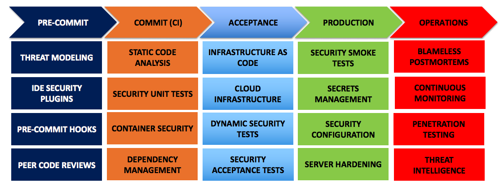

# SecDevOps

This documentation is provided by [Sans.org](https://software-security.sans.org/blog/2018/10/14/exploring-the-devsecops-toolchain)
to provide DevOps teams with Security tools and help them deliver secure software, while staying productive and agile
in a DevOps way-of-working.
The tools described can be integrated in CI/CD toolchains.

* [Secure DevOps poster](https://www.sans.org/security-resources/posters/appsec/secure-devops-toolchain-swat-checklist-60): Toolchain and SWAT checklist
* [Exploring DevOps toolchain](https://blogs.sans.org/appsecstreetfighter/files/2018/10/DevSecOps_Exploring_Phase1-2.pdf): Presentation detailing DevOps toolchain and challenges in adding Sec to DevOps

## Pre-commit
* Threat modeling
  * OWASP User Security Stories [source](https://github.com/OWASP/user-security-stories)
  * OWASP Application Security Verification Standards [source](https://www.owasp.org/index.php/Category:OWASP_Application_Secuity_verification_standard_Project)
  * Mozilla's Rapid Risk Assessment (RRA) [source](https://infosec.mozilla.org/guidelines/risk/rapid_risk_assessment.html)
  * OWASP Threat Dragon [source](https://www.owasp.org/index.php/OWASP_Threat_Dragon)
* IDE Security plugins
  * [FindSecurityBugs](http://find-sec-bugs.github.io/) for Eclipse and IntelliJ
  * [Puma Scan](https://github.com/pumasecurity/puma-scan) for Visual Studio
  * Microsoft's [DevSkim](https://github.com/Microsoft/DevSkim) for VSCode, Sublime, Visual Studio
  * [SonarLint](https://www.sonarlint.org/) for VisualStudio, IntelliJ and Eclipse
* Pre-commit hooks
  * For hooks:
    * Yelp pre-commit framework
    * Overcommit
  * AWS Labs [git-secrets](https://github.com/awslabs/git-secrets)
    * [BFG](https://rtyley.github.io/bfg-repo-cleaner/) deletes secrets from GIT repo history
      * [BFG Blog](https://anchor.host/removing-sensitive-data-from-git-repos/) 
  * git-hound
  * [GitGot](https://github.com/BishopFox/GitGot) for scanning secrets on GitHub
  * ThoughtWorks [Talisman](https://github.com/thoughtworks/talisman)
  * Auth0 [repo-supervisor](https://github.com/auth0/repo-supervisor)
  * Peer Code reviews
    * CERT Secure Coding Standards
    * OWASP Proactive controls
    * Ensure frameworks & libraries are used to do security things (authentication, crypto etc.)
    * Check for hard-coded secrets, backdoors, re-invented wheels
    * Get all developers trained in secure coding
    * Focus on high-risk code that does:
      * Infrastructure (code)
      * Pipelines (definitions)
      * Authentication & access control
      * Output encoding
      * Input Validation
      * High risk business logic
      * Handling of confidential data
      * Cryptography
    * Use workflow tools to support & enforce code review
      * Pull request comments (See BitBucket, GitHub, GitLab etc.)
      * Review Board or Gerrit
      * Atlassian Crucible
      * SmartBear Code Collaborator
      * Facebook's Phabricator

## Commit
* Static Code analysis
  * Wikipedia [List](https://en.wikipedia.org/wiki/List_of_tools_for_static_code_analysis) of Static Code Analysis Tools
  * [Awesome Static Analysis](https://github.com/mre/awesome-static-analysis) list of tools
  * [Checkmarx](https://www.checkmarx.com/) for [these](https://checkmarx.atlassian.net/wiki/spaces/KC/pages/22806548/7.1.8+Supported+Environments) languages: Java, .NET / C# and VB.NET, ASP, VB6, C / C++, PHP, Apex, Ruby, JavaScript, Perl 5, Objective C, HTML5, PL/SQL, Python, Groovy
  * [Fortify](https://www.microfocus.com/en-us/products/static-code-analysis-sast/overview) supports 25+ languages including Java, C#, C++, Swift & PHP
  * [Kiuwan](https://www.kiuwan.com/code-analysis-qa/)
  * [CodeSonar](https://www.grammatech.com/products/codesonar): SAST for C, C++, Java and binaries
  * [Coverity](https://scan.coverity.com/): SAST for C, C++, C#, Java, JavaScript, Ruby and Python
  * [Klocwork](https://www.roguewave.com/products-services/klocwork): SAST for C, C++, C# and Java
  * [GuardRails](https://www.guardrails.io/): SAST for PHP, Python, Ruby, Java (using Maven), JavaScript, Go, and Solidity. Coming soon (planned aug 2019): Elixir, C/C++, .NET
  * Java:
    * [FindSecurityBugs](http://h3xstream.github.io/find-sec-bugs/)
      * See [JavaVulnerableLab](https://github.com/brampat/JavaVulnerableLab) demo for an example-project and instructions to run Sonar with FindSecurityBugs and import them into Sonarcloud
    * [OWASP Lapse+](https://www.owasp.org/index.php/OWASP_LAPSE_Project)
    * [OWASP Orizon](https://www.owasp.org/index.php/Category:OWASP_Orizon_Project) (Also for Android APK files)
    * The [Checker Framework](https://checkerframework.org/)
    * Parasoft [Jtest](https://www.parasoft.com/products/jtest)
  * Groovy: [CodeNarc](http://codenarc.sourceforge.net/)
  * PHP:
    * [OWASP WAP](https://www.owasp.org/index.php/OWASP_WAP-Web_Application_Protection)
    * [Phan](https://github.com/etsy/phan)
  * JavaScript: [NodeJsScan](https://github.com/ajinabraham/NodeJsScan)
  * Ruby: [Brakeman](http://brakemanscanner.org/)
  * Python:
    * [Bandit](https://github.com/openstack/bandit) on GitHub
    * [Bandit](https://bandit.readthedocs.io/en/latest/)
  * C: [Flawfinder](http://www.dwheeler.com/flawfinder/)
    * Parasoft [C/C++test](https://www.parasoft.com/products/ctest)
  * C#: [PumaScan](https://github.com/pumasecurity/puma-scan)
  * Go: [Gosec](https://github.com/GoASTScanner/gas)
  * .NET: [OWASP O2](https://www.owasp.org/index.php/OWASP_O2_Platform)
    * [Microsoft SDL](https://docs.microsoft.com/en-us/azure/security/azure-security-threat-modeling-tool) for Azure
    * [WhiteSource](https://marketplace.visualstudio.com/items?itemName=whitesource.whitesource) for dependency management, checks licenses and vulnerabilities.
    * [Fortify](https://marketplace.visualstudio.com/items?itemName=fortifyvsts.hpe-security-fortify-vsts) for VisualStudio
    * [Checkmarx](https://marketplace.visualstudio.com/items?itemName=checkmarx.cxsast) for VisualStudio
    * [Reshift](https://www.softwaresecured.com/reshift)
    * [OWASP ZAP VSTS extension](https://github.com/deliveron/owasp-zap-vsts-extension) for active scan of vulnerabilities on running code in Visual Studio TReam Services (current Azure DevOps)
    * Parsoft [dottest](https://www.parasoft.com/products/dottest)
  * [Secure Headers](https://securityheaders.com/)
  * [ImmuniWeb](https://www.immuniweb.com/free/) free tests for Website, Mobile app, SSL and Phishing sites.
* Security Unit tests
  * Leverage "test-obsessed" teams
  * Think evil to come up with test-cases: evil user stories, abuse cases, OWASP ASVS
  * Increase test-coverage for high-risk code
  * FIX broken tests ASAP
  * TDD: Write tests first when fixing code, issues, vulnerabilities
  * Java: [JUnit](https://junit.org/)
  * C#, F#, VB: [XUnit](https://xunit.github.io/)
  * NodeJS: [Mocha](https://mochajs.org/)
  * Ruby: [RSpec](http://rspec.info/)
  * Python: [PyUnit](https://wiki.python.org/moin/PyUnit)
* Infrastructure as Code analysis
  * Ansible-lint
  * Foodcritic
  * puppet-lint
  * cfn_nag
* Container Security
  * Dangers:
    * Untrusted content & vulnerable images
    * Docker Daemon: extra attack surface
    * Container sprawl (scale is next-level vs. VM's in both number of machines, changes, but also security-events that can feed SIEM)
  * Guides / Resources:
    * Docker Security Guidelines
      * [Research on top 1000 Docker containers](https://www.kennasecurity.com/one-fifth-of-the-most-used-docker-containers-have-at-least-one-critical-vulnerability/) reveals 20% with high risk and 60% with medium risk CVE's
        * [VulnerableContainer.org](https://vulnerablecontainers.org/)
      * [10 Docker Security Best practices](https://snyk.io/blog/10-docker-image-security-best-practices/)
      * [Shifting Docker Security Left](https://snyk.io/blog/shifting-docker-security-left/)
      * [Top 2 Docker Base images have over 500 vulnerabilities](https://snyk.io/blog/the-top-two-most-popular-docker-base-images-each-have-over-500-vulnerabilities/)
      * [Top 10 Docker Base images have over 8000 vulnerabilities](https://snyk.io/blog/top-ten-docker-images-contain-over-8000-vulnerable-paths/)
      * [80% devs not addressing Docker Security](https://snyk.io/blog/80-of-developers-are-not-addressing-docker-security/)
      * [Improve security in your Docker images](https://snyk.io/blog/take-actions-to-improve-security-in-your-docker-images/)
    * Docker Reference Architecture
    * [CIS Docker Benchmark](https://github.com/dev-sec/cis-docker-benchmark)
    * [Docker Bench](https://github.com/docker/docker-bench-security)
    * [BLOG Docker Security & best practices](https://blog.docker.com/2015/05/understanding-docker-security-and-best-practices/)
    * NCC Group: Understanding and hardening Linux Containers
    * NIST SP 800-190 Application Container Security Guide
    * CIS Kubernetes Benchmark
    * Securing Kubernetes [course-material](https://github.com/manicodesecurity/defending-devops)
  * Tools:
    * [Actuary](https://github.com/diogomonica/actuary)
    * [Anchore](https://anchore.com/opensource/)
    * [Clair](https://github.com/coreos/clair)
    * Dagda
    * Docker Bench
    * [Falco](https://github.com/draios/falco)
  * Hardening:
    * Bane
    * CIS Benchmarks
    * grsecurity
* Dependency Management
  * Scan code to identify external dependencies (Bill of materials)
  * Identify out-of-date components
  * Check for CVE's
  * Commercial tools check for licensing risks and violations
  * Ensure also transitive dependencies are checked
  * Integrate into CI/CD
  * Tools:
    * [OWASP Dependency Check](https://www.owasp.org/index.php/OWASP_Dependency_Check): for Java, .NET, Ruby, Python
    * [OSSIndex](https://ossindex.sonatype.org/) supports numerous ecosystems and integrates with several toolchains
      * Maven [ossindex-maven-plugin](https://sonatype.github.io/ossindex-maven/maven-plugin/)
      * NPM [AuditJS](https://www.npmjs.com/package/auditjs) package
      * Visual Studio [Audit.Net](https://marketplace.visualstudio.com/items?itemName=VorSecurity.AuditNet) extension
    * GitHub [Automated Security fixes](https://help.github.com/en/articles/configuring-automated-security-fixes) for vulnerable dependencies
    * [JForg X-Ray](https://jfrog.com/xray/): in combination with JFrog Artifactory
    * [PHP Sercurity Checker](https://security.sensiolabs.org/)
    * Ruby [Bundler-Audit](https://github.com/rubysec/bundler-audit)
    * [NPM Audit](https://docs.npmjs.com/cli/audit)
    * [Retire.JS](https://retirejs.github.io/retire.js/)
    * Ruby & Rails [Hakiri](https://hakiri.io/)
    * [Snyk](https://snyk.io/) scans [support](https://snyk.io/docs/) Ruby, Java, Python, .NET, PHP, NodeJS and others
    * [SourceClear](https://www.sourceclear.com/) supports [10+ languages](https://www.sourceclear.com/vulnerability-database/search#_) and integrates with several toolchains
    * [Nexus](https://www.sonatype.com/products-overview) platform
    * [BlackDuck](https://www.blackducksoftware.com/)
    * [13 tools](https://techbeacon.com/app-dev-testing/13-tools-checking-security-risk-open-source-dependencies) for checking open source dependencies
    * Node Security Platform (Included in NPM as of April 2018)
    * [Gemnasium](https://docs.gitlab.com/ee/user/project/import/gemnasium.html) (Integrated into GitLab and integrates with GitHub)
  
## Acceptance
* Infrastructure as Code analysis
  * Red Hat [Ansible](https://www.ansible.com/) automation
  * [Chef](https://www.chef.io/) enterprise automation
  * [Puppet](https://puppet.com/) infrastructure automation and delivery
  * [Saltstack Enterprise](https://www.saltstack.com/products/saltstack-enterprise/) 
  * [Saltstack Security](https://www.saltstack.com/products/secops/)
  * Hashicorp [Terraform](https://www.terraform.io/) infrastructure as code
  * Hashicorp [Vagrant](https://www.vagrantup.com/)
  * Comparison [Puppet vs Chef](https://logz.io/blog/chef-vs-puppet/) and [Revisited](https://www.upguard.com/articles/puppet-vs.-chef-revisited)
  * Comparison [Ansible vs Saltstack](https://www.upguard.com/articles/ansible-vs-salt)
  * Comparison [Ansible vs Terraform](https://linuxacademy.com/blog/devops/ansible-vs-terraform-fight/)
  * Comparison [Terraform vs Vagrant](https://www.trustradius.com/compare-products/terraform-vs-vagrant)
  * [Blog](https://blog.pulumi.com/testing-your-infrastructure-as-code-with-pulumi) on testing ingrastructure as code with Pulumi
* Immutable Infrastructure:
  * Docker
  * RKT
* Security Scanning:
  * Arachni
  * NMap
  * SQLMap
  * sslyze
  * OWASP ZAP
  * ssh_scan
* Cloud Configuration Management:
  * AWS CloudFormation
  * Azure Resource Manager
  * Google Cloud Deployment Manager
* Security Acceptance testing:
  * [BDD-Security](https://github.com/continuumsecurity/bdd-security)
  * [Gauntlt](http://gauntlt.org/)
    * Gauntlt [Starter Kit](https://www.youtube.com/watch?v=hMpVQKcyGSE) video
  * Mittn
* Infrastructure Tests:
  * Serverspec
  * Test Kitchen
* Infrastructure Compliance Checks
  * HubbleStack
  * InSpec  

## Production
* Security Smoke Tests:
  * ZAP Baseline Scan
  * NMap
  * SSLLabs-Scan
* Configuration Safety Checks
  * AWS Config
  * AWS Trusted Advisor
  * Microsoft Azure Advisor
  * Security Monkey
  * OSQuery
* Secrets Management
  * Ansible Vault
  * [HashiCorp Vault](https://www.vaultproject.io/)
  * Blackbox
  * Chef Vault
  * Docker Secrets
  * Hashicorp Vault
  * Pinterest Knox
* Cloud Secrets Management:
  * AWS KMS
  * Azure Key Vault
  * Google Cloud KMS
* Cloud Security Testing:
  * CloudSploit
  * Nimbostratus
* Server Hardening:
  * dev-sec.io
  * SIMP
* Intrusion Detection System (IDS):
  * [Comparison](https://www.alienvault.com/blogs/security-essentials/open-source-intrusion-detection-tools-a-quick-overview) of Open-source IDS
  * [Fail2Ban](https://www.fail2ban.org/wiki/index.php/Main_Page): scans logfiles and bans IPs based on malicious signs
  * [Snort](https://www.snort.org/): Network-based IDS
  * [Suricata](https://suricata-ids.org/features/): Network-based IDS and extra non-IDS functions
  * [Zeek](https://www.zeek.org/documentation/index.html) (formerly known as Bro): Signature and Anomaly-based IDS
  * [OSSEC](https://www.ossec.net/): Host-based IDS
  * [Samhain](https://la-samhna.de/samhain/s_documentation.html): Host-based IDS
  * [Netfilter](https://www.netfilter.org/): Linux kernel packet filtering framework
* File Integrity Monitors (FIM):
  * [AFICK](http://afick.sourceforge.net/)
  * [TripWire](https://github.com/Tripwire/tripwire-open-source)
  * [ChkRootkit](https://github.com/Magentron/chkrootkit): Rootkit-finding file integrity checkers for Unix-based systems
  * [rkhunter](http://rkhunter.sourceforge.net/): Rootkit-finding file integrity checkers for Unix-based systems
  * [Unhide](http://www.unhide-forensics.info/): Rootkit-finding file integrity checkers for Unix-based systems
* Multi-tools
  * [Wazuh](https://wazuh.com/): OpenSource tool for threat detection, integrity monitoring, incident response and compliance

## Operation
* Tools Integration:
  * [Nucleus](https://www.nucleussec.com/)
* Fault Injection:
  * Chaos Kong
  * Chaos Monkey
* Cyber Simulations:
  * Game day exercises
  * Tabletop Scenarios
* Penetration Testing:
  * Attack-driven defense
  * Bug Bounties
  * Red Team exercises
* Threat Intelligence
  * Diamond Model
  * Kill Chain
  * STIX
  * TAXII
* Continuous Scanning:
  * OpenSCAP
  * OpenVAS
  * Prowler
  * Scout2
  * vuls
* Blameless Postmortems:
  * Etsy Morgue
* Continuous Monitoring / SIEM:
  * [SIEM](https://en.wikipedia.org/wiki/Security_information_and_event_management) - Security Information and Event Management
  * [Comparison](https://logz.io/blog/open-source-siem-tools/)
  * [LME](https://www.ncsc.gov.uk/blog-post/logging-made-easy) Logging Made Easy blog by NCSC UK
  * [Splunk](https://www.splunk.com/page/sign_up/es_sandbox)
    * [ThreatHunting](https://github.com/olafhartong/ThreatHunting) for Splunk: A Splunk app mapped to MITRE ATT&CK to guide your threat hunts
      * [BLOG](https://securityaffairs.co/wordpress/81288/security/hunting-mitres-attck-splunk.html) on using ThreatHunting
  * [Elastic Stack](https://www.elastic.co/solutions/security-analytics) with [additions](https://logz.io/blog/elk-siem/):
    * [X-Pack](https://www.elastic.co/products/stack)
    * [ElastAlert](https://github.com/Yelp/elastalert)
    * Blog on [Security plugins](https://www.theserverside.com/feature/Detect-attacker-intent-with-Elasticsearch-security-plugins) for Elasticsearch
  * [Backstory](https://chronicle.security/products/backstory/) from Google / Alphabet's [Chronicle](https://chronicle.security/)
  * [OSSIM](https://www.alienvault.com/products/ossim)
  * [OSSEC](http://www.ossec.net/)
  * [Apache Metron](http://metron.apache.org/)
  * [SIEMonster](https://siemonster.com/)
  * [Prelude](https://www.prelude-siem.org/)
  * [Elastic Intel](https://github.com/securityclippy/elasticintel/)
  * Grafana
  * Graphite
  * Statsd
  * Seyren
  * Sof-elk
  * ElastAlert
  * 411
* Cloud Monitoring
  * CloudWatch
  * CloudTrail
  * Reddalert
* Cloud Compliance:
  * Cloud Custodian
  * Compliance Monkey
  * Forseti Security
