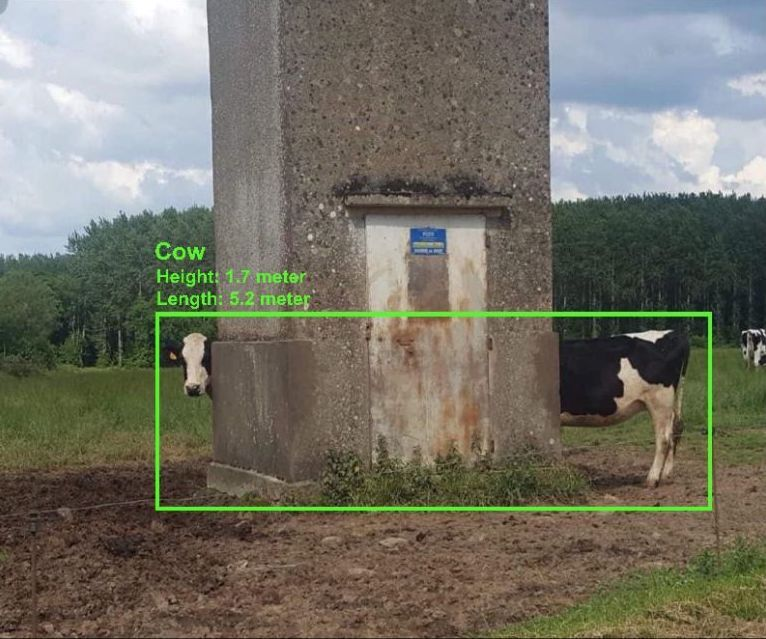

# AI and Machine Learning

Humans can do Deep Learning as well

## AI is bad at

Distinguish similar looking objects

Drawing details

AI is (at this moment?) still bad at judging correctness of its solution.
AI Hallucination is a result of this.  

Extrapolate correctly

Again, bad at judging correctness

Lie

But they wouldn't give false information deliberately

Or can it?

Find a satisfying solution

## AI is good at

Finding bugs in complex code

Solving classic captchas

## AI is worse than

A bunny

A parrot

## Advantage or burden

Whether AI is helpful or not, depends on correctness

AI as a tool can be very helpful if used correctly.
But if we trust AI blindly, it can become a burder.

AI becomes scary when it intentionally errs to pretends to be human

