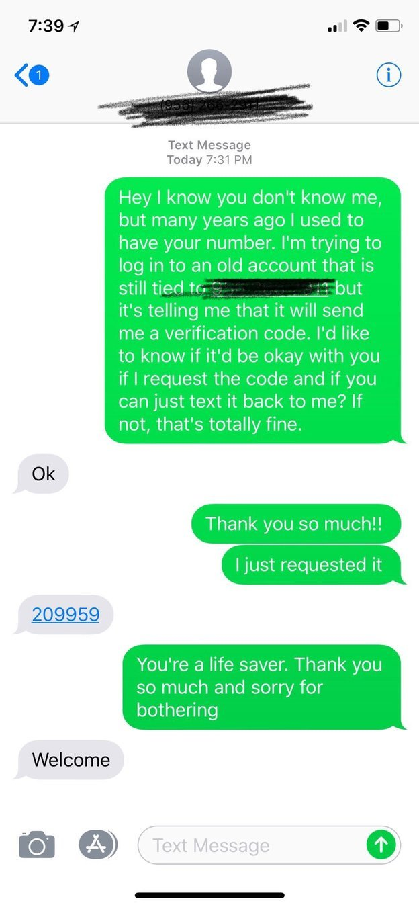

# Authentication

Making sure your accounts are secure is easy. Just use a password manager and MFA where possible. But the theory is easy, while in practice, a mistake is easily made.


## Strong passwords
Choosing a strong password is hard in itself. Because systems ask us to jump through all those hoops that just don't help


## Choosing is hard
Sometimes, the rules are so mind bogglingly complex, you almost need a manual.


## Sufficient
So ```P@ssw0rd``` would be good enough right?


## Too strong
Why not use Emoji in your passwords?


_- Let it go from Frozen_ 

Well, [this](https://apple.stackexchange.com/questions/202143/i-included-emoji-in-my-password-and-now-i-cant-log-in-to-my-account-on-yosemite) is why. 
And some [more info](https://medium.com/@hvost/why-you-should-not-use-emojis-in-your-passwords-b8db0607e169) how he fixed it.

## What is 2FA?
What exactly is 2FA anyway?


## Unbreakable
But it's super-safe right?

