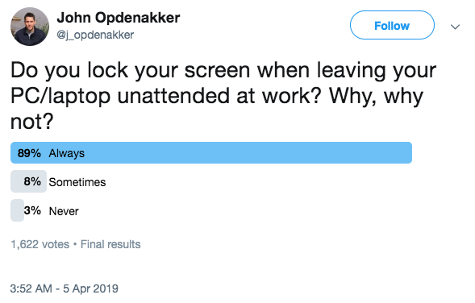
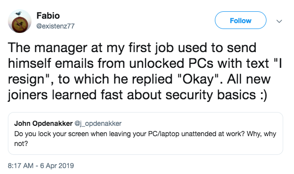
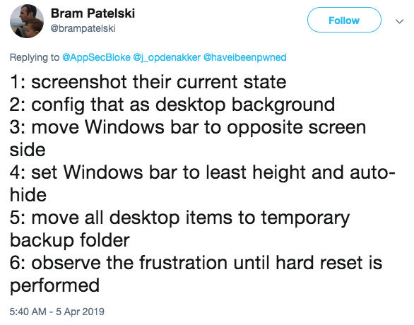
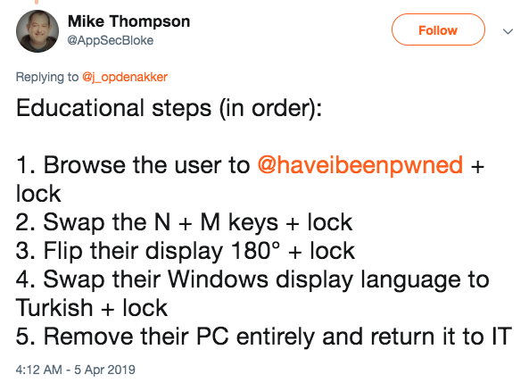

# Unlocked

One of my contacts, working on SSDLC proposed the following question?

[Source](https://twitter.com/j_opdenakker/status/1114118532751601666)

As you can see, most of his followers do the right thing. As a rule for security hygiene, it is good practice to lock your PC when unattended. To educate people, numerous pranks can be undertaken. Here are some examples. Perform at your own risk.

## Fake update

Browse to [Fakeupdate.net](http://fakeupdate.net) and see how long they will wait.

## I resign

Resign your colleague, but do please be careful. This is doable only if your/his/her boss is in on this prank as well.

## Not responding

You can make a PC act like it's not responding. Quite normal behavior, isn't it?

## Increasing

And you could always icrease the level of the prank, until they learn

