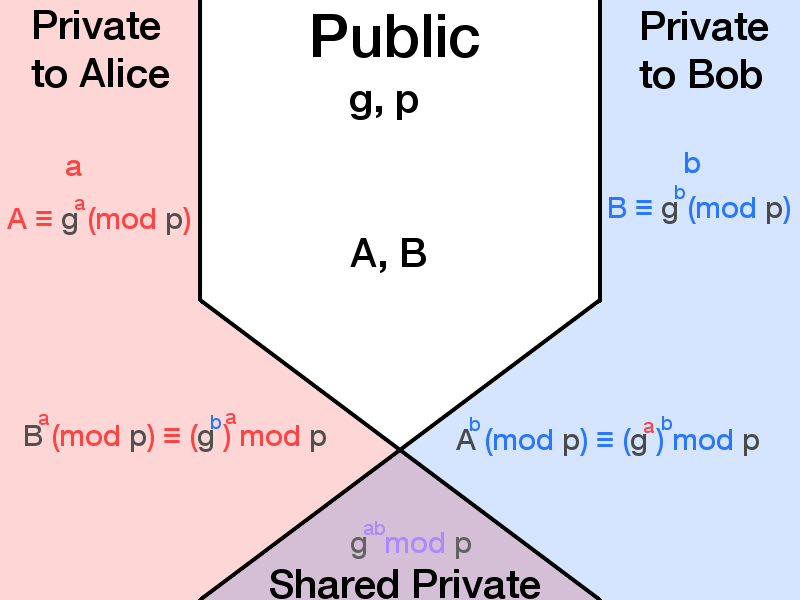

# Diffie Hellman

The Diffie Hellman key-exchange method allows for any number of individuals to securely exchange (symmetrical) cryptographic keys over a public channel.
This can be done using mathematical properties of large prime-numbers and modulo functions. Below is an example of such a key exchange with 
small primenumbers to be able to understand the basics. For sufficiently secure Diffie-Hellman key exchange, the number p in the algorithm 
should be at least 2048 bits. [source](https://en.wikipedia.org/wiki/Diffie%E2%80%93Hellman_key_exchange#Practical_attacks_on_Internet_traffic)

In the example below Alice and Bob use Diffie Hellman for key exchange. The following base-numbers are used:
* p = 13
* g = 6

* Alice chooses a personal secret a: 5
* Bob chooses a personal secret b: 4

Both calculate using (g^private) MOD p:
* Alice -> A = (6^5) MOD 13 = 2
* Bob -> B = (6^4) MOD 13 = 9

Based in this public information, Alice and Bob can use their respective secrets a and b to agree upon a shared secret:
* Alice -> Sa = (9^5) MOD 13 = 3
* Bob -> Sb = (2^4) MOD 13 = 3

In this example the confidentiality of information is:

| Alice     |   Public  |   Bob     |
| --------- | --------- | --------- |
| a = 5     | p = 13    | b = 4     |
|           | A = 2     |           |
| Sa = 3    | B = 9     | Sb = 3    |

In the diagram below we see in generic terms what the confidentiality of information is.

To demonstrate Diffie Hellman, you can use [this](https://github.com/brampat/security-examples) set of Groovy scripts,
which contains a Diffie Hellman Demo tool.

Sources:

* [Wikipedia](https://en.wikipedia.org/wiki/Diffie%E2%80%93Hellman_key_exchange)
* [Youtube](https://youtu.be/YEBfamv-_do)
* [Diffie-Hellman exploiting](https://blog.trendmicro.com/trendlabs-security-intelligence/how-exploit-kit-operators-are-misusing-diffie-hellman-key-exchange/)