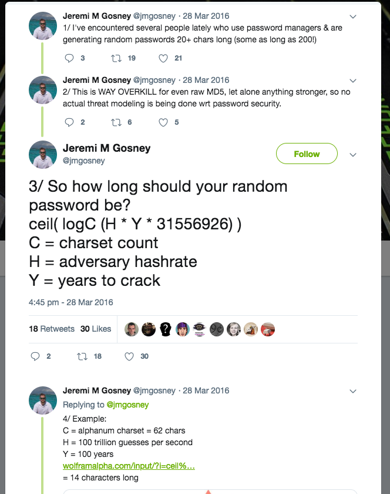

# Passwords, fun with numbers

When I was on holiday, I saw the number-lock on my suitcase. It has three dials of decimal combination, to support a thousand different combinations. Three dials, ten options each.


That's when my insane brain started thinking: what if it were the other way around? Instead of a three dial lock with ten options, have a ten-dial lock of three combinations each? What would be better for the number of possible combinations? Length or complexity? More dials or more options?


The total number of combinations for these locks can be calculated by the formula ```O ^ L``` (raised to the power of) where O is the number of options for each character and L is the length of the password. Using this formula, we can calculate:

```
O = 10
L = 3
10 ^ 3 = 1000
```

For the fictional long number-lock of ten length, the formula gives these numbers:

```
O = 3
L = 10
3 ^ 10 = 59049
```

Let's take a more practical example. Say we use only lowercase characters and a ten character password. 
```
O = 26
L = 10
26 ^ 10 = 141167095653376
```

Compare this to a 26 length password using only ten different characters.
```
O = 10
L = 26
10 ^ 26 = 100000000000000000000000000
```

That's a hefty 708.380.373.890 times bigger password-space. Yes, length matters when we're talking about passwords. Or does it? In this blogpost, I will try to find out to what extent password length will help you create safer and stronger passwords.


## Disclaimer
In the examples below, I do not use any optimization techniques. The system cracks passwords, simply by trying all theoretical possibilities in a given pattern. In real life, attackers will use lists of leaked passwords, variants of these passwords, combinations of words, different variants of l33tsp34k etc. to optimize and save a lot of time. Some patterns listed will reflect this, for instance 'Random18' is an 8 character pattern that starts with an uppercase character, five lowercase characters and two decimals. This often-used patterns still enables a password-space of 30891577600 options. However a fully random 8-character password using uppercase, lowercase and decimals (see '8x Alphanumeric') could theoretically have 218340105584896 different passwords, an increase of a factor 7000 times.
When choosing passwords, use fully randomized strings of characters preferably generated by cryptographically random password generators found in password managers for example. Creating strong passwords is all about randomness. Using patterns to derive your password or (please don't tell me you still do) password-reuse will dramatically decrease the time needed to crack certain passwords.

Other techniques to battle these sort of attacks are also not used. Using proper (dynamic) salting and peppering (static salting) would make the attack described below much harder. Login-throttling will (semi-) prevent an attack on the actual login-system, but that's an online attack, which is not a practical option for brute-forcing.

While SHA-1, MD5 and reduced forms of SHA2 have design flaws and can be [attacked](https://en.m.wikipedia.org/wiki/Secure_Hash_Algorithms), these flaws [cannot](https://twitter.com/jmgosney/status/1097986034846048256) be used to reverse a hashed password.

Also using quantum computing to crack passwords is left out of scope. 
 
## Basics
Let's take a password storage system that has at least hashed its passwords. There are several different hashing options, some of which are better suited for passwords than others. We'll see in a moment why that is. Say this system somehow leaks its user-database. Since passwords are hashed (I hope), this will not immediately reveal the actual passwords of user-accounts. It will however enable attackers to start cracking passwords offline.

### Brute-force
Obviously, when attackers use brute-forcing techniques to crack a password, the bigger the password-space is, the longer it will take for cracking a password. That's where my statistics fetish went in overdrive.

## Speed
Depending on password length, complexity and the hashing algorithm, brute-forcing passwords can take anywhere between seconds and many millenia. Let's see some statistics from a $5000,- cracking rig.


```
HASHCAT v3.2

OpenCL Platform #1: Intel(R) Corporation
========================================
* Device #1: Intel(R) Xeon(R) CPU E5-2620 v3 @ 2.40GHz, skipped

OpenCL Platform #2: NVIDIA Corporation
======================================
* Device #2: GeForce GTX 1070, 2036/8145 MB allocatable, 15MCU
* Device #3: GeForce GTX 1070, 2036/8145 MB allocatable, 15MCU
* Device #4: GeForce GTX 1070, 2036/8145 MB allocatable, 15MCU
* Device #5: GeForce GTX 1070, 2036/8145 MB allocatable, 15MCU

Hashtype: MD5
Speed.Dev.#*.....: 76526.9 MH/s

Hashtype: SHA1
Speed.Dev.#*.....: 25963.3 MH/s

Hashtype: SHA256
Speed.Dev.#*.....: 9392.1 MH/s

Hashtype: SHA512
Speed.Dev.#*.....: 3235.0 MH/s

Hashtype: scrypt
Speed.Dev.#*.....: 1872.4 kH/s

Hashtype: bcrypt, Blowfish(OpenBSD)
Speed.Dev.#*.....: 43551 H/s
```

Source: [Netmux.com](https://www.netmux.com/blog/how-to-build-a-password-cracking-rig)

This machine will crack (brute-force, no optimization) the full password space of most of these fictional password-patterns in seconds.

| Hash-type | 3x Number-lock    | Reverse Number-lock   | 10x Lowercase | Pattern like 'Random18'   | 8x Alphanumeric   |
| --------- | ----------------: | --------------------: | ------------: | ------------------------: | ----------------: |
| MD5       |          0 seconds|              0 seconds|     30 minutes|                  0 seconds|         47 minutes|
| SHA1      |          0 seconds|              0 seconds|        1 hours|                  0 seconds|            2 hours|
| SHA256    |          0 seconds|              0 seconds|        4 hours|                  0 seconds|            6 hours|
| SHA512    |          0 seconds|              0 seconds|       12 hours|                  0 seconds|           18 hours|
| SCRYPT    |          0 seconds|              0 seconds|        2 years|                  1 seconds|            3 years|
| BCRYPT    |          0 seconds|              1 seconds|      102 years|                  1 minutes|          158 years|

If we include some more complex and/or larger password-patterns, the numbers quickly become unimaginably large. So large, that even Java ```double``` was by far not suitable to calculate these numbers. But ```BigInteger``` saved me:

|        | 4x English words| 4x Dictionary Words| 8x All alphanumeric| 10x All alphanumeric| 14x All alphanumeric|        26x numerical|       10x ASCII|                8x UTF8 (smilies ;-)|                        42x numerical|                             30x alphanumeric or symbol|                                                                                                                                             30x UTF8|
| ------ | --------------: | -------------------: | -----------------: | ------------------: | ------------------: | ------------------: | -------------: | ---------------------------------: | ----------------------------------: | ----------------------------------------------------: | --------------------------------------------------------------------------------------------------------------------------------------------------: |
| MD5    |         226 days|             358 years|          47 minutes|             126 days|       5138 millennia|      41436 millennia|       489 years|      51421389666782902409 millennia|      414361381210588518603 millennia|       88938014688729074768127408015877045392 millennia|      5235959597778261501539031063423676185261821165413036824455971255837835566976203833828094413552079731849234334321635613864542157766366 millennia|
| SHA1   |          1 years|           1 millennia|             2 hours|              1 years|      15146 millennia|     122133 millennia|     1 millennia|     151564691117497717717 millennia|     1221331340151852287818 millennia|      262145049214965009527795362703902087372 millennia|     15433005686612150231369944355591058342426150071194606531583414538921341225900838998547149182748674106575557459151894268396175804045363 millennia|
| SHA256 |          5 years|           2 millennia|             6 hours|              2 years|      41871 millennia|     337621 millennia|     3 millennia|     418981861872310611515 millennia|     3376219587074731583385 millennia|      724667598969655458510131849159423458553 millennia|     42662637380694119536858346513294931385090966039910874858813222463386937814805129116063414824848399232466985123582412501852666736211388 millennia|
| SHA512 |         14 years|           8 millennia|            18 hours|              8 years|     121563 millennia|     980209 millennia|    11 millennia|    1216420261171848066281 millennia|     9802099531302808811224 millennia|     2103910527444482544628441836318460916561 millennia|    123861439426033149954289729918861615165969972841869220328117362194243109320071484751461885124098500906106080673631646509629190495570627 millennia|
| SCRYPT |     25 millennia|       14642 millennia|             3 years|         14 millennia|  210028588 millennia| 1693537277 millennia| 19993 millennia| 2101644704598872299946099 millennia| 16935372774922338444943672 millennia|  3634987479322207344516668094686082602583640 millennia| 213999015457817368138286304362057960404781490142836427986252759398833827521059203787107027545641236077362300245245875058027361275993900447 millennia|
| BCRYPT |   1092 millennia|      629518 millennia|           158 years|        611 millennia| 9029816284 millennia|72810709246 millennia|859597 millennia|90356582969183910689055971 millennia|728107092460898406565004976 millennia|156280006343893390091456208594296825907042533 millennia|9200517933990430532068776291876588943122152468219947366569301891997346987449915114945218212588887750711881954012499746473110405115174834065 millennia|

Although these numbers look very impressive, they are far from meaningful.

## Length
Then I saw a [Tweet](https://twitter.com/jmgosney/status/714599256410054657) by Jeremi M Gosney, founder and CEO of Terahash. Terahash builds professional hashcrack-servers with 40-ish GPU's costing 10-100k. Clients are state-actors like secret service and intelligence agencies.



With a bit of tinkering (there's no logC method in Java / Groovy), I've come up with this:

```groovy
    int requiredLength(MaskSymbol pattern, BigInteger years, BigInteger speed) {
        return Math.ceil( logX(pattern.options, (speed * years * ExtraLongDuration.SECONDS_IN_YEAR)))
    }

    static double logX(long x, double a) {
        return Math.round(Math.log(a) / Math.log(x));
    }
``` 

This will calculate for each password-pattern and hashing algorithm, the required length for a given minimum time to crack. I've chosen 100 years for this, here are the results:

|      |Decimal|Lowercase|UPPERCASE|Alphanumeric|ASCII|Symbol|Alphanumeric or symbol|UTF8|English words|Dictionary Words|USA Cities|Cities|
|------| ----: | ------: | ------: | ---------: |----:|----: | -------------------: |---:| ----------: | -------------: | -------: | ---: |
|MD5   |     20|       14|       14|          11|   10|    13|                    10|   4|            4|               4|         5|     3|
|SHA1  |     20|       14|       14|          11|    9|    13|                    10|   4|            4|               4|         4|     3|
|SHA256|     19|       14|       14|          11|    9|    13|                    10|   4|            4|               4|         4|     3|
|SHA512|     19|       13|       13|          11|    9|    13|                    10|   4|            4|               4|         4|     3|
|SCRYPT|     16|       11|       11|           9|    7|    10|                     8|   3|            3|               3|         4|     3|
|BCRYPT|     14|       10|       10|           8|    7|     9|                     7|   3|            3|               3|         3|     2|

As you can see, password-length quickly adds so much password-space that cracking a sufficiently randomized password is almost impossible to crack with a $5000,- cracking-rig. 


## Professional cracking

But what about a more professional cracking-rig. Let's see what a $21200,- [machine](https://sagitta.pw/hardware/gpu-compute-nodes/brutalis/) would do. [Here](https://gist.github.com/epixoip/ace60d09981be09544fdd35005051505) are its benchmarks and below are both the speeds and minimum required password-length for at least 100 years to crack.


|      |     3x Number-lock|    Reverse Number-lock|  10x Lowercase|    Pattern like 'Random18'| 4x English words| 4x Dictionary Words| 8x All alphanumeric| 10x All alphanumeric| 14x All alphanumeric|        26x numerical|       10x ASCII|                8x UTF8 (smilies ;-)|                        42x numerical|                            30x alphanumeric or symbol|                                                                                                                                             30x UTF8|
| ---- | ----------------: | --------------------: | ------------: | ------------------------: | --------------: | -------------------: | -----------------: | ------------------: | ------------------: | ------------------: | -------------: | ---------------------------------: | ----------------------------------: | ---------------------------------------------------: | --------------------------------------------------------------------------------------------------------------------------------------------------: |
|MD5   |          0 seconds|              0 seconds|     4 minutes |                  0 seconds|          31 days|              49 years|           6 minutes|              17 days|        715 millennia|       5768 millennia|        68 years|       7158667536639855365 millennia|       57685632133462955256 millennia|      12381572778393489233896687903384065972 millennia|       728928063567795597784477490062793023579976099951695338842022315259917152356614977571364741452535292761966838237581183297526707755450 millennia|
|SHA1  |          0 seconds|              0 seconds|    23 minutes |                  0 seconds|         171 days|             270 years|          35 minutes|              95 days|       3882 millennia|      31302 millennia|       369 years|      38846194915014101623 millennia|      313028548704487527189 millennia|      67188060772782833483445304447090040129 millennia|      3955496115925145509399084662265718904856000613459495831801181309954357933370496082635530092561289737722143839873626618545413931423208 millennia|
|SHA256|          0 seconds|              0 seconds|    59 minutes |                  0 seconds|          1 years|             698 years|             1 hours|             247 days|      10014 millennia|      80749 millennia|       953 years|     100208293095665543512 millennia|      807493671504137738399 millennia|     173319443543392591480211292774787011389 millennia|     10203663833499295637369740212163092001963688320764944912870063375003856912772572363493692248327161872380356485691107489766852339306711 millennia|
|SHA512|          0 seconds|              0 seconds|       3 hours |                  0 seconds|          3 years|           2 millennia|             4 hours|              2 years|      30150 millennia|     243111 millennia|     2 millennia|     301696621628800111506 millennia|     2431117277358075525696 millennia|     521812007412457049356605256376087421517 millennia|     30720121176636069100774135095222629630684938791827752774333157000021195452870918645663229272995227467838136896276124635533218683398448 millennia|
|SCRYPT|          0 seconds|              0 seconds|      257 days |                  0 seconds|      7 millennia|        4315 millennia|             1 years|          4 millennia|   61896203 millennia|  499091712 millennia|  5892 millennia|  619362484440218540083273 millennia|  4990917129733939797641068 millennia| 1071244283667726612398364577081958143555144 millennia|  63066303068106908019536834231135173536147456070425266036272867978024153403703667769100369619337160688007109621342311554049017274442587423 millennia|
|BCRYPT|          0 seconds|              0 seconds|      24 years |                 18 seconds|    257 millennia|      148355 millennia|            37 years|        144 millennia| 2128016931 millennia|17158978346 millennia|202577 millennia|21293936931227968043393271 millennia|171589783461929580651041838 millennia|36829819027504875713598535392263101001502215 millennia|2168245435839920130422766646577474702715978691252418440267638889060478672350818469539930727145339017485136206597393812005684151802873264060 millennia|

As you can see, the time required to crack these password-patterns decreases dramatically. A 10-length lowercase password becomes within reach even when hashed with scrypt. An 8-length alphanumeric (no symbols!) password can be cracked within hours if no proper 'slow' hashing algorithm is used. What's more suprising though, is the difference in length to 'fix' these speed-gains.

|      |Decimal|Lowercase|UPPERCASE|Alphanumeric|ASCII|Symbol|Alphanumeric or symbol|UTF8|English words|Dictionary Words|USA Cities|Cities|
|------| ----: | ------: | ------: | ---------: |----:|----: | -------------------: |---:| ----------: | -------------: | -------: | ---: |
|MD5   |     21|       15|       15|          12|   10|    14|                    11|   4|            5|               4|         5|     3|
|SHA1  |     21|       14|       14|          11|   10|    14|                    10|   4|            5|               4|         5|     3|
|SHA256|     20|       14|       14|          11|   10|    13|                    10|   4|            4|               4|         5|     3|
|SHA512|     20|       14|       14|          11|    9|    13|                    10|   4|            4|               4|         4|     3|
|SCRYPT|     16|       12|       12|           9|    8|    11|                     8|   3|            4|               3|         4|     3|
|BCRYPT|     15|       10|       10|           8|    7|    10|                     7|   3|            3|               3|         3|     2|

Yes, you only need a single extra character in length for each of these combinations to make your password strong enough again. Let's add some more $$ to our machine, to illustrate Moore's law of decreasing hardware-prices (yes I know, that's not [Moore's law](https://en.wikipedia.org/wiki/Moore%27s_law), but it extends from Moore's law).
Let's take a hypothetical 40 Brutalis machines (currently about $847000,-). Since cracking passwords is perfectly suited for parallel execution, we can just multiply the speeds of this machine with 40 and rerun our calculations.

|      |     3x Number-lock|    Reverse Number-lock|  10x Lowercase|    Pattern like 'Random18'| 4x English words| 4x Dictionary Words| 8x All alphanumeric| 10x All alphanumeric| 14x All alphanumeric|      26x numerical|     10x ASCII|              8x UTF8 (smilies ;-)|                      42x numerical|                          30x alphanumeric or symbol|                                                                                                                                           30x UTF8|
| ---- | ----------------: | --------------------: | ------------: | ------------------------: | --------------: | -------------------: | -----------------: | ------------------: | ------------------: | ----------------: | -----------: | -------------------------------: | --------------------------------: | -------------------------------------------------: | ------------------------------------------------------------------------------------------------------------------------------------------------: |
|MD5   |          0 seconds|              0 seconds|      6 seconds|                  0 seconds|         18 hours|               1 years|           9 seconds|             10 hours|         17 millennia|      144 millennia|       1 years|      178966688415996384 millennia|      1442140803336573881 millennia|      309539319459837230847417197584601649 millennia|      18223201589194889944611937251569825589499402498792383471050557881497928808915374439284118536313382319049170955939529582438167693886 millennia|
|SHA1  |          0 seconds|              0 seconds|     34 seconds|                  0 seconds|           4 days|               6 years|          53 seconds|               2 days|         97 millennia|      782 millennia|       9 years|      971154872875352540 millennia|      7825713717612188179 millennia|     1679701519319570837086132611177251003 millennia|      98887402898128637734977116556642972621400015336487395795029532748858948334262402065888252314032243443053595996840665463635348285580 millennia|
|SHA256|          0 seconds|              0 seconds|      1 minutes|                  0 seconds|          11 days|              17 years|           2 minutes|               6 days|        250 millennia|     2018 millennia|      23 years|     2505207327391638587 millennia|     20187341787603443459 millennia|     4332986088584814787005282319369675284 millennia|     255091595837482390934243505304077300049092208019123622821751584375096422819314309087342306208179046809508912142277687244171308482667 millennia|
|SHA512|          0 seconds|              0 seconds|      4 minutes|                  0 seconds|          33 days|              52 years|           6 minutes|              18 days|        753 millennia|     6077 millennia|      71 years|     7542415540720002787 millennia|     60777931933951888142 millennia|    13045300185311426233915131409402185537 millennia|     768003029415901727519353377380565740767123469795693819358328925000529886321772966141580731824880686695953422406903115888330467084961 millennia|
|SCRYPT|          0 seconds|              0 seconds|         6 days|                  0 seconds|        187 years|         107 millennia|              9 days|            104 years|    1547405 millennia| 12477292 millennia| 147 millennia| 15484062111005463502081 millennia| 124772928243348494941026 millennia| 26781107091693165309959114427048953588878 millennia| 1576657576702672700488420855778379338403686401760631650906821699450603835092591694227509240483429017200177740533557788851225431861064685 millennia|
|BCRYPT|          0 seconds|              0 seconds|       221 days|                  0 seconds|      6 millennia|        3708 millennia|            341 days|          3 millennia|   53200423 millennia|428974458 millennia|5064 millennia|532348423280699201084831 millennia|4289744586548239516276045 millennia|920745475687621892839963384806577525037555 millennia|54206135895998003260569166164436867567899467281310461006690972226511966808770461738498268178633475437128405164934845300142103795071831601 millennia|

Again, we can see some password-patterns fall to the sheer speed of this machine, including a 10-length lowercase password at even scrypt or bcrypt, a pass-phrase of four English words and even 10-length alphanumeric passwords fall within days if not properly hashed. But how many longer should our passwords be with this 40x increase in computing power?

|      |Decimal|Lowercase|UPPERCASE|Alphanumeric|ASCII|Symbol|Alphanumeric or symbol|UTF8|English words|Dictionary Words|USA Cities|Cities|
|------| ----: | ------: | ------: | ---------: |----:|----: | -------------------: |---:| ----------: | -------------: | -------: | ---: |
|MD5   |     23|       16|       16|          13|   11|    15|                    12|   4|            5|               4|         5|     4|
|SHA1  |     22|       16|       16|          12|   10|    15|                    11|   4|            5|               4|         5|     4|
|SHA256|     22|       15|       15|          12|   10|    14|                    11|   4|            5|               4|         5|     3|
|SHA512|     21|       15|       15|          12|   10|    14|                    11|   4|            5|               4|         5|     3|
|SCRYPT|     18|       13|       13|          10|    8|    12|                     9|   3|            4|               3|         4|     3|
|BCRYPT|     16|       12|       12|           9|    8|    11|                     8|   3|            4|               3|         4|     3|

Yes, two extra characters at most.

## Conclusion

Fully random passwords are really hard to crack. Even with costly, high-grade and specialized hardware, a moderately strong password cannot be cracked in a reasonable timeframe. Using all characters available, including both uppercase, lowercase, decimals and symbols, even a 15 character password is sufficiently strong against brute-force attacks. Even while hardware becomes increasingly cheaper and faster, increasing password length with just a few extra characters is sufficient to resist faster hardware.
 
Knowing this, we can conclude that the most important factor in password-safety is randomness. Reuse of passwords, patterns like 'Random18' or 'Password-ebay' is absolutely devastating to the protection passwords offer. Using longer passwords is always a good idea, but anywhere above 15 to 20 positions is overkill and it will be for many many years (unless quantum computing becomes a thing?).

To manage fully random passwords of 15 to 20 length, the use of password managers is highly advisable. These can also be used to help generate sufficiently randomized passwords.

## Terminology explained

| Term                      | Explanation                                                                                                                           |
| ------------------------- | ------------------------------------------------------------------------------------------------------------------------------------- |
| 3x Number-lock            | Lock using dials with decimals. Each of 3 position normally has 10 options, 0 to 9.                                                   |
| Reverse Number-lock       | Fictional lock with 10 positions of 3 options each. To illustrate the difference with a 3x number-lock.                               |
| 'Random18'                | A password pattern starting with an uppercase, then five lowercase letters and two decimals. Fits most password policies              |
| English words             | An average adult knows about 35k words. [source](https://www.economist.com/johnson/2013/05/29/lexical-facts)                          |
| English Dictionary        | There are about 171k words in the English language. [source](https://www.quora.com/How-many-words-are-there-in-the-English-language)  |
| Alphanumeric              | All letters, uppercase and lowercase and all decimals for a total of 62 options.                                                      |
| Numerical / Decimal       | All decimals, 10 options.                                                                                                             |
| ASCII                     | All ASCII characters, which are 128.                                                                                                  |
| UTF8                      | There currently are about 137k printable, non-control characters in UTF8. These include smilies and other graphical symbols.          |
| Lowercase                 | All characters in lowercase. 26 options.                                                                                              |
| UPPERCASE                 | All characters in uppercase. 26 options.                                                                                              |
| Symbol                    | The set of symbols normally allowed in passwords: __!"#$%&'()\*+,-./:;<=>?@[\]^\_{}~\ &#124;&#96;__  (including space)                |
| Alphanumeric or symbol    | For a total of 95 options.                                                                                                            |
| USA Cities                | There are about 27k USA cities. [source](https://www.quora.com/How-many-towns-and-cities-are-there-in-the-world)                      |
| Cities                    | The estimate for cities in the world is 2M. [source](https://www.quora.com/How-many-towns-and-cities-are-there-in-the-world)          |

## Acknowledgements

Thank you for inspiration, input and comments to:
* [Arjan Gelderblom](https://twitter.com/ragelderblom) for helping me get started on Sec App Development
* [Jeremy M Gosney](https://twitter.com/jmgosney) for inspiring me on hashcracking and benchmarking awesome hardware
* [Jim Manico](https://twitter.com/manicode) for helping me understand Sec App Development and just being an awesome dude
* [John Opdenakker](https://twitter.com/j_opdenakker) for discussing password- and identity management 
* [Ronald van der Meer](https://twitter.com/ronaldvdmeer) for discussing crypto, password- and identity management and tweeting many relevant news-items

## Notes

Calculations made with ```ComplexityCalculator``` in my [Security-examples](https://github.com/brampat/security-examples/) Groovy scripts 