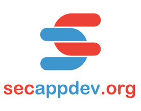
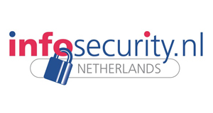
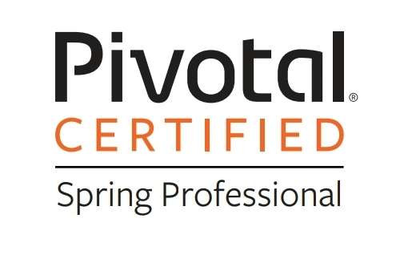
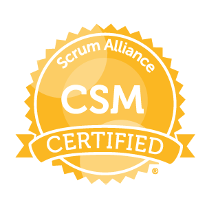
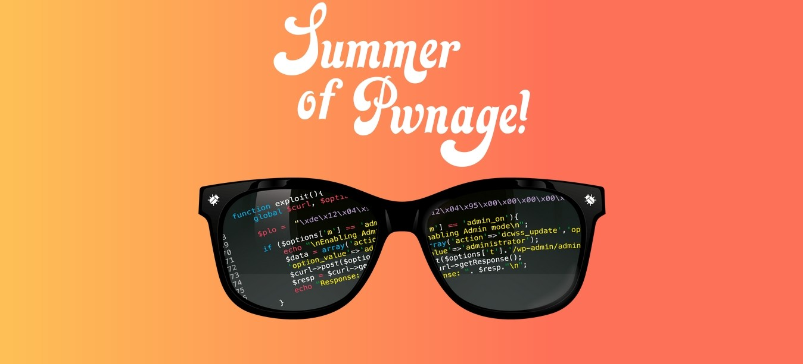
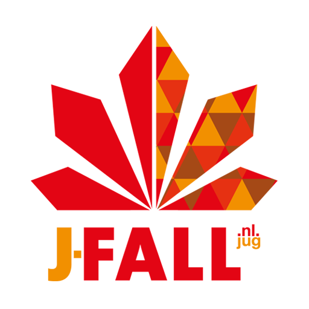
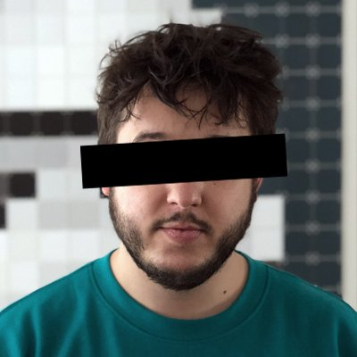
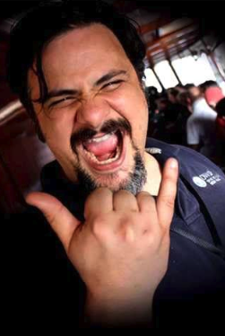
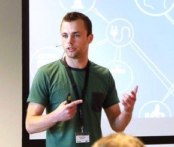

<!-- .slide: data-background="#DB8831" style="text-align: left; vertical-align: middle; color:white" color="#FFFFFF" -->
# Security

## Security, Secure Coding & Hacking

<!-- .element style="position: fixed; top: 300px; right: 60px; height: 200px;"  -->

   

<!-- .element style="vertical-align: middle; background:none; border:none; box-shadow:none; width: 50px;" --> brampatelski 
<!-- .element style="vertical-align: middle; background:none; border:none; box-shadow:none; width: 50px;" --> brampatelski 
<!-- .element style="vertical-align: middle; background:none; border:none; box-shadow:none; width: 50px;" --> brampat.github.io 

<!-- .element style="position: fixed; bottom: 10px; right: 20px; width: 150px;" -->

-- Notes --

--

## Conferences & Certifications

<!-- .element style="position: fixed; top: 290px; right: 20px; width: 250px; background-color: #444444;" -->
<!-- .element style="position: fixed; top: 260px; left: 280px; width: 150px;" -->
<!-- .element style="position: fixed; top: 140px; left: 80px; width: 150px;" -->
<!-- .element style="position: fixed; top: 290px; left: 20px; width: 250px;" -->
<!-- .element style="position: fixed; top: 160px; right: 80px; width: 250px;" -->
<!-- .element style="position: fixed; top: 380px; left: 30px; width: 150px;" -->
<!-- .element style="position: fixed; top: 400px; left: 300px; width: 150px;" -->
<!-- .element style="position: fixed; bottom: 0px; left: 20px; width: 250px;" -->
<!-- .element style="position: fixed; top: 150px; left: 270px; width: 150px;" -->
<!-- .element style="position: fixed; top: 330px; right: 300px; width: 150px;" -->
<!-- .element style="position: fixed; top: 160px; right: 350px; width: 150px;" -->
<!-- .element style="position: fixed; bottom: 30px; left: 290px; width: 250px;" -->
<!-- .element style="position: fixed; bottom: 130px; right: 70px; width: 150px;" -->
<!-- .element style="position: fixed; bottom: 20px; right: 240px; width: 150px;" -->
<!-- .element style="position: fixed; bottom: 20px; right: 40px; width: 150px;" -->

--

## Inspirational Heroes

<!-- .element style="position: fixed; top: 190px; right: 20px; width: 150px;" -->
<!-- .element style="position: fixed; top: 310px; left: 190px; width: 150px;" -->
<!-- .element style="position: fixed; top: 140px; left: 80px; width: 150px;" -->
<!-- .element style="position: fixed; top: 300px; left: 20px; width: 150px;" -->
<!-- .element style="position: fixed; top: 490px; left: 10px; width: 150px;" -->
<!-- .element style="position: fixed; bottom: 10px; left: 350px; width: 150px;" -->
<!-- .element style="position: fixed; bottom: 0px; left: 180px; width: 150px;" -->
<!-- .element style="position: fixed; top: 130px; left: 270px; width: 150px;" -->
<!-- .element style="position: fixed; top: 140px; right: 180px; width: 150px;" -->
<!-- .element style="position: fixed; top: 160px; right: 350px; width: 150px;" -->
<!-- .element style="position: fixed; top: 330px; right: 300px; width: 150px;" -->
<!-- .element style="position: fixed; bottom: 140px; right: 140px; width: 150px;" -->
<!-- .element style="position: fixed; bottom: 0px; right: 175px; width: 150px;" -->
<!-- .element style="position: fixed; bottom: 20px; right: 10px; width: 150px;" -->
<!-- .element style="position: fixed; bottom: 40px; right: 320px; width: 150px;" -->
<!-- .element style="position: fixed; top: 320px; left: 350px; width: 150px;" -->

-- Notes --

* Troy Hunt - Have I Been pwned, Microsoft MVP
* Daniel Verlaan - IT / Security Journalist, Laat je niet Hack maken / Watch your hack
* Bart Roos - Ethical hacker, Call-center scam
* Scott Helme - Hacker, researcher, Founder of  and 
* Brenno de Winter - Ex IT- and privact journalist, OV Chip hacking, CISO, trainer, GDPR / AVG
* Edward Snowden - Activist on privacy & freedom of speech, former NSA, leaked Snowden documents in 2013
* FC (Freaky Clown Cygenta) - Hardware hacking & Social engineering / Physical pentesting
* Oscar Koeroo - KPN CISO, Crypto, High performance security
* Jeremy Gosney - Founder CEO Terahash
* Jim Manico - Java Champion, former OWASP boardmember
* Jayson E Street - Hacker, Social Engineer
* Victor Gevers - GDI Foundation non-profit for safer internet
* Rik van Duijn - Dearbytes hacker
* Wesley Neelen - Dearbytes hacker, IoT devices, hardware
* Tanya Janca - Cloud Advocate at Microsoft
* Edwin van Andel - Zerocopter hacker platform

--

<!-- .slide: data-background="pics/hacker.jpg" style="text-align: left; vertical-align: middle; color:white" -->

## Who are you? <!-- .element style="color:#cccccc;" -->

-- Notes --

* Developers?
* Product owners?
* Business consultants?
* Scrum masters?
* Students?
* Hackers? (all)
* Other?

--

## Agenda

* Intro
* Security Principles
* Secure Software Development
* Bonus: 5 ways to do security testing

TL;DR -> OWASP SAMM and expand from there<!-- .element style="box-shadow:none; position: fixed; left: 0px; bottom: 100px;" class="fragment" data-fragment-index="0" -->
