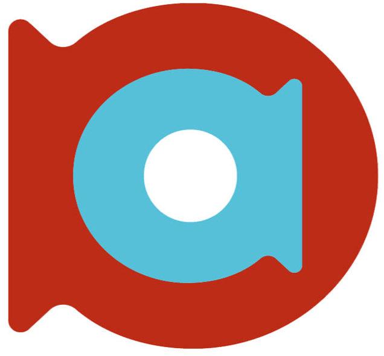
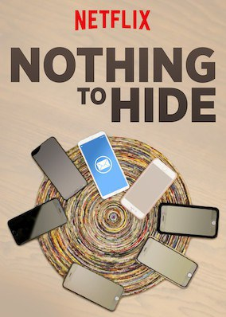
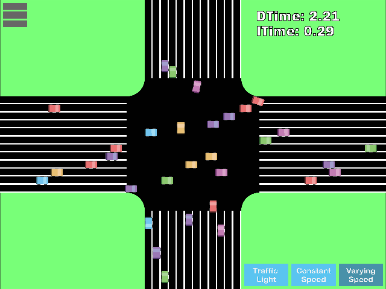

## Expectations

What pops up in your mind?

--

<!-- .slide: class="table-medium" -->

## Agenda

| Time  | Subject                          | Type |
|------:|----------------------------------|------|
| 9:00  | Intro                            |      |
| 9:30  | Security Principles              | T    |
| 10:00 | Hacking basics                   | L    |
| 10:30 | Pushing Left                     | T    |
| 11:00 | Hacker-types                     | T    |
| 11:30 | Hacking puzzles                  | L    |
| 12:00 | Pause                            | -    |
| 12:45 | Hack Activities                  | T    |
| 13:00 | OWASP Top 10 by example          | T    |
| 13:45 | Hacking puzzles                  | L    |
| 14:45 | Pause                            | -    |
| 15:00 | Encryption & stuff               | T    |
| 15:15 | Continuous Security-Testing      | T    |
| 15:30 | Hacking puzzles                  | L    |
| 16:00 | AMA                              | T    |

--

## (Re)Sources

* OWASP [SAMM](https://owasp.org/www-project-samm/)
* Go [Hack yourself first](https://www.pluralsight.com/courses/hack-yourself-first)
* Darknet Diaries:
  * [Samy](https://darknetdiaries.com/episode/61/)
  * [MS08-067](https://darknetdiaries.com/episode/57/)
  * [MAGECART](https://darknetdiaries.com/episode/52/)
  * [XBox Underground](https://darknetdiaries.com/episode/45/) part 1
* Mr Robot
* My [GitHub](https://github.com/brampat/security) Security brain-dump via:
<!-- .element style="vertical-align: middle; background:none; border:none; box-shadow:none; width: 30px;" --> brampat.github.io<!-- .element style="position: fixed; bottom: 120px; left: 40px;" -->
* Twitter<!-- .element style="position: fixed; bottom: 80px; left: 33px;" -->
<!-- .element style="vertical-align: middle; background:none; border:none; box-shadow:none; width: 30px;" --> brampatelski<!-- .element style="position: fixed; bottom: 33px; left: 40px;" -->

<!-- .element style="position: fixed; bottom: 33px; right: 40px;" -->

--

## Coding & Java

* My [GitHub](https://github.com/brampat/security/tree/master/defense/secure-coding/java) Java section
* Oracle [Secure Coding Guidelines](https://www.oracle.com/java/technologies/javase/seccodeguide.html) for Java SE
* OWASP [Cheat Sheets](https://cheatsheetseries.owasp.org/IndexProactiveControls.html)

--

## Ordina Resources

* [BIO](https://www.informatiebeveiligingsdienst.nl/project/baseline-informatiebeveiliging-overheid/): Baseline Informatiebeveilging Overheid
* [Grip op SSD](https://www.cip-overheid.nl/productcategorie%C3%ABn-en-worshops/producten/secure-software/)
* Security Journey
* Ordina Security training path

-- Notes --

These resources aren't all internal Ordina resources, but are very relevant for Ordina, employees and clients

--

## Hands-on

* [Hacksplaining](https://www.hacksplaining.com/)
* [Root-me.org](https://www.root-me.org/)
* [Hacker101](https://www.hacker101.com/)

--

## Intro

## How many accounts?

<!-- .element style="margin: 0px; height: 75px; width: 75px;" -->
<!-- .element style="margin: 0px; height: 75px; width: 75px;" -->
<!-- .element style="margin: 0px; height: 75px; width: 75px;" -->
<!-- .element style="margin: 0px; height: 75px; width: 75px;" -->
<!-- .element style="margin: 0px; height: 75px; width: 75px;" -->
<!-- .element style="margin: 0px; height: 75px; width: 75px;" -->
<!-- .element style="margin: 0px; height: 75px; width: 75px;" -->
<!-- .element style="margin: 0px; height: 75px; width: 75px;" -->
<!-- .element style="margin: 0px; height: 75px; width: 75px;" -->
<!-- .element style="margin: 0px; height: 75px; width: 75px;" -->
<!-- .element style="margin: 0px; height: 75px; width: 75px;" -->
<!-- .element style="margin: 0px; height: 75px; width: 75px;" -->
<!-- .element style="margin: 0px; height: 75px; width: 75px;" -->
<!-- .element style="margin: 0px; height: 75px; width: 75px;" -->
<!-- .element style="margin: 0px; height: 75px; width: 75px;" -->
<!-- .element style="margin: 0px; height: 75px; width: 75px;" -->
<!-- .element style="margin: 0px; height: 75px; width: 75px;" -->
<!-- .element style="margin: 0px; height: 75px; width: 75px;" -->
<!-- .element style="margin: 0px; height: 75px; width: 75px;" -->
<!-- .element style="margin: 0px; height: 75px; width: 75px;" -->
<!-- .element style="margin: 0px; height: 75px; width: 75px;" -->
<!-- .element style="margin: 0px; height: 75px; width: 75px;" -->
<!-- .element style="margin: 0px; height: 75px; width: 75px;" -->
<!-- .element style="margin: 0px; height: 75px; width: 75px;" -->
<!-- .element style="margin: 0px; height: 75px; width: 75px;" -->
<!-- .element style="margin: 0px; height: 75px; width: 75px;" -->
<!-- .element style="margin: 0px; height: 75px; width: 75px;" -->
<!-- .element style="margin: 0px; height: 75px; width: 75px;" -->
<!-- .element style="margin: 0px; height: 75px; width: 75px;" -->
<!-- .element style="margin: 0px; height: 75px; width: 75px;" -->
<!-- .element style="margin: 0px; height: 75px; width: 75px;" -->
<!-- .element style="margin: 0px; height: 75px; width: 75px;" -->
<!-- .element style="margin: 0px; height: 75px; width: 75px;" -->
<!-- .element style="margin: 0px; height: 75px; width: 75px;" -->
<!-- .element style="margin: 0px; height: 75px; width: 75px;" -->
<!-- .element style="margin: 0px; height: 75px; width: 75px;" -->
<!-- .element style="margin: 0px; height: 75px; width: 75px;" -->
<!-- .element style="margin: 0px; height: 75px; width: 75px;" -->
<!-- .element style="margin: 0px; height: 75px; width: 75px;" -->
<!-- .element style="margin: 0px; height: 75px; width: 75px;" -->
<!-- .element style="margin: 0px; height: 75px; width: 75px;" -->
<!-- .element style="margin: 0px; height: 75px; width: 75px;" -->
<!-- .element style="margin: 0px; height: 75px; width: 75px;" -->
<!-- .element style="margin: 0px; height: 75px; width: 75px;" -->

--

<!-- .slide: data-background="pics/intro/hacker.jpg" style="text-align: left; vertical-align: middle; color:white" -->

## Intro <!-- .element style="color:#cccccc;" -->

## Hacked? <!-- .element style="color:#cccccc;" -->

--

<!-- .slide: data-background="pics/intro/neo_matrix.jpeg" -->
## Intro <!-- .element style="color:#cccccc;" -->

## Secured? <!-- .element style="color:#cccccc;" -->

--

## Intro

### Discussion statements

_Data is the new Gold_<!-- .element: style="position: fixed; top: 300px; left: 100px;" class="fragment fade-in-then-out" data-fragment-index="0" -->
<!-- .element: style="position: fixed; box-shadow:none; top: 300px; right: 100px; width: 400px;" class="fragment fade-in-then-out" data-fragment-index="0" -->

_Security should be done by experts_<!-- .element: style="position: fixed; top: 300px; left: 100px;" class="fragment fade-in-then-out" data-fragment-index="1" -->
<!-- .element: style="position: fixed; box-shadow:none; bottom: 100px; right: 100px; width: 400px;" class="fragment fade-in-then-out" data-fragment-index="1" -->

_Internet of Things makes us more secure_<!-- .element: style="position: fixed; top: 300px; left: 100px;" class="fragment fade-in-then-out" data-fragment-index="2" -->
<!-- .element: style="position: fixed; box-shadow:none; bottom: 50px; right: 50px; width: 500px;" class="fragment fade-in-then-out" data-fragment-index="2" -->

_Passwords should disappear_<!-- .element: style="position: fixed; top: 300px; left: 100px;" class="fragment fade-in-then-out" data-fragment-index="3" -->
<!-- .element: style="position: fixed; box-shadow:none; bottom: 50px; right: 50px; width: 500px;" class="fragment fade-in-then-out" data-fragment-index="3" -->

_Privacy is overrated: I've got nothing to hide_<!-- .element: style="position: fixed; top: 300px; left: 100px;" class="fragment fade-in-then-out" data-fragment-index="4" -->
<!-- .element: style="position: fixed; box-shadow:none; bottom: 50px; right: 20px; width: 250px;" class="fragment fade-in-then-out" data-fragment-index="4" -->

_Security and Privacy are mutually exclusive_<!-- .element: style="position: fixed; top: 300px; left: 100px;" class="fragment fade-in-then-out" data-fragment-index="5" -->
<!-- .element: style="position: fixed; box-shadow:none; bottom: 50px; right: 50px; width: 400px;" class="fragment fade-in-then-out" data-fragment-index="5" -->

_Self-driving cars should be 100% safe_<!-- .element: style="position: fixed; top: 300px; left: 100px;" class="fragment fade-in-then-out" data-fragment-index="6" -->
<!-- .element: style="position: fixed; box-shadow:none; bottom: 30px; right: 50px; width: 400px;" class="fragment fade-in-then-out" data-fragment-index="6" -->

