# How did I get here?

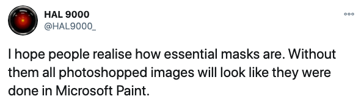<!-- .element style="vertical-align: middle; background:none; border:none; box-shadow:none; position: fixed; bottom: 200px; left: 220px;" -->

--

<!-- .slide: data-background="#DB8831" style="text-align: left; vertical-align: middle; color:white" color="#FFFFFF" -->
# Working from Home<!-- .element style="color: white;" -->

## Safe & Secure<!-- .element style="color: white;" -->

* Questions in chat

<!-- .element style="position: fixed; top: 300px; right: 60px; height: 200px;"  -->

<!-- .element style="vertical-align: middle; background:none; border:none; box-shadow:none; width: 30px;" --> brampatelski<!-- .element style="position: fixed; bottom: 110px; left: 20px;" -->
<!-- .element style="vertical-align: middle; background:none; border:none; box-shadow:none; width: 30px;" --> brampatelski<!-- .element style="position: fixed; bottom: 75px; left: 20px;" -->
<!-- .element style="vertical-align: middle; background:none; border:none; box-shadow:none; width: 30px;" --> brampat.github.io<!-- .element style="position: fixed; bottom: 40px; left: 20px;" -->

<!-- .element style="position: fixed; bottom: 10px; right: 20px; width: 150px;" -->

-- Notes --

--

## Conferences & Certifications

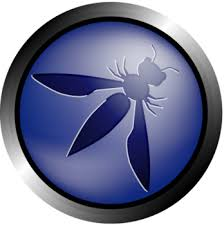<!-- .element style="border:none; box-shadow:none; position: fixed; top: 130px; left: 80px; width: 150px;" -->
<!-- .element style="border:none; box-shadow:none; position: fixed; top: 290px; right: 20px; width: 250px; background-color: #444444;" -->
<!-- .element style="border:none; box-shadow:none; position: fixed; top: 260px; left: 280px; width: 150px;" -->
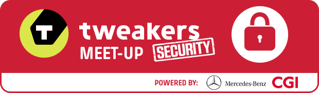<!-- .element style="border:none; box-shadow:none; position: fixed; top: 290px; left: 20px; width: 250px;" -->
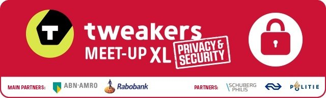<!-- .element style="border:none; box-shadow:none; position: fixed; top: 160px; right: 80px; width: 250px;" -->
<!-- .element style="border:none; box-shadow:none; position: fixed; top: 380px; left: 30px; width: 150px;" -->
<!-- .element style="border:none; box-shadow:none; position: fixed; top: 395px; left: 215px; width: 150px;" -->
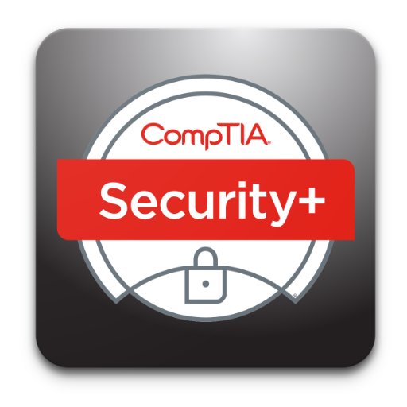<!-- .element style="border:none; box-shadow:none; position: fixed; bottom: 140px; right: 420px; width: 150px;" -->
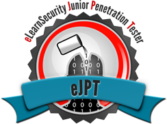<!-- .element style="border:none; box-shadow:none; position: fixed; bottom: 0px; left: 20px; width: 250px;" -->
<!-- .element style="border:none; box-shadow:none; position: fixed; top: 150px; left: 270px; width: 150px;" -->
<!-- .element style="border:none; box-shadow:none; position: fixed; top: 330px; right: 270px; width: 150px;" -->
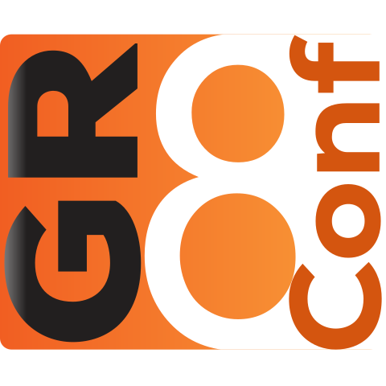<!-- .element style="border:none; box-shadow:none; position: fixed; top: 160px; right: 350px; width: 150px;" -->
<!-- .element style="border:none; box-shadow:none; position: fixed; bottom: 30px; left: 290px; width: 250px;" -->
<!-- .element style="border:none; box-shadow:none; position: fixed; bottom: 130px; right: 70px; width: 150px;" -->
<!-- .element style="border:none; box-shadow:none; position: fixed; bottom: 20px; right: 240px; width: 150px;" -->
<!-- .element style="border:none; box-shadow:none; position: fixed; bottom: 20px; right: 40px; width: 150px;" -->

--

## Inspirational Heroes

<!-- .element style="position: fixed; bottom: 140px; right: 140px; width: 150px;" -->
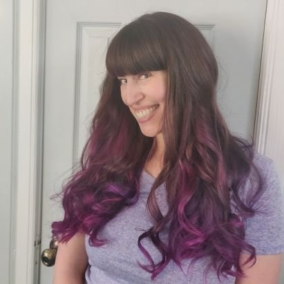<!-- .element style="position: fixed; bottom: 0px; right: 175px; width: 150px;" -->
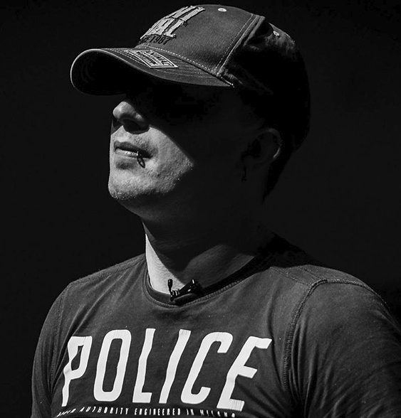<!-- .element style="position: fixed; top: 310px; left: 190px; width: 150px;" -->
<!-- .element style="position: fixed; top: 490px; left: 10px; width: 150px;" -->
<!-- .element style="position: fixed; top: 330px; right: 300px; width: 150px;" -->
<!-- .element style="position: fixed; top: 190px; right: 20px; width: 150px;" -->
<!-- .element style="position: fixed; top: 300px; left: 20px; width: 150px;" -->
<!-- .element style="position: fixed; top: 130px; left: 270px; width: 150px;" -->
<!-- .element style="position: fixed; bottom: 0px; left: 180px; width: 150px;" -->
<!-- .element style="position: fixed; bottom: 10px; left: 350px; width: 150px;" -->
<!-- .element style="position: fixed; top: 140px; right: 180px; width: 150px;" -->
<!-- .element style="position: fixed; top: 160px; right: 350px; width: 150px;" -->
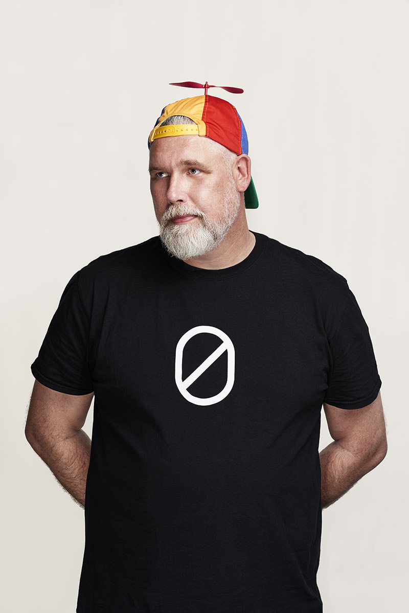<!-- .element style="position: fixed; bottom: 20px; right: 10px; width: 150px;" -->
<!-- .element style="position: fixed; bottom: 40px; right: 320px; width: 150px;" -->
<!-- .element style="position: fixed; top: 140px; left: 80px; width: 150px;" -->
<!-- .element style="position: fixed; top: 320px; left: 350px; width: 150px;" -->

-- Notes --

* Troy Hunt - Have I Been pwned, Microsoft MVP
* Daniel Verlaan - IT / Security Journalist, Laat je niet Hack maken / Watch your hack
* Bart Roos - Ethical hacker, Call-center scam
* Scott Helme - Hacker, researcher, Founder of  and 
* Brenno de Winter - Ex IT- and privact journalist, OV Chip hacking, CISO, trainer, GDPR / AVG
* Edward Snowden - Activist on privacy & freedom of speech, former NSA, leaked Snowden documents in 2013
* FC (Freaky Clown Cygenta) - Hardware hacking & Social engineering / Physical pentesting
* Oscar Koeroo - KPN CISO, Crypto, High performance security
* Jeremy Gosney - Founder CEO Terahash
* Jim Manico - Java Champion, former OWASP boardmember
* Jayson E Street - Hacker, Social Engineer [Beirut Bank Job](https://darknetdiaries.com/episode/6/)
* Victor Gevers - GDI Foundation non-profit for safer internet
* Rik van Duijn - Dearbytes hacker
* Wesley Neelen - Dearbytes hacker, IoT devices, hardware
* Tanya Janca - Cloud Advocate at Microsoft
* Chris Kubecka - Incident Response & Cyber warfare specialist - Saudi Aramco attacks (2012) of [Shamoon](https://darknetdiaries.com/episode/30/) by Iran / Saudi Arabian embassy The Hague (2014) by ISIS 
* Edwin van Andel - Zerocopter hacker platform

--

## Agenda

* Whoami
* Security Hygiene
  * Updates
  * Strong Authentication
* Understanding Passwords
  * Attacks
  * Defences

-- Notes --

[UHS](https://www.nu.nl/tech/6080538/ziekenhuizen-in-meerdere-staten-vs-getroffen-door-ransomware.html)

--

## (Re)Sources

* [Darknet Diaries](https://darknetdiaries.com/)
  * 33: [RockYou](https://darknetdiaries.com/episode/33/)
  * 45: [Xbox Underground p1](https://darknetdiaries.com/episode/45/)
* Passwords, Fun with Numbers on [brampat.github.io](https://brampat.github.io/2019-02-20_passwords_fun_with_numbers/README)
* Security Journey - White belt 18: Security at Home

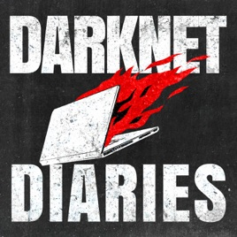<!-- .element style="position: fixed; top: 350px; right: 50px; width: 250px; background:none; border:none; box-shadow:none; " -->
