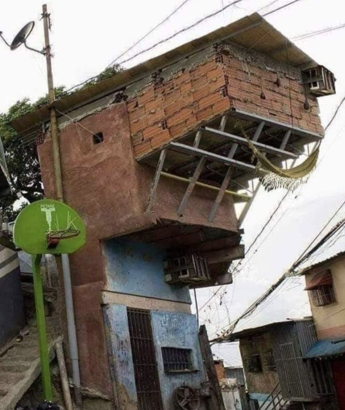

## Spring-cleanup your (smart) home

Maintenance:
* Health
* Safety
* Durability

<!-- .element style="vertical-align: middle; background:none; border:none; box-shadow:none; position: fixed; bottom: 20px; right: 20px; width: 430px;" -->

-- Notes --

Regular maintenance is needed to ensure:
* Health
* Safety and
* Durability

--

<!-- .slide: data-background="#DB8831" style="text-align: left; vertical-align: middle; color:white" color="#FFFFFF" -->
# Spring-cleanup<!-- .element style="color: white;" -->

## Securing your Smart Home<!-- .element style="color: white;" -->

* Plz mute during talk
* Questions in chat

<!-- .element style="position: fixed; top: 300px; right: 60px; height: 200px;"  -->

<!-- .element style="vertical-align: middle; background:none; border:none; box-shadow:none; width: 30px;" --> brampatelski<!-- .element style="position: fixed; bottom: 110px; left: 20px;" -->
<!-- .element style="vertical-align: middle; background:none; border:none; box-shadow:none; width: 30px;" --> brampatelski<!-- .element style="position: fixed; bottom: 75px; left: 20px;" -->
<!-- .element style="vertical-align: middle; background:none; border:none; box-shadow:none; width: 30px;" --> brampat.github.io<!-- .element style="position: fixed; bottom: 40px; left: 20px;" -->

<!-- .element style="position: fixed; bottom: 10px; right: 20px; width: 150px;" -->

-- Notes --

--

## Conferences & Certifications

<!-- .element style="border:none; box-shadow:none; position: fixed; top: 130px; left: 80px; width: 150px;" -->
<!-- .element style="border:none; box-shadow:none; position: fixed; top: 290px; right: 20px; width: 250px; background-color: #444444;" -->
<!-- .element style="border:none; box-shadow:none; position: fixed; top: 260px; left: 280px; width: 150px;" -->
<!-- .element style="border:none; box-shadow:none; position: fixed; top: 290px; left: 20px; width: 250px;" -->
<!-- .element style="border:none; box-shadow:none; position: fixed; top: 160px; right: 80px; width: 250px;" -->
<!-- .element style="border:none; box-shadow:none; position: fixed; top: 380px; left: 30px; width: 150px;" -->
<!-- .element style="border:none; box-shadow:none; position: fixed; top: 395px; left: 215px; width: 150px;" -->
<!-- .element style="border:none; box-shadow:none; position: fixed; bottom: 140px; right: 420px; width: 150px;" -->
<!-- .element style="border:none; box-shadow:none; position: fixed; bottom: 0px; left: 20px; width: 250px;" -->
<!-- .element style="border:none; box-shadow:none; position: fixed; top: 150px; left: 270px; width: 150px;" -->
<!-- .element style="border:none; box-shadow:none; position: fixed; top: 330px; right: 270px; width: 150px;" -->
<!-- .element style="border:none; box-shadow:none; position: fixed; top: 160px; right: 350px; width: 150px;" -->
<!-- .element style="border:none; box-shadow:none; position: fixed; bottom: 30px; left: 290px; width: 250px;" -->
<!-- .element style="border:none; box-shadow:none; position: fixed; bottom: 130px; right: 70px; width: 150px;" -->
<!-- .element style="border:none; box-shadow:none; position: fixed; bottom: 20px; right: 240px; width: 150px;" -->
<!-- .element style="border:none; box-shadow:none; position: fixed; bottom: 20px; right: 40px; width: 150px;" -->

--

## Agenda

* Whoami
* Bug Lifecycle
* Security Hygiene @home
* Bonus: Understanding Passwords

-- Notes --

[UHS](https://www.nu.nl/tech/6080538/ziekenhuizen-in-meerdere-staten-vs-getroffen-door-ransomware.html)

--

## (Re)Sources

* [Darknet Diaries](https://darknetdiaries.com/)
  * 57: [MS08-067](https://darknetdiaries.com/transcript/57/)
  * 33: [RockYou](https://darknetdiaries.com/episode/33/)
  * 45: [Xbox Underground p1](https://darknetdiaries.com/episode/45/)
* Passwords, Fun with Numbers on [brampat.github.io](https://brampat.github.io/2019-02-20_passwords_fun_with_numbers/README)

<!-- .element style="position: fixed; top: 350px; right: 50px; width: 250px; background:none; border:none; box-shadow:none; " -->
