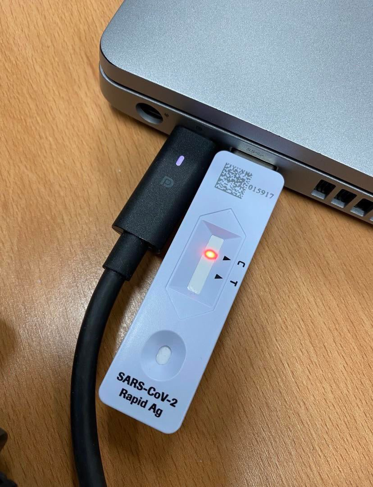
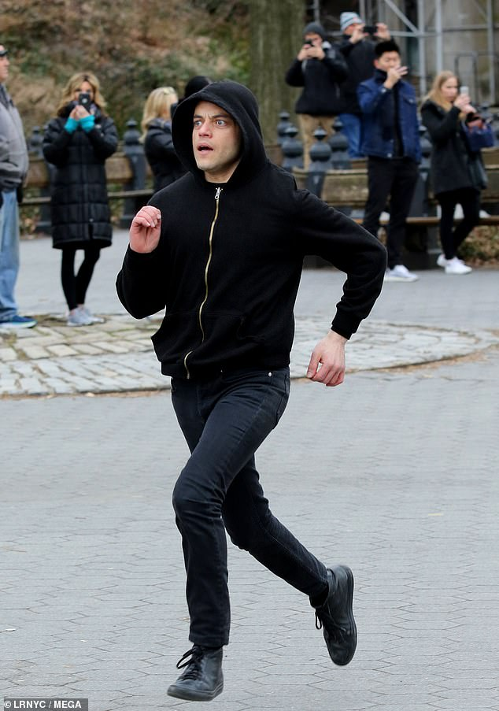

<!-- .slide: data-background="#FFFFFF" style="text-align: left; vertical-align: middle; color:white" color="#FFFFFF" -->
# Security by Meme<!-- .element style="color: #DB8831;" -->

## Less FUD, more FUN<!-- .element style="color: #DB8831;" -->

<!-- .element style="position: fixed; top: 300px; left: 60px; height: 200px;"  -->

<!-- .element style="vertical-align: middle; background:none; border:none; box-shadow:none; position: fixed; bottom: 80px; right: 20px; width: 340px" -->

<!-- .element style="vertical-align: middle; background:none; border:none; box-shadow:none; width: 30px;" --> brampatelski<!-- .element style="position: fixed; bottom: 110px; left: 20px; color: #333333;" -->
<!-- .element style="vertical-align: middle; background:none; border:none; box-shadow:none; width: 30px;" --> brampatelski<!-- .element style="position: fixed; bottom: 75px; left: 20px; color: #333333;" -->
<!-- .element style="vertical-align: middle; background:none; border:none; box-shadow:none; width: 30px;" --> brampat.github.io<!-- .element style="position: fixed; bottom: 40px; left: 20px; color: #333333;" -->

<!-- .element style="background:none; border:none; box-shadow:none; position: fixed; bottom: 10px; right: 20px; width: 150px;" -->
<!-- .element style="background:none; border:none; box-shadow:none; position: fixed; top: 0px; right: 10px; width: 150px;" -->

-- Notes --

This is the first awareness lesson:
* Don't plug in random USB sticks
* You never know what's on them
* Before you know, you're infected with a virus

--

## Agenda

* Machine Learning & AI
* Physical security
* Code Quality
* Cryptography
* Password Security
* Bonus memes (if time)

-- Notes --

--

## How did the cybercriminal escape?

<!-- .element style="background:none; border:none; box-shadow:none; position: fixed; bottom: 0px; right: 0px; width: 400px;" class="fragment" data-fragment-index="1" -->

## Ran somewhere<!-- .element style="position: fixed; bottom: 40px; left: 20px; color: #333333;" class="fragment" data-fragment-index="1" -->

-- Notes --

I dunno, he just ran somewhere
* Elliot Anderson from Mr. Robot
* Advisors:
  * Kor Adana (network security analyst and forensics manager for Toyota Motor Sales)
  * Michael Bazzell (security consultant and former FBI Cyber Crimes Task Force agent and investigator)
  * James Plouffe (lead solutions architect at MobileIron)
  * 2nd season:
    * Jeff Moss (founder and director of Black Hat and DEF CON computer security conferences)
    * Marc Rogers (principal security researcher for Cloudflare and head of security for DEF CON)
    * Ryan Kazanciyan (chief security architect for Tanium)
    * Andre McGregor (director of security for Tanium and former FBI Cyber Special agent)
