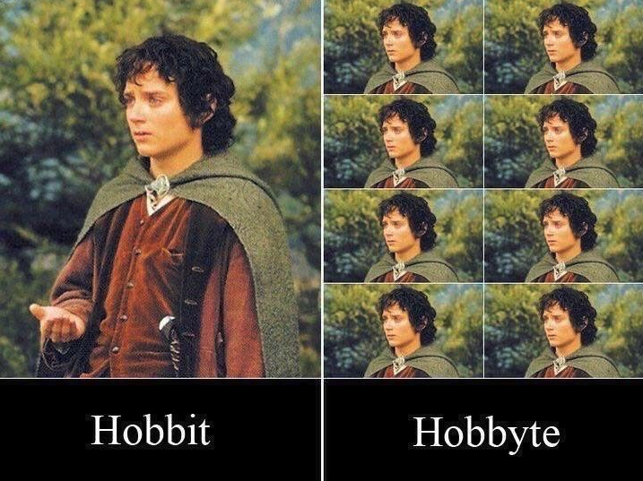

<!-- .slide: data-background="#FFFFFF" style="text-align: left; vertical-align: middle; color:white" color="#FFFFFF" -->
# Security by Meme<!-- .element style="color: #DB8831;" -->

## Less FUD, more FUN<!-- .element style="color: #DB8831;" -->

<!-- .element style="position: fixed; top: 300px; left: 60px; height: 200px;"  -->

<!-- .element style="vertical-align: middle; background:none; border:none; box-shadow:none; position: fixed; bottom: 80px; right: 20px; width: 440px" -->

<!-- .element style="vertical-align: middle; background:none; border:none; box-shadow:none; width: 30px;" --> brampatelski<!-- .element style="position: fixed; bottom: 110px; left: 20px; color: #333333;" -->
<!-- .element style="vertical-align: middle; background:none; border:none; box-shadow:none; width: 30px;" --> brampatelski<!-- .element style="position: fixed; bottom: 75px; left: 20px; color: #333333;" -->
<!-- .element style="vertical-align: middle; background:none; border:none; box-shadow:none; width: 30px;" --> brampat.github.io<!-- .element style="position: fixed; bottom: 40px; left: 20px; color: #333333;" -->

<!-- .element style="background:none; border:none; box-shadow:none; position: fixed; bottom: 10px; right: 20px; width: 150px;" -->

-- Notes --

--

## Agenda

* Password Security
* Cryptography
* Code Quality (if time)

-- Notes --

