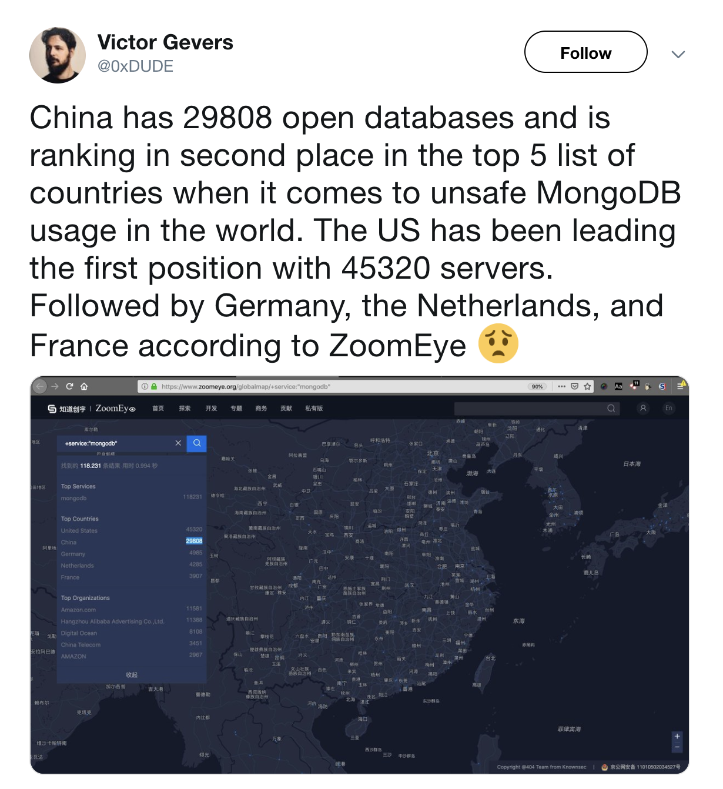
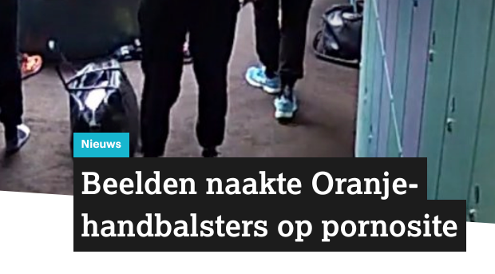
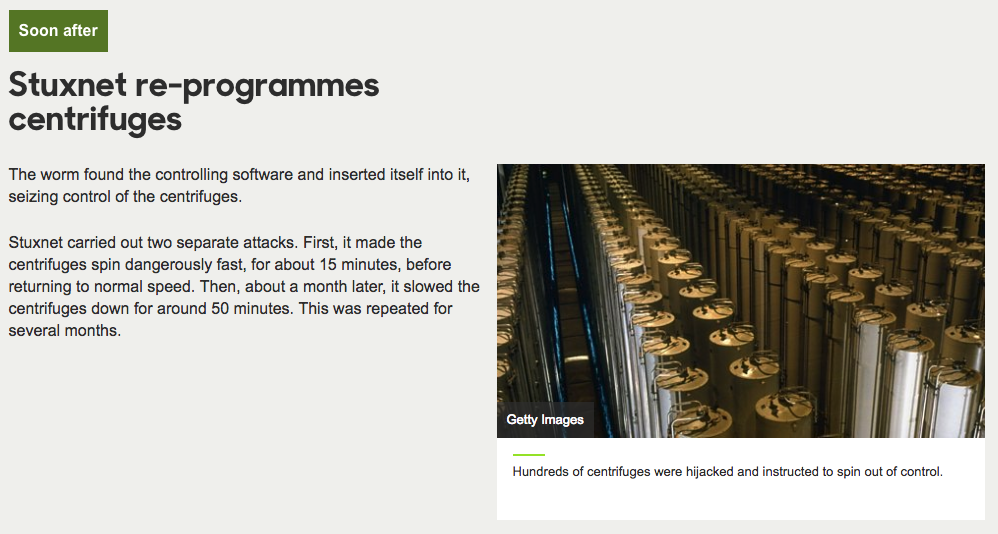
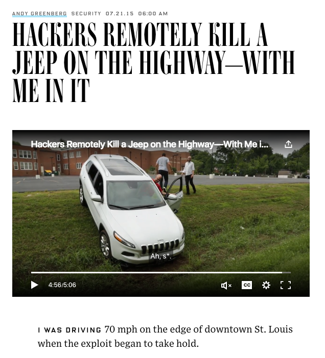
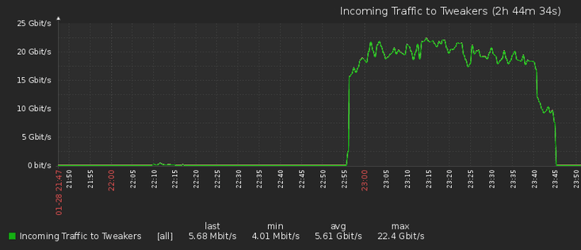
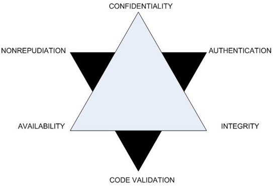
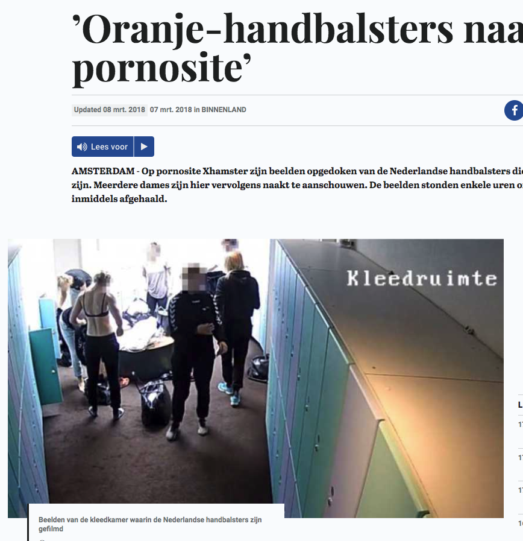
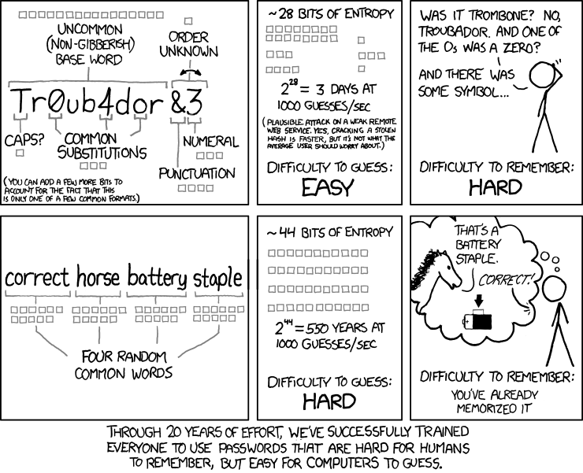
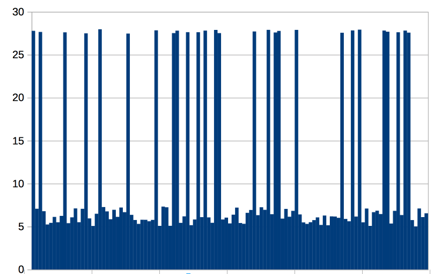

<!-- .slide: data-background="#DB8831" style="text-align: left; vertical-align: middle; color:white" color="#FFFFFF" -->
# Security
<hr />

## Security, Secure Coding & Hacking

<!-- .element style="position: fixed; top: 300px; right: 60px; height: 200px;"  -->

<br><br><br>

<!-- .element style="vertical-align: middle; background:none; border:none; box-shadow:none; width: 50px;" --> brampatelski<br>
<!-- .element style="vertical-align: middle; background:none; border:none; box-shadow:none; width: 50px;" --> brampatelski<br>
<!-- .element style="vertical-align: middle; background:none; border:none; box-shadow:none; width: 50px;" --> brampat<br>

<!-- .element style="position: fixed; bottom: 10px; right: 20px; width: 150px;" -->

-- Notes --


--

## Conferences & Certifications
<hr />

<!-- .element style="position: fixed; top: 290px; right: 20px; width: 250px; background-color: #444444;" -->
<!-- .element style="position: fixed; top: 260px; left: 280px; width: 150px;" -->
<!-- .element style="position: fixed; top: 140px; left: 80px; width: 150px;" -->
<!-- .element style="position: fixed; top: 290px; left: 20px; width: 250px;" -->
<!-- .element style="position: fixed; top: 160px; right: 80px; width: 250px;" -->
<!-- .element style="position: fixed; top: 380px; left: 30px; width: 150px;" -->
<!-- .element style="position: fixed; top: 400px; left: 300px; width: 150px;" -->
<!-- .element style="position: fixed; bottom: 0px; left: 20px; width: 250px;" -->
<!-- .element style="position: fixed; top: 150px; left: 270px; width: 150px;" -->
<!-- .element style="position: fixed; top: 330px; right: 300px; width: 150px;" -->
<!-- .element style="position: fixed; top: 160px; right: 350px; width: 150px;" -->
<!-- .element style="position: fixed; bottom: 30px; left: 290px; width: 250px;" -->
<!-- .element style="position: fixed; bottom: 130px; right: 70px; width: 150px;" -->
<!-- .element style="position: fixed; bottom: 20px; right: 240px; width: 150px;" -->
<!-- .element style="position: fixed; bottom: 20px; right: 40px; width: 150px;" -->

--


## Inspirational Heroes
<hr />

<!-- .element style="position: fixed; top: 190px; right: 20px; width: 150px;" -->
<!-- .element style="position: fixed; top: 310px; left: 190px; width: 150px;" -->
<!-- .element style="position: fixed; top: 140px; left: 80px; width: 150px;" -->
<!-- .element style="position: fixed; top: 300px; left: 20px; width: 150px;" -->
<!-- .element style="position: fixed; top: 490px; left: 10px; width: 150px;" -->
<!-- .element style="position: fixed; bottom: 10px; left: 350px; width: 150px;" -->
<!-- .element style="position: fixed; bottom: 0px; left: 180px; width: 150px;" -->
<!-- .element style="position: fixed; top: 130px; left: 270px; width: 150px;" -->
<!-- .element style="position: fixed; top: 140px; right: 180px; width: 150px;" -->
<!-- .element style="position: fixed; top: 160px; right: 350px; width: 150px;" -->
<!-- .element style="position: fixed; top: 330px; right: 300px; width: 150px;" -->
<!-- .element style="position: fixed; bottom: 140px; right: 140px; width: 150px;" -->
<!-- .element style="position: fixed; bottom: 0px; right: 175px; width: 150px;" -->
<!-- .element style="position: fixed; bottom: 20px; right: 10px; width: 150px;" -->
<!-- .element style="position: fixed; bottom: 40px; right: 320px; width: 150px;" -->
<!-- .element style="position: fixed; top: 320px; left: 350px; width: 150px;" -->

-- Notes --

* Troy Hunt - Have I Been pwned, Microsoft MVP
* Daniel Verlaan - IT / Security Journalist, Laat je niet Hack maken / Watch your hack
* Bart Roos - Ethical hacker, Call-center scam
* Scott Helme - Hacker, researcher, Founder of  and 
* Brenno de Winter - Ex IT- and privact journalist, OV Chip hacking, CISO, trainer, GDPR / AVG
* Edward Snowden - Activist on privacy & freedom of speech, former NSA, leaked Snowden documents in 2013
* FC (Freaky Clown Cygenta) - Hardware hacking & Social engineering / Physical pentesting
* Oscar Koeroo - KPN CISO, Crypto, High performance security
* Jeremy Gosney - Founder CEO Terahash
* Jim Manico - Java Champion, former OWASP boardmember
* Jayson E Street - Hacker, Social Engineer
* Victor Gevers - GDI Foundation non-profit for safer internet
* Rik van Duijn - Dearbytes hacker
* Wesley Neelen - Dearbytes hacker, IoT devices, hardware
* Kevin Mitnick - Worlds most famous hacker (actually only social engineer)
* Edwin van Andel - Zerocopter hacker platform

---

## Expectations
<hr />

What pops up in your mind?

--


## Agenda
<hr />

* Intro
* Security Principles
* Secure Software Development
* Threat Analysis
* Hackers
* Hack Activities
* Password Hacking (and defending)
* _Choose your topic_

--

## Intro
<hr />

## How many accounts?

<div style="background-color: #ffffff; width: 890px; ">

<!-- .element style="margin: 0px; height: 75px; width: 75px;" -->
<!-- .element style="margin: 0px; height: 75px; width: 75px;" -->
<!-- .element style="margin: 0px; height: 75px; width: 75px;" -->
<!-- .element style="margin: 0px; height: 75px; width: 75px;" -->
<!-- .element style="margin: 0px; height: 75px; width: 75px;" -->
<!-- .element style="margin: 0px; height: 75px; width: 75px;" -->
<!-- .element style="margin: 0px; height: 75px; width: 75px;" -->
<!-- .element style="margin: 0px; height: 75px; width: 75px;" -->
<!-- .element style="margin: 0px; height: 75px; width: 75px;" -->
<!-- .element style="margin: 0px; height: 75px; width: 75px;" -->
<!-- .element style="margin: 0px; height: 75px; width: 75px;" -->
<!-- .element style="margin: 0px; height: 75px; width: 75px;" -->
<!-- .element style="margin: 0px; height: 75px; width: 75px;" -->
<!-- .element style="margin: 0px; height: 75px; width: 75px;" -->
<!-- .element style="margin: 0px; height: 75px; width: 75px;" -->
<!-- .element style="margin: 0px; height: 75px; width: 75px;" -->
<!-- .element style="margin: 0px; height: 75px; width: 75px;" -->
<!-- .element style="margin: 0px; height: 75px; width: 75px;" -->
<!-- .element style="margin: 0px; height: 75px; width: 75px;" -->
<!-- .element style="margin: 0px; height: 75px; width: 75px;" -->
<!-- .element style="margin: 0px; height: 75px; width: 75px;" -->
<!-- .element style="margin: 0px; height: 75px; width: 75px;" -->
<!-- .element style="margin: 0px; height: 75px; width: 75px;" -->
<!-- .element style="margin: 0px; height: 75px; width: 75px;" -->
<!-- .element style="margin: 0px; height: 75px; width: 75px;" -->
<!-- .element style="margin: 0px; height: 75px; width: 75px;" -->
<!-- .element style="margin: 0px; height: 75px; width: 75px;" -->
<!-- .element style="margin: 0px; height: 75px; width: 75px;" -->
<!-- .element style="margin: 0px; height: 75px; width: 75px;" -->
<!-- .element style="margin: 0px; height: 75px; width: 75px;" -->
<!-- .element style="margin: 0px; height: 75px; width: 75px;" -->
<!-- .element style="margin: 0px; height: 75px; width: 75px;" -->
<!-- .element style="margin: 0px; height: 75px; width: 75px;" -->
<!-- .element style="margin: 0px; height: 75px; width: 75px;" -->
<!-- .element style="margin: 0px; height: 75px; width: 75px;" -->
<!-- .element style="margin: 0px; height: 75px; width: 75px;" -->
<!-- .element style="margin: 0px; height: 75px; width: 75px;" -->
<!-- .element style="margin: 0px; height: 75px; width: 75px;" -->
<!-- .element style="margin: 0px; height: 75px; width: 75px;" -->
<!-- .element style="margin: 0px; height: 75px; width: 75px;" -->
<!-- .element style="margin: 0px; height: 75px; width: 75px;" -->
<!-- .element style="margin: 0px; height: 75px; width: 75px;" -->
<!-- .element style="margin: 0px; height: 75px; width: 75px;" -->
<!-- .element style="margin: 0px; height: 75px; width: 75px;" -->

</div>

--

<!-- .slide: data-background="pics/hacker.jpg" style="text-align: left; vertical-align: middle; color:white" -->

## Intro <!-- .element style="color:#cccccc;" -->
<hr />

## Hacked? <!-- .element style="color:#cccccc;" -->

--

<!-- .slide: data-background="pics/neo_matrix.jpeg" -->
## Intro <!-- .element style="color:#cccccc;" -->
<hr />

## Secured? <!-- .element style="color:#cccccc;" -->

--

## Intro
<hr />
* Age <20 ?<!-- .element: class="fragment" data-fragment-index="1" -->
* Millionairs ?<!-- .element: class="fragment" data-fragment-index="2" -->
* Self-thaught ?<!-- .element: class="fragment" data-fragment-index="3" -->

<span>Why [not](https://www.bbc.com/news/av/technology-47407609/how-one-teenager-is-making-millions-by-hacking-legally)?</span><!-- .element: class="fragment" data-fragment-index="4" -->
<!-- .element: class="fragment" data-fragment-index="4" -->

--

## Intro
<hr />

### Discussion statements

_Data is the new Gold_<!-- .element: style="position: fixed; top: 300px; left: 100px;" class="fragment fade-in-then-out" data-fragment-index="0" -->
_Security should be done by experts_<!-- .element: style="position: fixed; top: 300px; left: 100px;" class="fragment fade-in-then-out" data-fragment-index="1" -->
_Internet of Things makes us more secure_<!-- .element: style="position: fixed; top: 300px; left: 100px;" class="fragment fade-in-then-out" data-fragment-index="2" -->
_Passwords should disappear_<!-- .element: style="position: fixed; top: 300px; left: 100px;" class="fragment fade-in-then-out" data-fragment-index="3" -->
_Privacy is overrated: I've got nothing to hide_<!-- .element: style="position: fixed; top: 300px; left: 100px;" class="fragment fade-in-then-out" data-fragment-index="4" -->
_Safety and Privacy are mutually exclusive_<!-- .element: style="position: fixed; top: 300px; left: 100px;" class="fragment fade-in-then-out" data-fragment-index="5" -->
_Self-driving cars should be 100% safe_<!-- .element: style="position: fixed; top: 300px; left: 100px;" class="fragment fade-in-then-out" data-fragment-index="6" -->

---

## Security Principles
<hr />

### CIA

<!-- .element style="position: fixed; top: 160px; right: 200px; width: 575px;"  -->


-- Notes --


--

## Security Principles
<hr />

### CIA - Confidential

* Data leaks<!-- .element: class="fragment" data-fragment-index="1" -->
* Web-cam hacks<!-- .element: class="fragment" data-fragment-index="1" -->
* Bad config<!-- .element: class="fragment" data-fragment-index="1" -->
* SQL-injection (dump)<!-- .element: class="fragment" data-fragment-index="1" -->

<!-- .element style="position: fixed; top: 160px; right: 280px; width: 275px;"  -->

<!-- .element style="position: fixed; top: 150px; right: 20px; width: 225px;" class="fragment" data-fragment-index="1" -->
<!-- .element style="position: fixed; top: 450px; left: 40px; width: 275px;" class="fragment" data-fragment-index="1" -->
<!-- .element style="position: fixed; top: 380px; right: 260px; width: 325px;" class="fragment" data-fragment-index="1"  -->

--

## Security Principles
<hr />

### CIA - Integral

* Account takeover<!-- .element: class="fragment" data-fragment-index="1" -->
* Car-hacking<!-- .element: class="fragment" data-fragment-index="1" -->
* SQL injection insert / update<!-- .element: class="fragment" data-fragment-index="1" -->

<!-- .element style="position: fixed; top: 160px; right: 280px; width: 275px;"  -->

<!-- .element style="position: fixed; top: 280px; right: 20px; width: 375px;" class="fragment" data-fragment-index="1" -->
<!-- .element style="position: fixed; top: 140px; right: 190px; width: 375px;" class="fragment" data-fragment-index="1" -->
<!-- .element style="position: fixed; top: 370px; left: 10px; width: 375px;" class="fragment" data-fragment-index="1" -->
<!-- .element style="position: fixed; top: 390px; left: 320px; width: 275px;" class="fragment" data-fragment-index="1" -->

--

## Security Principles
<hr />

### CIA - Available

* (D)DOS<!-- .element: class="fragment" data-fragment-index="1" -->
* Ransomware<!-- .element: class="fragment" data-fragment-index="1" -->
* SQL-injection drop table<!-- .element: class="fragment" data-fragment-index="1" -->

<!-- .element style="position: fixed; top: 350px; right: 220px; width: 275px;" class="fragment" data-fragment-index="1" -->
<!-- .element style="position: fixed; top: 140px; right: 90px; width: 275px;" class="fragment" data-fragment-index="1" -->
<!-- .element style="position: fixed; top: 370px; left: 10px; width: 375px;" class="fragment" data-fragment-index="1" -->

--

## Security Principles
<hr />

### New CIA

<!-- .element style="position: fixed; top: 160px; right: 200px; width: 575px;"  -->


-- Notes --


--

## Security Principles
<hr />

### STRIDE
* Spoofing (I)
  * IP / [Caller-ID](https://youtu.be/FO0iG_P0P6M?t=345) / Mail-address / [GPS](https://www.scmagazine.com/home/pokemon-go-cheaters-may-inadvertently-learn-gps-spoofing/)
* Tampering (I)
  * Ransomware / Data / Log-file / Cookie / [URL Query string](https://nos.nl/artikel/273011-alle-begrotingsstukken-openbaar.html)
* Repudiation (I)
* Information disclosure (C)
  * Data-breaches: [Information is awesome](https://informationisbeautiful.net/visualizations/worlds-biggest-data-breaches-hacks/) / [HIBP](https://haveibeenpwned.com)
* Denial of Service (A)
  * [DDoS-er caught](https://tweakers.net/reviews/6031/een-ddoser-betrapt-hoe-de-aanvaller-tegen-de-lamp-liep.html) (Dutch)
* Elevation of privilege (C / I)
  * iPhone Jailbreaking / Account takeover / iCloud-hacking

---

## Secure Software Development
<hr />

### Conventional Security effort

<!-- .element style="width: 500px;" class="fragment" -->

--

## Secure Software Development
<hr />

<!-- .element style="width: 500px;" -->

Cost increases 30-100x

--

## Secure Software Development
<hr />

### Conventional Security effort

<!-- .element style="box-shadow:none; position: fixed; left: 100px; top: 400px; width: 800px; " -->

<!-- .element style="box-shadow:none; position: fixed; left: 140px; top: 350px;" class="fragment" data-fragment-index="5" -->
<!-- .element style="box-shadow:none; position: fixed; left: 265px; top: 350px;" class="fragment" data-fragment-index="4" -->
<!-- .element style="box-shadow:none; position: fixed; left: 390px; top: 350px;" class="fragment" data-fragment-index="3" -->
<!-- .element style="box-shadow:none; position: fixed; left: 515px; top: 350px;" class="fragment" data-fragment-index="2" -->
<!-- .element style="box-shadow:none; position: fixed; left: 640px; top: 350px;" class="fragment" data-fragment-index="0" -->
<!-- .element style="box-shadow:none; position: fixed; left: 765px; top: 350px;" class="fragment" data-fragment-index="1" -->

<!-- .element style="box-shadow:none; position: fixed; left: 265px; top: 250px;" class="fragment" data-fragment-index="6" -->

--

## Secure Software Development
<hr />

<!-- .element style="box-shadow:none; position: fixed; right: 40px; top: 10px; width: 120px;" -->
<!-- .element style="box-shadow:none; position: fixed; right: 0px; top: 210px; width: 620px; z-index: -1;" -->

* CIA Ratings
* Quality Gates
* Security Specifications
* Security Requirements
* Risk Assessment


--

## Secure Software Development
<hr />

<!-- .element style="box-shadow:none; position: fixed; right: 40px; top: 10px; width: 120px;" -->

* Threat Modelling
* Attack Surface Analysis
* Security Architecture

<!-- .element style="box-shadow:none; position: fixed; right: 0px; top: 210px; width: 620px; z-index: -1;" -->

--

## Secure Software Development
<hr />

<!-- .element style="box-shadow:none; position: fixed; right: 40px; top: 10px; width: 120px;" -->

* Static Code analysis (SAST):
  * QA: Checkmarx, Fortify, FindSecurityBugs, PumaScan, MS SDL for Azure
  * Dependencies & Licensing: OWASP Dependency-check, White-source, Snyk
* Pair programming
* Code review / Pull-requests

<!-- .element style="box-shadow:none; position: fixed; right: 0px; top: 310px; width: 520px; z-index: -1;" -->

--

## Secure Software Development
<hr />

<!-- .element style="box-shadow:none; position: fixed; right: 40px; top: 10px; width: 120px;" -->

* DAST Tools: OWASP ZAP, Nessus, OpenVAS
* Basic Vulnerability scanning
* Internal Red-teaming
* Security Unit Testing
* Security Smoke tests

<!-- .element style="box-shadow:none; position: fixed; right: 0px; top: 310px; width: 520px; z-index: -1;" -->

--

## Secure Software Development
<hr />

<!-- .element style="box-shadow:none; position: fixed; right: 40px; top: 10px; width: 120px;" -->

* Professional Pen-testing
* Risk Assessment review
* Advanced Code Reviews
* Fuzz Testing (Chaos Monkey testing)

<!-- .element style="box-shadow:none; position: fixed; right: 0px; top: 310px; width: 520px; z-index: -1;" -->

--

## Secure Software Development
<hr />

<!-- .element style="box-shadow:none; position: fixed; right: 40px; top: 10px; width: 120px;" -->

* Secure deployment
* Secrets Managements
* Security Configuration
* Server hardening
* Monitoring with SIEM / Log aggregation:
  * Splunk, ElasticStack, OSSIM, OSSEC, Apache Metron, SIEMonster
* Patching & Updating
* Phase-out procedures

<!-- .element style="box-shadow:none; position: fixed; right: 0px; top: 410px; width: 520px; z-index: -1;" -->


---

## Threat analysis
<hr />

What<!-- .element: class="fragment" data-fragment-index="1" style="position: fixed; top: 150px; width: 250px;" -->
<!-- .element style="position: fixed; top: 150px; right: 120px; width: 175px;" class="fragment" data-fragment-index="1" -->

Who<!-- .element: class="fragment" data-fragment-index="2" style="position: fixed; top: 300px; width: 250px;" -->
<!-- .element style="position: fixed; top: 300px; right: 20px; width: 175px;" class="fragment" data-fragment-index="2" -->

How<!-- .element: class="fragment" data-fragment-index="3" style="position: fixed; top: 450px; width: 250px;" -->
<!-- .element style="position: fixed; top: 450px; right: 120px; width: 175px;" class="fragment" data-fragment-index="2" -->

--

## Practice
<hr />

Analyze:
<!-- .element style="position: fixed; top: 250px; right: 20px; width: 475px;" -->

* What
* Who
* How (optional)
* Security measures taken?<!-- .element: class="fragment" data-fragment-index="1" -->

--

## Security by Design
<hr />

### Design user-login

<!-- .element style="position: fixed; top: 150px; right: 20px; width: 450px; height: 450px;" -->

* User-types
* Functionalities
* Assets

--

## Threat analysis
<hr />

<!-- .element style="position: fixed; top: 150px; right: 20px; width: 450px; height: 450px;" -->

* What
* Who
* How

---

<!-- .slide: data-background="pics/hacker.jpg" style="text-align: left; vertical-align: middle; color:white" -->

## Hacker types <!-- .element style="color:#cccccc;" -->

--

## Hacker types
<hr />

### Black
* Criminal<!-- .element: class="fragment" data-fragment-index="1" -->
* Personal gain<!-- .element: class="fragment" data-fragment-index="1" -->

<!-- .element style="position: fixed; top: 150px; right: 20px; width: 450px; height: 450px; background-color: #ffffff;" -->

--

## Hacker types
<hr />

### White
* Ethical hacker<!-- .element: class="fragment" data-fragment-index="1" -->
* Pen-tester<!-- .element: class="fragment" data-fragment-index="1" -->
* Authorized Security professional<!-- .element: class="fragment" data-fragment-index="1" -->

<!-- .element style="position: fixed; top: 150px; right: 20px; width: 450px; height: 450px; background-color: #ffffff;" -->

--

## Hacker types
<hr />

### Grey
* Non-professional
* Not authorized
* Criminal?

<!-- .element style="position: fixed; top: 150px; right: 20px; width: 450px; height: 450px; background-color: #ffffff;" -->

--

## Hacker types
<hr />

### Red
* White hats
* Punisher style

<!-- .element style="position: fixed; top: 150px; right: 20px; width: 450px; height: 450px; background-color: #ffffff;" -->
<!-- .element style="position: fixed; top: 450px; left: 120px; width: 350px; background-color: #ffffff;" -->


--

## Hacker types
<hr />

### Script kiddies
* Kids
* Pranks
* No coding skill
* Uses scripts & tools

<!-- .element style="position: fixed; top: 150px; right: 20px; background-color: #ffffff;" -->
<!-- .element style="position: fixed; top: 420px; right: 120px; width: 350px; background-color: #ffffff;" -->
<!-- .element style="position: fixed; top: 450px; left: 120px; width: 350px; background-color: #ffffff;" -->

--

## Hacker types
<hr />

### Green
* Curious kids
* Wanna-be white-hat

<!-- .element style="position: fixed; top: 150px; right: 20px; width: 450px; height: 450px; background-color: #ffffff;" -->

--

## Hacker types
<hr />

### Blue
* Revenge hacker
* Revenge-porn

<!-- .element style="position: fixed; top: 150px; right: 20px; width: 450px; height: 450px; background-color: #ffffff;" -->

--

## Hacker types
<hr />

### Corporate
* Insider
* Whistleblower
* Corporate revenge hacker

<!-- .element style="position: fixed; top: 150px; right: 20px; background-color: #ffffff;" -->
<!-- .element style="position: fixed; top: 420px; right: 120px; width: 350px; background-color: #ffffff;" -->
<!-- .element style="position: fixed; top: 450px; left: 120px; width: 350px; background-color: #ffffff;" -->

-- Notes --
Gus Gorman - Superman 3 (salami slicing half cents)

--

## Hacker types
<hr />

### HAcktivist
* Greenpeace-style
* ISIS hackers
* Anonymous collective
* Various skill-levels

APT-Names [*](https://www.crowdstrike.com/blog/meet-the-adversaries/):
* Jackals (Activists)
* Spiders (Criminals)

<!-- .element style="position: fixed; top: 150px; right: 20px; background-color: #ffffff;" -->
<!-- .element style="position: fixed; top: 420px; right: 50px; width: 350px; background-color: #ffffff;" -->
<!-- .element style="position: fixed; top: 410px; left: 200px; width: 350px; background-color: #ffffff;" -->

--

## Hacker types
<hr />

### State actor (APT)
* Unlimited funds
* Expert skills

APT-Names [*](https://www.crowdstrike.com/blog/meet-the-adversaries/):
* Bears (Russia)
* Kitten (Iran)
* Panda (China)
* Chollima (NKorea)
* Tiger (India)

<!-- .element style="position: fixed; width: 150px; top: 150px; left: 420px; background-color: #ffffff;" -->
<!-- .element style="position: fixed; width: 300px; top: 200px; right: 50px; background-color: #ffffff;" -->
<!-- .element style="position: fixed; width: 300px; bottom: 40px; left: 300px; background-color: #ffffff;" -->
<!-- .element style="position: fixed; width: 300px; top: 420px; right: 50px; background-color: #ffffff;" -->
<!-- .element style="position: fixed; width: 300px; top: 300px; right: 270px; background-color: #ffffff;" -->

--

## Hack activities
<hr />
* Physical pentest (Social engineering)

<!-- .element style="position: fixed; width: 350px; top: 200px; right: 120px; background-color: #ffffff;" -->

<!-- .element style="position: fixed; width: 400px; top: 300px; left: 60px; background-color: #ffffff;" -->

[Crying baby example](https://www.youtube.com/watch?v=lc7scxvKQOo)

-- Notes --

* Alberto Stegeman tests Schiphol security
* [StukTV](https://www.youtube.com/watch?v=vFd6kIdjUpM) enters festival as sound / decibel auditors

--

## Hack activities
<hr />
* Digital pentest (hacking)
  * Ethical hacking<!-- .element: class="fragment" data-fragment-index="1" -->
    * Bug bounties<!-- .element: class="fragment" data-fragment-index="1" -->
    * Responsible disclosures<!-- .element: class="fragment" data-fragment-index="1" -->
    * Non-responsible disclosures<!-- .element: class="fragment" data-fragment-index="1" -->
  * Assignments<!-- .element: class="fragment" data-fragment-index="2" -->
    * Black-box<!-- .element: class="fragment" data-fragment-index="2" -->
    * Grey-box<!-- .element: class="fragment" data-fragment-index="2" -->
    * White-box (transparent box)<!-- .element: class="fragment" data-fragment-index="2" -->
  * Red-/blue-teaming<!-- .element: class="fragment" data-fragment-index="3" -->

<!-- .element style="position: fixed; width: 150px; top: 170px; right: 50px; background-color: #ffffff;" class="fragment" data-fragment-index="1" -->
<!-- .element style="position: fixed; width: 150px; top: 190px; right: 170px; background-color: #ffffff;" class="fragment" data-fragment-index="1" -->
<!-- .element style="position: fixed; width: 150px; top: 210px; right: 290px; background-color: #ffffff;" class="fragment" data-fragment-index="1" -->
<!-- .element style="position: fixed; width: 150px; top: 330px; right: 100px; background-color: #ffffff;" class="fragment" data-fragment-index="2" -->
<!-- .element style="position: fixed; width: 300px; bottom: 20px; right: 50px; background-color: #ffffff;" class="fragment" data-fragment-index="3" -->

---

## OWASP Top 10 Examples
<hr />

### Disclaimer

<!-- .element style="width: 800px;" class="fragment" -->

--

## OWASP Top 10 Examples
<hr />

### Indirect object reference


--

## OWASP Top 10 Examples
<hr />

### Cross Site Scripting

<!-- .element style="width: 500px;" -->

[Harlem Shake](https://www.youtube.com/watch?v=K0noqLisW_c)

--

## OWASP Top 10 Examples
<hr />

### Security Misconfiguration

<!-- .element style="width: 450px;" -->

--

## OWASP Top 10 Examples
<hr />

### Insufficient Logging


<!-- .element style="width: 400px;" -->

--

## OWASP Top 10 Examples
<hr />

### Sensitive Data Exposure

<!-- .element style="width: 400px;" -->

[Breed-ready status](https://www.bleepingcomputer.com/news/security/creepy-database-lists-breedready-status-for-18-million-women/)<!-- .element style="position: fixed; width: 400px; bottom: 100px; right: 100px;" -->

--

## OWASP Top 10 Examples
<hr />

### SQL Injection


Details in password hacking

---

## Password hacking
<hr />

<!-- .element style="position: fixed; width: 750px; top: 80px; left: 100px;" class="fragment" data-fragment-index="1" -->

--

## Required knowledge
<hr />

### SQL-injection

<!-- .element style="position: fixed; width: 400px; top: 215px; right: 50px; background-color: #ffffff;" -->

<pre><code data-trim data-noescape>
var query = "SELECT U.USERNAME FROM USERS U 
WHERE U.USERNAME = '" + $_POST['username'] + "' 
  AND U.PASSWORD = '" + $_POST['password'] + "'" 
</code></pre><!-- .element style="position: fixed; width: 450px; left: 50px; top: 210px;" -->

<pre><code data-trim data-noescape>
SELECT U.USERNAME FROM USERS U
WHERE U.USERNAME = 'foo'
  AND U.PASSWORD = 'bar' 
</code></pre><!-- .element: style="position: fixed; width: 450px; left: 50px; top: 280px;" class="fragment" data-fragment-index="1" -->

<pre><code data-trim data-noescape>
SELECT 1+1; #  Comment
SELECT 1+1; -- Comment
</code></pre><!-- .element: style="position: fixed; width: 450px; left: 50px; top: 350px;" class="fragment" data-fragment-index="2"  -->

<pre>
Username: admin' --
Password: doesnt matter
</code></pre><!-- .element: style="position: fixed; width: 450px; left: 50px; top: 405px;" class="fragment" data-fragment-index="3" -->

<pre><code data-trim data-noescape>
SELECT U.USERNAME FROM USERS U
WHERE U.USERNAME = 'admin' --'
AND U.PASSWORD = 'doesnt matter'
</code></pre><!-- .element: style="position: fixed; width: 450px; left: 50px; top: 455px;" class="fragment" data-fragment-index="4" -->

That's all folks<!-- .element: style="position: fixed; left: 50px; top: 550px;" class="fragment" data-fragment-index="5" -->

--

## Password storage: Attack SQL Injection
<hr />

<!-- .element style="box-shadow:none; position: fixed; left: 120px; top: 250px;" -->
<pre>admin</pre><!-- .element style="box-shadow:none; position: fixed; left: 115px; top: 310px; width: 100px;" -->
<!-- .element style="box-shadow:none; position: fixed; left: 70px; top: 330px;" -->
<pre>alice</pre><!-- .element style="box-shadow:none; position: fixed; left: 65px; top: 390px; width: 100px;" -->
<!-- .element style="box-shadow:none; position: fixed; left: 70px; top: 410px;" -->
<pre>bob</pre><!-- .element style="box-shadow:none; position: fixed; left: 70px; top: 470px; width: 100px;" -->
<!-- .element style="box-shadow:none; position: fixed; left: 120px; top: 470px;" -->
<pre>eve</pre><!-- .element style="box-shadow:none; position: fixed; left: 120px; top: 530px; width: 100px;" -->


<!-- .element style="box-shadow:none; position: fixed; left: 320px; top: 300px;" -->

<!-- .element style="box-shadow:none; position: fixed; left: 140px; top: 280px;" class="fragment" data-fragment-index="0" -->
<!-- .element style="box-shadow:none; position: fixed; left: 90px; top: 360px;" class="fragment" data-fragment-index="0" -->
<!-- .element style="box-shadow:none; position: fixed; left: 90px; top: 400px;" class="fragment" data-fragment-index="0" -->
<!-- .element style="box-shadow:none; position: fixed; left: 140px; top: 445px;" class="fragment" data-fragment-index="0" -->

<pre>P@ssw0rd</pre><!-- .element style="box-shadow:none; position: fixed; left: 240px; top: 360px; width: 100px;" class="fragment" data-fragment-index="0" -->
<pre>qwerty</pre><!-- .element style="box-shadow:none; position: fixed; left: 240px; top: 385px; width: 100px;" class="fragment" data-fragment-index="0" -->
<pre>123456</pre><!-- .element style="box-shadow:none; position: fixed; left: 240px; top: 410px; width: 100px;" class="fragment" data-fragment-index="0" -->
<pre>password</pre><!-- .element style="box-shadow:none; position: fixed; left: 240px; top: 435px; width: 100px;" class="fragment" data-fragment-index="0" -->

<pre>admin</pre><!-- .element style="box-shadow:none; position: fixed; left: 365px; top: 405px; width: 100px; height: 100px;" class="fragment" data-fragment-index="1" -->
<pre>alice</pre><!-- .element style="box-shadow:none; position: fixed; left: 365px; top: 430px; width: 100px; height: 100px;" class="fragment" data-fragment-index="1" -->
<pre>bob</pre><!-- .element style="box-shadow:none; position: fixed; left: 365px; top: 455px; width: 100px; height: 100px;" class="fragment" data-fragment-index="1" -->
<pre>eve</pre><!-- .element style="box-shadow:none; position: fixed; left: 365px; top: 480px; width: 100px; height: 100px;" class="fragment" data-fragment-index="1" -->

<pre>P@ssw0rd</pre><!-- .element style="box-shadow:none; position: fixed; left: 420px; top: 405px; width: 100px; height: 100px;" class="fragment" data-fragment-index="1" -->
<pre>qwerty</pre><!-- .element style="box-shadow:none; position: fixed; left: 420px; top: 430px; width: 100px; height: 100px;" class="fragment" data-fragment-index="1" -->
<pre>123456</pre><!-- .element style="box-shadow:none; position: fixed; left: 420px; top: 455px; width: 100px; height: 100px;" class="fragment" data-fragment-index="1" -->
<pre>password</pre><!-- .element style="box-shadow:none; position: fixed; left: 420px; top: 480px; width: 100px; height: 100px;" class="fragment" data-fragment-index="1" -->

<!-- .element style="box-shadow:none; position: fixed; left: 580px; top: 400px;" class="fragment" data-fragment-index="2" -->
<pre>union select user, password 
from users; --</pre><!-- .element style="box-shadow:none; position: fixed; left: 580px; top: 460px;" class="fragment" data-fragment-index="2" -->


<!-- .element style="box-shadow:none; position: fixed; left: 750px; top: 350px;" class="fragment" data-fragment-index="3" -->
<pre>admin</pre><!-- .element style="box-shadow:none; position: fixed; left: 760px; top: 384px; width: 100px; height: 100px;" class="fragment" data-fragment-index="3" -->
<pre>alice</pre><!-- .element style="box-shadow:none; position: fixed; left: 760px; top: 415px; width: 100px; height: 100px;" class="fragment" data-fragment-index="3" -->
<pre>bob</pre><!-- .element style="box-shadow:none; position: fixed; left: 760px; top: 446px; width: 100px; height: 100px;" class="fragment" data-fragment-index="3" -->
<pre>eve</pre><!-- .element style="box-shadow:none; position: fixed; left: 760px; top: 477px; width: 100px; height: 100px;" class="fragment" data-fragment-index="3" -->
<pre>P@ssw0rd</pre><!-- .element style="box-shadow:none; position: fixed; left: 815px; top: 384px; width: 100px; height: 100px;" class="fragment" data-fragment-index="3" -->
<pre>qwerty</pre><!-- .element style="box-shadow:none; position: fixed; left: 815px; top: 415px; width: 100px; height: 100px;" class="fragment" data-fragment-index="3" -->
<pre>123456</pre><!-- .element style="box-shadow:none; position: fixed; left: 815px; top: 446px; width: 100px; height: 100px;" class="fragment" data-fragment-index="3" -->
<pre>password</pre><!-- .element style="box-shadow:none; position: fixed; left: 815px; top: 477px; width: 100px; height: 100px;" class="fragment" data-fragment-index="3" -->

--

## Bobby Tables
<hr />


--

## Defense: SQL-injection
<hr />

### Parameterized queries

```asp
var cmd = new SqlCommand() {
   Connection = conn,
   CommandText = "SELECT * FROM Students WHERE FirstName = @FirstName"
};
var prm = cmd.Parameters.Add("StudentName", SqlDbType.NVarChar);
prm.Value = "Robert'; DROP TABLE Students; --";
```

<!-- .element style="position: fixed; left: 450px; width: 500px;" class="fragment" data-fragment-index="1" -->

<br><br><br>
[bobby-tables.com](http://bobby-tables.com/)<!-- .element class="fragment" data-fragment-index="1" -->

Contains example code for: ADO.NET, ASP, C#, Delphi, Go, Java, Perl, PHP, Python, Ruby, VB.NET and more<!-- .element style="font-size: 12px; width: 300px;" class="fragment" data-fragment-index="1" -->

--

## Encoding, Encryption, Hashing
<hr />

--

## Encoding
<hr />

* Purpose: Efficient transport or storage
* Undone via decoding<!-- .element: class="fragment" data-fragment-index="1" -->
  * Encoding algorithm (public)
  * Easy using trial & error
* Examples: ASCII, Unicode (UTF-*), URL Encoding, base64, RGB, HTML<!-- .element: class="fragment" data-fragment-index="2" -->

<!-- .element: style="position: fixed; width: 350px; right: 0px; top: 120px;" -->


--

## Encryption
<hr />

* Purpose: Confidentiality
* Undo: decryption<!-- .element: class="fragment" data-fragment-index="1" -->
  * Needed: 
    * Encryption algorithm (public)
    * Key
  * Brute force (Easy: ROT13 / CAESAR, Hard: others)
* Single key (symmetric):<!-- .element: class="fragment" data-fragment-index="2" -->
  * Same key used to encrypt & decrypt
* Dual (or more) keys (asymmetric):<!-- .element: class="fragment" data-fragment-index="3" -->
  * Different keys used to encrypt & decrypt
* Examples: CAESAR-cipher, PGP, 3DES, RSA, Blowfish, Twofish, AES<!-- .element: class="fragment" data-fragment-index="4" -->

<!-- .element: style="position: fixed; width: 400px; right: 0px; top: 120px;" -->

--

## Optional: Key exchange
<hr />

### Challenge

Alice & Bob:
* Are on internet
* Want confidentially

They should:
* Agree on a shared key
* Over internet (in public)
* So only Alice & Bob know the key

--

## Optional: Key exchange
<hr />

### Diffie Hellmann

<!-- .element: style="position: fixed; width: 400px; left: 250px; top: 220px;" -->

<span>Choose g and p using [this](https://en.wikipedia.org/wiki/Primitive_root_modulo_n) table</span><!-- .element: style="position: fixed; top: 550px;" -->

--

## Optional: Key exchange
<hr />

### Diffie Hellmann

Volunteers:
* Alice
* Bob
* Calculating expert in:
  * Power raising
  * Modulo

--

## Hashing
<hr />

* Purpose: Integrity
* Undo: not possible<!-- .element: class="fragment" data-fragment-index="2" -->
* Irreversible<!-- .element: class="fragment" data-fragment-index="2" -->
* Same input always creates same output<!-- .element: class="fragment" data-fragment-index="3" -->
  * (using same algorithm)
* No collisions (in practice)<!-- .element: class="fragment" data-fragment-index="4" -->
* Examples: MD5, SHA-1, SHA-2 (224, 256, 384 etc), scrypt, bcrypt <!-- .element: class="fragment" data-fragment-index="5" -->

<!-- .element: style="position: fixed; width: 400px; right: 0px; top: 120px;" -->

--

## Password storage: Account creation
<hr />

<!-- .element style="box-shadow:none; position: fixed; left: 120px; top: 250px;" -->
<pre>admin</pre><!-- .element style="box-shadow:none; position: fixed; left: 115px; top: 310px; width: 100px;" -->
<!-- .element style="box-shadow:none; position: fixed; left: 70px; top: 330px;" -->
<pre>alice</pre><!-- .element style="box-shadow:none; position: fixed; left: 65px; top: 390px; width: 100px;" -->
<!-- .element style="box-shadow:none; position: fixed; left: 70px; top: 410px;" -->
<pre>bob</pre><!-- .element style="box-shadow:none; position: fixed; left: 70px; top: 470px; width: 100px;" -->
<!-- .element style="box-shadow:none; position: fixed; left: 120px; top: 470px;" -->
<pre>eve</pre><!-- .element style="box-shadow:none; position: fixed; left: 120px; top: 530px; width: 100px;" -->

<!-- .element style="box-shadow:none; position: fixed; left: 320px; top: 370px;" -->

<!-- .element style="box-shadow:none; position: fixed; left: 450px; top: 300px;" -->

<!-- .element style="box-shadow:none; position: fixed; left: 140px; top: 280px;" class="fragment" data-fragment-index="1" -->
<pre>P@ssw0rd</pre><!-- .element style="box-shadow:none; position: fixed; left: 240px; top: 360px; width: 100px;" class="fragment" data-fragment-index="1" -->
<pre>admin</pre><!-- .element style="box-shadow:none; position: fixed; left: 495px; top: 405px; width: 100px; height: 100px;" class="fragment" data-fragment-index="2" -->
<pre>65E84...C5</pre><!-- .element style="box-shadow:none; position: fixed; left: 550px; top: 405px; width: 100px; height: 100px;" class="fragment" data-fragment-index="2" -->
<!-- .element style="box-shadow:none; position: fixed; left: 90px; top: 360px;" class="fragment" data-fragment-index="3" -->
<pre>qwerty</pre><!-- .element style="box-shadow:none; position: fixed; left: 240px; top: 385px; width: 100px;" class="fragment" data-fragment-index="3" -->
<pre>alice</pre><!-- .element style="box-shadow:none; position: fixed; left: 495px; top: 430px; width: 100px; height: 100px;" class="fragment" data-fragment-index="3" -->
<pre>8D969...92</pre><!-- .element style="box-shadow:none; position: fixed; left: 550px; top: 430px; width: 100px; height: 100px;" class="fragment" data-fragment-index="3" -->
<!-- .element style="box-shadow:none; position: fixed; left: 90px; top: 400px;" class="fragment" data-fragment-index="3" -->
<pre>123456</pre><!-- .element style="box-shadow:none; position: fixed; left: 240px; top: 410px; width: 100px;" class="fragment" data-fragment-index="3" -->
<pre>bob</pre><!-- .element style="box-shadow:none; position: fixed; left: 495px; top: 455px; width: 100px; height: 100px;" class="fragment" data-fragment-index="3" -->
<pre>5E884...D8</pre><!-- .element style="box-shadow:none; position: fixed; left: 550px; top: 455px; width: 100px; height: 100px;" class="fragment" data-fragment-index="3" -->
<!-- .element style="box-shadow:none; position: fixed; left: 140px; top: 445px;" class="fragment" data-fragment-index="3" -->
<pre>password</pre><!-- .element style="box-shadow:none; position: fixed; left: 240px; top: 435px; width: 100px;" class="fragment" data-fragment-index="3" -->
<pre>eve</pre><!-- .element style="box-shadow:none; position: fixed; left: 495px; top: 480px; width: 100px; height: 100px;" class="fragment" data-fragment-index="3" -->
<pre>B03DD...42</pre><!-- .element style="box-shadow:none; position: fixed; left: 550px; top: 480px; width: 100px; height: 100px;" class="fragment" data-fragment-index="3" -->

--

## Password storage: Login
<hr />

<!-- .element style="box-shadow:none; position: fixed; left: 120px; top: 250px;"  -->
<pre>admin</pre><!-- .element style="box-shadow:none; position: fixed; left: 115px; top: 310px; width: 100px;"  -->
<!-- .element style="box-shadow:none; position: fixed; left: 70px; top: 330px;"  -->
<pre>alice</pre><!-- .element style="box-shadow:none; position: fixed; left: 65px; top: 390px; width: 100px;"  -->
<!-- .element style="box-shadow:none; position: fixed; left: 70px; top: 410px;"  -->
<pre>bob</pre><!-- .element style="box-shadow:none; position: fixed; left: 70px; top: 470px; width: 100px;"  -->
<!-- .element style="box-shadow:none; position: fixed; left: 120px; top: 470px;"  -->
<pre>eve</pre><!-- .element style="box-shadow:none; position: fixed; left: 120px; top: 530px; width: 100px;"  -->
<!-- .element style="box-shadow:none; position: fixed; left: 650px; top: 300px;" -->

<!-- .element style="box-shadow:none; position: fixed; left: 90px; top: 360px;" class="fragment" data-fragment-index="0" -->
<pre>qwerty</pre><!-- .element style="box-shadow:none; position: fixed; left: 240px; top: 385px; width: 100px;" class="fragment" data-fragment-index="0" -->

<!-- .element style="box-shadow:none; position: fixed; left: 320px; top: 370px;" class="fragment" data-fragment-index="1" -->
<pre>8D969...92</pre><!-- .element style="box-shadow:none; position: fixed; left: 420px; top: 390px; width: 100px; height: 100px;" class="fragment" data-fragment-index="1" -->

<!-- .element style="box-shadow:none; position: fixed; left: 450px; top: 420px; " class="fragment" data-fragment-index="2" -->
<!-- .element style="box-shadow:none; position: fixed; left: 520px; top: 500px;" class="fragment" data-fragment-index="2" -->
<!-- .element style="box-shadow:none; position: fixed; left: 620px; top: 440px; -webkit-transform: rotate(180deg);" class="fragment" data-fragment-index="2" -->


<pre>admin</pre><!-- .element style="box-shadow:none; position: fixed; left: 695px; top: 405px; width: 100px; height: 100px;" -->
<pre>alice</pre><!-- .element style="box-shadow:none; position: fixed; left: 695px; top: 430px; width: 100px; height: 100px;" -->
<pre>bob</pre><!-- .element style="box-shadow:none; position: fixed; left: 695px; top: 455px; width: 100px; height: 100px;" -->
<pre>eve</pre><!-- .element style="box-shadow:none; position: fixed; left: 695px; top: 480px; width: 100px; height: 100px;" -->

<pre>65E84...C5</pre><!-- .element style="box-shadow:none; position: fixed; left: 750px; top: 405px; width: 100px; height: 100px;" -->
<pre>8D969...92</pre><!-- .element style="box-shadow:none; position: fixed; left: 750px; top: 430px; width: 100px; height: 100px;" -->
<pre>5E884...D8</pre><!-- .element style="box-shadow:none; position: fixed; left: 750px; top: 455px; width: 100px; height: 100px;" -->
<pre>B03DD...42</pre><!-- .element style="box-shadow:none; position: fixed; left: 750px; top: 480px; width: 100px; height: 100px;" -->


--

<!-- .slide: style="font-size: 16px;" -->

## Online Attacks
<hr />

### Common passwords

| Rank | 2011     | 2012     | 2013        | 2014      | 2015      | 2016       | 2017      | 2018      |
|-----:|----------|----------|-------------|-----------|-----------|------------|-----------|-----------|
| 1    | password | password | 123456      | 123456    | 123456    | 123456     | 123456    | 123456    |
| 2    | 123456   | 123456   | password    | password  | password  | password   | password  | password  |
| 3    | 12345678 | 12345678 | 12345678    | 12345     | 12345678  | 12345      | 12345678  | 123456789 |
| 4    | qwerty   | abc123   | qwerty      | 12345678  | qwerty    | 12345678   | qwerty    | 12345678  |
| 5    | abc123   | qwerty   | abc123      | qwerty    | 12345     | football   | 12345     | 12345     |
| 6    | monkey   | monkey   | 123456789   | 123456789 | 123456789 | qwerty     | 123456789 | 111111    |
| 7    | 1234567  | letmein  | 111111      | 1234      | football  | 1234567890 | letmein   | 1234567   |
| 8    | letmein  | dragon   | 1234567     | baseball  | 1234      | 1234567    | 1234567   | sunshine  |
| 9    | trustno1 | 111111   | iloveyou    | dragon    | 1234567   | princess   | football  | qwerty    |
| 10   | dragon   | baseball | adobe123    | football  | baseball  | 1234       | iloveyou  | iloveyou  |

2016:
* Top 25 passwords = 10% all passwords observed
* 123456 = 4% 

--

## Online Attacks
<hr />

### Dictionary attack

<!-- .element style="box-shadow:none; position: fixed; left: 120px; top: 250px;"  -->
<pre>cracker</pre><!-- .element style="box-shadow:none; position: fixed; left: 115px; top: 310px; width: 100px;"  -->
<!-- .element style="box-shadow:none; position: fixed; left: 320px; top: 370px;" -->
<!-- .element style="box-shadow:none; position: fixed; left: 650px; top: 300px;" -->

<pre>Common passwords
123456
password
123456789
12345678
12345
111111
...
P@ssw0rd
</pre><!-- .element style="box-shadow:none; position: fixed; left: 30px; top: 230px; width: 100px; font-size: 10px;" -->

<!-- .element style="box-shadow:none; position: fixed; left: 140px; top: 280px;" class="fragment" data-fragment-index="1" -->
<!-- .element style="box-shadow:none; position: fixed; left: 450px; top: 420px; " class="fragment" data-fragment-index="1" -->
<!-- .element style="box-shadow:none; position: fixed; left: 520px; top: 500px;" -->
<!-- .element style="box-shadow:none; position: fixed; left: 620px; top: 440px; -webkit-transform: rotate(180deg);" class="fragment" data-fragment-index="1" -->

<pre>alice
123456</pre><!-- .element style="box-shadow:none; position: fixed; left: 240px; top: 360px; width: 100px; color: red;" class="fragment fade-in-then-out" data-fragment-index="1" -->
<pre>alice
8D969..92</pre><!-- .element style="box-shadow:none; position: fixed; left: 420px; top: 375px; width: 100px; height: 100px; color: red;" class="fragment fade-in-then-out" data-fragment-index="1" -->

<pre>alice
password</pre><!-- .element style="box-shadow:none; position: fixed; left: 240px; top: 360px; width: 100px; color: red;" class="fragment fade-in-then-out" data-fragment-index="2" -->
<pre>alice
17EDE..48</pre><!-- .element style="box-shadow:none; position: fixed; left: 420px; top: 375px; width: 100px; height: 100px; color: red;" class="fragment fade-in-then-out" data-fragment-index="2" -->

<pre>alice
123456789</pre><!-- .element style="box-shadow:none; position: fixed; left: 240px; top: 360px; width: 100px; color: red;" class="fragment fade-in-then-out" data-fragment-index="3" -->
<pre>alice
E1E44..5C</pre><!-- .element style="box-shadow:none; position: fixed; left: 420px; top: 375px; width: 100px; height: 100px; color: red;" class="fragment fade-in-then-out" data-fragment-index="3" -->

<pre>alice
12345678</pre><!-- .element style="box-shadow:none; position: fixed; left: 240px; top: 360px; width: 100px; color: red;" class="fragment fade-in-then-out" data-fragment-index="4" -->
<pre>alice
EF797..4F</pre><!-- .element style="box-shadow:none; position: fixed; left: 420px; top: 375px; width: 100px; height: 100px; color: red;" class="fragment fade-in-then-out" data-fragment-index="4" -->

<pre>alice
qwerty</pre><!-- .element style="box-shadow:none; position: fixed; left: 240px; top: 360px; width: 100px; color: green;" class="fragment" data-fragment-index="5" -->
<pre>alice
8D969...92</pre><!-- .element style="box-shadow:none; position: fixed; left: 420px; top: 375px; width: 100px; height: 100px; color: green;" class="fragment" data-fragment-index="5" -->

<pre>admin</pre><!-- .element style="box-shadow:none; position: fixed; left: 695px; top: 405px; width: 100px; height: 100px;" -->
<pre>alice</pre><!-- .element style="box-shadow:none; position: fixed; left: 695px; top: 430px; width: 100px; height: 100px;" -->
<pre>bob</pre><!-- .element style="box-shadow:none; position: fixed; left: 695px; top: 455px; width: 100px; height: 100px;" -->
<pre>eve</pre><!-- .element style="box-shadow:none; position: fixed; left: 695px; top: 480px; width: 100px; height: 100px;" -->

<pre>65E84...C5</pre><!-- .element style="box-shadow:none; position: fixed; left: 750px; top: 405px; width: 100px; height: 100px;" -->
<pre>8D969...92</pre><!-- .element style="box-shadow:none; position: fixed; left: 750px; top: 430px; width: 100px; height: 100px;" -->
<pre>5E884...D8</pre><!-- .element style="box-shadow:none; position: fixed; left: 750px; top: 455px; width: 100px; height: 100px;" -->
<pre>B03DD...42</pre><!-- .element style="box-shadow:none; position: fixed; left: 750px; top: 480px; width: 100px; height: 100px;" -->

--

## Defense: Dictionary attack
<hr />

### Delay after failed login

| Fails | Delay     |
|------:|----------:|
| 5     | 0.1 sec   |
| 6     | 0.5 sec   |
| 7     | 1 sec     |
| 10    | 5 sec     |
| 20    | 30 sec    |
| 30    | Lockout   |

--

## Online Attacks
<hr />

### Credential Stuffing

<!-- .element style="box-shadow:none; position: fixed; left: 170px; top: 250px;"  -->
<pre>cracker</pre><!-- .element style="box-shadow:none; position: fixed; left: 165px; top: 310px; width: 100px;"  -->
<!-- .element style="box-shadow:none; position: fixed; left: 320px; top: 370px;" -->
<!-- .element style="box-shadow:none; position: fixed; left: 680px; top: 300px;" -->

<pre>Leaked passwords
simon / football
melany / princess
joyce / iloveyou
...
alice / P@ssw0rd
</pre><!-- .element style="box-shadow:none; position: fixed; left: 30px; top: 230px; width: 100px; font-size: 10px;" -->

<!-- .element style="box-shadow:none; position: fixed; left: 190px; top: 280px;" class="fragment" data-fragment-index="1" -->
<!-- .element style="box-shadow:none; position: fixed; left: 480px; top: 420px; " class="fragment" data-fragment-index="1" -->
<!-- .element style="box-shadow:none; position: fixed; left: 550px; top: 500px;" -->
<!-- .element style="box-shadow:none; position: fixed; left: 650px; top: 440px; -webkit-transform: rotate(180deg);" class="fragment" data-fragment-index="1" -->

<pre>simon
football</pre><!-- .element style="box-shadow:none; position: fixed; left: 240px; top: 360px; width: 100px; color: red;" class="fragment fade-in-then-out" data-fragment-index="1" -->
<pre>simon
6382D..CB</pre><!-- .element style="box-shadow:none; position: fixed; left: 420px; top: 375px; width: 100px; height: 100px; color: red;" class="fragment fade-in-then-out" data-fragment-index="1" -->

<pre>melany
princess</pre><!-- .element style="box-shadow:none; position: fixed; left: 240px; top: 360px; width: 100px; color: red;" class="fragment fade-in-then-out" data-fragment-index="2" -->
<pre>melany
04E77..F2</pre><!-- .element style="box-shadow:none; position: fixed; left: 420px; top: 375px; width: 100px; height: 100px; color: red;" class="fragment fade-in-then-out" data-fragment-index="2" -->

<pre>joyce
iloveyou</pre><!-- .element style="box-shadow:none; position: fixed; left: 240px; top: 360px; width: 100px; color: red;" class="fragment fade-in-then-out" data-fragment-index="3" -->
<pre>joyce
E4Ad9..AE</pre><!-- .element style="box-shadow:none; position: fixed; left: 420px; top: 375px; width: 100px; height: 100px; color: red;" class="fragment fade-in-then-out" data-fragment-index="3" -->

<pre>alice
qwerty</pre><!-- .element style="box-shadow:none; position: fixed; left: 240px; top: 360px; width: 100px; color: green;" class="fragment" data-fragment-index="4" -->
<pre>alice
8D969...92</pre><!-- .element style="box-shadow:none; position: fixed; left: 420px; top: 375px; width: 100px; height: 100px; color: green;" class="fragment" data-fragment-index="4" -->

<pre>admin</pre><!-- .element style="box-shadow:none; position: fixed; left: 725px; top: 405px; width: 100px; height: 100px;" -->
<pre>alice</pre><!-- .element style="box-shadow:none; position: fixed; left: 725px; top: 430px; width: 100px; height: 100px;" -->
<pre>bob</pre><!-- .element style="box-shadow:none; position: fixed; left: 725px; top: 455px; width: 100px; height: 100px;" -->
<pre>eve</pre><!-- .element style="box-shadow:none; position: fixed; left: 725px; top: 480px; width: 100px; height: 100px;" -->

<pre>65E84...C5</pre><!-- .element style="box-shadow:none; position: fixed; left: 780px; top: 405px; width: 100px; height: 100px;" -->
<pre>8D969...92</pre><!-- .element style="box-shadow:none; position: fixed; left: 780px; top: 430px; width: 100px; height: 100px;" -->
<pre>5E884...D8</pre><!-- .element style="box-shadow:none; position: fixed; left: 780px; top: 455px; width: 100px; height: 100px;" -->
<pre>B03DD...42</pre><!-- .element style="box-shadow:none; position: fixed; left: 780px; top: 480px; width: 100px; height: 100px;" -->

--

## Defense: Credential stuffing
<hr />

### Refuse common / leaked passwords

<!-- .element style="box-shadow:none; position: fixed; left: 120px; top: 250px;"  -->
<pre>simon</pre><!-- .element style="box-shadow:none; position: fixed; left: 115px; top: 310px; width: 100px;"  -->
<!-- .element style="box-shadow:none; position: fixed; left: 280px; top: 340px;" -->
<!-- .element style="box-shadow:none; position: fixed; left: 680px; top: 200px;" -->
<!-- .element style="box-shadow:none; position: fixed; left: 700px; top: 500px; width: 200px;" -->
<pre>Password</pre><!-- .element style="box-shadow:none; position: fixed; left: 710px; top: 500px; width: 100px; height: 100px;" -->
<pre>123456</pre><!-- .element style="box-shadow:none; position: fixed; left: 710px; top: 520px; width: 100px; height: 100px;" -->
<pre>password</pre><!-- .element style="box-shadow:none; position: fixed; left: 710px; top: 542px; width: 100px; height: 100px;" -->
<pre>123456789</pre><!-- .element style="box-shadow:none; position: fixed; left: 710px; top: 566px; width: 100px; height: 100px;" -->
<pre>12345678</pre><!-- .element style="box-shadow:none; position: fixed; left: 710px; top: 588px; width: 100px; height: 100px;" -->
<pre>SHA256</pre><!-- .element style="box-shadow:none; position: fixed; left: 810px; top: 500px; width: 100px; height: 100px;" -->
<pre>8D969..92</pre><!-- .element style="box-shadow:none; position: fixed; left: 810px; top: 520px; width: 100px; height: 100px;" -->
<pre>5E884..D8</pre><!-- .element style="box-shadow:none; position: fixed; left: 810px; top: 542px; width: 100px; height: 100px;" -->
<pre>15E2B..25</pre><!-- .element style="box-shadow:none; position: fixed; left: 810px; top: 566px; width: 100px; height: 100px;" -->
<pre>EF797..4F</pre><!-- .element style="box-shadow:none; position: fixed; left: 810px; top: 588px; width: 100px; height: 100px;" -->

<!-- .element style="box-shadow:none; position: fixed; left: 140px; top: 280px;" class="fragment" data-fragment-index="0" -->
<div class="fragment fade-in" data-fragment-index="0">
  <div class="fragment fade-out" data-fragment-index="4">
    <pre>password</pre><!-- .element style="box-shadow:none; position: fixed; left: 200px; top: 355px; width: 100px;" -->
    <pre>5E884..D8</pre><!-- .element style="box-shadow:none; position: fixed; left: 380px; top: 360px; width: 100px; height: 100px;" -->
  </div>
</div>

<!-- .element style="box-shadow:none; position: fixed; left: 410px; top: 390px; " class="fragment" data-fragment-index="2" -->
<!-- .element style="box-shadow:none; position: fixed; left: 480px; top: 470px;" class="fragment" data-fragment-index="2" -->

<div class="fragment fade-in" data-fragment-index="2">
  <div class="fragment fade-out" data-fragment-index="4">
    <!-- .element style="box-shadow:none; position: fixed; left: 600px; top: 510px; width: 100px;" class="fragment" data-fragment-index="2" -->
  </div>
</div>

<div class="fragment fade-in" data-fragment-index="3">
  <div class="fragment fade-out" data-fragment-index="4">
    <!-- .element style="box-shadow:none; position: fixed; left: 210px; top: 345px; width: 50px; " -->
  </div>
</div>

<div class="fragment fade-in" data-fragment-index="4">
  <pre>7qyKNZACVrzK</pre><!-- .element style="box-shadow:none; position: fixed; left: 180px; top: 355px; width: 100px;" -->
  <pre>6D231..EC</pre><!-- .element style="box-shadow:none; position: fixed; left: 380px; top: 360px; width: 100px; height: 100px;" -->
</div>

<!-- .element style="box-shadow:none; position: fixed; left: 590px; top: 400px; " class="fragment" data-fragment-index="5" -->
<pre>6D231..EC</pre><!-- .element style="box-shadow:none; position: fixed; left: 780px; top: 308px; width: 100px;" class="fragment" data-fragment-index="5" -->
<pre>simon</pre><!-- .element style="box-shadow:none; position: fixed; left: 725px; top: 308px; width: 100px;" class="fragment" data-fragment-index="5" -->


--

## Offline Attacks
<hr />

### Rainbow table attack

<!-- .element style="box-shadow:none; position: fixed; left: 680px; top: 300px;" -->
<pre>admin</pre><!-- .element style="box-shadow:none; position: fixed; left: 725px; top: 405px; width: 100px; height: 100px;" -->
<pre>alice</pre><!-- .element style="box-shadow:none; position: fixed; left: 725px; top: 430px; width: 100px; height: 100px;" -->
<pre>bob</pre><!-- .element style="box-shadow:none; position: fixed; left: 725px; top: 455px; width: 100px; height: 100px;" -->
<pre>eve</pre><!-- .element style="box-shadow:none; position: fixed; left: 725px; top: 480px; width: 100px; height: 100px;" -->

<pre>65E84...C5</pre><!-- .element style="box-shadow:none; position: fixed; left: 780px; top: 405px; width: 100px; height: 100px;" -->
<pre>8D969...92</pre><!-- .element style="box-shadow:none; position: fixed; left: 780px; top: 430px; width: 100px; height: 100px;" -->
<pre>5E884...D8</pre><!-- .element style="box-shadow:none; position: fixed; left: 780px; top: 455px; width: 100px; height: 100px;" -->
<pre>B03DD...42</pre><!-- .element style="box-shadow:none; position: fixed; left: 780px; top: 480px; width: 100px; height: 100px;" -->

<pre>Common passwords
123456
password
123456789
12345678
12345
111111
...
P@ssw0rd
</pre><!-- .element style="box-shadow:none; position: fixed; left: 30px; top: 230px; width: 100px; font-size: 10px;" class="fragment" data-fragment-index="1" -->

<!-- .element style="box-shadow:none; position: fixed; left: 120px; top: 260px; width: 90px;" class="fragment" data-fragment-index="2" -->

<!-- .element style="box-shadow:none; position: fixed; left: 220px; top: 230px; width: 400px;" class="fragment" data-fragment-index="3" -->
<pre>123456</pre><!-- .element style="box-shadow:none; position: fixed; left: 225px; top: 259px; width: 100px; height: 100px; font-size: 12px;" class="fragment" data-fragment-index="3" -->
<pre>qwerty</pre><!-- .element style="box-shadow:none; position: fixed; left: 225px; top: 282px; width: 100px; height: 100px; font-size: 12px;" class="fragment" data-fragment-index="3" -->
<pre>password</pre><!-- .element style="box-shadow:none; position: fixed; left: 225px; top: 306px; width: 100px; height: 100px; font-size: 12px;" class="fragment" data-fragment-index="3" -->
<pre>P@ssw0rd</pre><!-- .element style="box-shadow:none; position: fixed; left: 225px; top: 332px; width: 100px; height: 100px; font-size: 12px;" class="fragment" data-fragment-index="3" -->

<!-- MD5 -->
<pre>E10AD..3E</pre><!-- .element style="box-shadow:none; position: fixed; left: 327px; top: 259px; width: 100px; height: 100px; font-size: 12px;" class="fragment" data-fragment-index="3" -->
<pre>D8578..A4</pre><!-- .element style="box-shadow:none; position: fixed; left: 327px; top: 282px; width: 100px; height: 100px; font-size: 12px;" class="fragment" data-fragment-index="3" -->
<pre>5F4DC..99</pre><!-- .element style="box-shadow:none; position: fixed; left: 327px; top: 306px; width: 100px; height: 100px; font-size: 12px;" class="fragment" data-fragment-index="3" -->
<pre>161EB..92</pre><!-- .element style="box-shadow:none; position: fixed; left: 327px; top: 332px; width: 100px; height: 100px; font-size: 12px;" class="fragment" data-fragment-index="3" -->

<!-- SHA1 -->
<pre>7C4A8..1B</pre><!-- .element style="box-shadow:none; position: fixed; left: 400px; top: 259px; width: 100px; height: 100px; font-size: 12px;" class="fragment" data-fragment-index="3" -->
<pre>B1B37..1E</pre><!-- .element style="box-shadow:none; position: fixed; left: 400px; top: 282px; width: 100px; height: 100px; font-size: 12px;" class="fragment" data-fragment-index="3" -->
<pre>5BAA6..D8</pre><!-- .element style="box-shadow:none; position: fixed; left: 400px; top: 306px; width: 100px; height: 100px; font-size: 12px;" class="fragment" data-fragment-index="3" -->
<pre>21BD1..57</pre><!-- .element style="box-shadow:none; position: fixed; left: 400px; top: 332px; width: 100px; height: 100px; font-size: 12px;" class="fragment" data-fragment-index="3" -->

<!-- SHA256 -->
<pre>8D969..92</pre><!-- .element style="box-shadow:none; position: fixed; left: 480px; top: 259px; width: 100px; height: 100px; font-size: 12px;" class="fragment" data-fragment-index="3" -->
<pre>65E84..C5</pre><!-- .element style="box-shadow:none; position: fixed; left: 480px; top: 282px; width: 100px; height: 100px; font-size: 12px;" class="fragment" data-fragment-index="3" -->
<pre>5E884..D8</pre><!-- .element style="box-shadow:none; position: fixed; left: 480px; top: 306px; width: 100px; height: 100px; font-size: 12px;" class="fragment" data-fragment-index="3" -->
<pre>B03DD..42</pre><!-- .element style="box-shadow:none; position: fixed; left: 480px; top: 332px; width: 100px; height: 100px; font-size: 12px;" class="fragment" data-fragment-index="3" -->

<!-- SHA512 -->
<pre>BA325..13</pre><!-- .element style="box-shadow:none; position: fixed; left: 550px; top: 259px; width: 100px; height: 100px; font-size: 12px;" class="fragment" data-fragment-index="3" -->
<pre>0DD3E..F8</pre><!-- .element style="box-shadow:none; position: fixed; left: 550px; top: 282px; width: 100px; height: 100px; font-size: 12px;" class="fragment" data-fragment-index="3" -->
<pre>B109F..86</pre><!-- .element style="box-shadow:none; position: fixed; left: 550px; top: 306px; width: 100px; height: 100px; font-size: 12px;" class="fragment" data-fragment-index="3" -->
<pre>6BFCC..04</pre><!-- .element style="box-shadow:none; position: fixed; left: 550px; top: 332px; width: 100px; height: 100px; font-size: 12px;" class="fragment" data-fragment-index="3" -->


<!-- .element style="box-shadow:none; position: fixed; left: 490px; top: 390px;" class="fragment" data-fragment-index="4" -->
<!-- .element style="box-shadow:none; position: fixed; left: 620px; top: 405px; -webkit-transform: rotate(220deg);" class="fragment" data-fragment-index="4" -->
<!-- .element style="box-shadow:none; position: fixed; left: 470px; top: 290px;  -webkit-transform: rotate(220deg);" class="fragment" data-fragment-index="5" -->
<!-- .element style="box-shadow:none; position: fixed; left: 280px; top: 235px; -webkit-transform: rotate(215deg);" class="fragment" data-fragment-index="6" -->

--

## Offline Attacks
<hr />

### Dictionary attack

<pre>
Dictionary:
{all leaked passwords}
{all girls-names}
{sports-teams}
{city-names}
Aaaaaa00
Aaaaaa01
Aaaaaa02
etc.
</pre><!-- .element style="box-shadow:none; position: fixed; left: 30px; top: 230px; width: 100px; font-size: 10px;" -->

<!-- .element style="box-shadow:none; position: fixed; left: 120px; top: 260px; width: 90px;" class="fragment" -->

<!-- .element style="box-shadow:none; position: fixed; left: 220px; top: 230px; width: 400px;" -->
<pre>123456</pre><!-- .element style="box-shadow:none; position: fixed; left: 225px; top: 259px; width: 100px; height: 100px; font-size: 12px;" -->
<pre>qwerty</pre><!-- .element style="box-shadow:none; position: fixed; left: 225px; top: 282px; width: 100px; height: 100px; font-size: 12px;" -->
<pre>password</pre><!-- .element style="box-shadow:none; position: fixed; left: 225px; top: 306px; width: 100px; height: 100px; font-size: 12px;" -->
<pre>P@ssw0rd</pre><!-- .element style="box-shadow:none; position: fixed; left: 225px; top: 332px; width: 100px; height: 100px; font-size: 12px;" -->

--

## Offline Attacks
<hr />

### Brute-force attack
<span style="font-size: 16px;">$ 5000,- hashcat machine: [Netmux.com](https://www.netmux.com/blog/how-to-build-a-password-cracking-rig) (jan-2018)<span>

<pre>
{all possible comnbinations}
aaaaaaaa
aaaaaaab
...
aaaaaaba
aaaaaabb
...
aaaaaaaA
aaaaaaaB
...
</pre><!-- .element style="box-shadow:none; position: fixed; left: 30px; top: 230px; width: 100px; font-size: 10px;" -->

<!-- .element style="box-shadow:none; position: fixed; left: 120px; top: 260px; width: 90px;" -->
<!-- .element style="box-shadow:none; position: fixed; left: 220px; top: 230px; width: 400px;" -->

<pre>10x lowercase</pre><!-- .element style="box-shadow:none; position: fixed; left: 225px; top: 259px; width: 100px; height: 100px; font-size: 10px;" -->
<pre>8x alphanumeric</pre><!-- .element style="box-shadow:none; position: fixed; left: 225px; top: 282px; width: 100px; height: 100px; font-size: 10px;" -->
<pre>Ulllll99</pre><!-- .element style="box-shadow:none; position: fixed; left: 225px; top: 306px; width: 100px; height: 100px; font-size: 10px;" -->
<pre>14x alphanumeric</pre><!-- .element style="box-shadow:none; position: fixed; left: 225px; top: 332px; width: 100px; height: 100px; font-size: 10px;" -->

<!-- 10x lowercase -->
<pre>30 min.</pre><!-- .element style="box-shadow:none; position: fixed; left: 327px; top: 259px; width: 100px; height: 100px; font-size: 10px;" class="fragment" data-fragment-index="1" -->
<pre>1 hour</pre><!-- .element style="box-shadow:none; position: fixed; left: 400px; top: 259px; width: 100px; height: 100px; font-size: 10px;" class="fragment" data-fragment-index="1" -->
<pre>4 hours</pre><!-- .element style="box-shadow:none; position: fixed; left: 480px; top: 259px; width: 100px; height: 100px; font-size: 10px;" class="fragment" data-fragment-index="1" -->
<pre>12 hours</pre><!-- .element style="box-shadow:none; position: fixed; left: 550px; top: 259px; width: 100px; height: 100px; font-size: 10px;" class="fragment" data-fragment-index="1" -->


<!-- 8x alphanumeric -->
<pre>47 min.</pre><!-- .element style="box-shadow:none; position: fixed; left: 327px; top: 282px; width: 100px; height: 100px; font-size: 10px;" class="fragment" data-fragment-index="2" -->
<pre>2 hours</pre><!-- .element style="box-shadow:none; position: fixed; left: 400px; top: 282px; width: 100px; height: 100px; font-size: 10px;" class="fragment" data-fragment-index="2" -->
<pre>6 hours</pre><!-- .element style="box-shadow:none; position: fixed; left: 480px; top: 282px; width: 100px; height: 100px; font-size: 10px;" class="fragment" data-fragment-index="2" -->
<pre>18 hours</pre><!-- .element style="box-shadow:none; position: fixed; left: 550px; top: 282px; width: 100px; height: 100px; font-size: 10px;" class="fragment" data-fragment-index="2" -->


<!-- Random19 -->
<pre>0 seconds</pre><!-- .element style="box-shadow:none; position: fixed; left: 327px; top: 306px; width: 100px; height: 100px; font-size: 10px;" class="fragment" data-fragment-index="3" -->
<pre>0 seconds</pre><!-- .element style="box-shadow:none; position: fixed; left: 400px; top: 306px; width: 100px; height: 100px; font-size: 10px;" class="fragment" data-fragment-index="3" -->
<pre>0 seconds</pre><!-- .element style="box-shadow:none; position: fixed; left: 480px; top: 306px; width: 100px; height: 100px; font-size: 10px;" class="fragment" data-fragment-index="3" -->
<pre>0 seconds</pre><!-- .element style="box-shadow:none; position: fixed; left: 550px; top: 306px; width: 100px; height: 100px; font-size: 10px;" class="fragment" data-fragment-index="3" -->


<!-- 14x alphanumeric -->
<pre>5138 mil.</pre><!-- .element style="box-shadow:none; position: fixed; left: 327px; top: 332px; width: 100px; height: 100px; font-size: 10px;" class="fragment" data-fragment-index="4" -->
<pre>15146 mill.</pre><!-- .element style="box-shadow:none; position: fixed; left: 400px; top: 332px; width: 100px; height: 100px; font-size: 10px;" class="fragment" data-fragment-index="4" -->
<pre>41871 mill.</pre><!-- .element style="box-shadow:none; position: fixed; left: 480px; top: 332px; width: 100px; height: 100px; font-size: 10px;" class="fragment" data-fragment-index="4" -->
<pre>121563 mill.</pre><!-- .element style="box-shadow:none; position: fixed; left: 550px; top: 332px; width: 100px; height: 100px; font-size: 10px;" class="fragment" data-fragment-index="4" -->

--

## Offline Attacks
<hr />

### Brute-force attack

<span style="font-size: 16px;">$21200,- professional hashcat [machine](https://sagitta.pw/hardware/gpu-compute-nodes/brutalis/)<span>

<pre>
{all possible comnbinations}
aaaaaaaa
aaaaaaab
...
aaaaaaba
aaaaaabb
...
aaaaaaaA
aaaaaaaB
...
</pre><!-- .element style="box-shadow:none; position: fixed; left: 30px; top: 230px; width: 100px; font-size: 10px;" -->

<!-- .element style="box-shadow:none; position: fixed; left: 120px; top: 260px; width: 90px;" -->
<!-- .element style="box-shadow:none; position: fixed; left: 220px; top: 230px; width: 400px;" -->

<pre>10x lowercase</pre><!-- .element style="box-shadow:none; position: fixed; left: 225px; top: 259px; width: 100px; height: 100px; font-size: 10px;" -->
<pre>8x alphanumeric</pre><!-- .element style="box-shadow:none; position: fixed; left: 225px; top: 282px; width: 100px; height: 100px; font-size: 10px;" -->
<pre>10x alphanumeric</pre><!-- .element style="box-shadow:none; position: fixed; left: 225px; top: 306px; width: 100px; height: 100px; font-size: 10px;" -->
<pre>14x alphanumeric</pre><!-- .element style="box-shadow:none; position: fixed; left: 225px; top: 332px; width: 100px; height: 100px; font-size: 10px;" -->

<!-- 10x lowercase -->
<pre>4 min.</pre><!-- .element style="box-shadow:none; position: fixed; left: 327px; top: 259px; width: 100px; height: 100px; font-size: 10px;" class="fragment" data-fragment-index="1" -->
<pre>23 min.</pre><!-- .element style="box-shadow:none; position: fixed; left: 400px; top: 259px; width: 100px; height: 100px; font-size: 10px;" class="fragment" data-fragment-index="1" -->
<pre>59 min.</pre><!-- .element style="box-shadow:none; position: fixed; left: 480px; top: 259px; width: 100px; height: 100px; font-size: 10px;" class="fragment" data-fragment-index="1" -->
<pre>3 hours</pre><!-- .element style="box-shadow:none; position: fixed; left: 550px; top: 259px; width: 100px; height: 100px; font-size: 10px;" class="fragment" data-fragment-index="1" -->


<!-- 8x alphanumeric -->
<pre>6 min.</pre><!-- .element style="box-shadow:none; position: fixed; left: 327px; top: 282px; width: 100px; height: 100px; font-size: 10px;" class="fragment" data-fragment-index="1" -->
<pre>35 min.</pre><!-- .element style="box-shadow:none; position: fixed; left: 400px; top: 282px; width: 100px; height: 100px; font-size: 10px;" class="fragment" data-fragment-index="1" -->
<pre>1 hour</pre><!-- .element style="box-shadow:none; position: fixed; left: 480px; top: 282px; width: 100px; height: 100px; font-size: 10px;" class="fragment" data-fragment-index="1" -->
<pre>4 hours</pre><!-- .element style="box-shadow:none; position: fixed; left: 550px; top: 282px; width: 100px; height: 100px; font-size: 10px;" class="fragment" data-fragment-index="1" -->

<!-- 10x alphanumeric -->
<pre>17 days</pre><!-- .element style="box-shadow:none; position: fixed; left: 327px; top: 306px; width: 100px; height: 100px; font-size: 10px;" class="fragment" data-fragment-index="1" -->
<pre>95 days</pre><!-- .element style="box-shadow:none; position: fixed; left: 400px; top: 306px; width: 100px; height: 100px; font-size: 10px;" class="fragment" data-fragment-index="1" -->
<pre>247 days</pre><!-- .element style="box-shadow:none; position: fixed; left: 480px; top: 306px; width: 100px; height: 100px; font-size: 10px;" class="fragment" data-fragment-index="1" -->
<pre>2 years</pre><!-- .element style="box-shadow:none; position: fixed; left: 550px; top: 306px; width: 100px; height: 100px; font-size: 10px;" class="fragment" data-fragment-index="1" -->

<!-- 14x alphanumeric -->
<pre>715 mill.</pre><!-- .element style="box-shadow:none; position: fixed; left: 327px; top: 332px; width: 100px; height: 100px; font-size: 10px;" class="fragment" data-fragment-index="1" -->
<pre>3882 mill.</pre><!-- .element style="box-shadow:none; position: fixed; left: 400px; top: 332px; width: 100px; height: 100px; font-size: 10px;" class="fragment" data-fragment-index="1" -->
<pre>10014 mill.</pre><!-- .element style="box-shadow:none; position: fixed; left: 480px; top: 332px; width: 100px; height: 100px; font-size: 10px;" class="fragment" data-fragment-index="1" -->
<pre>30150 mill.</pre><!-- .element style="box-shadow:none; position: fixed; left: 550px; top: 332px; width: 100px; height: 100px; font-size: 10px;" class="fragment" data-fragment-index="1" -->

--

## Offline Attacks
<hr />

### Brute-force attack

<span style="font-size: 16px;">40x $21200,- professional hashcat [machine](https://sagitta.pw/hardware/gpu-compute-nodes/brutalis/) ($847k) <span>

<pre>
{all possible comnbinations}
aaaaaaaa
aaaaaaab
...
aaaaaaba
aaaaaabb
...
aaaaaaaA
aaaaaaaB
...
</pre><!-- .element style="box-shadow:none; position: fixed; left: 30px; top: 230px; width: 100px; font-size: 10px;" -->

<!-- .element style="box-shadow:none; position: fixed; left: 120px; top: 260px; width: 90px;" -->
<!-- .element style="box-shadow:none; position: fixed; left: 220px; top: 230px; width: 400px;" -->

<pre>10x lowercase</pre><!-- .element style="box-shadow:none; position: fixed; left: 225px; top: 259px; width: 100px; height: 100px; font-size: 10px;" -->
<pre>8x alphanumeric</pre><!-- .element style="box-shadow:none; position: fixed; left: 225px; top: 282px; width: 100px; height: 100px; font-size: 10px;" -->
<pre>10x alphanumeric</pre><!-- .element style="box-shadow:none; position: fixed; left: 225px; top: 306px; width: 100px; height: 100px; font-size: 10px;" -->
<pre>14x alphanumeric</pre><!-- .element style="box-shadow:none; position: fixed; left: 225px; top: 332px; width: 100px; height: 100px; font-size: 10px;" -->

<!-- 10x lowercase -->
<pre>6 sec.</pre><!-- .element style="box-shadow:none; position: fixed; left: 327px; top: 259px; width: 100px; height: 100px; font-size: 10px;" class="fragment" data-fragment-index="1" -->
<pre>34 sec.</pre><!-- .element style="box-shadow:none; position: fixed; left: 400px; top: 259px; width: 100px; height: 100px; font-size: 10px;" class="fragment" data-fragment-index="1" -->
<pre>1 min.</pre><!-- .element style="box-shadow:none; position: fixed; left: 480px; top: 259px; width: 100px; height: 100px; font-size: 10px;" class="fragment" data-fragment-index="1" -->
<pre>4 min.</pre><!-- .element style="box-shadow:none; position: fixed; left: 550px; top: 259px; width: 100px; height: 100px; font-size: 10px;" class="fragment" data-fragment-index="1" -->


<!-- 8x alphanumeric -->
<pre>9 sec.</pre><!-- .element style="box-shadow:none; position: fixed; left: 327px; top: 282px; width: 100px; height: 100px; font-size: 10px;" class="fragment" data-fragment-index="1" -->
<pre>53 sec.</pre><!-- .element style="box-shadow:none; position: fixed; left: 400px; top: 282px; width: 100px; height: 100px; font-size: 10px;" class="fragment" data-fragment-index="1" -->
<pre>2 min.</pre><!-- .element style="box-shadow:none; position: fixed; left: 480px; top: 282px; width: 100px; height: 100px; font-size: 10px;" class="fragment" data-fragment-index="1" -->
<pre>6 min.</pre><!-- .element style="box-shadow:none; position: fixed; left: 550px; top: 282px; width: 100px; height: 100px; font-size: 10px;" class="fragment" data-fragment-index="1" -->

<!-- 10x alphanumeric -->
<pre>10 hours</pre><!-- .element style="box-shadow:none; position: fixed; left: 327px; top: 306px; width: 100px; height: 100px; font-size: 10px;" class="fragment" data-fragment-index="1" -->
<pre>2 days</pre><!-- .element style="box-shadow:none; position: fixed; left: 400px; top: 306px; width: 100px; height: 100px; font-size: 10px;" class="fragment" data-fragment-index="1" -->
<pre>6 days</pre><!-- .element style="box-shadow:none; position: fixed; left: 480px; top: 306px; width: 100px; height: 100px; font-size: 10px;" class="fragment" data-fragment-index="1" -->
<pre>18 days</pre><!-- .element style="box-shadow:none; position: fixed; left: 550px; top: 306px; width: 100px; height: 100px; font-size: 10px;" class="fragment" data-fragment-index="1" -->

<!-- 14x alphanumeric -->
<pre>17 mill.</pre><!-- .element style="box-shadow:none; position: fixed; left: 327px; top: 332px; width: 100px; height: 100px; font-size: 10px;" class="fragment" data-fragment-index="1" -->
<pre>97 mill.</pre><!-- .element style="box-shadow:none; position: fixed; left: 400px; top: 332px; width: 100px; height: 100px; font-size: 10px;" class="fragment" data-fragment-index="1" -->
<pre>250 mill.</pre><!-- .element style="box-shadow:none; position: fixed; left: 480px; top: 332px; width: 100px; height: 100px; font-size: 10px;" class="fragment" data-fragment-index="1" -->
<pre>753 mill.</pre><!-- .element style="box-shadow:none; position: fixed; left: 550px; top: 332px; width: 100px; height: 100px; font-size: 10px;" class="fragment" data-fragment-index="1" -->

--

## Defense: Brute-force attack
<hr />

# R andom
# U nique
# L ong
# P asswords

<span style="font-size: 16px;">20 - 30 characters is sufficient<span><br>
<span style="font-size: 16px;">Any pattern or system you introduce can be broken<span>
<!-- .element style="box-shadow:none; position: fixed; right: 70px; top: 260px; width: 290px;" class="fragment" data-fragment-index="0" -->
<!-- .element style="box-shadow:none; position: fixed; right: 70px; top: 460px; width: 290px;" class="fragment" data-fragment-index="0" -->


--

## Defense: Brute-force attack
<hr />

### (Dynamic) Salt

<!-- .element style="box-shadow:none; position: fixed; left: 470px; top: 260px; width: 90px;" -->
<!-- .element style="box-shadow:none; position: fixed; left: 620px; top: 230px; width: 300px;" -->
<!-- .element style="box-shadow:none; position: fixed; left: 20px; top: 190px;" -->
<pre>admin</pre><!-- .element style="box-shadow:none; position: fixed; left: 15px; top: 250px;" -->

<!-- .element style="box-shadow:none; position: fixed; left: 70px; top: 200px; -webkit-transform: rotate(-33deg);" class="fragment" data-fragment-index="1" -->
<pre>P@ssw0rd</pre><!-- .element style="box-shadow:none; position: fixed; left: 200px; top: 230px;" class="fragment" data-fragment-index="1" -->
<!-- .element style="box-shadow:none; position: fixed; left: 300px; top: 220px; -webkit-transform: rotate(-33deg);" class="fragment" data-fragment-index="1" -->

<!-- .element style="box-shadow:none; position: fixed; left: 20px; top: 300px;" class="fragment" data-fragment-index="2" -->
<!-- .element style="box-shadow:none; position: fixed; left: 145px; top: 285px; -webkit-transform: rotate(-43deg);" class="fragment" data-fragment-index="2" -->
<pre>(ZmgbWZLV2F6</pre><!-- .element style="box-shadow:none; position: fixed; left: 250px; top: 300px; width: 100px;" class="fragment" data-fragment-index="2" -->

<!-- .element style="box-shadow:none; position: fixed; left: 360px; top: 270px; -webkit-transform: rotate(-43deg);" class="fragment" data-fragment-index="3" -->

<pre>admin</pre><!-- .element style="box-shadow:none; position: fixed; left: 630px; top: 260px; font-size: 14px;" class="fragment" data-fragment-index="4" -->
<pre>(ZmgbWZLV2F6</pre><!-- .element style="box-shadow:none; position: fixed; left: 727px; top: 260px; font-size: 11px;" class="fragment" data-fragment-index="4" -->
<pre>F5EF1..6C</pre><!-- .element style="box-shadow:none; position: fixed; left: 825px; top: 260px; font-size: 11px;" class="fragment" data-fragment-index="4" -->

<!-- .element style="box-shadow:none; position: fixed; left: 20px; top: 400px;" class="fragment" data-fragment-index="5" -->
<pre>alice</pre><!-- .element style="box-shadow:none; position: fixed; left: 15px; top: 460px; " class="fragment" data-fragment-index="5" -->

<!-- .element style="box-shadow:none; position: fixed; left: 125px; top: 385px; -webkit-transform: rotate(-43deg);" class="fragment" data-fragment-index="6" -->
<pre>P@ssw0rd</pre><!-- .element style="box-shadow:none; position: fixed; left: 250px; top: 400px; width: 100px;" class="fragment" data-fragment-index="6" -->
<!-- .element style="box-shadow:none; position: fixed; left: 360px; top: 340px; -webkit-transform: rotate(-63deg);" class="fragment" data-fragment-index="6" -->

<!-- .element style="box-shadow:none; position: fixed; left: 145px; top: 315px; -webkit-transform: rotate(-33deg);" class="fragment" data-fragment-index="7" -->
<pre>2SCkqpcH+x>Q</pre><!-- .element style="box-shadow:none; position: fixed; left: 250px; top: 350px; width: 100px;" class="fragment" data-fragment-index="7" -->
<!-- .element style="box-shadow:none; position: fixed; left: 360px; top: 310px; -webkit-transform: rotate(-53deg);" class="fragment" data-fragment-index="7" -->

<pre>alice</pre><!-- .element style="box-shadow:none; position: fixed; left: 630px; top: 285px; font-size: 14px;" class="fragment" data-fragment-index="8" -->
<pre>2SCkqpcH+x>Q</pre><!-- .element style="box-shadow:none; position: fixed; left: 727px; top: 285px; font-size: 11px;" class="fragment" data-fragment-index="8" -->
<pre>5ADF9..C8</pre><!-- .element style="box-shadow:none; position: fixed; left: 825px; top: 285px; font-size: 11px;" class="fragment" data-fragment-index="8" -->

<pre>hash("P@ssw0rd" + "(ZmgbWZLV2F6") -> "F5EF1..6C"</pre><!-- .element style="box-shadow:none; position: fixed; left: 225px; top: 185px; font-size: 11px;" class="fragment" data-fragment-index="9" -->
<pre>hash("P@ssw0rd" + "2SCkqpcH+x>Q") -> "5ADF9..C8"</pre><!-- .element style="box-shadow:none; position: fixed; left: 225px; top: 485px; font-size: 11px;" class="fragment" data-fragment-index="9" -->

--

## Salted login 
<hr />

```
login(username, password) {
  var user = db.find(username)
  if (! user) {
    return "Login failed"
  } else {
    var hash = hash(password, user.salt)
    if (hash == user.hash) {
      return "Login successful"
    } else {
      return "Login failed"
    }
  }
}
```

--

## Timing Attack 
<hr />



--

## Defense Timing Attack 
<hr />

### Always Hash something

```
login(username, password) {
  var user = db.find(username)
  if (! user) {
    hash(password, String.random)
    return "Login failed"
  } else {
    var hash = hash(password, user.salt)
    if (hash == user.hash) {  // <-- This may stil cause timing difference
      return "Login successful"
    } else {
      return "Login failed"
    }
  }
}
```

--

## Defense: Brute-force attack
<hr />

### Pepper (Static Salt)

<!-- .element style="box-shadow:none; position: fixed; left: 470px; top: 260px; width: 90px;" -->
<!-- .element style="box-shadow:none; position: fixed; left: 620px; top: 230px; width: 300px;" -->
<!-- .element style="box-shadow:none; position: fixed; left: 20px; top: 190px;" -->

<pre>admin</pre><!-- .element style="box-shadow:none; position: fixed; left: 15px; top: 250px;" -->

<!-- .element style="box-shadow:none; position: fixed; left: 70px; top: 200px; -webkit-transform: rotate(-33deg);" class="fragment" data-fragment-index="1" -->
<pre>P@ssw0rd</pre><!-- .element style="box-shadow:none; position: fixed; left: 200px; top: 230px;" class="fragment" data-fragment-index="1" -->
<!-- .element style="box-shadow:none; position: fixed; left: 300px; top: 220px; -webkit-transform: rotate(-33deg);" class="fragment" data-fragment-index="1" -->

<!-- .element style="box-shadow:none; position: fixed; left: 20px; top: 300px;" class="fragment" data-fragment-index="2" -->
<!-- .element style="box-shadow:none; position: fixed; left: 145px; top: 285px; -webkit-transform: rotate(-43deg);" class="fragment" data-fragment-index="2" -->
<pre>(ZmgbWZLV2F6</pre><!-- .element style="box-shadow:none; position: fixed; left: 250px; top: 300px; width: 100px;" class="fragment" data-fragment-index="2" -->

<!-- .element style="box-shadow:none; position: fixed; left: 360px; top: 270px; -webkit-transform: rotate(-43deg);" class="fragment" data-fragment-index="3" -->

<!-- .element style="box-shadow:none; position: fixed; left: 20px; top: 400px;" class="fragment" data-fragment-index="4" -->
<!-- .element style="box-shadow:none; position: fixed; left: 125px; top: 385px; -webkit-transform: rotate(-43deg);" class="fragment" data-fragment-index="5" -->
<pre>MaFHgAKL8ekS</pre><!-- .element style="box-shadow:none; position: fixed; left: 250px; top: 400px; width: 100px;" class="fragment" data-fragment-index="5" -->
<!-- .element style="box-shadow:none; position: fixed; left: 360px; top: 340px; -webkit-transform: rotate(-65deg);" class="fragment" data-fragment-index="6" -->

<pre>admin</pre><!-- .element style="box-shadow:none; position: fixed; left: 630px; top: 260px; font-size: 14px;" class="fragment" data-fragment-index="7" -->
<pre>(ZmgbWZLV2F6</pre><!-- .element style="box-shadow:none; position: fixed; left: 727px; top: 260px; font-size: 11px;" class="fragment" data-fragment-index="7" -->
<pre>E25B9..CD</pre><!-- .element style="box-shadow:none; position: fixed; left: 825px; top: 260px; font-size: 11px;" class="fragment" data-fragment-index="7" -->

<pre>hash("P@ssw0rd" + "(ZmgbWZLV2F6" + "MaFHgAKL8ekS") -> "E25B9..CD"</pre><!-- .element style="box-shadow:none; position: fixed; left: 225px; top: 185px; font-size: 11px;" class="fragment" data-fragment-index="9" -->

--

## Defense: Brute-force attack

|        | 10x lower | 'Ulllll99' | 8x alphanum | 10x alphanum |
|--------|----------:|-----------:|------------:|-------------:|
| MD5    |     6 sec |      0 sec |       9 sec |     10 hours |
| SHA1   |    34 sec |      0 sec |      53 sec |       2 days |
| SHA256 |     1 min |      0 sec |       2 min |       6 days |
| SHA512 |     4 min |      0 sec |       6 min |      18 days |
| SCRYPT |    6 days |      2 min |      9 days |    104 years |
| BCRYPT |  221 days |     1 hour |    341 days |  3 millennia |

---

## Choose your topic
<hr />

* Security
* Hacking
* Privacy
* Fun / Hacking stories

--

## Choose your topic
<hr />

### Security

* OWASP: [Top 10](https://www.owasp.org/images/7/72/OWASP_Top_10-2017_%28en%29.pdf.pdf), [Cheat-sheets](https://github.com/OWASP/CheatSheetSeries/tree/master/cheatsheets), [Projects](https://www.owasp.org/index.php/Category:OWASP_Project#tab=Project_Inventory)
  * [OWASP Student Chapters](https://www.owasp.org/index.php/OWASP_Student_Chapters_Program)
  * [OWASP Education Project](https://www.owasp.org/index.php/Category:OWASP_Education_Project)
* Secure Software Development Lifecycle: [Tools](https://github.com/brampat/security/tree/master/defense/tools), Methods, Procedures

--

## Choose your topic
<hr />

### Hacking

* [Password cracking](https://github.com/brampat/security/tree/master/publications/2019-02-20_passwords_fun_with_numbers)
* Practice hacking:
  * [Bug bounties](https://github.com/brampat/security)
  * [Capture the flag](https://github.com/brampat/security/tree/master/techniques/tools)
  * Vulnerable apps

--

## Choose your topic
<hr />

### Privacy

* [GDRP](https://github.com/brampat/security/tree/master/privacy/gdpr) / AVG
* Privacy
* Edward Snowden
* [Breaches](https://github.com/brampat/security/blob/master/news/breaches.md) ([Visual](https://informationisbeautiful.net/visualizations/worlds-biggest-data-breaches-hacks/)) / Hacker [news](https://github.com/brampat/security/tree/master/news)


## Choose your topic
<hr />

### Fun

* [Pewpew-map](http://www.vanimpe.eu/pewpew/index.html?pew=1)
* Car hacking: [LEAF](https://www.troyhunt.com/controlling-vehicle-features-of-nissan/) and [Cherokee](https://www.wired.com/2015/07/hackers-remotely-kill-jeep-highway/)
* [Other fun](https://github.com/brampat/security/tree/master/funny_stories)