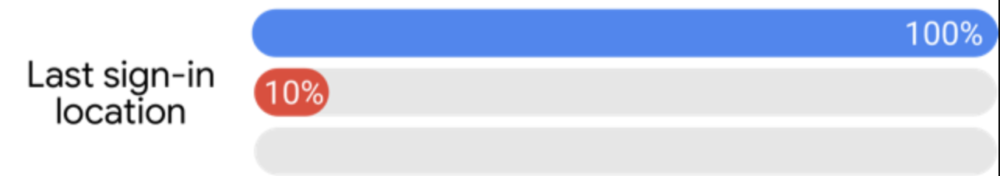
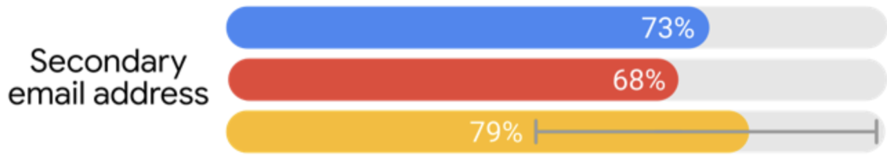
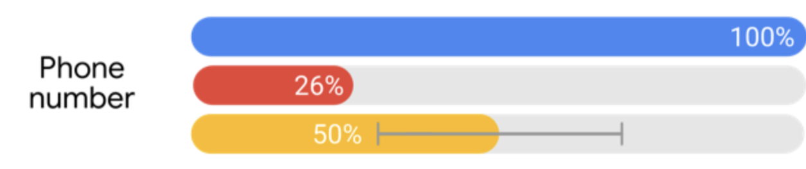
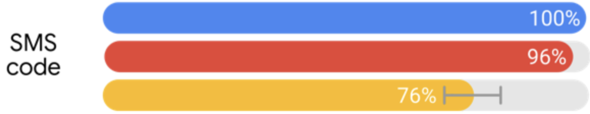
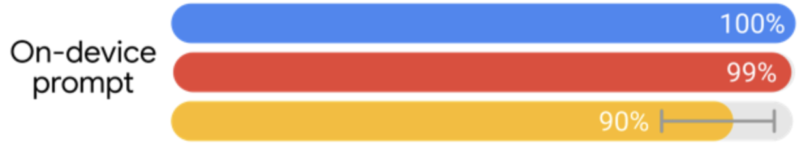
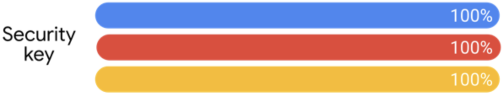

# Account hygiene

--

## Agenda

* Attacks
* Defenses
  * Passwords
  * MFA

--

## Credential Stuffing

TODO:
* Try Leaked user-password combinations on different services

-- Notes --
Explain how Credential stuffing works:
* Uses lists of leaked credential pairs (username & password combinations)

--

## Dictionary attacks (offline)

TODO:
* Use lists of leaked and common passwords
* Create variations
* Try all with each username

-- Notes --

Explain how dictionary attacks work:
* uses lists of words commonly used in passwords, like names of girlfriends, pets, sports-clubs etc.
* combines and varies words using rules like l33tsp34k, adding numbers like 123 or dates etc.
* tries all these combinations on each attacked account

--

## Brute-force (offline)

TODO:
* Leaked hashes of passwords
* Hash possible passwords
* See if they match leaked hashes

--

## Why do these work?

* Leaks
* Reuse
* Patterns

-- Notes --

If simple password hygiene is used, none of this would even work.
The time it takes to hack adds up quickly

--

<!-- .slide: style="font-size: 20px;" -->
## Brute-force timings

|        | 10x lower | 8x alphanum | 10x alphanum | 'Ulllll99' | Pwned PW's |
|--------|----------:|------------:|-------------:|-----------:|-----------:|
| MD5    |     6 sec |       9 sec |     10 hours |      0 sec |      0 sec |
| SHA1   |    34 sec |      53 sec |       2 days |      0 sec |      0 sec |
| SHA256 |     1 min |       2 min |       6 days |      0 sec |      0 sec |
| SHA512 |     4 min |       6 min |      18 days |      0 sec |      0 sec |
| SCRYPT |    6 days |      9 days |    104 years |      2 min |      1 sec |
| BCRYPT |  221 days |    341 days |  3 millennia |     1 hour |      1 min |

Using NSA grade hardware ($847k)

-- Notes --

* Using professional hardware of Terahash costing $847k it still takes hours to millennia to crack even basic 10 length passwords with only letters and numbers
* Both length (user defined) and hashing algorithm (developer-defined) used greatly influence time-to-crack
* Using patterns (Ulllll99) or reusing passwords (Pwned PW's) dramatically decrease the time-to-crack

--

<!-- .slide: style="font-size: 20px;" -->
## Hackers don't have $800k+

|        | 10x lower | 8x alphanum | 10x alphanum | 'Ulllll99' | Pwned PW's |
|--------|----------:|------------:|-------------:|-----------:|-----------:|
| MD5    |    30 min |      47 min |     126 days |      0 sec |      0 sec |
| SHA1   |    1 hour |     2 hours |       1 year |      1 sec |      0 sec |
| SHA256 |   4 hours |     6 hours |      2 years |      3 sec |      0 sec |
| SHA512 |  12 hours |    18 hours |      8 years |      9 sec |      0 sec |
| SCRYPT |   2 years |     3 years | 14 millennia |     4 hour |      4 min |
| BCRYPT | 102 years |   158 years |611 millennia |     8 days |     3 hour |

Using budget grade hardware ($5k)

-- Notes --

* Yes, they do
* But also with budget hardware of only $5000,-, patterns and reuse are cracked within days

--

## Defense: LURP

# L ong
# U nique
# R andom
# P asswords

<i>[\X-cYB6aTW4KyBY>#/+|[}Y.O+IS-</i> *<!-- .element style="box-shadow:none; position: fixed; right: 100px; top: 260px; width: 490px; font-size: 26px;" class="fragment" data-fragment-index="0" -->

100+ accounts?<!-- .element class="fragment" data-fragment-index="1" -->

&ast; Don't reuse this, because.... well, it's not unique then... and it's in my public repo<!-- .element style="font-size: 16px;" class="fragment" data-fragment-index="0" -->

-- Notes --

Notice that Password manager is not in this list, because it's not a requirement but a tool to get there for normal humans.
For people with perfect photographic memory, go ahead and remember 100+ of these passwords

--

## Password managers

20 - 30 characters is sufficient 
Any pattern or system you introduce can be broken
<!-- .element style="box-shadow:none; position: fixed; right: 70px; top: 260px; width: 290px;" -->
<!-- .element style="box-shadow:none; position: fixed; right: 70px; top: 400px; width: 290px;" -->
<!-- .element style="box-shadow:none; position: fixed; left: 70px; top: 260px; width: 290px;" -->
<!-- .element style="box-shadow:none; position: fixed; left: 70px; top: 400px; width: 290px;" -->

-- Notes --

So to get there, just start using a password manager.
Do expect the obvious question.... (next slide)

--

## Password managers

* Are they safe?
  * Are they 100% secure?<!-- .element class="fragment" data-fragment-index="0" -->
    * No1<!-- .element class="fragment" data-fragment-index="1" -->
  * Should you use them?<!-- .element class="fragment" data-fragment-index="0" -->
    * Yes2<!-- .element class="fragment" data-fragment-index="2" -->
    * But why?<!-- .element class="fragment" data-fragment-index="3" -->
      * <i>don’t have to be perfect, just better than none</i> - Troy Hunt3<!-- .element class="fragment" data-fragment-index="4" -->

1 But...<!-- .element style="font-size: 16px; position: fixed; left: 10px; bottom: 80px; " class="fragment" data-fragment-index="1" -->

2 Unless your name is Edward Snowden<!-- .element style="font-size: 16px; position: fixed; left: 10px; bottom: 60px; " class="fragment" data-fragment-index="2" -->

3 Shortened from [this]()<!-- .element style="font-size: 16px; position: fixed; left: 10px; bottom: 60px; " class="fragment" data-fragment-index="4" -->

-- Notes --

The question should not be "Are they safe".
Let's split this question into two:
* Are they 100% secure? No, but this is not relevant for 99.999% of ppl
* Should you use them? YES, unless your that 0.001% of NSA / CIA targets like Edward Snowden types or people actually WORKING on cryptography and stuff that NSA / CIA / Russia / China wants to hack
* Because simply: having a password-manager to ENABLE you to do LURP is insanely better than weak or reused passwords
  * As long as you use PW-managers correctly:
    * Super strong random passphrase as master-pass
    * All the other obvious security hygiene, which brings us to (next slide)

--

## But, they're not safe?

See?

-- Notes --

These vulnerabilities can only be abused when local memory could be read, which means: your machine is already compromised.
If you machine is compromised, narrow vulnerabilities in PW-managers are NOT your problem.

--

## So update

--

## MFA

Things you:
* know
* have
* are

-- Notes --

MFA requires authentication over more than one category.
(multiple in the same category is NOT MFA)

Example:
* Know: Passwords, (static) pins
* Have: Badge, smartphone (Authentication app), security key, Yubi-key, RSA-token (with rolling pins)
* Are: Biometrics like fingerprints, eye-scan, face-scan, voice, but also keystroke and mouse dynamics

--

## MFA: Adaptive authentication

Context:
* Location-based
* Time-based
* Device-based
* Network-based

-- Notes --
Example:
* Location-based: Are you in an expected location, like office or home?
* Time-based: Working-hours?
* Device-based: Smartphone, tablet or laptop?
* Network-based: Office, VPN? Private or public network?

--

## MFA Effectiveness

### Knowledge-based

* Last sign-in location
* Secondary email-address<!-- .element style="position: fixed; bottom: 350px; " class="fragment" data-fragment-index="0" -->
* Phone number<!-- .element style="position: fixed; bottom: 80px; bottom: 250px; " class="fragment" data-fragment-index="1" -->

<!-- .element style="box-shadow:none; position: fixed; right: 10px; bottom: 420px; width: 450px; " -->
<!-- .element style="box-shadow:none; position: fixed; right: 10px; bottom: 310px; width: 450px; " class="fragment" data-fragment-index="0" -->
<!-- .element style="box-shadow:none; position: fixed; right: 10px; bottom: 200px; width: 450px; " class="fragment" data-fragment-index="1" -->

Source: [Google research](https://thenextweb.com/google/2019/05/23/google-data-shows-2-factor-authentication-blocks-100-of-automated-bot-hacks/)<!-- .element style="font-size: 16px; position: fixed; bottom: 80px; " -->

--

## MFA Effectiveness

### Device-based

* SMS-code
* Device-prompt<!-- .element style="position: fixed; bottom: 350px; " class="fragment" data-fragment-index="0" -->
* Security-key<!-- .element style="position: fixed; bottom: 80px; bottom: 250px; " class="fragment" data-fragment-index="1" -->

<!-- .element style="box-shadow:none; position: fixed; right: 10px; bottom: 420px; width: 450px; " -->
<!-- .element style="box-shadow:none; position: fixed; right: 10px; bottom: 310px; width: 450px; " class="fragment" data-fragment-index="0" -->
<!-- .element style="box-shadow:none; position: fixed; right: 10px; bottom: 200px; width: 450px; " class="fragment" data-fragment-index="1" -->

Source: [Google research](https://thenextweb.com/google/2019/05/23/google-data-shows-2-factor-authentication-blocks-100-of-automated-bot-hacks/)<!-- .element style="font-size: 16px; position: fixed; bottom: 80px; " -->
