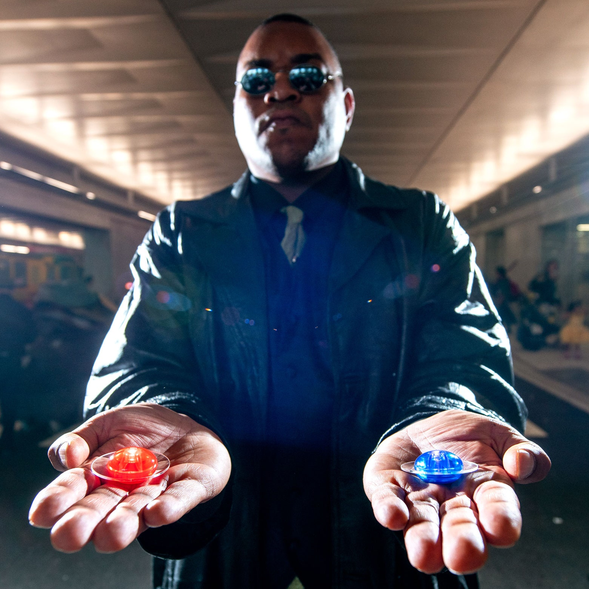
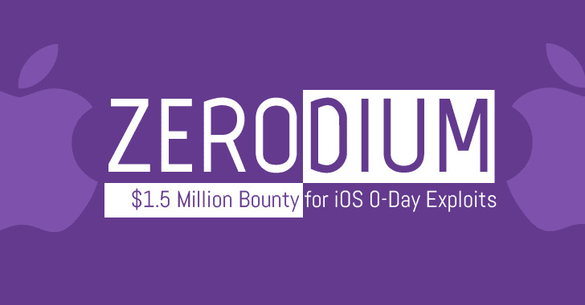
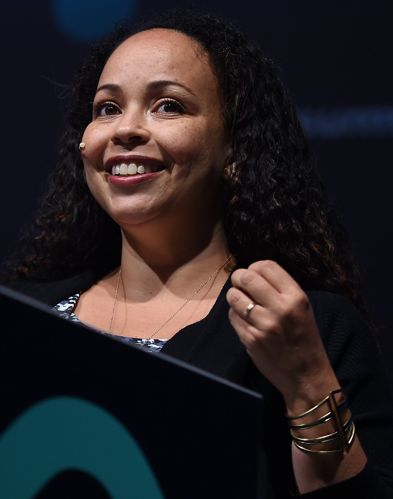
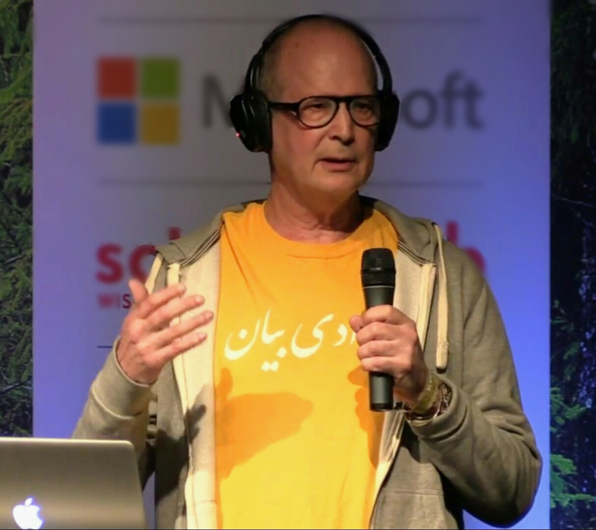
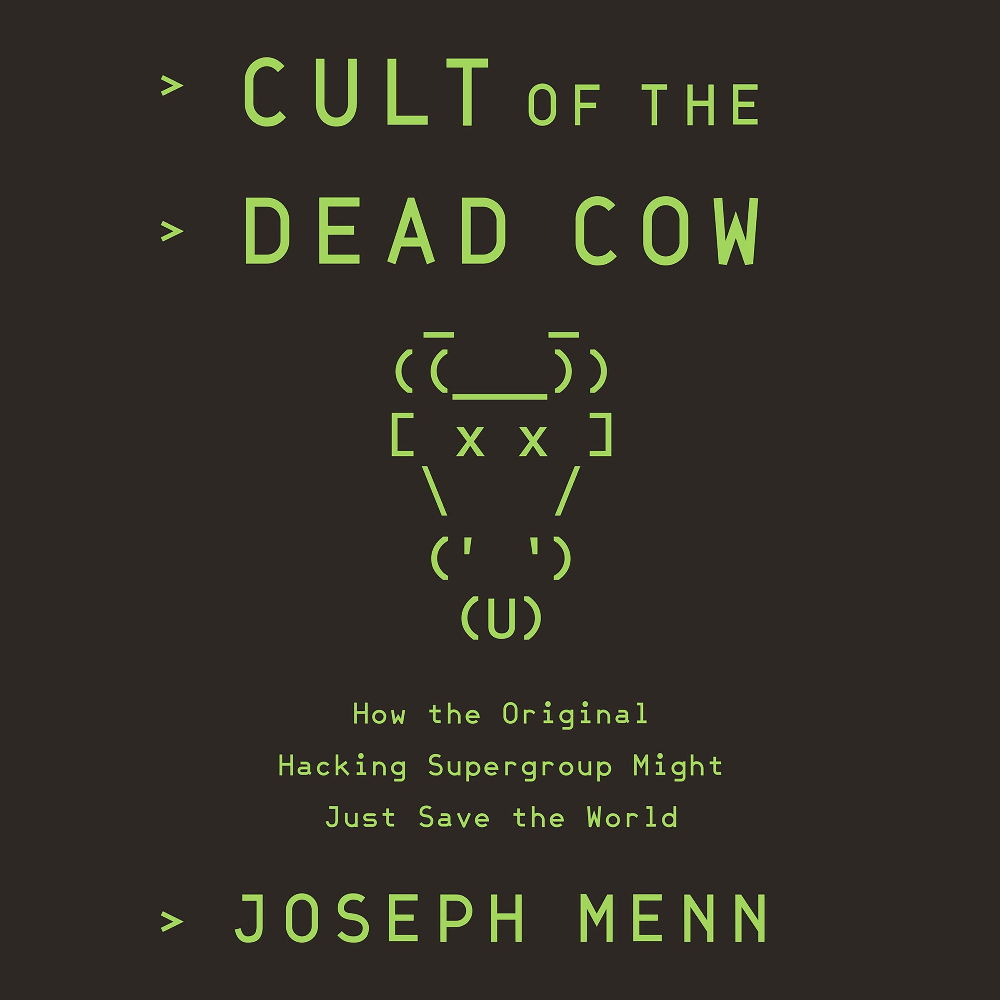

## Ethics

--

<!-- .element style="position: fixed; top: 10px; width: 650px; left: 150px; background-color: #ffffff;" -->
<!-- .element style="position: fixed; bottom: 110px; width: 250px; left: 180px; background-color: #ffffff;" -->
<!-- .element style="position: fixed; bottom: 110px; width: 250px; right: 180px; background-color: #ffffff;" -->

--

## Selling Zero Days

<!-- .element style="position: fixed; top: 110px; width: 550px; right: 10px; background-color: #ffffff;" -->

* Pros:
  * Fast money
* Cons:
  * Needs top skills
  * Used as weapon?
  * Not sustainable

Darknet Diaries 98: [Zero Day Brokers](https://darknetdiaries.com/transcript/98/)

--

## Bug Bounties

<!-- .element style="box-shadow:none; position: fixed; bottom: 10px; width: 750px; right: 10px; background-color: #ffffff;" -->

* Pros:
  * Continuous money
* Cons:
  * Basic skills
  * Used to fix broken stuff
  * Sustainable

-- Notes --

* [HackerOne](https://www.hackerone.com/company-news/trytohack-makes-history-first-bug-bounty-hacker-earn-over-1-million)
  * Started in 2015 (age 16)
  * Self-taught via internet: Blogs & Youtube
  * $1M in 2019 (4 years after start learning)
  * 1670 unique vulns.

--

## Cult of the Dead Cow

### Saving the World

<!-- .element style="position: fixed; width: 150px; top: 190px; left: 50px; background-color: #ffffff;" -->
<!-- .element style="position: fixed; width: 150px; top: 180px; left: 340px; background-color: #ffffff;" -->
<!-- .element style="position: fixed; width: 150px; top: 170px; left: 195px; background-color: #ffffff;" -->
<!-- .element style="position: fixed; width: 150px; top: 450px; left: 290px; background-color: #ffffff;" -->
<!-- .element style="position: fixed; width: 150px; top: 360px; left: 10px; background-color: #ffffff;" -->
<!-- .element style="position: fixed; width: 150px; top: 320px; left: 285px; background-color: #ffffff;" -->
<!-- .element style="position: fixed; width: 150px; top: 310px; left: 140px; background-color: #ffffff;" -->
<!-- .element style="position: fixed; width: 350px; top: 180px; right: 0px; background-color: #ffffff;" -->

-- Notes --

* [Mudge](https://en.wikipedia.org/wiki/Peiter_Zatko) / Peiter Zatko
  * Secretary of Defense Exceptional Civilian Service Award
  * Twitter Head of Security
* [Dildog](https://en.wikipedia.org/wiki/Christien_Rioux) / Christien Rioux
  * Principal Software Architect at Symantec
  * Chief Scientist & Co-founder Veracode
* [Sir Dystic](https://en.wikipedia.org/wiki/Sir_Dystic) / Josh Buchbinder:
  * Check Point
  * Senior Developer
* [Oxblood Ruffin](https://en.wikipedia.org/wiki/Oxblood_Ruffin) / Laird Brown
* Javaman / [Adam O'Donnell](https://www.linkedin.com/in/adamjodonnell/)
  * CISO / Principal Engineer
* Lady Carolin / Carrie Campbell
* [Rosie the Riveter](https://en.wikipedia.org/wiki/Window_Snyder) / Window Snyder
  * Security & Privacy Apple
  * CSO Fastly
  * CSSO Intel
  * CSO Square
  * Founder & CEO Thistle Technologies

[Defcon](https://www.youtube.com/watch?v=tr4PEQ-g7r8) interview

