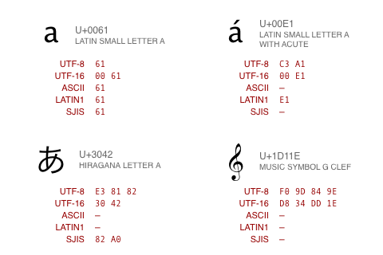
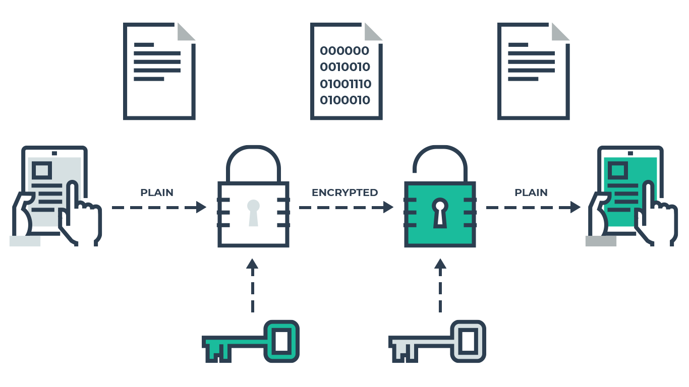

## Encryption & Stuff

* Purpose: ...
* Reverse: ...
* Examples: ...

--

## Encoding

* Purpose: Efficient transport or storage<!-- .element: class="fragment" data-fragment-index="1" -->
* Reverse: decoding<!-- .element: class="fragment" data-fragment-index="2" -->
  * Encoding algorithm (public)
  * Easy using trial & error
* Examples: ASCII, Unicode (UTF-*), URL Encoding, base64, RGB, HTML<!-- .element: class="fragment" data-fragment-index="0" -->

<!-- .element: style="position: fixed; width: 350px; right: 0px; bottom: 50px;" -->

--

## Encryption

* Purpose: Confidentiality<!-- .element: class="fragment" data-fragment-index="1" -->
* Reverse: decryption<!-- .element: class="fragment" data-fragment-index="2" -->
  * Needed: 
    * Encryption algorithm (public)
    * Key
  * Brute force (Easy: ROT13 / CAESAR, Hard: others)
* Single key (symmetric):<!-- .element: class="fragment" data-fragment-index="3" -->
  * Same key used to encrypt & decrypt
* Dual (or more) keys (asymmetric):<!-- .element: class="fragment" data-fragment-index="4" -->
  * Different keys used to encrypt & decrypt
* Examples: CAESAR-cipher, PGP, DES, 3DES, AES, RSA, Blowfish, Twofish<!-- .element: class="fragment" data-fragment-index="0" -->

<!-- .element: style="position: fixed; width: 400px; right: 0px; top: 120px;" -->

--

## Optional: Key exchange

### Challenge

Alice & Bob:
* Are on internet
* Want confidentially

They should:
* Agree on a shared key
* Over internet (in public)
* So only Alice & Bob know the key

--

## Optional: Key exchange

### Diffie Hellmann

<!-- .element: style="position: fixed; width: 400px; left: 250px; top: 220px;" -->

Choose g and p using [this](https://en.wikipedia.org/wiki/Primitive_root_modulo_n) table<!-- .element: style="position: fixed; top: 550px;" -->

--

## Optional: Key exchange

### Diffie Hellmann

Volunteers:
* Alice
* Bob
* Calculating expert in:
  * Power raising
  * Modulo

--

## Hashing

* Purpose: Integrity (file-downloads, passwords)<!-- .element: class="fragment" data-fragment-index="1" -->
* Reverse: not possible<!-- .element: class="fragment" data-fragment-index="2" -->
* Same input always creates same output<!-- .element: class="fragment" data-fragment-index="3" -->
  * (using same algorithm)
* No collisions (practically)<!-- .element: class="fragment" data-fragment-index="4" -->
* Examples: MD5, SHA-1, SHA-2 (224, 256, 384 etc), scrypt, bcrypt <!-- .element: class="fragment" data-fragment-index="0" -->

<!-- .element: style="position: fixed; width: 400px; right: 0px; bottom: 20px;" -->

--

## Crypto in Java

* Java Cryptography Architecture [JDK SE 11](https://docs.oracle.com/en/java/javase/11/security/java-cryptography-architecture-jca-reference-guide.html#GUID-2BCFDD85-D533-4E6C-8CE9-29990DEB0190)
* Java Cryptography [tutorial](https://www.tutorialspoint.com/java_cryptography/index.htm)
* Crypto [demo](https://github.com/MichelSchudel/crypto-demo) by [Michel Schudel](https://www.twitter.com/MichelSchudel)
 * [Presentation slides](https://www.slideshare.net/michelschudel/cryptography-101-forjavadevelopers-fall-2019)
