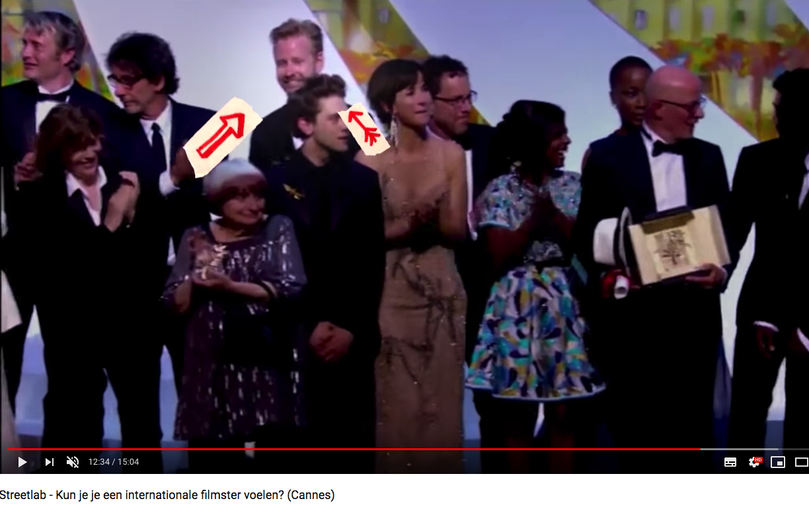
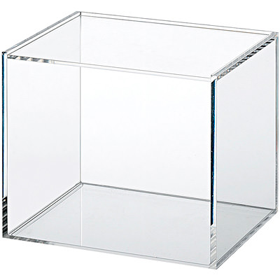

## Hack activities

* Physical pentest (Social engineering)

<!-- .element style="position: fixed; width: 350px; top: 200px; right: 120px; background-color: #ffffff;" -->

<!-- .element style="position: fixed; width: 400px; top: 300px; left: 60px; background-color: #ffffff;" -->

[Crying baby example](https://www.youtube.com/watch?v=lc7scxvKQOo)

-- Notes --

* Alberto Stegeman tests Schiphol security
* [StreetLab](https://www.youtube.com/watch?v=d8cB0x5wEBc&t=475) on stage at Cannes Film-festival (around 12:00)
* [StukTV](https://www.youtube.com/watch?v=vFd6kIdjUpM) enters festival as sound / decibel auditors

--

## Hack activities

* Digital pentest (hacking)
  * Ethical hacking<!-- .element: class="fragment" data-fragment-index="1" -->
    * Bug bounties<!-- .element: class="fragment" data-fragment-index="1" -->
    * Responsible disclosures<!-- .element: class="fragment" data-fragment-index="1" -->
    * Non-responsible disclosures<!-- .element: class="fragment" data-fragment-index="1" -->
  * Assignments<!-- .element: class="fragment" data-fragment-index="2" -->
    * Black-box<!-- .element: class="fragment" data-fragment-index="2" -->
    * Grey-box<!-- .element: class="fragment" data-fragment-index="2" -->
    * White-box (transparent box)<!-- .element: class="fragment" data-fragment-index="2" -->
  * Red-/blue-teaming<!-- .element: class="fragment" data-fragment-index="3" -->

<!-- .element style="position: fixed; width: 150px; top: 170px; right: 50px; background-color: #ffffff;" class="fragment" data-fragment-index="1" -->
<!-- .element style="position: fixed; width: 150px; top: 190px; right: 170px; background-color: #ffffff;" class="fragment" data-fragment-index="1" -->
<!-- .element style="position: fixed; width: 150px; top: 210px; right: 290px; background-color: #ffffff;" class="fragment" data-fragment-index="1" -->
<!-- .element style="position: fixed; width: 150px; top: 330px; right: 100px; background-color: #ffffff;" class="fragment" data-fragment-index="2" -->
<!-- .element style="position: fixed; width: 300px; bottom: 20px; right: 50px; background-color: #ffffff;" class="fragment" data-fragment-index="3" -->

--

## Asymetrical Game

| Subject   | SOC                               | White-hats                    | Black-hats                        | Advantage |
|-----------|-----------------------------------|-------------------------------|-----------------------------------|-----------|
| Time      | Immediate response                | Limited assignment time       | No deadline                       | Black-hats|
| Money     | Limited resources                 | Limited resources             | Unlimited resources (sometimes)   | Black-hats|
| Knowledge | White-box                         | White-box (mostly)            | Black-box                         | SOC       |
| Attack    | Don't known when, where and how   | Controlled (Rules of engagement)| No rules                       | Black-hats|
| Defend    | Needs to defend everything        |                               | Needs just one entry              | Black-hats|
| Detect    | Single detection needed           | Stealthy not (always) needed  | Remain stealthy                   | SOC       |

-- Notes --

White-hats don't need to create full damage, just proof / Proof of concept.
They don't need to execute the full attack up to grabbing all the data.
Just an SQL-injection that grabs one record or an XSS that does alert(1) should be sufficient.

