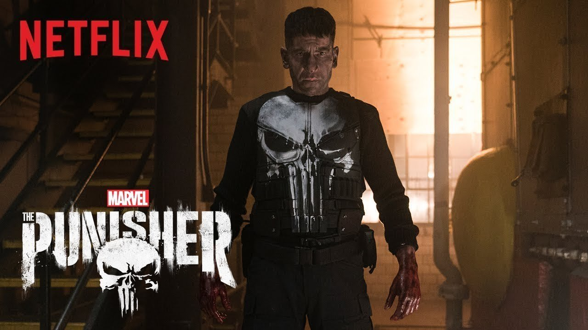
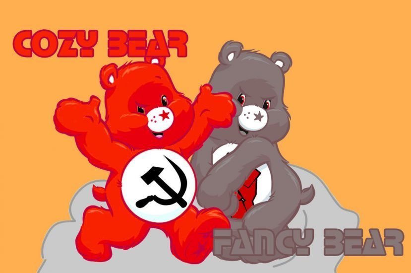

<!-- .slide: data-background="pics/hacker.jpg" style="text-align: left; vertical-align: middle; color:white" -->

## Hacker types <!-- .element style="color:#cccccc;" -->

--

## Hacker types

### Black
* Criminal<!-- .element: class="fragment" data-fragment-index="1" -->
* Personal gain<!-- .element: class="fragment" data-fragment-index="1" -->

<!-- .element style="position: fixed; top: 150px; right: 20px; width: 450px; height: 450px; background-color: #ffffff;" -->

--

## Hacker types

### White
* Ethical hacker<!-- .element: class="fragment" data-fragment-index="1" -->
* Pen-tester<!-- .element: class="fragment" data-fragment-index="1" -->
* Authorized Security professional<!-- .element: class="fragment" data-fragment-index="1" -->

<!-- .element style="position: fixed; top: 150px; right: 20px; width: 450px; height: 450px; background-color: #ffffff;" -->

--

## Hacker types

### Grey
* Non-professional
* Not authorized
* Criminal?

<!-- .element style="position: fixed; top: 150px; right: 20px; width: 450px; height: 450px; background-color: #ffffff;" -->

--

## Hacker types

### Red
* White hats
* Punisher style

<!-- .element style="position: fixed; top: 150px; right: 20px; width: 450px; height: 450px; background-color: #ffffff;" -->
<!-- .element style="position: fixed; top: 450px; left: 120px; width: 350px; background-color: #ffffff;" -->

--

## Hacker types

### Script kiddies
* Kids
* Pranks
* No coding skill
* Uses scripts & tools

<!-- .element style="position: fixed; top: 150px; right: 20px; background-color: #ffffff;" -->
<!-- .element style="position: fixed; top: 420px; right: 120px; width: 350px; background-color: #ffffff;" -->
<!-- .element style="position: fixed; top: 450px; left: 120px; width: 350px; background-color: #ffffff;" -->

--

## Hacker types

### Green
* Curious kids
* Wanna-be white-hat

<!-- .element style="position: fixed; top: 150px; right: 20px; width: 450px; height: 450px; background-color: #ffffff;" -->

--

## Hacker types

### Blue
* Revenge hacker
* Revenge-porn

<!-- .element style="position: fixed; top: 150px; right: 20px; width: 450px; height: 450px; background-color: #ffffff;" -->

--

## Hacker types

### Corporate
* Insider
* Whistleblower
* Corporate revenge hacker

<!-- .element style="position: fixed; top: 150px; right: 20px; background-color: #ffffff;" -->
<!-- .element style="position: fixed; top: 420px; right: 120px; width: 350px; background-color: #ffffff;" -->
<!-- .element style="position: fixed; top: 450px; left: 120px; width: 350px; background-color: #ffffff;" -->

-- Notes --
Gus Gorman - Superman 3 (salami slicing half cents)

--

## Hacker types

### HAcktivist
* Greenpeace-style
* ISIS hackers
* Anonymous collective
* Various skill-levels

APT-Names [*](https://www.crowdstrike.com/blog/meet-the-adversaries/):
* Jackals (Activists)
* Spiders (Criminals)

<!-- .element style="position: fixed; top: 150px; right: 20px; background-color: #ffffff;" -->
<!-- .element style="position: fixed; top: 420px; right: 50px; width: 350px; background-color: #ffffff;" -->
<!-- .element style="position: fixed; top: 410px; left: 200px; width: 350px; background-color: #ffffff;" -->

--

## Hacker types

### State actor (APT)
* Unlimited funds
* Expert skills

APT-Names [*](https://www.crowdstrike.com/blog/meet-the-adversaries/):
* Bears (Russia)
* Kitten (Iran)
* Panda (China)
* Chollima (NKorea)
* Tiger (India)

<!-- .element style="position: fixed; width: 150px; top: 150px; left: 420px; background-color: #ffffff;" -->
<!-- .element style="position: fixed; width: 300px; top: 200px; right: 50px; background-color: #ffffff;" -->
<!-- .element style="position: fixed; width: 300px; bottom: 40px; left: 300px; background-color: #ffffff;" -->
<!-- .element style="position: fixed; width: 300px; top: 420px; right: 50px; background-color: #ffffff;" -->
<!-- .element style="position: fixed; width: 300px; top: 300px; right: 270px; background-color: #ffffff;" -->

