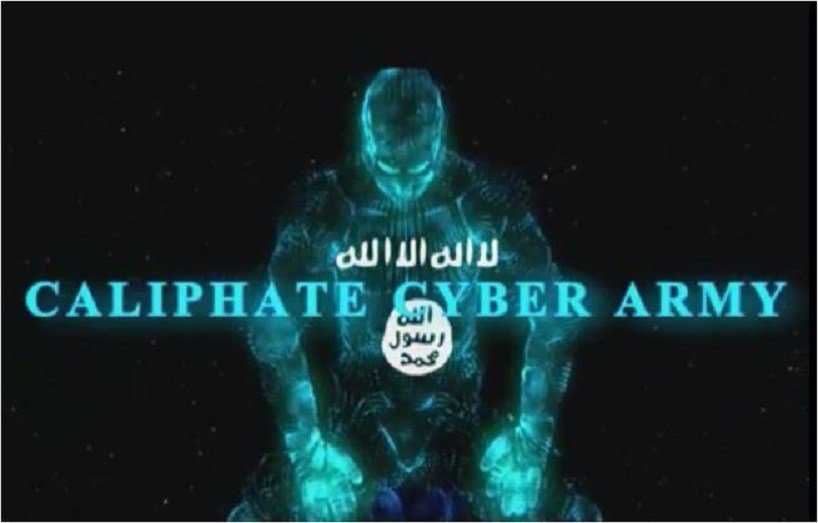

<!-- .slide: data-background="pics/intro/hacker.jpg" style="text-align: left; vertical-align: middle; color:white" -->

## Hacker types <!-- .element style="color:#cccccc;" -->

--

## Hacker types

### Black
* Criminal<!-- .element: class="fragment" data-fragment-index="1" -->
* Personal gain<!-- .element: class="fragment" data-fragment-index="1" -->

<!-- .element style="box-shadow:none; position: fixed; top: 150px; right: 20px; width: 450px; height: 450px; background-color: #ffffff;" -->

-- Notes --

* Hackers in media when something gets hacked

--

## Hacker types

### White
* Ethical hacker<!-- .element: class="fragment" data-fragment-index="1" -->
* Pen-tester<!-- .element: class="fragment" data-fragment-index="1" -->
* Authorized Security professional<!-- .element: class="fragment" data-fragment-index="1" -->

<!-- .element style="box-shadow:none; position: fixed; top: 150px; right: 20px; width: 450px; height: 450px; background-color: #ffffff;" -->

-- Notes --

* Most security researchers, like pen-testers and other ethical hackers
* Most often responsible disclosure, working pro-actively and constructively with vendors
* Sometimes forced to do full disclosure to force unwilling vendors to fix issues

--

## Hacker types

### Grey
* Non-professional
* Not authorized
* Criminal?

<!-- .element style="box-shadow:none; position: fixed; top: 150px; right: 20px; width: 450px; height: 450px; background-color: #ffffff;" -->

-- Notes --

* Does white-hat stuff, but without permission
* Sometimes offer services (or friend's services) for money after discovering vulnerabilities
* Not (often) full disclosures, but also not really ethical

--

## Hacker types

### Red
* White hats
* Punisher style

<!-- .element style="box-shadow:none; position: fixed; top: 150px; right: 20px; width: 450px; height: 450px; background-color: #ffffff;" -->
<!-- .element style="position: fixed; top: 450px; left: 120px; width: 350px; background-color: #ffffff;" -->

-- Notes --

* Fights black-hats using aggressive and destructive attacks
* Unethical, illegal activities

--

## Hacker types

### Script kiddies
* Kids
* Pranks
* No coding skill
* Uses scripts & tools

<!-- .element style="box-shadow:none; position: fixed; top: 150px; right: 20px; background-color: #ffffff;" -->
<!-- .element style="position: fixed; top: 420px; right: 120px; width: 350px; background-color: #ffffff;" -->
<!-- .element style="position: fixed; top: 450px; left: 120px; width: 350px; background-color: #ffffff;" -->

-- Notes --

* Prankster kids
* Found some tools on internet and abuse those to hack for fun or profit
* Credentials / data hoarders trade sensitive private data like baseball cards

--

## Hacker types

### Green
* Curious kids
* Wanna-be white-hat

<!-- .element style="box-shadow:none; position: fixed; top: 150px; right: 20px; width: 450px; height: 450px; background-color: #ffffff;" -->

-- Notes --

* Want to become White-hats, but lack the skills
* Eagerness gives potential, but could also slide towards black-hats
* Need guidance in ethics and skills
* Darknet Diaries 17 [Finn](https://darknetdiaries.com/episode/17/)

--

## Hacker types

### Blue
* Revenge hacker
* Revenge-porn

<!-- .element style="box-shadow:none; position: fixed; top: 150px; right: 20px; width: 450px; height: 450px; background-color: #ffffff;" -->

-- Notes --

Examples:
* Spouse spying with Smart-phone spying apps
* Insider threat after job-loss revenge

--

## Hacker types

### Corporate
* Insider
* Whistleblower
* Corporate revenge hacker

<!-- .element style="position: fixed; top: 150px; right: 20px; background-color: #ffffff;" -->
<!-- .element style="position: fixed; top: 420px; right: 120px; width: 350px; background-color: #ffffff;" -->
<!-- .element style="position: fixed; top: 450px; left: 120px; width: 350px; background-color: #ffffff;" -->

-- Notes --

* Blue hat insider has overlap with Corporate hacker
* Not always black-hat: whistleblower isn't

Example in 1983 movie Superman 3:
* Gus Gorman (by Richard Pryor) - Superman 3 (salami slicing half cents)

--

## Hacker types

### HAcktivist
* Greenpeace-style
* ISIS hackers
* Anonymous collective
* Various skill-levels

<!-- .element style="position: fixed; top: 150px; right: 20px; background-color: #ffffff;" -->
<!-- .element style="position: fixed; top: 420px; right: 50px; width: 350px; background-color: #ffffff;" -->
<!-- .element style="position: fixed; top: 410px; left: 200px; width: 350px; background-color: #ffffff;" -->

-- Notes --

APT-Names [*](https://www.crowdstrike.com/blog/meet-the-adversaries/):
* Jackals (Activists)
* Spiders (Criminals)

Motives:
* Financial
  * Darknet Diaries 58: [Oxymonster](https://darknetdiaries.com/episode/58/)
* Destructive
* Principles / righteousness
  * Darknet Diaries 14: [Anonymous](https://darknetdiaries.com/episode/14/) OpJustina
* World views
* Politics activists
* In name of religion

--

## Hacker types

### State actor (APT)
* Unlimited funds
* Expert skills

<!-- .element style="position: fixed; width: 150px; top: 150px; left: 420px; background-color: #ffffff;" -->
<!-- .element style="position: fixed; width: 300px; top: 200px; right: 50px; background-color: #ffffff;" -->
<!-- .element style="position: fixed; width: 300px; bottom: 40px; left: 300px; background-color: #ffffff;" -->
<!-- .element style="position: fixed; width: 300px; top: 420px; right: 50px; background-color: #ffffff;" -->
<!-- .element style="position: fixed; width: 300px; top: 300px; right: 270px; background-color: #ffffff;" -->

-- Notes --

Targets:
* Governments / political parties
  * Voting process, machines, fake-news
* Banks
* Big corps for intel spying (ASML)
* Journalists & activists
* Large groups of civilians
  * Spying Darknet Diaries 3 [DigitNotar](https://darknetdiaries.com/episode/3/)
  * Influencing thoughts (psy-ops): Darknet Diaries 65 [Psy-Ops](https://darknetdiaries.com/episode/65/)
  

APT-Names [*](https://www.crowdstrike.com/blog/meet-the-adversaries/):
Crowd-Strike categorises APTs by origin into animals:
* Nation-State-Based Adversaries
  * Bear = Russia
  * Buffalo = Vietnam
  * Chollima (a mythical winged horse) = North Korea
  * Crane = South Korea
  * Kitten = Iran
  * Leopard = Pakistan
  * Panda = China
  * Tiger = India
