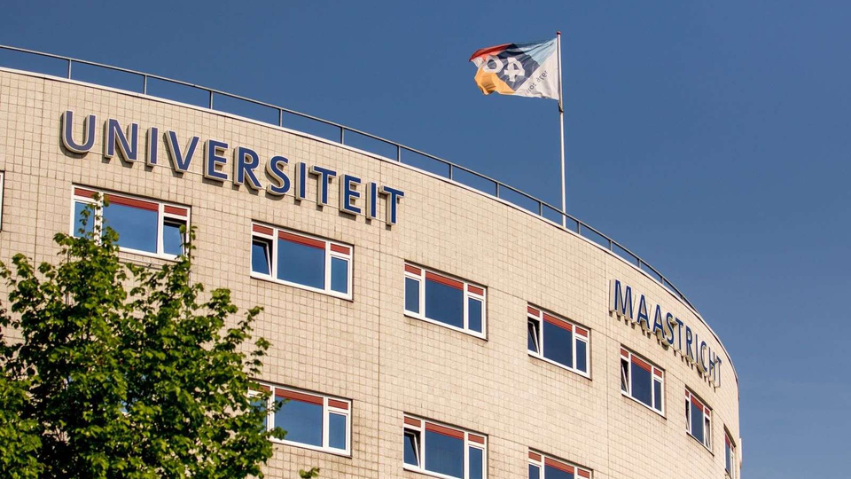

## University of Maastricht

--

## University of Maastricht

## Timeline

* Oct 15, 2019: Two phishing mails clicked<!-- .element: class="fragment" data-fragment-index="0" -->
* Nov 21, 2019: Attackers have full control due to missing updates<!-- .element: class="fragment" data-fragment-index="1" -->
* Dec 19, 2019: Anti-virus alert, which attacker removes<!-- .element: class="fragment" data-fragment-index="2" -->
* Dec 23, 2019: Ransomware activated and detected<!-- .element: class="fragment" data-fragment-index="3" -->
* Dec 24, 2018: Fox-IT isolates network<!-- .element: class="fragment" data-fragment-index="4" -->
* Dec 30, 2019: BTC 30 (~Euro 220k) ransom paid after analysis<!-- .element: class="fragment" data-fragment-index="5" -->
* Jan 2,  2020: University Maastricht limited operational<!-- .element: class="fragment" data-fragment-index="6" -->
* Feb 5,  2020: Symposium streamed & recorded<!-- .element: class="fragment" data-fragment-index="7" -->

--

## University of Maastricht

## Attack

* Clop Ransomware<!-- .element: class="fragment" data-fragment-index="0" -->
* DHCP, Exchange servers & DC's compromised<!-- .element: class="fragment" data-fragment-index="1" -->
* 267 Windows servers affected<!-- .element: class="fragment" data-fragment-index="2" -->
* TA505 (aka SectorJ04) spider-group<!-- .element: class="fragment" data-fragment-index="3" -->

-- Notes --

* Clop Ransomware (related to CryptoMix)
* DHCP, Exchange servers & DC's compromised
* Infra: 1647 servers (Linux & Windows) & 7307 workstations
* 267 Windows servers affected
* no decryptor available
* Targets networks instead of PC's
* TA505 (aka SectorJ04) spider-group
* Active since Q3 2014, mainly targeting retail & financials
* Dridex & Trick banking trojans

Sources:
* [Bleeping Computers](https://www.bleepingcomputer.com/news/security/ta505-hackers-behind-maastricht-university-ransomware-attack/)
* [Symposium](https://youtu.be/ik-ZVvZ2-xU?t=888)