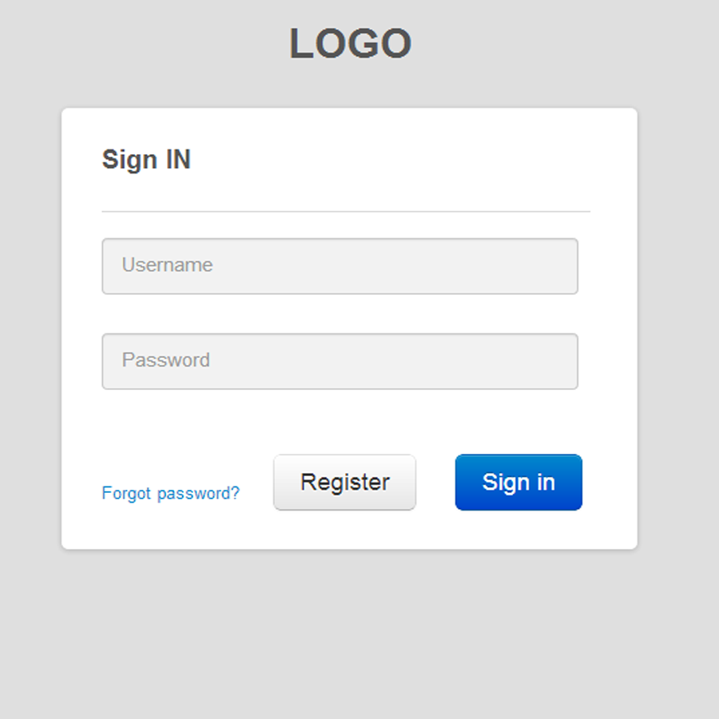

## MADSpace

https://github.com/brampat/security ->  
  publications ->  
  presentation ->   
  madspace.md

--

## Rubber Ducky OS detection

* See [this](https://forums.hak5.org/topic/36078-auto-detect-os-and-choose-appropriate-payload/) forum discussion
* And [this](https://www.youtube.com/watch?v=nuruzFqMgIw) BlackHat video
  * Worm-like properties: reproduces / infects other devices
  * Could infect (weaponize) all USB-devices (including webcams, keyboards, USB-HDD's, Android Phone etc)
    * *"Can I charge my phone on your laptop?"*
    * PoC: srlabs.de/badusb
  * OS detection to select different payloads (video 28:25)
  * Keyboard-emulation to start Meterpreter-shell
  * Ethernet emulation voor MitM network attacks
    * Install root CA for https validation
  * Infect on boot to infect BIOS or install rootkit
* More info [here](https://opensource.srlabs.de/projects/badusb)

--

## CVE's

### Where can you get CVE numbers

See book "Securing Open Source Libraries" by Guy Podjarny, downloadable [here](https://snyk.io/blog/new-oreilly-book-securing-open-source-libraries-by-guy-podjarny/):

 Or just report your vulnerability to one of the [CVE numbering authorities](https://cve.mitre.org/cve/cna.html)

*Common Vulnerabilities and Exposures (CVE)
[...]. CVE is a free dictionary of vulnerabilities,
[...] CVEs are used globally as a classification system.
When a new vulnerability is disclosed, it can be reported to MITRE
 (or one of the other CVE Numbering Authorities), which can con‐
 firm the issue is real and assign it a CVE number.*

--

## Hacking Responsibly

### Marcus Hutchins (‘WannaCry hero’) sentenced to supervised release
* Accidentally [stopped WannaCry](https://techcrunch.com/2019/07/08/the-wannacry-sinkhole/) by registering domain *iuqerfsodp9ifjaposdfjhgosurijfaewrwergwea.com* (2017)
* Created and sold Kronos banking malware (2014-2015)

<!-- .element style="margin: 0px; width: 475px;" -->

--

## Hacking Responsibly

### SQL-injection

<!-- .element style="position: fixed; width: 400px; top: 215px; right: 50px; background-color: #ffffff;" -->

<pre><code data-trim data-noescape>
var query = "SELECT U.USERNAME FROM USERS U 
WHERE U.USERNAME = '" + $_POST['username'] + "' 
  AND U.PASSWORD = '" + $_POST['password'] + "'" 
</code></pre><!-- .element style="position: fixed; width: 450px; left: 50px; top: 210px;" -->

<pre><code data-trim data-noescape>
SELECT U.USERNAME FROM USERS U
WHERE U.USERNAME = 'foo'
  AND U.PASSWORD = 'bar' 
</code></pre><!-- .element: style="position: fixed; width: 450px; left: 50px; top: 280px;" class="fragment" data-fragment-index="1" -->

<pre><code data-trim data-noescape>
SELECT 1+1; #  Comment
SELECT 1+1; -- Comment
</code></pre><!-- .element: style="position: fixed; width: 450px; left: 50px; top: 350px;" class="fragment" data-fragment-index="2"  -->

<pre>
Username: admin
Password: ' OR 1 = 1 --
</code></pre><!-- .element: style="position: fixed; width: 450px; left: 50px; top: 405px;" class="fragment" data-fragment-index="3" -->

<pre><code data-trim data-noescape>
SELECT U.USERNAME FROM USERS U
WHERE U.USERNAME = 'admin'
AND U.PASSWORD = '' OR 1 = 1 --'
</code></pre><!-- .element: style="position: fixed; width: 450px; left: 50px; top: 455px;" class="fragment" data-fragment-index="4" -->

That's all folks<!-- .element: style="position: fixed; left: 50px; top: 550px;" class="fragment" data-fragment-index="5" -->

--

## Hacking Responsibly

--

## Disclosing Responsibly

* [ZeroCopter](https://www.zerocopter.com/responsible-disclosure)
* [BugCrowd](https://www.bugcrowd.com/resource/what-is-responsible-disclosure/)

--

## Hacking

* Basics:
  * [Hacksplaining](https://www.hacksplaining.com/lessons)
  * [Secure Code Warrior](https://portal.securecodewarrior.com/#/website-trial/)

--

## Hacking

* Challenges:
  * [Root-me](https://www.root-me.org/?lang=en): Online challenges and VM to practice hacking
  * [Hack.me](https://hack.me/): Online challenges on vulnerable web-applications
  * [Hack the box](https://www.hackthebox.eu/): Online testing environment, accessible after completing an entry-level test
  * [Try Hack Me](https://tryhackme.com/): Hack Challenges
  * [Hacker 101](https://www.hacker101.com/): Training for bounty-hunter by [HackerOne](https://www.hackerone.com/)

--

## Hacking

* CTF's:
  * [PicoCTF](https://picoctf.com/) -> Darknet Diary ep. 46: PPP 
  * [Tracelabs](https://www.tracelabs.org/getinvolved/ctf/) OSINT CTF on finding missing persons
  * [CTFTime](https://ctftime.org/): Overview of scheduled CTF's

--

## Hacking

* Lists:
  * [List](https://www.blackroomsec.com/updated-hacking-challenge-site-links/) of hacking challenge sites
  * [List 2](https://www.peerlyst.com/posts/resource-a-compendium-of-sites-that-you-can-practice-on-you-can-legally-hack-these-sites-karl-m-1)

 
 
 
