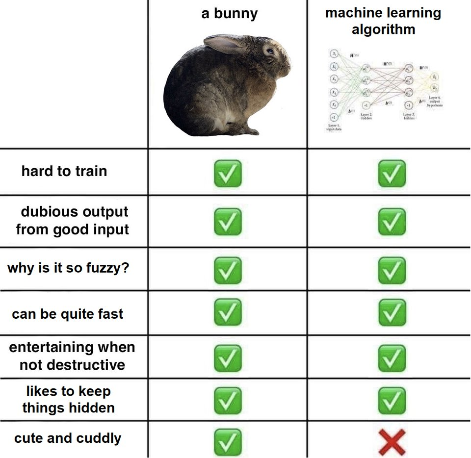
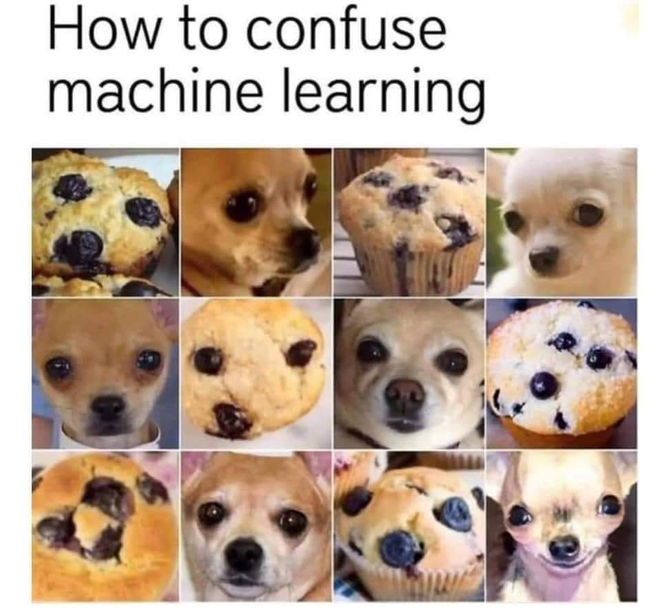
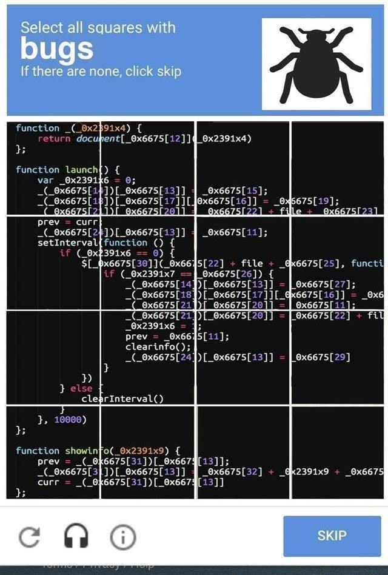
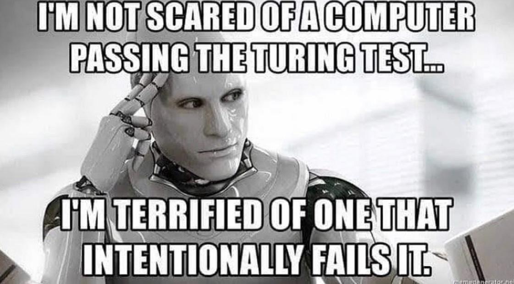

## Machine Learning & AI

--

<!-- .element style="border:none; box-shadow:none; position: fixed; width: 650px; left: 0px; top: 10px;"  -->

-- Notes --

* Any Machine Learning experts here?
  * Machine learning is fuzzy logic right?
  * But it can be quite fast?
  * Is your algorithm cute & cuddly?
* What's the hardest thing about Machine Learning?
  * Is it the learning data-set?
  * Here's a nice data-set (next slide)

--

<!-- .element style="border:none; box-shadow:none; position: fixed; width: 750px; left: 0px; top: 10px;"  -->

-- Notes --

* Here's a really hard machine learning data-set
* While Google still needs our help with traffic lights, busses & boats, there are much harder Machine Learning sets to crack.
* Humans are clearly beating Machine Learning in recognizing cakes from dogs
* But we're not always better at detecting things (next slide)

--

<!-- .element style="border:none; box-shadow:none; position: fixed; width: 550px; left: 0px; top: 10px;"  -->

-- Notes --

* Here's an example of things we find hard to spot
* which computers are much better at
* But we'll come back to coding bugs in a later slide

--

<!-- .element style="border:none; box-shadow:none; position: fixed; width: 1250px; left: 0px; top: 10px;"  -->

-- Notes --

* Let's go back to AI for a bit
* Artificial Intelligence should be implemented with care, to preserve human values
  * that's why we have Asimov's laws
* Again: the training data-set is very important
  * we should make sure we don't create biased algorithms
    * Examples: preferring caucasian ppl over ppl of color (Twitter)
    * Gender bias
    * Dutch Tax offices: groups are fraudulent based on religion, home address, car-size etc
  * Algorithms are only as fair as the people who create them

