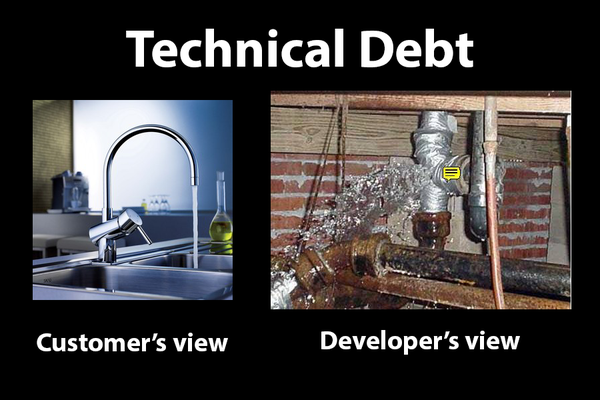
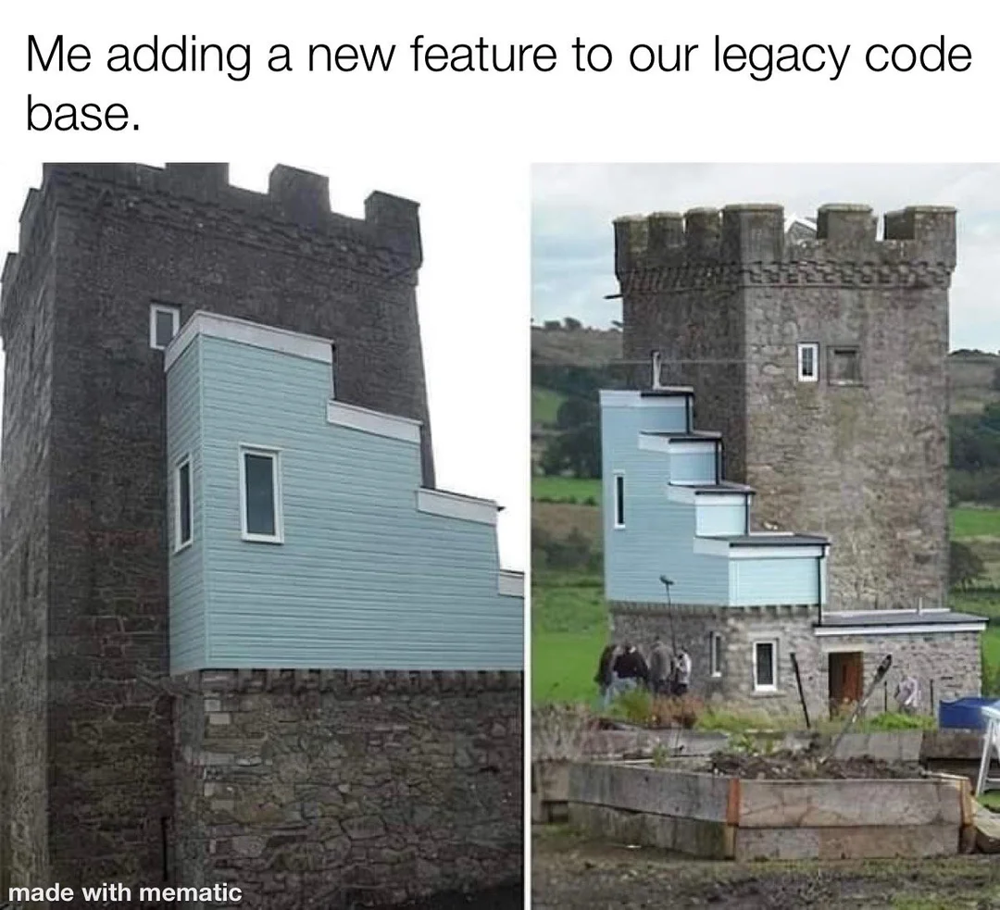
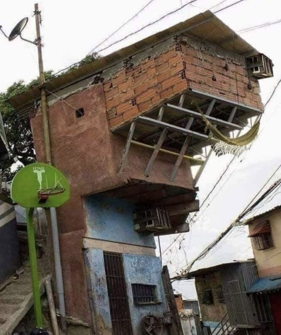
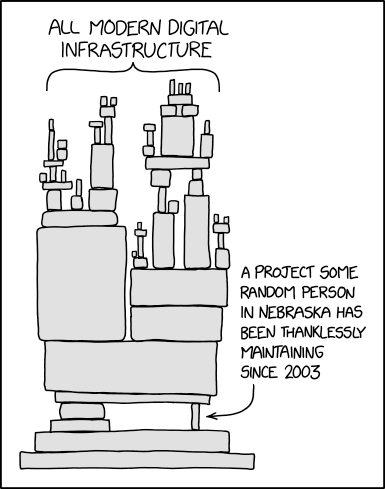

## Code Quality

--

<!-- .element style="border:none; box-shadow:none; position: fixed; width: 850px; left: 0px; top: 10px;"  -->

-- Notes --

Quality (Maintainability) is about what a developer sees

--

<!-- .element style="border:none; box-shadow:none; position: fixed; width: 850px; left: 0px; top: 10px;"  -->

-- Notes --

Old but well maintained code can still be expanded with new features
* May look odd, but stable
* However....

--

<!-- .element style="border:none; box-shadow:none; position: fixed; width: 600px; left: 0px; top: 10px;"  -->

-- Notes --

Adding features
* without maintaining code
* will result in risk
* Resulting in bugs which.... 

--

## Fixing bugs on Prod

<!-- .element style="border:none; box-shadow:none; position: fixed; width: 850px; left: 0px; top: 110px;"  -->

-- Notes --

Bugs will eventually need fixing
* Let's fix bugs before prod

--

<!-- .element style="border:none; box-shadow:none; position: fixed; width: 600px; left: 0px; top: 10px;"  -->

-- Notes --

How important software can be:
* We build on other ppl's work / dependencies
* Log4J / Spring
* This comic references [OpenSSL](https://www.theregister.com/2021/05/10/untangling_open_sources_sustainability_problem/)
  * 2014: Heartbleed on OpenSSL
  * 2020: This comic
* But [left-pad](https://www.theregister.com/2016/03/23/npm_left_pad_chaos/) in NPM is a similar example
* And recently [node-ipc](https://portswigger.net/daily-swig/npm-maintainer-targets-russian-users-with-data-wiping-protestware) contained anti-Russia malware

--

<!-- .element style="border:none; box-shadow:none; position: fixed; width: 850px; left: 0px; top: 10px;"  -->

-- Notes --

And accept that coding without bugs is nearly impossible
* Well, maybe some people only make a single bug in their life 

