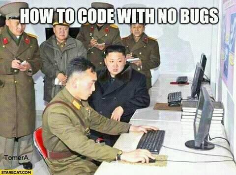

## Code Quality

--

<!-- .element style="border:none; box-shadow:none; position: fixed; width: 850px; left: 0px; top: 10px;"  -->

-- Notes --

Quality (Maintainability) is about what a developer sees

--

<!-- .element style="border:none; box-shadow:none; position: fixed; width: 850px; left: 0px; top: 10px;"  -->

-- Notes --

Well maintained code can still add new features to old code

--

<!-- .element style="border:none; box-shadow:none; position: fixed; width: 600px; left: 0px; top: 10px;"  -->

-- Notes --

But adding features, without maintaining code will result in risky applications

--

<!-- .element style="border:none; box-shadow:none; position: fixed; width: 850px; left: 0px; top: 10px;"  -->

-- Notes --

Which will eventually need fixing

--

<!-- .element style="border:none; box-shadow:none; position: fixed; width: 600px; left: 0px; top: 10px;"  -->

-- Notes --

We build on other ppl's work 
* This comic references [OpenSSL](https://www.theregister.com/2021/05/10/untangling_open_sources_sustainability_problem/)
* But [left-pad](https://www.theregister.com/2016/03/23/npm_left_pad_chaos/) in NPM is a similar example
* And recently [node-ipc](https://portswigger.net/daily-swig/npm-maintainer-targets-russian-users-with-data-wiping-protestware) contained anti-Russia malware

--

<!-- .element style="border:none; box-shadow:none; position: fixed; width: 850px; left: 0px; top: 10px;"  -->

-- Notes --

Just remember that no code is free from bugs

