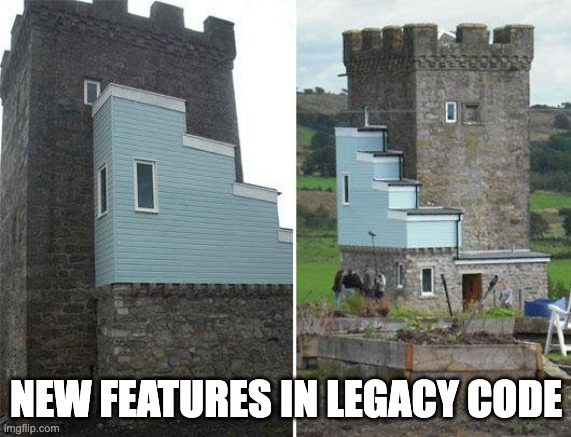

## Code Quality

<!-- .element style="border:none; box-shadow:none; position: fixed; width: 750px; left: 100px; top: 120px;"  -->

-- Notes --

Quality (Maintainability) is about what a developer sees

--

## Why?

<!-- .element style="border:none; box-shadow:none; position: fixed; width: 600px; right: 40px; top: 10px;"  -->

-- Notes --

Adding features
* without maintaining code
* will result in risk
* Resulting in bugs which....

--

## Fixing bugs on Prod

<!-- .element style="border:none; box-shadow:none; position: fixed; width: 850px; left: 60px; top: 110px;"  -->

-- Notes --

... need fixing
* Let's fix bugs before prod

--

<!-- .element style="border:none; box-shadow:none; position: fixed; width: 600px; left: 200px; top: 10px;"  -->

-- Notes --

You may not be the guy in Nebraska which supports the entire internet, but you are building software that ppl depend on.
* We build on other ppl's work / dependencies
* And the guy in Omaha, Nebraska maintains [GPSD](https://www.theregister.com/2021/10/19/gpsd_bug_reset/) 
* Other examples:
  * [OpenSSL](https://www.buzzfeed.com/chrisstokelwalker/the-internet-is-being-protected-by-two-guys-named-st) maintained by two Steve's
    * 2014: Heartbleed on OpenSSL
  * [left-pad](https://www.theregister.com/2016/03/23/npm_left_pad_chaos/) in NPM
    * [Brand infringement](https://www.theregister.com/2016/03/23/npm_left_pad_chaos/) by Kik IM App's lawyers
  * And recently [node-ipc](https://portswigger.net/daily-swig/npm-maintainer-targets-russian-users-with-data-wiping-protestware) contained anti-Russia malware
* Better funded, but equally important projects:
  * Log4J / Spring
* There are [more examples](https://www.explainxkcd.com/wiki/index.php/2347:_Dependency)

--

<!-- .element style="border:none; box-shadow:none; position: fixed; width: 750px; left: 100px; bottom: 10px;"  -->

-- Notes --

And accept that coding without bugs is nearly impossible
* Well, maybe some people only make a single bug in their life 

--

## Lesson

<!-- .element style="border:none; box-shadow:none; position: fixed; width: 650px; left: 150px; bottom: 60px;"  -->

-- Notes --

So build your code to last, well maintained code can still get new features
* Stable
* Robust
* Future-proof

