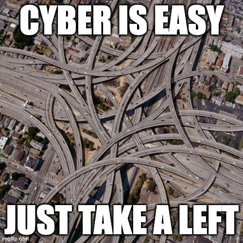
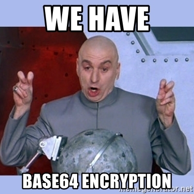
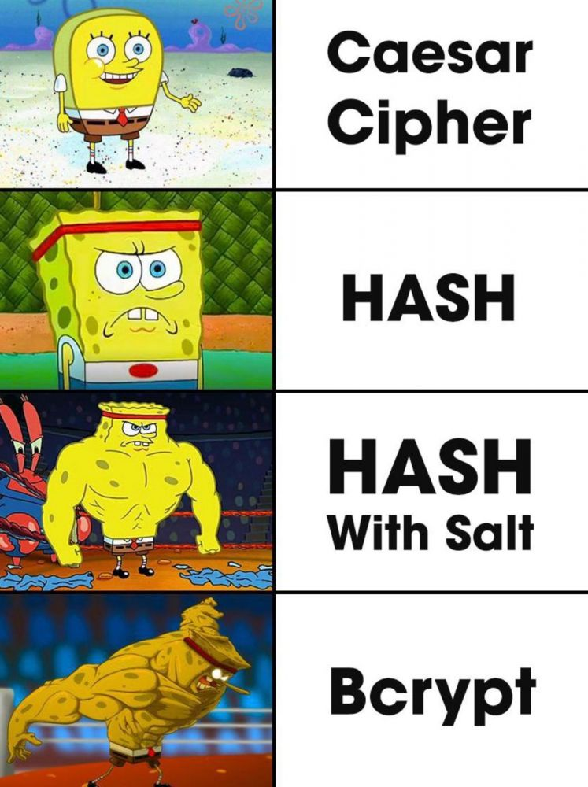
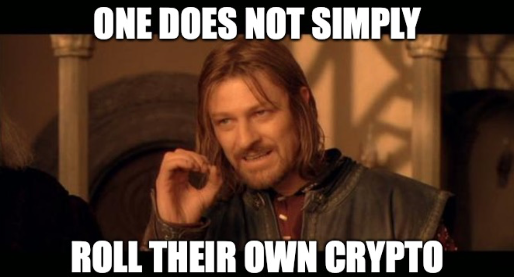
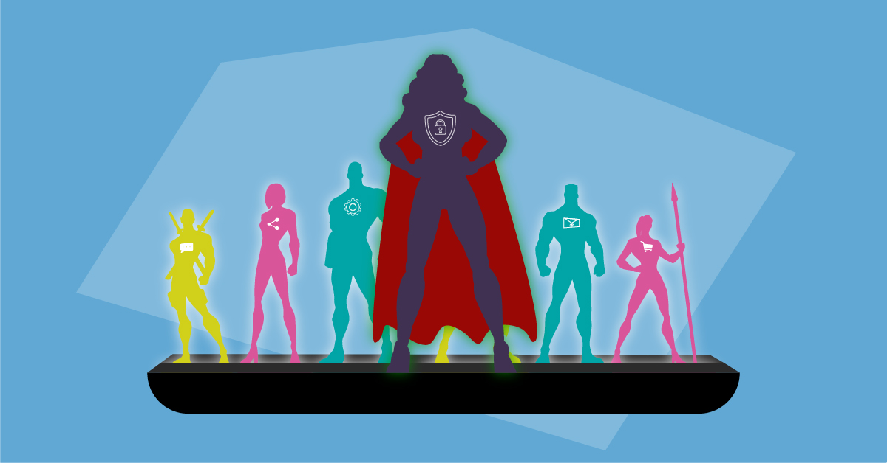

## Cryptography

### Why?

<!-- .element style="border:none; box-shadow:none; position: fixed; width: 550px; right: 60px; top: 120px;"  -->

--

<!-- .element style="border:none; box-shadow:none; position: fixed; width: 750px; left: 100px; top: 100px;"  -->

-- Notes --

Just to be clear, we're not talking about cryptocurrency
* This is not investment advice, not even investment opinion
* But what is considered cryptography then?

--

## Not Crypto

<!-- .element style="border:none; box-shadow:none; position: fixed; width: 550px; left: 200px; bottom: 10px;"  -->

-- Notes --

Encoding is not encryption

--

## Broken Crypto

<!-- .element style="border:none; box-shadow:none; position: fixed; width: 550px; left: 200px; bottom: 10px;"  -->

-- Notes --

Hashing is cryptography
* Hexadecimal digest for instance next to file-downloads etc.
* Protects integrity: Is this really what I expect it is (not been tampered with)
* Hashes cannot be reversed
  * NOT encryption
* MD5 is broken
* SHA1 is vulnerable
* SHA2 is strong with high enough bit-size
  * Bitcoin uses SHA-256 -> SHA2 with 256 bits
* But....

--

## Stronger

<!-- .element style="border:none; box-shadow:none; position: fixed; width: 550px; right: 60px; top: 10px;"  -->

-- Notes --

SHA-256 is not for everything
* Caesar Cipher (encryption) is weak
* Hashing, depending on which algo, is soft to brute-force with rainbow-tables
* Hashing with salt defends against rainbow-tables
  * Weak against weak passwords
* BCrypt has built-in salt and is deliberately "slow" to defend against brute-force
  * If you need password hashing: Use BCrypt
  * Still weak against weak passwords

--

<!-- .element style="border:none; box-shadow:none; position: fixed; width: 550px; left: 0px; top: 10px;"  -->
<!-- .element style="border:none; box-shadow:none; position: fixed; width: 450px; right: 0px; bottom: 10px;"  -->

-- Notes --

Never roll your own encryption
* Encryption is incredibly hard
* Even for Bruce Schneier
* Invented Blowfish in '93 and recommends using Twofish instead

--

<!-- .element style="border:none; box-shadow:none; position: fixed; width: 550px; left: 0px; top: 10px;"  -->
<!-- .element style="border:none; box-shadow:none; position: fixed; width: 550px; right: 0px; bottom: 10px;"  -->

-- Notes --

The Death Star plans were stolen by physically taking out the harddrive
* Use encryption to protect confidentiality
* Jyn Erso stealing harddrive

--

<!-- .element style="border:none; box-shadow:none; position: fixed; width: 650px; left: 150px; top: 110px;"  -->

-- Notes --

But cryptography doesn't solve all risks
* Actual attacks will always take the easy route:
  * Threatening ppl
  * Or phishing

--

## Lesson

<!-- .element style="border:none; box-shadow:none; position: fixed; width: 800px; left: 100px; bottom: 10px;"  -->

* Security & Crypto is complex
* Security Champions
* Dedicated Security Team

-- Notes --

Security and crypto is hard enough.
* Have a security champion in your team who connects your team with...
* a dedicated security support team which...
* Builds reusable crypto building blocks, battle-tested
* Use those blocks

