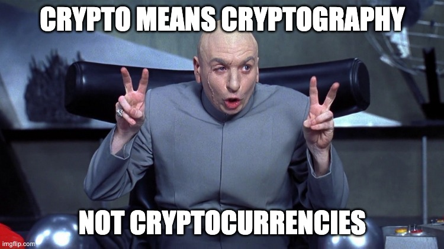
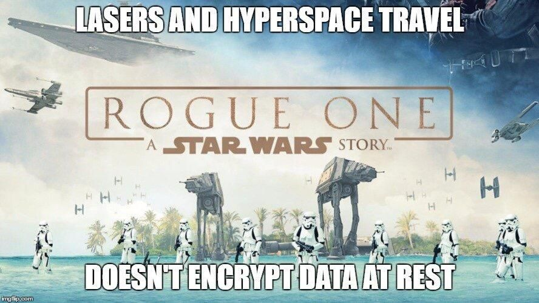

## Cryptography

--

<!-- .element style="border:none; box-shadow:none; position: fixed; width: 750px; left: 0px; top: 10px;"  -->

-- Notes --

This is not investment advice, not even investment opinion
* But what is considered cryptography then?

--

<!-- .element style="border:none; box-shadow:none; position: fixed; width: 550px; left: 0px; top: 10px;"  -->

-- Notes --

Encoding is not encryption

--

<!-- .element style="border:none; box-shadow:none; position: fixed; width: 550px; left: 0px; top: 10px;"  -->

-- Notes --

Hashing is cryptography
* Cannot be reversed
* NOT encryption
* MD5 is broken
* SHA1 is vulnerable
* SHA2 is strong with enough bit-size
  * Bitcoin uses SHA-256 -> SHA2 with 256 bits
* But if you need password hashing: Use BCrypt

--

<!-- .element style="border:none; box-shadow:none; position: fixed; width: 550px; left: 0px; top: 10px;"  -->

-- Notes --

* Caesar Cipher (encryption) is weak
* Hashing, depending on which algo, is soft to brute-force with rainbow-tables
* Hashing with salt defends against rainbow-tables
  * Weak against weak passwords
* BCrypt has built-in salt ans is deliberately "slow" to defend against brute-force
  * Still weak against weak passwords

--

<!-- .element style="border:none; box-shadow:none; position: fixed; width: 550px; left: 0px; top: 10px;"  -->
<!-- .element style="border:none; box-shadow:none; position: fixed; width: 450px; right: 0px; bottom: 10px;"  -->

-- Notes --

Never roll your own encryption
* Encryption is incredibly hard
* Even for Bruce Schneier
* Invented Blowfish in '93 and recommends using Twofish instead

--

<!-- .element style="border:none; box-shadow:none; position: fixed; width: 550px; left: 0px; top: 10px;"  -->
<!-- .element style="border:none; box-shadow:none; position: fixed; width: 550px; right: 0px; bottom: 10px;"  -->

-- Notes --

The Death Star plans were stolen by physically taking out the harddrive
* Use encryption to protect confidentiality

--

<!-- .element style="border:none; box-shadow:none; position: fixed; width: 750px; left: 0px; top: 10px;"  -->

-- Notes --

But don't think it's unbeatable
* Actual attacks will always take the easy route:
  * Threatening ppl
  * Or phishing

