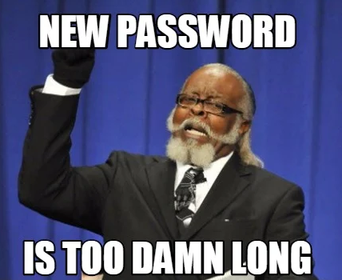

## Password Security

--

<!-- .element style="border:none; box-shadow:none; position: fixed; width: 850px; left: 0px; top: 10px;"  -->

Password:<!-- .element style="font-size: 50px; box-shadow:none; position: fixed; bottom: 50px; left: 20px;" -->
1Forrest1<!-- .element style="font-size: 50px; box-shadow:none; position: fixed; bottom: 50px; left: 400px;" class="fragment" data-fragment-index="1" -->

-- Notes --

Let's first talk about predictable passwords:
* Bad pun:
  * What's Forrest Gump's password?
  * Predictable passwords are very bad 

--

## Long
## Unique
## Random
## Passwords

<!-- .element style="position: fixed; width: 550px; top: 30px; right: 0px;" -->

(*) L.A.R.P. = Live Action Role Playing

-- Notes --

How to make passwords unpredictable:
* LURP
* Not LARP what these guys are doing

--

<!-- .element style="border:none; box-shadow:none; position: fixed; width: 850px; left: 0px; top: 10px;"  -->

-- Notes --

Why Long:
* Longer passwords means harder to crack
* Length beats complexity in general
* Whenever you try to use 50+ character passwords

--

<!-- .element style="border:none; box-shadow:none; position: fixed; width: 550px; left: 200px; top: 10px;"  -->

-- Notes --

Why unique:
* If it's reused, it will leak
* If someone asks for your password, you say no
* But any random website, we have no problem to provide our password

--

<!-- .element style="border:none; box-shadow:none; position: fixed; width: 750px; top: 100px; left: 0px;"  -->
<!-- .element style="border:none; box-shadow:none; position: fixed; width: 520px; top: 135px; left: 76px;" class="fragment" data-fragment-index="1" -->

-- Notes --

Effect of password reuse is:
* Armor is Millions of dollars on Cyber-security will fail
* Arrow through the visor: when people reuse passwords
  * Dataleak at Municipality of Buren (yesterday) was password-based attack
* You are part of security, if you like it or not
* So get a password manager

--

<!-- .element style="border:none; box-shadow:none; position: fixed; width: 850px; left: 0px; top: 10px;"  -->

-- Notes --

* admin / admin is the oldest vulnerability in existence and is still not fixed
* Make it random

--

<!-- .element style="border:none; box-shadow:none; position: fixed; width: 540px; left: 0px; top: 0px;"  -->

-- Notes --

* So it's time to change those weak passwords and make them LURP

--

<!-- .element style="border:none; box-shadow:none; position: fixed; width: 650px; left: 0px;"  -->
<!-- .element style="border:none; box-shadow:none; position: fixed; width: 550px; right: 0px;" class="fragment" data-fragment-index="5"  -->

P<!-- .element style="font-size: 50px; box-shadow:none; position: fixed; bottom: 150px; right: 205px;" class="fragment" data-fragment-index="1" -->
@<!-- .element style="font-size: 50px; box-shadow:none; position: fixed; bottom: 150px; right: 165px;" class="fragment" data-fragment-index="4" -->
ss<!-- .element style="font-size: 50px; box-shadow:none; position: fixed; bottom: 150px; right: 125px;" class="fragment" data-fragment-index="2" -->
w<!-- .element style="font-size: 50px; box-shadow:none; position: fixed; bottom: 150px; right: 90px;" class="fragment" data-fragment-index="2" -->
0<!-- .element style="font-size: 50px; box-shadow:none; position: fixed; bottom: 150px; right: 65px;" class="fragment" data-fragment-index="3" -->
r<!-- .element style="font-size: 50px; box-shadow:none; position: fixed; bottom: 150px; right: 45px;" class="fragment" data-fragment-index="2" -->
d<!-- .element style="font-size: 50px; box-shadow:none; position: fixed; bottom: 150px; right: 15px;" class="fragment" data-fragment-index="2" -->

-- Notes --

* And choosing a string password that checks all the boxes is often challenging
  * Uppercase
  * 4 lowercase
  * Number
  * Punctuation marks
  * Length 8+
  * No more than 3 of the same characters
  * No more than 3 punctuation marks
  * Only punctuation marks from this list

--

<!-- .element style="border:none; box-shadow:none; position: fixed; width: 750px; left: 0px;"  -->

-- Notes --

* And even then, the result can be very weak

--

<!-- .element style="border:none; box-shadow:none; position: fixed; width: 550px; top: 0px; left: 0px;"  -->

-- Notes --

* And we're not even diving into mandatory password rotation, which completely defeats its purpose  

--

<!-- .element style="border:none; box-shadow:none; position: fixed; width: 650px; top: 0px; left: 0px;"  -->

-- Notes --

* So how DO we choose a strong, effective password?

--

<!-- .element style="border:none; box-shadow:none; position: fixed; width: 750px; top: 0px; left: 0px;"  -->

-- Notes --

* Well, it should be long, unique and random
* But not to complex, so you can't even type it in
* This is:
  * Let it go in emoticons (from Frozen)
  * Someone used this on the password-change screen
  * Noticed there's no emoticons keyboard on the login-screen

--

<!-- .element style="border:none; box-shadow:none; position: fixed; width: 750px; left: 0px;"  -->

-- Notes --

* But how can you remember all those passwords?

--

<!-- .element style="border:none; box-shadow:none; position: fixed; width: 750px; left: 0px;"  -->

-- Notes --

* When they have to be unique and hard to guess?

--

<!-- .element style="border:none; box-shadow:none; position: fixed; width: 750px; left: 0px;"  -->

-- Notes --

* You could write them down
* And to be honest, that's not even that bad.
  * Hence Password-notebooks
  * Yes, these are easily stolen or lost
  * But the risk of password notebooks being stolen is way less than 
  * reused passwords in a data breach
  * Just guard them with your life and have a recovery and incident response plan.

--

<!-- .element style="border:none; box-shadow:none; position: fixed; width: 750px; left: 0px;"  -->

-- Notes --

But the best method is simply using password managers

