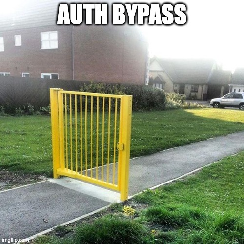
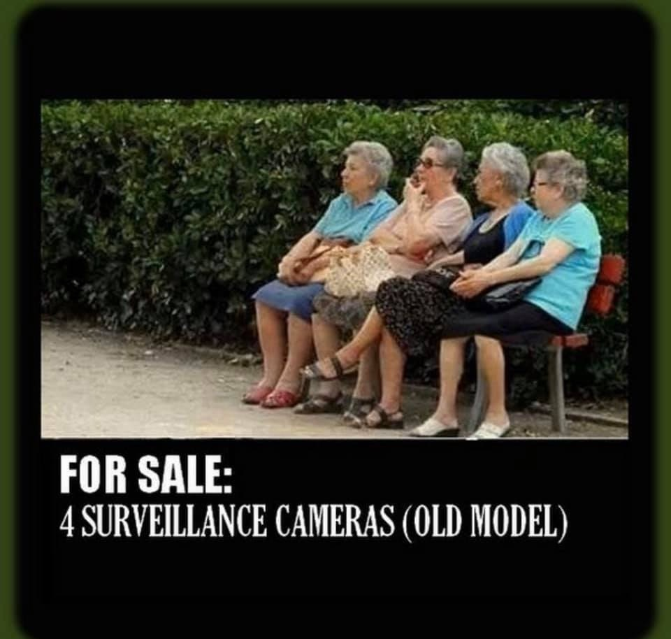
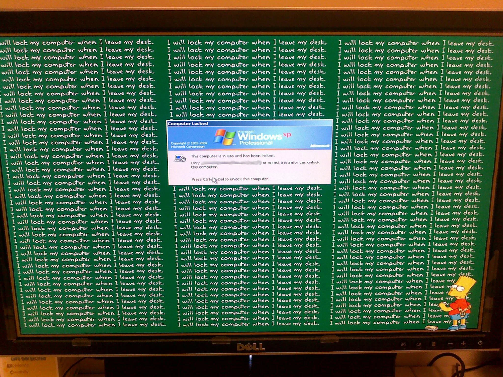

## Physical Security

--

<!-- .element style="border:none; box-shadow:none; position: fixed; width: 550px; left: 0px; top: 10px;"  -->

-- Notes --

* Secure Design is important
  * Perform Secure design review
* This is true with software development as well
  * Think about how your system is going to be used
  * Think how it can be abused
  * Design accordingly
  * This is called Threat modelling

--

<!-- .element style="border:none; box-shadow:none; position: fixed; width: 750px; left: 50px; top: 10px;"  -->

-- Notes --

Threat model to prevent authorization bypasses

--

<!-- .element style="border:none; box-shadow:none; position: fixed; width: 750px; left: 0px; top: 10px;"  -->

-- Notes --

* Don't blame people when they fail on Security
  * Help and educate instead
  * See how you can improve on teaching
  * Reward ppl for doing the right thing
* We all have company badges:
  * All employees can check for badges, when company policy is to wear them visibly
  * Be helpful and friendly, malicious ppl will reveal themselves soon enough
  * Spot that "lost visitor" and help them to front-desk for a visitor badge

--

# Scream 2022

"Nice Smart door locks"

<!-- .element style="vertical-align: middle; background:none; border:none; box-shadow:none; position: fixed; bottom: 20px; right: 20px; width: 830px;" -->
<!-- .element style="vertical-align: middle; background:none; border:none; box-shadow:none; position: fixed; top: 100px; right: 10px; width: 230px;" -->

-- Notes --

Where physical meets digital
* Insecure Security cams / baby-cams

--

<!-- .element style="border:none; box-shadow:none; position: fixed; width: 750px; left: 0px; top: 10px;"  -->

More inspiration: [40 tips](https://www.troyhunt.com/40-inappropriate-actions-to-take/) from Troy Hunt (2013)<!-- .element style="font-size: 30px; box-shadow:none; position: fixed; bottom: 10px; left: 10px;" -->

-- Notes --

* There are so many fun things to do with unlocked & unattended PCs & laptops
* Prepare your team-mates first
* Teach your colleagues to always lock
* Uninvited visitors could still visit

