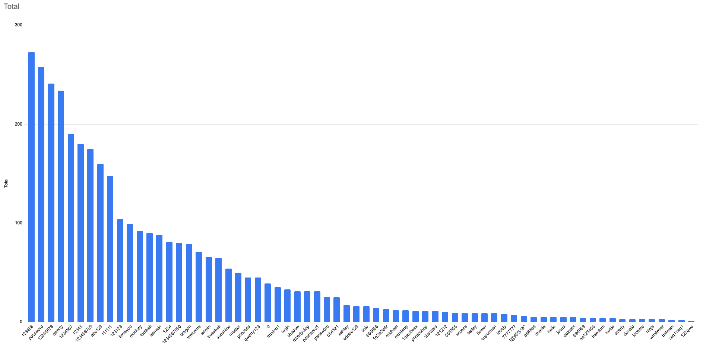

## Password hacking
<hr />

<!-- .element style="position: fixed; width: 750px; top: 80px; left: 100px;" class="fragment" data-fragment-index="1" -->

-- Notes --

The way we failed at effective passwords is so prevalent, there is an XKCD comic about it.

--

## Required knowledge
<hr />

### SQL-injection

<!-- .element style="position: fixed; width: 400px; top: 215px; right: 50px; background-color: #ffffff;" -->

<pre><code data-trim data-noescape>
var query = "SELECT U.USERNAME FROM USERS U 
WHERE U.USERNAME = '" + $_POST['username'] + "' 
  AND U.PASSWORD = '" + $_POST['password'] + "'" 
</code></pre><!-- .element style="position: fixed; width: 450px; left: 50px; top: 210px;" -->

<pre><code data-trim data-noescape>
SELECT U.USERNAME FROM USERS U
WHERE U.USERNAME = 'foo'
  AND U.PASSWORD = 'bar' 
</code></pre><!-- .element: style="position: fixed; width: 450px; left: 50px; top: 280px;" class="fragment" data-fragment-index="1" -->

<pre><code data-trim data-noescape>
SELECT 1+1; #  Comment
SELECT 1+1; -- Comment
</code></pre><!-- .element: style="position: fixed; width: 450px; left: 50px; top: 350px;" class="fragment" data-fragment-index="2"  -->

<pre>
Username: admin' --
Password: doesnt matter
</code></pre><!-- .element: style="position: fixed; width: 450px; left: 50px; top: 405px;" class="fragment" data-fragment-index="3" -->

<pre><code data-trim data-noescape>
SELECT U.USERNAME FROM USERS U
WHERE U.USERNAME = 'admin' --'
AND U.PASSWORD = 'doesnt matter'
</code></pre><!-- .element: style="position: fixed; width: 450px; left: 50px; top: 455px;" class="fragment" data-fragment-index="4" -->

That's all folks<!-- .element: style="position: fixed; left: 50px; top: 550px;" class="fragment" data-fragment-index="5" -->

--

## Bobby Tables
<hr />


-- Notes --

SQL injection attacks are so prevalent, there even is an XKCD comic about it.

--

## Defense: SQL-injection
<hr />

### Parameterized queries

```asp
var cmd = new SqlCommand() {
   Connection = conn,
   CommandText = "SELECT * FROM Students WHERE FirstName = @FirstName"
};
var prm = cmd.Parameters.Add("StudentName", SqlDbType.NVarChar);
prm.Value = "Robert'; DROP TABLE Students; --";
```

<!-- .element style="position: fixed; left: 450px; width: 500px;" class="fragment" data-fragment-index="1" -->

<br><br><br>
[bobby-tables.com](http://bobby-tables.com/)<!-- .element class="fragment" data-fragment-index="1" -->

Contains example code for: ADO.NET, ASP, C#, Delphi, Go, Java, Perl, PHP, Python, Ruby, VB.NET and more<!-- .element style="font-size: 12px; width: 300px;" class="fragment" data-fragment-index="1" -->

-- Notes --

SQL injection defence is so easy, but so often not implemented, there even is a website called Bobby Tables about it.

--

## Defense: SQL-injection
<hr />


--

## Password storage: Attack SQL Injection
<hr />

<!-- .element style="box-shadow:none; position: fixed; left: 120px; top: 250px;" -->
<pre>admin</pre><!-- .element style="box-shadow:none; position: fixed; left: 115px; top: 310px; width: 100px;" -->
<!-- .element style="box-shadow:none; position: fixed; left: 70px; top: 330px;" -->
<pre>alice</pre><!-- .element style="box-shadow:none; position: fixed; left: 65px; top: 390px; width: 100px;" -->
<!-- .element style="box-shadow:none; position: fixed; left: 70px; top: 410px;" -->
<pre>bob</pre><!-- .element style="box-shadow:none; position: fixed; left: 70px; top: 470px; width: 100px;" -->
<!-- .element style="box-shadow:none; position: fixed; left: 120px; top: 470px;" -->
<pre>eve</pre><!-- .element style="box-shadow:none; position: fixed; left: 120px; top: 530px; width: 100px;" -->


<!-- .element style="box-shadow:none; position: fixed; left: 320px; top: 300px;" -->

<!-- .element style="box-shadow:none; position: fixed; left: 140px; top: 280px;" class="fragment" data-fragment-index="0" -->
<!-- .element style="box-shadow:none; position: fixed; left: 90px; top: 360px;" class="fragment" data-fragment-index="0" -->
<!-- .element style="box-shadow:none; position: fixed; left: 90px; top: 400px;" class="fragment" data-fragment-index="0" -->
<!-- .element style="box-shadow:none; position: fixed; left: 140px; top: 445px;" class="fragment" data-fragment-index="0" -->

<pre>P@ssw0rd</pre><!-- .element style="box-shadow:none; position: fixed; left: 240px; top: 360px; width: 100px;" class="fragment" data-fragment-index="0" -->
<pre>qwerty</pre><!-- .element style="box-shadow:none; position: fixed; left: 240px; top: 385px; width: 100px;" class="fragment" data-fragment-index="0" -->
<pre>123456</pre><!-- .element style="box-shadow:none; position: fixed; left: 240px; top: 410px; width: 100px;" class="fragment" data-fragment-index="0" -->
<pre>password</pre><!-- .element style="box-shadow:none; position: fixed; left: 240px; top: 435px; width: 100px;" class="fragment" data-fragment-index="0" -->

<pre>admin</pre><!-- .element style="box-shadow:none; position: fixed; left: 365px; top: 405px; width: 100px; height: 100px;" class="fragment" data-fragment-index="1" -->
<pre>alice</pre><!-- .element style="box-shadow:none; position: fixed; left: 365px; top: 430px; width: 100px; height: 100px;" class="fragment" data-fragment-index="1" -->
<pre>bob</pre><!-- .element style="box-shadow:none; position: fixed; left: 365px; top: 455px; width: 100px; height: 100px;" class="fragment" data-fragment-index="1" -->
<pre>eve</pre><!-- .element style="box-shadow:none; position: fixed; left: 365px; top: 480px; width: 100px; height: 100px;" class="fragment" data-fragment-index="1" -->

<pre>P@ssw0rd</pre><!-- .element style="box-shadow:none; position: fixed; left: 420px; top: 405px; width: 100px; height: 100px;" class="fragment" data-fragment-index="1" -->
<pre>qwerty</pre><!-- .element style="box-shadow:none; position: fixed; left: 420px; top: 430px; width: 100px; height: 100px;" class="fragment" data-fragment-index="1" -->
<pre>123456</pre><!-- .element style="box-shadow:none; position: fixed; left: 420px; top: 455px; width: 100px; height: 100px;" class="fragment" data-fragment-index="1" -->
<pre>password</pre><!-- .element style="box-shadow:none; position: fixed; left: 420px; top: 480px; width: 100px; height: 100px;" class="fragment" data-fragment-index="1" -->

<!-- .element style="box-shadow:none; position: fixed; left: 580px; top: 400px;" class="fragment" data-fragment-index="2" -->
<pre>union select user, password 
from users; --</pre><!-- .element style="box-shadow:none; position: fixed; left: 580px; top: 460px;" class="fragment" data-fragment-index="2" -->


<!-- .element style="box-shadow:none; position: fixed; left: 750px; top: 350px;" class="fragment" data-fragment-index="3" -->
<pre>admin</pre><!-- .element style="box-shadow:none; position: fixed; left: 760px; top: 384px; width: 100px; height: 100px;" class="fragment" data-fragment-index="3" -->
<pre>alice</pre><!-- .element style="box-shadow:none; position: fixed; left: 760px; top: 415px; width: 100px; height: 100px;" class="fragment" data-fragment-index="3" -->
<pre>bob</pre><!-- .element style="box-shadow:none; position: fixed; left: 760px; top: 446px; width: 100px; height: 100px;" class="fragment" data-fragment-index="3" -->
<pre>eve</pre><!-- .element style="box-shadow:none; position: fixed; left: 760px; top: 477px; width: 100px; height: 100px;" class="fragment" data-fragment-index="3" -->
<pre>P@ssw0rd</pre><!-- .element style="box-shadow:none; position: fixed; left: 815px; top: 384px; width: 100px; height: 100px;" class="fragment" data-fragment-index="3" -->
<pre>qwerty</pre><!-- .element style="box-shadow:none; position: fixed; left: 815px; top: 415px; width: 100px; height: 100px;" class="fragment" data-fragment-index="3" -->
<pre>123456</pre><!-- .element style="box-shadow:none; position: fixed; left: 815px; top: 446px; width: 100px; height: 100px;" class="fragment" data-fragment-index="3" -->
<pre>password</pre><!-- .element style="box-shadow:none; position: fixed; left: 815px; top: 477px; width: 100px; height: 100px;" class="fragment" data-fragment-index="3" -->


-- Notes --

How can I extract all user-data using SQLi?
```Union select```
(or tools like SQLmap)

--

## Required knowledge
<hr />

### Hashing
See Encryption & stuff

<!-- .element style="box-shadow:none; width: 600px; " -->

--

## Password storage: Account creation
<hr />

<!-- .element style="box-shadow:none; position: fixed; left: 120px; top: 250px;" -->
<pre>admin</pre><!-- .element style="box-shadow:none; position: fixed; left: 115px; top: 310px; width: 100px;" -->
<!-- .element style="box-shadow:none; position: fixed; left: 70px; top: 330px;" -->
<pre>alice</pre><!-- .element style="box-shadow:none; position: fixed; left: 65px; top: 390px; width: 100px;" -->
<!-- .element style="box-shadow:none; position: fixed; left: 70px; top: 410px;" -->
<pre>bob</pre><!-- .element style="box-shadow:none; position: fixed; left: 70px; top: 470px; width: 100px;" -->
<!-- .element style="box-shadow:none; position: fixed; left: 120px; top: 470px;" -->
<pre>eve</pre><!-- .element style="box-shadow:none; position: fixed; left: 120px; top: 530px; width: 100px;" -->

<!-- .element style="box-shadow:none; position: fixed; left: 320px; top: 370px;" -->

<!-- .element style="box-shadow:none; position: fixed; left: 450px; top: 300px;" -->

<!-- .element style="box-shadow:none; position: fixed; left: 140px; top: 280px;" class="fragment" data-fragment-index="1" -->
<pre>P@ssw0rd</pre><!-- .element style="box-shadow:none; position: fixed; left: 240px; top: 360px; width: 100px;" class="fragment" data-fragment-index="1" -->
<pre>admin</pre><!-- .element style="box-shadow:none; position: fixed; left: 495px; top: 405px; width: 100px; height: 100px;" class="fragment" data-fragment-index="2" -->
<pre>65E84...C5</pre><!-- .element style="box-shadow:none; position: fixed; left: 550px; top: 405px; width: 100px; height: 100px;" class="fragment" data-fragment-index="2" -->
<!-- .element style="box-shadow:none; position: fixed; left: 90px; top: 360px;" class="fragment" data-fragment-index="3" -->
<pre>qwerty</pre><!-- .element style="box-shadow:none; position: fixed; left: 240px; top: 385px; width: 100px;" class="fragment" data-fragment-index="3" -->
<pre>alice</pre><!-- .element style="box-shadow:none; position: fixed; left: 495px; top: 430px; width: 100px; height: 100px;" class="fragment" data-fragment-index="3" -->
<pre>8D969...92</pre><!-- .element style="box-shadow:none; position: fixed; left: 550px; top: 430px; width: 100px; height: 100px;" class="fragment" data-fragment-index="3" -->
<!-- .element style="box-shadow:none; position: fixed; left: 90px; top: 400px;" class="fragment" data-fragment-index="3" -->
<pre>123456</pre><!-- .element style="box-shadow:none; position: fixed; left: 240px; top: 410px; width: 100px;" class="fragment" data-fragment-index="3" -->
<pre>bob</pre><!-- .element style="box-shadow:none; position: fixed; left: 495px; top: 455px; width: 100px; height: 100px;" class="fragment" data-fragment-index="3" -->
<pre>5E884...D8</pre><!-- .element style="box-shadow:none; position: fixed; left: 550px; top: 455px; width: 100px; height: 100px;" class="fragment" data-fragment-index="3" -->
<!-- .element style="box-shadow:none; position: fixed; left: 140px; top: 445px;" class="fragment" data-fragment-index="3" -->
<pre>password</pre><!-- .element style="box-shadow:none; position: fixed; left: 240px; top: 435px; width: 100px;" class="fragment" data-fragment-index="3" -->
<pre>eve</pre><!-- .element style="box-shadow:none; position: fixed; left: 495px; top: 480px; width: 100px; height: 100px;" class="fragment" data-fragment-index="3" -->
<pre>B03DD...42</pre><!-- .element style="box-shadow:none; position: fixed; left: 550px; top: 480px; width: 100px; height: 100px;" class="fragment" data-fragment-index="3" -->

--

## Password storage: Login
<hr />

<!-- .element style="box-shadow:none; position: fixed; left: 120px; top: 250px;"  -->
<pre>admin</pre><!-- .element style="box-shadow:none; position: fixed; left: 115px; top: 310px; width: 100px;"  -->
<!-- .element style="box-shadow:none; position: fixed; left: 70px; top: 330px;"  -->
<pre>alice</pre><!-- .element style="box-shadow:none; position: fixed; left: 65px; top: 390px; width: 100px;"  -->
<!-- .element style="box-shadow:none; position: fixed; left: 70px; top: 410px;"  -->
<pre>bob</pre><!-- .element style="box-shadow:none; position: fixed; left: 70px; top: 470px; width: 100px;"  -->
<!-- .element style="box-shadow:none; position: fixed; left: 120px; top: 470px;"  -->
<pre>eve</pre><!-- .element style="box-shadow:none; position: fixed; left: 120px; top: 530px; width: 100px;"  -->
<!-- .element style="box-shadow:none; position: fixed; left: 650px; top: 300px;" -->

<!-- .element style="box-shadow:none; position: fixed; left: 90px; top: 360px;" class="fragment" data-fragment-index="0" -->
<pre>qwerty</pre><!-- .element style="box-shadow:none; position: fixed; left: 240px; top: 385px; width: 100px;" class="fragment" data-fragment-index="0" -->

<!-- .element style="box-shadow:none; position: fixed; left: 320px; top: 370px;" class="fragment" data-fragment-index="1" -->
<pre>8D969...92</pre><!-- .element style="box-shadow:none; position: fixed; left: 420px; top: 390px; width: 100px; height: 100px;" class="fragment" data-fragment-index="1" -->

<!-- .element style="box-shadow:none; position: fixed; left: 450px; top: 420px; " class="fragment" data-fragment-index="2" -->
<!-- .element style="box-shadow:none; position: fixed; left: 520px; top: 500px;" class="fragment" data-fragment-index="2" -->
<!-- .element style="box-shadow:none; position: fixed; left: 620px; top: 440px; -webkit-transform: rotate(180deg);" class="fragment" data-fragment-index="2" -->


<pre>admin</pre><!-- .element style="box-shadow:none; position: fixed; left: 695px; top: 405px; width: 100px; height: 100px;" -->
<pre>alice</pre><!-- .element style="box-shadow:none; position: fixed; left: 695px; top: 430px; width: 100px; height: 100px;" -->
<pre>bob</pre><!-- .element style="box-shadow:none; position: fixed; left: 695px; top: 455px; width: 100px; height: 100px;" -->
<pre>eve</pre><!-- .element style="box-shadow:none; position: fixed; left: 695px; top: 480px; width: 100px; height: 100px;" -->

<pre>65E84...C5</pre><!-- .element style="box-shadow:none; position: fixed; left: 750px; top: 405px; width: 100px; height: 100px;" -->
<pre>8D969...92</pre><!-- .element style="box-shadow:none; position: fixed; left: 750px; top: 430px; width: 100px; height: 100px;" -->
<pre>5E884...D8</pre><!-- .element style="box-shadow:none; position: fixed; left: 750px; top: 455px; width: 100px; height: 100px;" -->
<pre>B03DD...42</pre><!-- .element style="box-shadow:none; position: fixed; left: 750px; top: 480px; width: 100px; height: 100px;" -->

--

## Offline Attacks
<hr />

### Hashcat

<!-- .element style="box-shadow:none; position: fixed; left: 20px; top: 250px; width: 300px;" -->

<!-- .element style="box-shadow:none; position: fixed; right: 20px; top: 250px; width: 400px;" -->

-- Notes --

* Left: homemade for $5000,-
  * MD5: 76526.9 MH/s
  * NetNTLM v1: 67492.1 MH/s
  * NetNTLM v2: 4943.9 MH/s

* Right: Professional machine for $21200 - $25000,-
  * MD5: 307.2 GH/s
  * NetNTLM v1: 272.4 GH/s
  * NetNTLM v2: 21336.5 MH/s

--

## Offline Attacks
<hr />

### Brute-force attack
<span style="font-size: 16px;">$ 5000,- hashcat machine: [Netmux.com](https://www.netmux.com/blog/how-to-build-a-password-cracking-rig) (jan-2018)<span>

<pre>
{all possible comnbinations}
aaaaaaaa
aaaaaaab
...
aaaaaaba
aaaaaabb
...
aaaaaaaA
aaaaaaaB
...
</pre><!-- .element style="box-shadow:none; position: fixed; left: 30px; top: 230px; width: 100px; font-size: 10px;" -->

<!-- .element style="box-shadow:none; position: fixed; left: 120px; top: 260px; width: 90px;" -->
<!-- .element style="box-shadow:none; position: fixed; left: 220px; top: 230px; width: 400px;" -->

<pre>8x alphanumeric</pre><!-- .element style="box-shadow:none; position: fixed; left: 225px; top: 259px; width: 100px; height: 100px; font-size: 10px;" -->
<pre>14x alphanumeric</pre><!-- .element style="box-shadow:none; position: fixed; left: 225px; top: 332px; width: 100px; height: 100px; font-size: 10px;" -->

<!-- 8x alphanumeric -->
<pre>47 min.</pre><!-- .element style="box-shadow:none; position: fixed; left: 327px; top: 259px; width: 100px; height: 100px; font-size: 10px;" class="fragment" data-fragment-index="1" -->
<pre>2 hours</pre><!-- .element style="box-shadow:none; position: fixed; left: 400px; top: 259px; width: 100px; height: 100px; font-size: 10px;" class="fragment" data-fragment-index="1" -->
<pre>6 hours</pre><!-- .element style="box-shadow:none; position: fixed; left: 480px; top: 259px; width: 100px; height: 100px; font-size: 10px;" class="fragment" data-fragment-index="1" -->
<pre>18 hours</pre><!-- .element style="box-shadow:none; position: fixed; left: 550px; top: 259px; width: 100px; height: 100px; font-size: 10px;" class="fragment" data-fragment-index="1" -->

<!-- 14x alphanumeric -->
<pre>5138 mil.</pre><!-- .element style="box-shadow:none; position: fixed; left: 327px; top: 332px; width: 100px; height: 100px; font-size: 10px;" class="fragment" data-fragment-index="2" -->
<pre>15146 mill.</pre><!-- .element style="box-shadow:none; position: fixed; left: 400px; top: 332px; width: 100px; height: 100px; font-size: 10px;" class="fragment" data-fragment-index="2" -->
<pre>41871 mill.</pre><!-- .element style="box-shadow:none; position: fixed; left: 480px; top: 332px; width: 100px; height: 100px; font-size: 10px;" class="fragment" data-fragment-index="2" -->
<pre>121563 mill.</pre><!-- .element style="box-shadow:none; position: fixed; left: 550px; top: 332px; width: 100px; height: 100px; font-size: 10px;" class="fragment" data-fragment-index="2" -->

--

## Brute-force
<hr />

### Defence

<!-- .element style="box-shadow:none;" -->

-- Notes --

This is not how brute-force defence works

--

## Online Attacks
<hr />

### Common passwords

<!-- .element style="box-shadow:none; "  -->

Up to 2016:
* Top 25 passwords = 10% all passwords observed
* 123456 = 4% 

-- Notes --

This was started after the RockYou breach in 2009 of plain-text passwords got leaked. That leak was caused by SQL-injection. Listen to Darknet Diaries Ep. 33

--

## Online Attacks
<hr />

### Common passwords

<!-- .element style="box-shadow:none; "  -->


-- Notes --

* Top 1-25 gets 25 to 1 point
* Total score for each password over years
* Top X:
  * 123456: 223
  * password: 216
  * 12345678: 201
  * qwerty: 190
  * 1234567: 158
  * abc123: 138
  * 12345: 134
  * 123456789: 127
  * 111111: 110
  * iloveyou: 95
  * monkey: 92
  * football: 90
  * letmein: 88
  * dragon: 79
  * welcome
  * 123123


--

## Online Attacks
<hr />

### Dictionary attack

<!-- .element style="box-shadow:none; position: fixed; left: 120px; top: 250px;"  -->
<pre>cracker</pre><!-- .element style="box-shadow:none; position: fixed; left: 115px; top: 310px; width: 100px;"  -->
<!-- .element style="box-shadow:none; position: fixed; left: 320px; top: 370px;" -->
<!-- .element style="box-shadow:none; position: fixed; left: 650px; top: 300px;" -->

<pre>Common passwords
123456
password
123456789
12345678
12345
111111
...
P@ssw0rd
</pre><!-- .element style="box-shadow:none; position: fixed; left: 30px; top: 230px; width: 100px; font-size: 10px;" -->

<!-- .element style="box-shadow:none; position: fixed; left: 140px; top: 280px;" class="fragment" data-fragment-index="1" -->
<!-- .element style="box-shadow:none; position: fixed; left: 450px; top: 420px; " class="fragment" data-fragment-index="1" -->
<!-- .element style="box-shadow:none; position: fixed; left: 520px; top: 500px;" -->
<!-- .element style="box-shadow:none; position: fixed; left: 620px; top: 440px; -webkit-transform: rotate(180deg);" class="fragment" data-fragment-index="1" -->

<pre>alice
123456</pre><!-- .element style="box-shadow:none; position: fixed; left: 240px; top: 360px; width: 100px; color: red;" class="fragment fade-in-then-out" data-fragment-index="1" -->
<pre>alice
8D969..92</pre><!-- .element style="box-shadow:none; position: fixed; left: 420px; top: 375px; width: 100px; height: 100px; color: red;" class="fragment fade-in-then-out" data-fragment-index="1" -->

<pre>alice
password</pre><!-- .element style="box-shadow:none; position: fixed; left: 240px; top: 360px; width: 100px; color: red;" class="fragment fade-in-then-out" data-fragment-index="2" -->
<pre>alice
17EDE..48</pre><!-- .element style="box-shadow:none; position: fixed; left: 420px; top: 375px; width: 100px; height: 100px; color: red;" class="fragment fade-in-then-out" data-fragment-index="2" -->

<pre>alice
123456789</pre><!-- .element style="box-shadow:none; position: fixed; left: 240px; top: 360px; width: 100px; color: red;" class="fragment fade-in-then-out" data-fragment-index="3" -->
<pre>alice
E1E44..5C</pre><!-- .element style="box-shadow:none; position: fixed; left: 420px; top: 375px; width: 100px; height: 100px; color: red;" class="fragment fade-in-then-out" data-fragment-index="3" -->

<pre>alice
12345678</pre><!-- .element style="box-shadow:none; position: fixed; left: 240px; top: 360px; width: 100px; color: red;" class="fragment fade-in-then-out" data-fragment-index="4" -->
<pre>alice
EF797..4F</pre><!-- .element style="box-shadow:none; position: fixed; left: 420px; top: 375px; width: 100px; height: 100px; color: red;" class="fragment fade-in-then-out" data-fragment-index="4" -->

<pre>alice
qwerty</pre><!-- .element style="box-shadow:none; position: fixed; left: 240px; top: 360px; width: 100px; color: green;" class="fragment" data-fragment-index="5" -->
<pre>alice
8D969...92</pre><!-- .element style="box-shadow:none; position: fixed; left: 420px; top: 375px; width: 100px; height: 100px; color: green;" class="fragment" data-fragment-index="5" -->

<pre>admin</pre><!-- .element style="box-shadow:none; position: fixed; left: 695px; top: 405px; width: 100px; height: 100px;" -->
<pre>alice</pre><!-- .element style="box-shadow:none; position: fixed; left: 695px; top: 430px; width: 100px; height: 100px;" -->
<pre>bob</pre><!-- .element style="box-shadow:none; position: fixed; left: 695px; top: 455px; width: 100px; height: 100px;" -->
<pre>eve</pre><!-- .element style="box-shadow:none; position: fixed; left: 695px; top: 480px; width: 100px; height: 100px;" -->

<pre>65E84...C5</pre><!-- .element style="box-shadow:none; position: fixed; left: 750px; top: 405px; width: 100px; height: 100px;" -->
<pre>8D969...92</pre><!-- .element style="box-shadow:none; position: fixed; left: 750px; top: 430px; width: 100px; height: 100px;" -->
<pre>5E884...D8</pre><!-- .element style="box-shadow:none; position: fixed; left: 750px; top: 455px; width: 100px; height: 100px;" -->
<pre>B03DD...42</pre><!-- .element style="box-shadow:none; position: fixed; left: 750px; top: 480px; width: 100px; height: 100px;" -->

--

## Defense: Dictionary attack
<hr />

### Delay after failed login

| Fails | Delay     |
|------:|----------:|
| 5     | 0.1 sec   |
| 6     | 0.5 sec   |
| 7     | 1 sec     |
| 10    | 5 sec     |
| 20    | 30 sec    |
| 30    | Lockout   |

--

## Online Attacks
<hr />

### Credential Stuffing

<!-- .element style="box-shadow:none; position: fixed; left: 170px; top: 250px;"  -->
<pre>cracker</pre><!-- .element style="box-shadow:none; position: fixed; left: 165px; top: 310px; width: 100px;"  -->
<!-- .element style="box-shadow:none; position: fixed; left: 320px; top: 370px;" -->
<!-- .element style="box-shadow:none; position: fixed; left: 680px; top: 300px;" -->

<pre>Leaked passwords
simon / football
melany / princess
joyce / iloveyou
...
alice / P@ssw0rd
</pre><!-- .element style="box-shadow:none; position: fixed; left: 30px; top: 230px; width: 100px; font-size: 10px;" -->

<!-- .element style="box-shadow:none; position: fixed; left: 190px; top: 280px;" class="fragment" data-fragment-index="1" -->
<!-- .element style="box-shadow:none; position: fixed; left: 480px; top: 420px; " class="fragment" data-fragment-index="1" -->
<!-- .element style="box-shadow:none; position: fixed; left: 550px; top: 500px;" -->
<!-- .element style="box-shadow:none; position: fixed; left: 650px; top: 440px; -webkit-transform: rotate(180deg);" class="fragment" data-fragment-index="1" -->

<pre>simon
football</pre><!-- .element style="box-shadow:none; position: fixed; left: 240px; top: 360px; width: 100px; color: red;" class="fragment fade-in-then-out" data-fragment-index="1" -->
<pre>simon
6382D..CB</pre><!-- .element style="box-shadow:none; position: fixed; left: 420px; top: 375px; width: 100px; height: 100px; color: red;" class="fragment fade-in-then-out" data-fragment-index="1" -->

<pre>melany
princess</pre><!-- .element style="box-shadow:none; position: fixed; left: 240px; top: 360px; width: 100px; color: red;" class="fragment fade-in-then-out" data-fragment-index="2" -->
<pre>melany
04E77..F2</pre><!-- .element style="box-shadow:none; position: fixed; left: 420px; top: 375px; width: 100px; height: 100px; color: red;" class="fragment fade-in-then-out" data-fragment-index="2" -->

<pre>joyce
iloveyou</pre><!-- .element style="box-shadow:none; position: fixed; left: 240px; top: 360px; width: 100px; color: red;" class="fragment fade-in-then-out" data-fragment-index="3" -->
<pre>joyce
E4Ad9..AE</pre><!-- .element style="box-shadow:none; position: fixed; left: 420px; top: 375px; width: 100px; height: 100px; color: red;" class="fragment fade-in-then-out" data-fragment-index="3" -->

<pre>alice
qwerty</pre><!-- .element style="box-shadow:none; position: fixed; left: 240px; top: 360px; width: 100px; color: green;" class="fragment" data-fragment-index="4" -->
<pre>alice
8D969...92</pre><!-- .element style="box-shadow:none; position: fixed; left: 420px; top: 375px; width: 100px; height: 100px; color: green;" class="fragment" data-fragment-index="4" -->

<pre>admin</pre><!-- .element style="box-shadow:none; position: fixed; left: 725px; top: 405px; width: 100px; height: 100px;" -->
<pre>alice</pre><!-- .element style="box-shadow:none; position: fixed; left: 725px; top: 430px; width: 100px; height: 100px;" -->
<pre>bob</pre><!-- .element style="box-shadow:none; position: fixed; left: 725px; top: 455px; width: 100px; height: 100px;" -->
<pre>eve</pre><!-- .element style="box-shadow:none; position: fixed; left: 725px; top: 480px; width: 100px; height: 100px;" -->

<pre>65E84...C5</pre><!-- .element style="box-shadow:none; position: fixed; left: 780px; top: 405px; width: 100px; height: 100px;" -->
<pre>8D969...92</pre><!-- .element style="box-shadow:none; position: fixed; left: 780px; top: 430px; width: 100px; height: 100px;" -->
<pre>5E884...D8</pre><!-- .element style="box-shadow:none; position: fixed; left: 780px; top: 455px; width: 100px; height: 100px;" -->
<pre>B03DD...42</pre><!-- .element style="box-shadow:none; position: fixed; left: 780px; top: 480px; width: 100px; height: 100px;" -->

--

## Defense: Credential stuffing
<hr />

### Refuse common / leaked passwords

<!-- .element style="box-shadow:none; position: fixed; left: 120px; top: 250px;"  -->
<pre>simon</pre><!-- .element style="box-shadow:none; position: fixed; left: 115px; top: 310px; width: 100px;"  -->
<!-- .element style="box-shadow:none; position: fixed; left: 280px; top: 340px;" -->
<!-- .element style="box-shadow:none; position: fixed; left: 680px; top: 200px;" -->
<!-- .element style="box-shadow:none; position: fixed; left: 700px; top: 500px; width: 200px;" -->
<pre>Password</pre><!-- .element style="box-shadow:none; position: fixed; left: 710px; top: 500px; width: 100px; height: 100px;" -->
<pre>123456</pre><!-- .element style="box-shadow:none; position: fixed; left: 710px; top: 520px; width: 100px; height: 100px;" -->
<pre>password</pre><!-- .element style="box-shadow:none; position: fixed; left: 710px; top: 542px; width: 100px; height: 100px;" -->
<pre>123456789</pre><!-- .element style="box-shadow:none; position: fixed; left: 710px; top: 566px; width: 100px; height: 100px;" -->
<pre>12345678</pre><!-- .element style="box-shadow:none; position: fixed; left: 710px; top: 588px; width: 100px; height: 100px;" -->
<pre>SHA256</pre><!-- .element style="box-shadow:none; position: fixed; left: 810px; top: 500px; width: 100px; height: 100px;" -->
<pre>8D969..92</pre><!-- .element style="box-shadow:none; position: fixed; left: 810px; top: 520px; width: 100px; height: 100px;" -->
<pre>5E884..D8</pre><!-- .element style="box-shadow:none; position: fixed; left: 810px; top: 542px; width: 100px; height: 100px;" -->
<pre>15E2B..25</pre><!-- .element style="box-shadow:none; position: fixed; left: 810px; top: 566px; width: 100px; height: 100px;" -->
<pre>EF797..4F</pre><!-- .element style="box-shadow:none; position: fixed; left: 810px; top: 588px; width: 100px; height: 100px;" -->

<!-- .element style="box-shadow:none; position: fixed; left: 140px; top: 280px;" class="fragment" data-fragment-index="0" -->
<div class="fragment fade-in" data-fragment-index="0">
  <div class="fragment fade-out" data-fragment-index="4">
    <pre>password</pre><!-- .element style="box-shadow:none; position: fixed; left: 200px; top: 355px; width: 100px;" -->
    <pre>5E884..D8</pre><!-- .element style="box-shadow:none; position: fixed; left: 380px; top: 360px; width: 100px; height: 100px;" -->
  </div>
</div>

<!-- .element style="box-shadow:none; position: fixed; left: 410px; top: 390px; " class="fragment" data-fragment-index="2" -->
<!-- .element style="box-shadow:none; position: fixed; left: 480px; top: 470px;" class="fragment" data-fragment-index="2" -->

<div class="fragment fade-in" data-fragment-index="2">
  <div class="fragment fade-out" data-fragment-index="4">
    
  </div>
</div>

<div class="fragment fade-in" data-fragment-index="3">
  <div class="fragment fade-out" data-fragment-index="4">
    
  </div>
</div>

<div class="fragment fade-in" data-fragment-index="4">
  <pre>7qyKNZACVrzK</pre><!-- .element style="box-shadow:none; position: fixed; left: 180px; top: 355px; width: 100px;" -->
  <pre>6D231..EC</pre><!-- .element style="box-shadow:none; position: fixed; left: 380px; top: 360px; width: 100px; height: 100px;" -->
</div>

<!-- .element style="box-shadow:none; position: fixed; left: 590px; top: 400px; " class="fragment" data-fragment-index="5" -->
<pre>6D231..EC</pre><!-- .element style="box-shadow:none; position: fixed; left: 780px; top: 308px; width: 100px;" class="fragment" data-fragment-index="5" -->
<pre>simon</pre><!-- .element style="box-shadow:none; position: fixed; left: 725px; top: 308px; width: 100px;" class="fragment" data-fragment-index="5" -->

[Pwned Passwords API](https://haveibeenpwned.com/API/v2#SearchingPwnedPasswordsByRange)<!-- .element style="box-shadow:none; position: fixed; left: 25px; bottom: 40px; " class="fragment" data-fragment-index="6" -->

--

## Offline Attacks
<hr />

### Lookup table attack

<!-- .element style="box-shadow:none; position: fixed; left: 680px; top: 300px;" -->
<pre>admin</pre><!-- .element style="box-shadow:none; position: fixed; left: 725px; top: 405px; width: 100px; height: 100px;" -->
<pre>alice</pre><!-- .element style="box-shadow:none; position: fixed; left: 725px; top: 430px; width: 100px; height: 100px;" -->
<pre>bob</pre><!-- .element style="box-shadow:none; position: fixed; left: 725px; top: 455px; width: 100px; height: 100px;" -->
<pre>eve</pre><!-- .element style="box-shadow:none; position: fixed; left: 725px; top: 480px; width: 100px; height: 100px;" -->

<pre>65E84...C5</pre><!-- .element style="box-shadow:none; position: fixed; left: 780px; top: 405px; width: 100px; height: 100px;" -->
<pre>8D969...92</pre><!-- .element style="box-shadow:none; position: fixed; left: 780px; top: 430px; width: 100px; height: 100px;" -->
<pre>5E884...D8</pre><!-- .element style="box-shadow:none; position: fixed; left: 780px; top: 455px; width: 100px; height: 100px;" -->
<pre>B03DD...42</pre><!-- .element style="box-shadow:none; position: fixed; left: 780px; top: 480px; width: 100px; height: 100px;" -->

<pre>Common passwords
123456
password
123456789
12345678
12345
111111
...
P@ssw0rd
</pre><!-- .element style="box-shadow:none; position: fixed; left: 30px; top: 230px; width: 100px; font-size: 10px;" class="fragment" data-fragment-index="1" -->

<!-- .element style="box-shadow:none; position: fixed; left: 120px; top: 260px; width: 90px;" class="fragment" data-fragment-index="2" -->

<!-- .element style="box-shadow:none; position: fixed; left: 220px; top: 230px; width: 400px;" class="fragment" data-fragment-index="3" -->
<pre>123456</pre><!-- .element style="box-shadow:none; position: fixed; left: 225px; top: 259px; width: 100px; height: 100px; font-size: 12px;" class="fragment" data-fragment-index="3" -->
<pre>qwerty</pre><!-- .element style="box-shadow:none; position: fixed; left: 225px; top: 282px; width: 100px; height: 100px; font-size: 12px;" class="fragment" data-fragment-index="3" -->
<pre>password</pre><!-- .element style="box-shadow:none; position: fixed; left: 225px; top: 306px; width: 100px; height: 100px; font-size: 12px;" class="fragment" data-fragment-index="3" -->
<pre>P@ssw0rd</pre><!-- .element style="box-shadow:none; position: fixed; left: 225px; top: 332px; width: 100px; height: 100px; font-size: 12px;" class="fragment" data-fragment-index="3" -->

<!-- MD5 -->
<pre>E10AD..3E</pre><!-- .element style="box-shadow:none; position: fixed; left: 327px; top: 259px; width: 100px; height: 100px; font-size: 12px;" class="fragment" data-fragment-index="3" -->
<pre>D8578..A4</pre><!-- .element style="box-shadow:none; position: fixed; left: 327px; top: 282px; width: 100px; height: 100px; font-size: 12px;" class="fragment" data-fragment-index="3" -->
<pre>5F4DC..99</pre><!-- .element style="box-shadow:none; position: fixed; left: 327px; top: 306px; width: 100px; height: 100px; font-size: 12px;" class="fragment" data-fragment-index="3" -->
<pre>161EB..92</pre><!-- .element style="box-shadow:none; position: fixed; left: 327px; top: 332px; width: 100px; height: 100px; font-size: 12px;" class="fragment" data-fragment-index="3" -->

<!-- SHA1 -->
<pre>7C4A8..1B</pre><!-- .element style="box-shadow:none; position: fixed; left: 400px; top: 259px; width: 100px; height: 100px; font-size: 12px;" class="fragment" data-fragment-index="3" -->
<pre>B1B37..1E</pre><!-- .element style="box-shadow:none; position: fixed; left: 400px; top: 282px; width: 100px; height: 100px; font-size: 12px;" class="fragment" data-fragment-index="3" -->
<pre>5BAA6..D8</pre><!-- .element style="box-shadow:none; position: fixed; left: 400px; top: 306px; width: 100px; height: 100px; font-size: 12px;" class="fragment" data-fragment-index="3" -->
<pre>21BD1..57</pre><!-- .element style="box-shadow:none; position: fixed; left: 400px; top: 332px; width: 100px; height: 100px; font-size: 12px;" class="fragment" data-fragment-index="3" -->

<!-- SHA256 -->
<pre>8D969..92</pre><!-- .element style="box-shadow:none; position: fixed; left: 480px; top: 259px; width: 100px; height: 100px; font-size: 12px;" class="fragment" data-fragment-index="3" -->
<pre>65E84..C5</pre><!-- .element style="box-shadow:none; position: fixed; left: 480px; top: 282px; width: 100px; height: 100px; font-size: 12px;" class="fragment" data-fragment-index="3" -->
<pre>5E884..D8</pre><!-- .element style="box-shadow:none; position: fixed; left: 480px; top: 306px; width: 100px; height: 100px; font-size: 12px;" class="fragment" data-fragment-index="3" -->
<pre>B03DD..42</pre><!-- .element style="box-shadow:none; position: fixed; left: 480px; top: 332px; width: 100px; height: 100px; font-size: 12px;" class="fragment" data-fragment-index="3" -->

<!-- SHA512 -->
<pre>BA325..13</pre><!-- .element style="box-shadow:none; position: fixed; left: 550px; top: 259px; width: 100px; height: 100px; font-size: 12px;" class="fragment" data-fragment-index="3" -->
<pre>0DD3E..F8</pre><!-- .element style="box-shadow:none; position: fixed; left: 550px; top: 282px; width: 100px; height: 100px; font-size: 12px;" class="fragment" data-fragment-index="3" -->
<pre>B109F..86</pre><!-- .element style="box-shadow:none; position: fixed; left: 550px; top: 306px; width: 100px; height: 100px; font-size: 12px;" class="fragment" data-fragment-index="3" -->
<pre>6BFCC..04</pre><!-- .element style="box-shadow:none; position: fixed; left: 550px; top: 332px; width: 100px; height: 100px; font-size: 12px;" class="fragment" data-fragment-index="3" -->


<!-- .element style="box-shadow:none; position: fixed; left: 490px; top: 390px;" class="fragment" data-fragment-index="4" -->
<!-- .element style="box-shadow:none; position: fixed; left: 620px; top: 405px; -webkit-transform: rotate(220deg);" class="fragment" data-fragment-index="4" -->
<!-- .element style="box-shadow:none; position: fixed; left: 470px; top: 290px;  -webkit-transform: rotate(220deg);" class="fragment" data-fragment-index="5" -->
<!-- .element style="box-shadow:none; position: fixed; left: 280px; top: 235px; -webkit-transform: rotate(215deg);" class="fragment" data-fragment-index="6" -->

--

## Offline Attacks
<hr />

### Dictionary attack

<pre>
Dictionary:
{all leaked passwords}
{all girls-names}
{sports-teams}
{city-names}
Aaaaaa00
Aaaaaa01
Aaaaaa02
etc.
</pre><!-- .element style="box-shadow:none; position: fixed; left: 30px; top: 230px; width: 100px; font-size: 10px;" -->

<!-- .element style="box-shadow:none; position: fixed; left: 120px; top: 260px; width: 90px;" class="fragment" -->

<!-- .element style="box-shadow:none; position: fixed; left: 220px; top: 230px; width: 400px;" -->
<pre>123456</pre><!-- .element style="box-shadow:none; position: fixed; left: 225px; top: 259px; width: 100px; height: 100px; font-size: 12px;" -->
<pre>qwerty</pre><!-- .element style="box-shadow:none; position: fixed; left: 225px; top: 282px; width: 100px; height: 100px; font-size: 12px;" -->
<pre>password</pre><!-- .element style="box-shadow:none; position: fixed; left: 225px; top: 306px; width: 100px; height: 100px; font-size: 12px;" -->
<pre>P@ssw0rd</pre><!-- .element style="box-shadow:none; position: fixed; left: 225px; top: 332px; width: 100px; height: 100px; font-size: 12px;" -->

--

## Offline Attacks
<hr />

### Brute-force attack
<span style="font-size: 16px;">$ 5000,- hashcat machine: [Netmux.com](https://www.netmux.com/blog/how-to-build-a-password-cracking-rig) (jan-2018)<span>

<pre>
{all possible comnbinations}
aaaaaaaa
aaaaaaab
...
aaaaaaba
aaaaaabb
...
aaaaaaaA
aaaaaaaB
...
</pre><!-- .element style="box-shadow:none; position: fixed; left: 30px; top: 230px; width: 100px; font-size: 10px;" -->

<!-- .element style="box-shadow:none; position: fixed; left: 120px; top: 260px; width: 90px;" -->
<!-- .element style="box-shadow:none; position: fixed; left: 220px; top: 230px; width: 400px;" -->

<pre>8x alphanumeric</pre><!-- .element style="box-shadow:none; position: fixed; left: 225px; top: 259px; width: 100px; height: 100px; font-size: 10px;" -->
<pre>Ulllll99</pre><!-- .element style="box-shadow:none; position: fixed; left: 225px; top: 282px; width: 100px; height: 100px; font-size: 10px;" -->
<pre>Pwned Passwords</pre><!-- .element style="box-shadow:none; position: fixed; left: 225px; top: 306px; width: 100px; height: 100px; font-size: 10px;" -->
<pre>14x alphanumeric</pre><!-- .element style="box-shadow:none; position: fixed; left: 225px; top: 332px; width: 100px; height: 100px; font-size: 10px;" -->

<!-- 8x alphanumeric -->
<pre>47 min.</pre><!-- .element style="box-shadow:none; position: fixed; left: 327px; top: 259px; width: 100px; height: 100px; font-size: 10px;" class="fragment" data-fragment-index="1" -->
<pre>2 hours</pre><!-- .element style="box-shadow:none; position: fixed; left: 400px; top: 259px; width: 100px; height: 100px; font-size: 10px;" class="fragment" data-fragment-index="1" -->
<pre>6 hours</pre><!-- .element style="box-shadow:none; position: fixed; left: 480px; top: 259px; width: 100px; height: 100px; font-size: 10px;" class="fragment" data-fragment-index="1" -->
<pre>18 hours</pre><!-- .element style="box-shadow:none; position: fixed; left: 550px; top: 259px; width: 100px; height: 100px; font-size: 10px;" class="fragment" data-fragment-index="1" -->

<!-- Ulllll99 -->
<pre>0 seconds</pre><!-- .element style="box-shadow:none; position: fixed; left: 327px; top: 282px; width: 100px; height: 100px; font-size: 10px;" class="fragment" data-fragment-index="2" -->
<pre>1 seconds</pre><!-- .element style="box-shadow:none; position: fixed; left: 400px; top: 282px; width: 100px; height: 100px; font-size: 10px;" class="fragment" data-fragment-index="2" -->
<pre>3 seconds</pre><!-- .element style="box-shadow:none; position: fixed; left: 480px; top: 282px; width: 100px; height: 100px; font-size: 10px;" class="fragment" data-fragment-index="2" -->
<pre>9 seconds</pre><!-- .element style="box-shadow:none; position: fixed; left: 550px; top: 282px; width: 100px; height: 100px; font-size: 10px;" class="fragment" data-fragment-index="2" -->

<!-- Pwned Password dictionary -->
<pre>0 seconds</pre><!-- .element style="box-shadow:none; position: fixed; left: 327px; top: 306px; width: 100px; height: 100px; font-size: 10px;" class="fragment" data-fragment-index="3" -->
<pre>0 seconds</pre><!-- .element style="box-shadow:none; position: fixed; left: 400px; top: 306px; width: 100px; height: 100px; font-size: 10px;" class="fragment" data-fragment-index="3" -->
<pre>0 seconds</pre><!-- .element style="box-shadow:none; position: fixed; left: 480px; top: 306px; width: 100px; height: 100px; font-size: 10px;" class="fragment" data-fragment-index="3" -->
<pre>0 seconds</pre><!-- .element style="box-shadow:none; position: fixed; left: 550px; top: 306px; width: 100px; height: 100px; font-size: 10px;" class="fragment" data-fragment-index="3" -->

<!-- 14x alphanumeric -->
<pre>5138 mil.</pre><!-- .element style="box-shadow:none; position: fixed; left: 327px; top: 332px; width: 100px; height: 100px; font-size: 10px;" class="fragment" data-fragment-index="4" -->
<pre>15146 mill.</pre><!-- .element style="box-shadow:none; position: fixed; left: 400px; top: 332px; width: 100px; height: 100px; font-size: 10px;" class="fragment" data-fragment-index="4" -->
<pre>41871 mill.</pre><!-- .element style="box-shadow:none; position: fixed; left: 480px; top: 332px; width: 100px; height: 100px; font-size: 10px;" class="fragment" data-fragment-index="4" -->
<pre>121563 mill.</pre><!-- .element style="box-shadow:none; position: fixed; left: 550px; top: 332px; width: 100px; height: 100px; font-size: 10px;" class="fragment" data-fragment-index="4" -->

--

## Offline Attacks
<hr />

### Brute-force attack

<span style="font-size: 16px;">$21200,- professional hashcat [machine](https://sagitta.pw/hardware/gpu-compute-nodes/brutalis/)<span>

<pre>
{all possible comnbinations}
aaaaaaaa
aaaaaaab
...
aaaaaaba
aaaaaabb
...
aaaaaaaA
aaaaaaaB
...
</pre><!-- .element style="box-shadow:none; position: fixed; left: 30px; top: 230px; width: 100px; font-size: 10px;" -->

<!-- .element style="box-shadow:none; position: fixed; left: 120px; top: 260px; width: 90px;" -->
<!-- .element style="box-shadow:none; position: fixed; left: 220px; top: 230px; width: 400px;" -->

<pre>8x alphanumeric</pre><!-- .element style="box-shadow:none; position: fixed; left: 225px; top: 259px; width: 100px; height: 100px; font-size: 10px;" -->
<pre>Ulllll99</pre><!-- .element style="box-shadow:none; position: fixed; left: 225px; top: 282px; width: 100px; height: 100px; font-size: 10px;" -->
<pre>Pwned Passwords</pre><!-- .element style="box-shadow:none; position: fixed; left: 225px; top: 306px; width: 100px; height: 100px; font-size: 10px;" -->
<pre>14x alphanumeric</pre><!-- .element style="box-shadow:none; position: fixed; left: 225px; top: 332px; width: 100px; height: 100px; font-size: 10px;" -->

<!-- 8x alphanumeric -->
<pre>6 min.</pre><!-- .element style="box-shadow:none; position: fixed; left: 327px; top: 259px; width: 100px; height: 100px; font-size: 10px;" class="fragment" data-fragment-index="1" -->
<pre>35 min.</pre><!-- .element style="box-shadow:none; position: fixed; left: 400px; top: 259px; width: 100px; height: 100px; font-size: 10px;" class="fragment" data-fragment-index="1" -->
<pre>1 hour</pre><!-- .element style="box-shadow:none; position: fixed; left: 480px; top: 259px; width: 100px; height: 100px; font-size: 10px;" class="fragment" data-fragment-index="1" -->
<pre>4 hours</pre><!-- .element style="box-shadow:none; position: fixed; left: 550px; top: 259px; width: 100px; height: 100px; font-size: 10px;" class="fragment" data-fragment-index="1" -->

<!-- Ulllll99 -->
<pre>0 seconds</pre><!-- .element style="box-shadow:none; position: fixed; left: 327px; top: 282px; width: 100px; height: 100px; font-size: 10px;" class="fragment" data-fragment-index="1" -->
<pre>0 seconds</pre><!-- .element style="box-shadow:none; position: fixed; left: 400px; top: 282px; width: 100px; height: 100px; font-size: 10px;" class="fragment" data-fragment-index="1" -->
<pre>0 seconds</pre><!-- .element style="box-shadow:none; position: fixed; left: 480px; top: 282px; width: 100px; height: 100px; font-size: 10px;" class="fragment" data-fragment-index="1" -->
<pre>2 seconds</pre><!-- .element style="box-shadow:none; position: fixed; left: 550px; top: 282px; width: 100px; height: 100px; font-size: 10px;" class="fragment" data-fragment-index="1" -->

<!-- Pwned Password dictionary -->
<pre>0 seconds</pre><!-- .element style="box-shadow:none; position: fixed; left: 327px; top: 306px; width: 100px; height: 100px; font-size: 10px;" class="fragment" data-fragment-index="1" -->
<pre>0 seconds</pre><!-- .element style="box-shadow:none; position: fixed; left: 400px; top: 306px; width: 100px; height: 100px; font-size: 10px;" class="fragment" data-fragment-index="1" -->
<pre>0 seconds</pre><!-- .element style="box-shadow:none; position: fixed; left: 480px; top: 306px; width: 100px; height: 100px; font-size: 10px;" class="fragment" data-fragment-index="1" -->
<pre>0 seconds</pre><!-- .element style="box-shadow:none; position: fixed; left: 550px; top: 306px; width: 100px; height: 100px; font-size: 10px;" class="fragment" data-fragment-index="1" -->

<!-- 14x alphanumeric -->
<pre>715 mill.</pre><!-- .element style="box-shadow:none; position: fixed; left: 327px; top: 332px; width: 100px; height: 100px; font-size: 10px;" class="fragment" data-fragment-index="1" -->
<pre>3882 mill.</pre><!-- .element style="box-shadow:none; position: fixed; left: 400px; top: 332px; width: 100px; height: 100px; font-size: 10px;" class="fragment" data-fragment-index="1" -->
<pre>10014 mill.</pre><!-- .element style="box-shadow:none; position: fixed; left: 480px; top: 332px; width: 100px; height: 100px; font-size: 10px;" class="fragment" data-fragment-index="1" -->
<pre>30150 mill.</pre><!-- .element style="box-shadow:none; position: fixed; left: 550px; top: 332px; width: 100px; height: 100px; font-size: 10px;" class="fragment" data-fragment-index="1" -->

--

## Offline Attacks
<hr />

### Brute-force attack

<span style="font-size: 16px;">40x $21200,- professional hashcat [machine](https://sagitta.pw/hardware/gpu-compute-nodes/brutalis/) ($847k) <span>

<pre>
{all possible comnbinations}
aaaaaaaa
aaaaaaab
...
aaaaaaba
aaaaaabb
...
aaaaaaaA
aaaaaaaB
...
</pre><!-- .element style="box-shadow:none; position: fixed; left: 30px; top: 230px; width: 100px; font-size: 10px;" -->

<!-- .element style="box-shadow:none; position: fixed; left: 120px; top: 260px; width: 90px;" -->
<!-- .element style="box-shadow:none; position: fixed; left: 220px; top: 230px; width: 400px;" -->

<pre>8x alphanumeric</pre><!-- .element style="box-shadow:none; position: fixed; left: 225px; top: 259px; width: 100px; height: 100px; font-size: 10px;" -->
<pre>Ulllll99</pre><!-- .element style="box-shadow:none; position: fixed; left: 225px; top: 282px; width: 100px; height: 100px; font-size: 10px;" -->
<pre>Pwned Passwords</pre><!-- .element style="box-shadow:none; position: fixed; left: 225px; top: 306px; width: 100px; height: 100px; font-size: 10px;" -->
<pre>14x alphanumeric</pre><!-- .element style="box-shadow:none; position: fixed; left: 225px; top: 332px; width: 100px; height: 100px; font-size: 10px;" -->

<!-- 8x alphanumeric -->
<pre>9 seconds</pre><!-- .element style="box-shadow:none; position: fixed; left: 327px; top: 259px; width: 100px; height: 100px; font-size: 10px;" class="fragment" data-fragment-index="1" -->
<pre>53 seconds</pre><!-- .element style="box-shadow:none; position: fixed; left: 400px; top: 259px; width: 100px; height: 100px; font-size: 10px;" class="fragment" data-fragment-index="1" -->
<pre>2 minutes</pre><!-- .element style="box-shadow:none; position: fixed; left: 480px; top: 259px; width: 100px; height: 100px; font-size: 10px;" class="fragment" data-fragment-index="1" -->
<pre>6 minutes</pre><!-- .element style="box-shadow:none; position: fixed; left: 550px; top: 259px; width: 100px; height: 100px; font-size: 10px;" class="fragment" data-fragment-index="1" -->

<!-- Ulllll99 -->
<pre>0 seconds</pre><!-- .element style="box-shadow:none; position: fixed; left: 327px; top: 282px; width: 100px; height: 100px; font-size: 10px;" class="fragment" data-fragment-index="1" -->
<pre>0 seconds</pre><!-- .element style="box-shadow:none; position: fixed; left: 400px; top: 282px; width: 100px; height: 100px; font-size: 10px;" class="fragment" data-fragment-index="1" -->
<pre>0 seconds</pre><!-- .element style="box-shadow:none; position: fixed; left: 480px; top: 282px; width: 100px; height: 100px; font-size: 10px;" class="fragment" data-fragment-index="1" -->
<pre>0 seconds</pre><!-- .element style="box-shadow:none; position: fixed; left: 550px; top: 282px; width: 100px; height: 100px; font-size: 10px;" class="fragment" data-fragment-index="1" -->

<!-- Pwned Password dictionary -->
<pre>0 seconds</pre><!-- .element style="box-shadow:none; position: fixed; left: 327px; top: 306px; width: 100px; height: 100px; font-size: 10px;" class="fragment" data-fragment-index="1" -->
<pre>0 seconds</pre><!-- .element style="box-shadow:none; position: fixed; left: 400px; top: 306px; width: 100px; height: 100px; font-size: 10px;" class="fragment" data-fragment-index="1" -->
<pre>0 seconds</pre><!-- .element style="box-shadow:none; position: fixed; left: 480px; top: 306px; width: 100px; height: 100px; font-size: 10px;" class="fragment" data-fragment-index="1" -->
<pre>0 seconds</pre><!-- .element style="box-shadow:none; position: fixed; left: 550px; top: 306px; width: 100px; height: 100px; font-size: 10px;" class="fragment" data-fragment-index="1" -->

<!-- 14x alphanumeric -->
<pre>17 mill.</pre><!-- .element style="box-shadow:none; position: fixed; left: 327px; top: 332px; width: 100px; height: 100px; font-size: 10px;" class="fragment" data-fragment-index="1" -->
<pre>97 mill.</pre><!-- .element style="box-shadow:none; position: fixed; left: 400px; top: 332px; width: 100px; height: 100px; font-size: 10px;" class="fragment" data-fragment-index="1" -->
<pre>250 mill.</pre><!-- .element style="box-shadow:none; position: fixed; left: 480px; top: 332px; width: 100px; height: 100px; font-size: 10px;" class="fragment" data-fragment-index="1" -->
<pre>753 mill.</pre><!-- .element style="box-shadow:none; position: fixed; left: 550px; top: 332px; width: 100px; height: 100px; font-size: 10px;" class="fragment" data-fragment-index="1" -->

--

## Defense: Brute-force attack

<!-- .element style="position: fixed; width: 900px; top: 280px;" -->

<!--
|        | 10x lower | 'Ulllll99' | 8x alphanum | 10x alphanum |
|--------|----------:|-----------:|------------:|-------------:|
| MD5    |     6 sec |      0 sec |       9 sec |     10 hours |
| SHA1   |    34 sec |      0 sec |      53 sec |       2 days |
| SHA256 |     1 min |      0 sec |       2 min |       6 days |
| SHA512 |     4 min |      0 sec |       6 min |      18 days |
| SCRYPT |    6 days |      2 min |      9 days |    104 years |
| BCRYPT |  221 days |     1 hour |    341 days |  3 millennia |
-->

--

## Defense: Brute-force attack
<hr />

# L ong
# U nique
# R andom
# P asswords

<span style="font-size: 16px;">20 - 30 characters is sufficient<span><br>
<span style="font-size: 16px;">Any pattern or system you introduce can be broken<span>
<!-- .element style="box-shadow:none; position: fixed; right: 70px; top: 260px; width: 290px;" class="fragment" data-fragment-index="0" -->
<!-- .element style="box-shadow:none; position: fixed; right: 70px; top: 460px; width: 290px;" class="fragment" data-fragment-index="0" -->


--

## Defense: Brute-force attack
<hr />

### (Dynamic) Salt

<!-- .element style="box-shadow:none; position: fixed; left: 470px; top: 260px; width: 90px;" -->
<!-- .element style="box-shadow:none; position: fixed; left: 620px; top: 230px; width: 300px;" -->
<!-- .element style="box-shadow:none; position: fixed; left: 20px; top: 190px;" -->
<pre>admin</pre><!-- .element style="box-shadow:none; position: fixed; left: 15px; top: 250px;" -->

<!-- .element style="box-shadow:none; position: fixed; left: 70px; top: 200px; -webkit-transform: rotate(-33deg);" class="fragment" data-fragment-index="1" -->
<pre>P@ssw0rd</pre><!-- .element style="box-shadow:none; position: fixed; left: 200px; top: 230px;" class="fragment" data-fragment-index="1" -->
<!-- .element style="box-shadow:none; position: fixed; left: 300px; top: 220px; -webkit-transform: rotate(-33deg);" class="fragment" data-fragment-index="1" -->

<!-- .element style="box-shadow:none; position: fixed; left: 20px; top: 300px;" class="fragment" data-fragment-index="2" -->
<!-- .element style="box-shadow:none; position: fixed; left: 145px; top: 285px; -webkit-transform: rotate(-43deg);" class="fragment" data-fragment-index="2" -->
<pre>(ZmgbWZLV2F6</pre><!-- .element style="box-shadow:none; position: fixed; left: 250px; top: 300px; width: 100px;" class="fragment" data-fragment-index="2" -->

<!-- .element style="box-shadow:none; position: fixed; left: 360px; top: 270px; -webkit-transform: rotate(-43deg);" class="fragment" data-fragment-index="3" -->

<pre>admin</pre><!-- .element style="box-shadow:none; position: fixed; left: 630px; top: 260px; font-size: 14px;" class="fragment" data-fragment-index="4" -->
<pre>(ZmgbWZLV2F6</pre><!-- .element style="box-shadow:none; position: fixed; left: 727px; top: 260px; font-size: 11px;" class="fragment" data-fragment-index="4" -->
<pre>F5EF1..6C</pre><!-- .element style="box-shadow:none; position: fixed; left: 825px; top: 260px; font-size: 11px;" class="fragment" data-fragment-index="4" -->

<!-- .element style="box-shadow:none; position: fixed; left: 20px; top: 400px;" class="fragment" data-fragment-index="5" -->
<pre>alice</pre><!-- .element style="box-shadow:none; position: fixed; left: 15px; top: 460px; " class="fragment" data-fragment-index="5" -->

<!-- .element style="box-shadow:none; position: fixed; left: 125px; top: 385px; -webkit-transform: rotate(-43deg);" class="fragment" data-fragment-index="6" -->
<pre>P@ssw0rd</pre><!-- .element style="box-shadow:none; position: fixed; left: 250px; top: 400px; width: 100px;" class="fragment" data-fragment-index="6" -->
<!-- .element style="box-shadow:none; position: fixed; left: 360px; top: 340px; -webkit-transform: rotate(-63deg);" class="fragment" data-fragment-index="6" -->

<!-- .element style="box-shadow:none; position: fixed; left: 145px; top: 315px; -webkit-transform: rotate(-33deg);" class="fragment" data-fragment-index="7" -->
<pre>2SCkqpcH+x>Q</pre><!-- .element style="box-shadow:none; position: fixed; left: 250px; top: 350px; width: 100px;" class="fragment" data-fragment-index="7" -->
<!-- .element style="box-shadow:none; position: fixed; left: 360px; top: 310px; -webkit-transform: rotate(-53deg);" class="fragment" data-fragment-index="7" -->

<pre>alice</pre><!-- .element style="box-shadow:none; position: fixed; left: 630px; top: 285px; font-size: 14px;" class="fragment" data-fragment-index="8" -->
<pre>2SCkqpcH+x>Q</pre><!-- .element style="box-shadow:none; position: fixed; left: 727px; top: 285px; font-size: 11px;" class="fragment" data-fragment-index="8" -->
<pre>5ADF9..C8</pre><!-- .element style="box-shadow:none; position: fixed; left: 825px; top: 285px; font-size: 11px;" class="fragment" data-fragment-index="8" -->

<pre>hash("P@ssw0rd" + "(ZmgbWZLV2F6") -> "F5EF1..6C"</pre><!-- .element style="box-shadow:none; position: fixed; left: 225px; top: 185px; font-size: 11px;" class="fragment" data-fragment-index="9" -->
<pre>hash("P@ssw0rd" + "2SCkqpcH+x>Q") -> "5ADF9..C8"</pre><!-- .element style="box-shadow:none; position: fixed; left: 225px; top: 485px; font-size: 11px;" class="fragment" data-fragment-index="9" -->

--

## Salted login 
<hr />

```
login(username, password) {
  var user = db.find(username)
  if (! user) {
    return "Login failed"
  } else {
    var hash = hash(password, user.salt)
    if (hash == user.hash) {
      return "Login successful"
    } else {
      return "Login failed"
    }
  }
}
```

--

## Timing Attack 
<hr />


--

## Defense Timing Attack 
<hr />

### Always Hash something

```
login(username, password) {
  var user = db.find(username)
  if (! user) {
    hash(password, String.random)
    return "Login failed"
  } else {
    var hash = hash(password, user.salt)
    if (hash == user.hash) {  // <-- This may stil cause timing difference
      return "Login successful"
    } else {
      return "Login failed"
    }
  }
}
```

--

## Defense: Brute-force attack
<hr />

### Pepper (Static Salt)

<!-- .element style="box-shadow:none; position: fixed; left: 470px; top: 260px; width: 90px;" -->
<!-- .element style="box-shadow:none; position: fixed; left: 620px; top: 230px; width: 300px;" -->
<!-- .element style="box-shadow:none; position: fixed; left: 20px; top: 190px;" -->

<pre>admin</pre><!-- .element style="box-shadow:none; position: fixed; left: 15px; top: 250px;" -->

<!-- .element style="box-shadow:none; position: fixed; left: 70px; top: 200px; -webkit-transform: rotate(-33deg);" class="fragment" data-fragment-index="1" -->
<pre>P@ssw0rd</pre><!-- .element style="box-shadow:none; position: fixed; left: 200px; top: 230px;" class="fragment" data-fragment-index="1" -->
<!-- .element style="box-shadow:none; position: fixed; left: 300px; top: 220px; -webkit-transform: rotate(-33deg);" class="fragment" data-fragment-index="1" -->

<!-- .element style="box-shadow:none; position: fixed; left: 20px; top: 300px;" class="fragment" data-fragment-index="2" -->
<!-- .element style="box-shadow:none; position: fixed; left: 145px; top: 285px; -webkit-transform: rotate(-43deg);" class="fragment" data-fragment-index="2" -->
<pre>(ZmgbWZLV2F6</pre><!-- .element style="box-shadow:none; position: fixed; left: 250px; top: 300px; width: 100px;" class="fragment" data-fragment-index="2" -->

<!-- .element style="box-shadow:none; position: fixed; left: 360px; top: 270px; -webkit-transform: rotate(-43deg);" class="fragment" data-fragment-index="3" -->

<!-- .element style="box-shadow:none; position: fixed; left: 20px; top: 400px;" class="fragment" data-fragment-index="4" -->
<!-- .element style="box-shadow:none; position: fixed; left: 125px; top: 385px; -webkit-transform: rotate(-43deg);" class="fragment" data-fragment-index="5" -->
<pre>MaFHgAKL8ekS</pre><!-- .element style="box-shadow:none; position: fixed; left: 250px; top: 400px; width: 100px;" class="fragment" data-fragment-index="5" -->
<!-- .element style="box-shadow:none; position: fixed; left: 360px; top: 340px; -webkit-transform: rotate(-65deg);" class="fragment" data-fragment-index="6" -->

<pre>admin</pre><!-- .element style="box-shadow:none; position: fixed; left: 630px; top: 260px; font-size: 14px;" class="fragment" data-fragment-index="7" -->
<pre>(ZmgbWZLV2F6</pre><!-- .element style="box-shadow:none; position: fixed; left: 727px; top: 260px; font-size: 11px;" class="fragment" data-fragment-index="7" -->
<pre>E25B9..CD</pre><!-- .element style="box-shadow:none; position: fixed; left: 825px; top: 260px; font-size: 11px;" class="fragment" data-fragment-index="7" -->

<pre>hash("P@ssw0rd" + "(ZmgbWZLV2F6" + "MaFHgAKL8ekS") -> "E25B9..CD"</pre><!-- .element style="box-shadow:none; position: fixed; left: 225px; top: 185px; font-size: 11px;" class="fragment" data-fragment-index="9" -->

