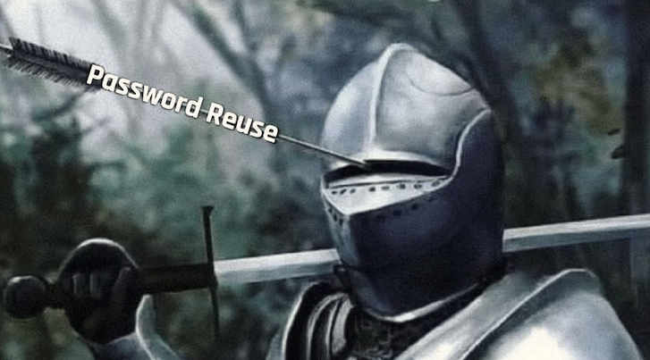
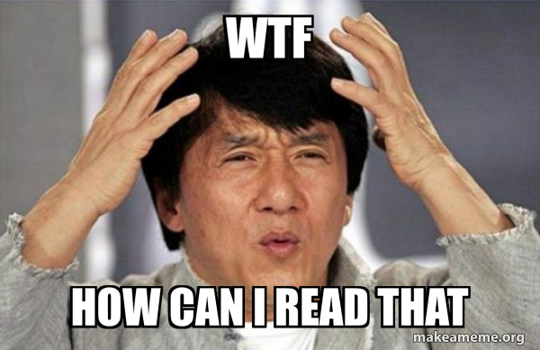
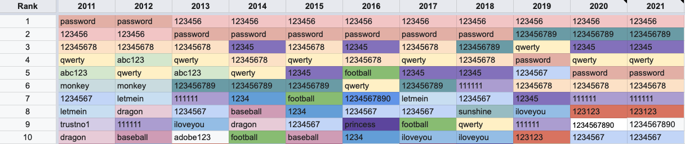

## Password hacking
<hr />

* Why __strong__ passwords?
* How __strong__ should they be?
* What can I as a __user__ do?
* What can I as a __developer__ do?

<!-- .element style="box-shadow:none; position: fixed; width: 500px; bottom: 20px; right: 10px;" -->

-- Notes --

The way we failed at effective passwords is so prevalent, there is an XKCD comic about it.

--

## Why?
<hr />

<!-- .element style="position: fixed; width: 750px; top: 150px; left: 0px;"  -->
<!-- .element style="position: fixed; width: 520px; top: 185px; left: 76px;" class="fragment" data-fragment-index="1" -->

--

## TL;DR
<hr />

# <span style="color: #CC0000;">L</span>ong
# <span style="color: #00CC00;">U</span>nique
# <span style="color: #0000CC;">R</span>andom
# <span style="color: #CC00CC;">P</span>asswords

<!-- .element style="position: fixed; width: 500px; top: 150px; right: 0px;" -->

<span style="font-size: 20px; position: fixed; right: 20px; bottom: 10px;">(*) Not to be confused with L.A.R.P. which is Live Action Role Playing</span>

--

## Hashing TL;DR:
<hr />

See cryptography

<!-- .element style="box-shadow:none; width: 600px; " -->

-- Notes --

* One-way function
* Any size input results in fixed-size digest
* The same input always results in the same output
* Slightly different input results in completely different output
* In practice, different inputs never result in the same output

--

## Login
<hr />

<!-- .element style="box-shadow:none; position: fixed; left: 120px; top: 250px;"  -->
<pre>admin</pre><!-- .element style="box-shadow:none; position: fixed; left: 115px; top: 310px; width: 100px;"  -->
<!-- .element style="box-shadow:none; position: fixed; left: 70px; top: 330px;"  -->
<pre>alice</pre><!-- .element style="box-shadow:none; position: fixed; left: 65px; top: 390px; width: 100px;"  -->
<!-- .element style="box-shadow:none; position: fixed; left: 70px; top: 410px;"  -->
<pre>bob</pre><!-- .element style="box-shadow:none; position: fixed; left: 70px; top: 470px; width: 100px;"  -->
<!-- .element style="box-shadow:none; position: fixed; left: 120px; top: 470px;"  -->
<pre>eve</pre><!-- .element style="box-shadow:none; position: fixed; left: 120px; top: 530px; width: 100px;"  -->
<!-- .element style="box-shadow:none; position: fixed; left: 650px; top: 300px;" -->

<!-- .element style="box-shadow:none; position: fixed; left: 90px; top: 360px;" -->
<pre>qwerty</pre><!-- .element style="box-shadow:none; position: fixed; left: 240px; top: 385px; width: 100px;" -->

<!-- .element style="box-shadow:none; position: fixed; left: 320px; top: 370px;" -->
<pre>8D969...92</pre><!-- .element style="box-shadow:none; position: fixed; left: 420px; top: 390px; width: 100px; height: 100px;" -->

<!-- .element style="box-shadow:none; position: fixed; left: 450px; top: 420px; " -->
<!-- .element style="box-shadow:none; position: fixed; left: 520px; top: 500px;" -->
<!-- .element style="box-shadow:none; position: fixed; left: 620px; top: 440px; -webkit-transform: rotate(180deg);" -->


<pre>admin</pre><!-- .element style="box-shadow:none; position: fixed; left: 695px; top: 405px; width: 100px; height: 100px;" -->
<pre>alice</pre><!-- .element style="box-shadow:none; position: fixed; left: 695px; top: 430px; width: 100px; height: 100px;" -->
<pre>bob</pre><!-- .element style="box-shadow:none; position: fixed; left: 695px; top: 455px; width: 100px; height: 100px;" -->
<pre>eve</pre><!-- .element style="box-shadow:none; position: fixed; left: 695px; top: 480px; width: 100px; height: 100px;" -->

<pre>65E84...C5</pre><!-- .element style="box-shadow:none; position: fixed; left: 750px; top: 405px; width: 100px; height: 100px;" -->
<pre>8D969...92</pre><!-- .element style="box-shadow:none; position: fixed; left: 750px; top: 430px; width: 100px; height: 100px;" -->
<pre>5E884...D8</pre><!-- .element style="box-shadow:none; position: fixed; left: 750px; top: 455px; width: 100px; height: 100px;" -->
<pre>B03DD...42</pre><!-- .element style="box-shadow:none; position: fixed; left: 750px; top: 480px; width: 100px; height: 100px;" -->

--


## Data-leaks
<hr />

<!-- .element style="box-shadow:none; position: fixed; left: 120px; top: 300px;" -->


<pre>admin</pre><!-- .element style="box-shadow:none; position: fixed; left: 165px; top: 405px; width: 100px; height: 100px;" -->
<pre>alice</pre><!-- .element style="box-shadow:none; position: fixed; left: 165px; top: 430px; width: 100px; height: 100px;" -->
<pre>bob</pre><!-- .element style="box-shadow:none; position: fixed; left: 165px; top: 455px; width: 100px; height: 100px;" -->
<pre>eve</pre><!-- .element style="box-shadow:none; position: fixed; left: 165px; top: 480px; width: 100px; height: 100px;" -->

<pre>65E84...C5</pre><!-- .element style="box-shadow:none; position: fixed; left: 220px; top: 405px; width: 100px; height: 100px;" -->
<pre>8D969...92</pre><!-- .element style="box-shadow:none; position: fixed; left: 220px; top: 430px; width: 100px; height: 100px;" -->
<pre>5E884...D8</pre><!-- .element style="box-shadow:none; position: fixed; left: 220px; top: 455px; width: 100px; height: 100px;" -->
<pre>B03DD...42</pre><!-- .element style="box-shadow:none; position: fixed; left: 220px; top: 480px; width: 100px; height: 100px;" -->


<!-- .element style="box-shadow:none; position: fixed; left: 380px; top: 400px;" -->


<!-- .element style="box-shadow:none; position: fixed; left: 550px; top: 350px;" -->
<pre>admin</pre><!-- .element style="box-shadow:none; position: fixed; left: 560px; top: 384px; width: 100px; height: 100px;" -->
<pre>alice</pre><!-- .element style="box-shadow:none; position: fixed; left: 560px; top: 415px; width: 100px; height: 100px;" -->
<pre>bob</pre><!-- .element style="box-shadow:none; position: fixed; left: 560px; top: 446px; width: 100px; height: 100px;" -->
<pre>eve</pre><!-- .element style="box-shadow:none; position: fixed; left: 560px; top: 477px; width: 100px; height: 100px;" -->
<pre>65E84...C5</pre><!-- .element style="box-shadow:none; position: fixed; left: 615px; top: 384px; width: 100px; height: 100px;" -->
<pre>8D969...92</pre><!-- .element style="box-shadow:none; position: fixed; left: 615px; top: 415px; width: 100px; height: 100px;" -->
<pre>5E884...D8</pre><!-- .element style="box-shadow:none; position: fixed; left: 615px; top: 446px; width: 100px; height: 100px;" -->
<pre>B03DD...42</pre><!-- .element style="box-shadow:none; position: fixed; left: 615px; top: 477px; width: 100px; height: 100px;" -->

<!-- .element style="box-shadow:none; position: fixed; left: 250px; top: 110px; width: 350px; " class="fragment" data-fragment-index="3" -->

-- Notes --

How can I extract all user-data using SQLi?
```Union select```
(or tools like SQLmap)

--

## Offline Attacks
<hr />

### Hashcat

<!-- .element style="box-shadow:none; position: fixed; left: 20px; top: 250px; width: 300px;" -->

<!-- .element style="box-shadow:none; position: fixed; right: 20px; top: 250px; width: 400px;" -->

-- Notes --

* Left: homemade for $5000,-
  * MD5: 76526.9 MH/s
  * NetNTLM v1: 67492.1 MH/s
  * NetNTLM v2: 4943.9 MH/s

* Right: Professional machine for $21200 - $25000,-
  * MD5: 307.2 GH/s
  * NetNTLM v1: 272.4 GH/s
  * NetNTLM v2: 21336.5 MH/s

--

## Offline Brute-force
<hr />

<!-- .element style="box-shadow:none; position: fixed; right: 0px; top: 250px; width: 300px;" -->
<span style="font-size: 16px; position: fixed; right: 20px; bottom: 10px;">$ 5000,- hashcat machine: [Netmux.com](https://www.netmux.com/blog/how-to-build-a-password-cracking-rig) (jan-2018)<span>

<pre>
{all possible combinations}
aaaaaaaa
aaaaaaab
...
aaaaaaba
aaaaaabb
...
aaaaaaaA
aaaaaaaB
...
</pre><!-- .element style="box-shadow:none; position: fixed; left: 30px; top: 230px; width: 100px; font-size: 10px;" -->

<!-- .element style="box-shadow:none; position: fixed; left: 120px; top: 260px; width: 90px;" -->
<!-- .element style="box-shadow:none; position: fixed; left: 220px; top: 230px; width: 400px;" -->

<pre>8x alphanumeric</pre><!-- .element style="box-shadow:none; position: fixed; left: 225px; top: 259px; width: 100px; height: 100px; font-size: 10px;" -->
<pre>Ulllll99</pre><!-- .element style="box-shadow:none; position: fixed; left: 225px; top: 282px; width: 100px; height: 100px; font-size: 10px;" -->
<pre>Pwned Passwords</pre><!-- .element style="box-shadow:none; position: fixed; left: 225px; top: 306px; width: 100px; height: 100px; font-size: 10px;" -->
<pre>14x alphanumeric</pre><!-- .element style="box-shadow:none; position: fixed; left: 225px; top: 332px; width: 100px; height: 100px; font-size: 10px;" -->

<!-- 8x alphanumeric -->
<pre>47 min.</pre><!-- .element style="box-shadow:none; position: fixed; left: 327px; top: 259px; width: 100px; height: 100px; font-size: 10px;"  -->
<pre>2 hours</pre><!-- .element style="box-shadow:none; position: fixed; left: 400px; top: 259px; width: 100px; height: 100px; font-size: 10px;"  -->
<pre>6 hours</pre><!-- .element style="box-shadow:none; position: fixed; left: 480px; top: 259px; width: 100px; height: 100px; font-size: 10px;"  -->
<pre>18 hours</pre><!-- .element style="box-shadow:none; position: fixed; left: 550px; top: 259px; width: 100px; height: 100px; font-size: 10px;"  -->

<!-- Ulllll99 -->
<pre>0 seconds</pre><!-- .element style="box-shadow:none; position: fixed; left: 327px; top: 282px; width: 100px; height: 100px; font-size: 10px;" -->
<pre>1 seconds</pre><!-- .element style="box-shadow:none; position: fixed; left: 400px; top: 282px; width: 100px; height: 100px; font-size: 10px;" -->
<pre>3 seconds</pre><!-- .element style="box-shadow:none; position: fixed; left: 480px; top: 282px; width: 100px; height: 100px; font-size: 10px;" -->
<pre>9 seconds</pre><!-- .element style="box-shadow:none; position: fixed; left: 550px; top: 282px; width: 100px; height: 100px; font-size: 10px;" -->

<!-- Pwned Password dictionary -->
<pre>0 seconds</pre><!-- .element style="box-shadow:none; position: fixed; left: 327px; top: 306px; width: 100px; height: 100px; font-size: 10px;" -->
<pre>0 seconds</pre><!-- .element style="box-shadow:none; position: fixed; left: 400px; top: 306px; width: 100px; height: 100px; font-size: 10px;" -->
<pre>0 seconds</pre><!-- .element style="box-shadow:none; position: fixed; left: 480px; top: 306px; width: 100px; height: 100px; font-size: 10px;" -->
<pre>0 seconds</pre><!-- .element style="box-shadow:none; position: fixed; left: 550px; top: 306px; width: 100px; height: 100px; font-size: 10px;" -->

<!-- 14x alphanumeric -->
<pre>5138 mil.</pre><!-- .element style="box-shadow:none; position: fixed; left: 327px; top: 332px; width: 100px; height: 100px; font-size: 10px;"  -->
<pre>15146 mill.</pre><!-- .element style="box-shadow:none; position: fixed; left: 400px; top: 332px; width: 100px; height: 100px; font-size: 10px;"  -->
<pre>41871 mill.</pre><!-- .element style="box-shadow:none; position: fixed; left: 480px; top: 332px; width: 100px; height: 100px; font-size: 10px;"  -->
<pre>121563 mill.</pre><!-- .element style="box-shadow:none; position: fixed; left: 550px; top: 332px; width: 100px; height: 100px; font-size: 10px;"  -->

--

## Defence: Brute-force
<hr />

<!-- .element style="box-shadow:none;" -->

-- Notes --

This is not how brute-force defence works

--

## Common passwords
<hr />

<!-- .element style="box-shadow:none; "  -->

Up to 2016 (*):
* 10% == top 25
* 4% == 123456

<span style="font-size: 16px; position: fixed; left: 20px; bottom: 10px;">(*) of all passwords observed</span>

-- Notes --

This was started after the RockYou breach in 2009 of plain-text passwords got leaked. That leak was caused by SQL-injection. Listen to Darknet Diaries Ep. 33
Source: [WikiPedia](https://en.wikipedia.org/wiki/List_of_the_most_common_passwords) 

--

## Common passwords
<hr />

<!-- .element style="box-shadow:none; "  -->


-- Notes --

* Top 1-25 gets 25 to 1 point
* Total score for each password over years
* Top X:
  * 123456: 223
  * password: 216
  * 12345678: 201
  * qwerty: 190
  * 1234567: 158
  * abc123: 138
  * 12345: 134
  * 123456789: 127
  * 111111: 110
  * iloveyou: 95
  * monkey: 92
  * football: 90
  * letmein: 88
  * dragon: 79
  * welcome
  * 123123

--

<!-- .element style="box-shadow:none; position: fixed; left: 220px; top: 90px;"  -->

--

## Defence: Brute-force attack
<hr />

# <span style="color: #CC0000;">L</span>ong
# <span style="color: #00CC00;">U</span>nique
# <span style="color: #0000CC;">R</span>andom
# <span style="color: #CC00CC;">P</span>asswords

<span style="font-size: 16px;">20-30 chars or 4-5 words is sufficient<span><br>
<span style="font-size: 16px;">Any pattern weakens the password<span>
<!-- .element style="box-shadow:none; position: fixed; right: 10px; top: 160px; width: 190px;" class="fragment" data-fragment-index="0" -->
<!-- .element style="box-shadow:none; position: fixed; right: 40px; top: 260px; width: 190px;" class="fragment" data-fragment-index="0" -->
<!-- .element style="box-shadow:none; position: fixed; right: 60px; top: 360px; width: 190px;" class="fragment" data-fragment-index="0" -->
<!-- .element style="box-shadow:none; position: fixed; right: 10px; top: 460px; width: 190px;" class="fragment" data-fragment-index="0" -->
<!-- .element style="box-shadow:none; position: fixed; right: 370px; top: 560px; width: 190px;" class="fragment" data-fragment-index="0" -->
<!-- .element style="box-shadow:none; position: fixed; right: 190px; top: 490px; width: 190px;" class="fragment" data-fragment-index="0" -->
<!-- .element style="box-shadow:none; position: fixed; right: 270px; top: 100px; width: 190px;" class="fragment" data-fragment-index="0" -->
<!-- .element style="box-shadow:none; position: fixed; right: 240px; top: 200px; width: 190px;" class="fragment" data-fragment-index="0" -->
<!-- .element style="box-shadow:none; position: fixed; right: 470px; top: 160px; width: 190px;" class="fragment" data-fragment-index="0" -->
<!-- .element style="box-shadow:none; position: fixed; right: 280px; top: 370px; width: 190px;" class="fragment" data-fragment-index="0" -->
<!-- .element style="box-shadow:none; position: fixed; right: 370px; top: 280px; width: 190px;" class="fragment" data-fragment-index="0" -->

--

## Deep dive
<hr />

* [Darknet Diaries](https://darknetdiaries.com/)
  * 33: [RockYou](https://darknetdiaries.com/episode/33/)
  * 45: [Xbox Underground p1](https://darknetdiaries.com/episode/45/)
  * 112: [Dirty Comms](https://darknetdiaries.com/episode/112/) -> SIM Swapping at 34 minutes

<!-- .element style="position: fixed; top: 300px; right: 50px; width: 250px; background:none; border:none; box-shadow:none; " -->


