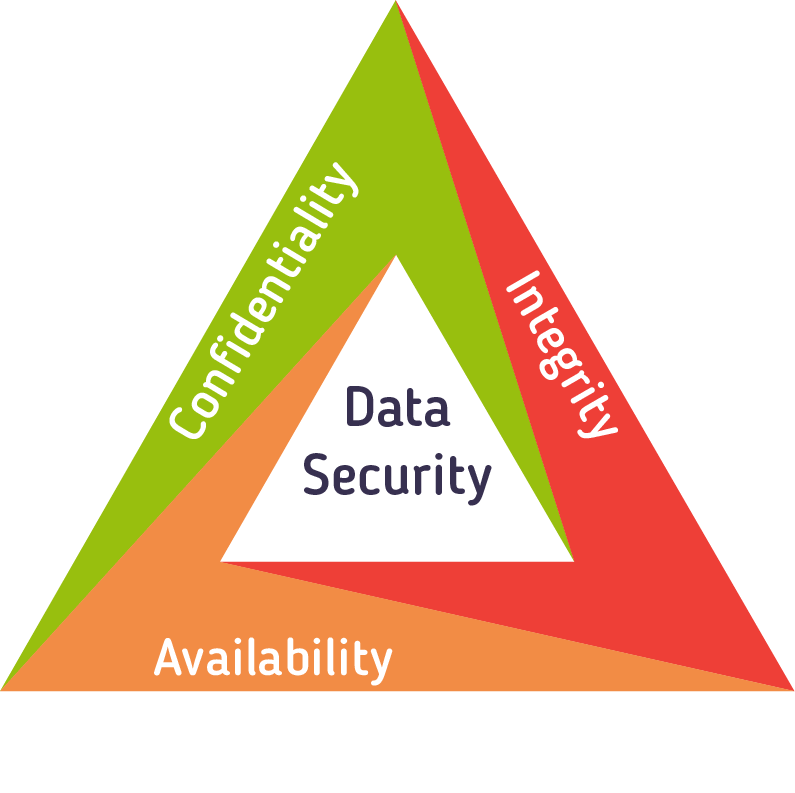
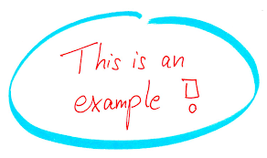
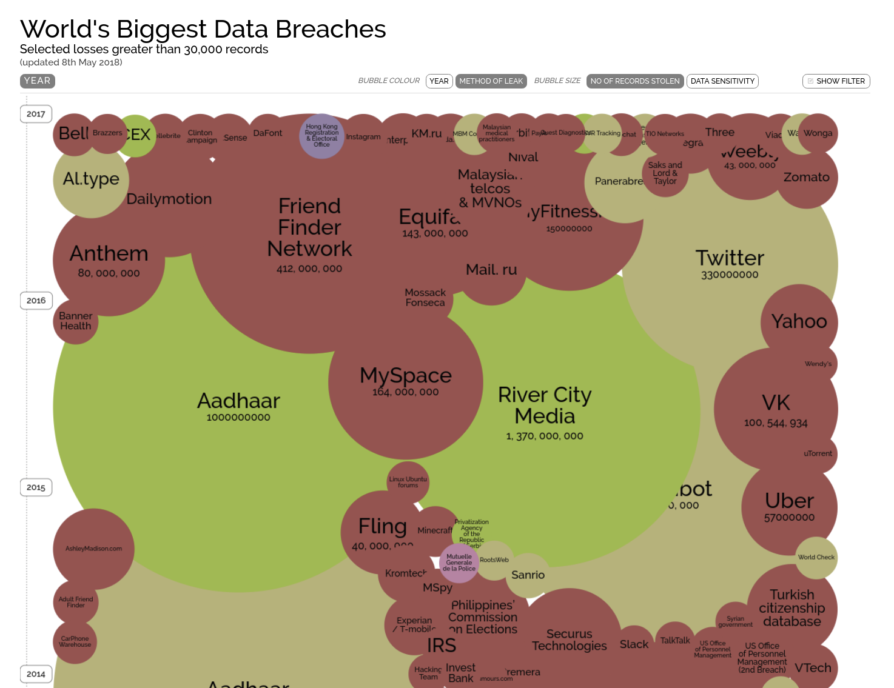
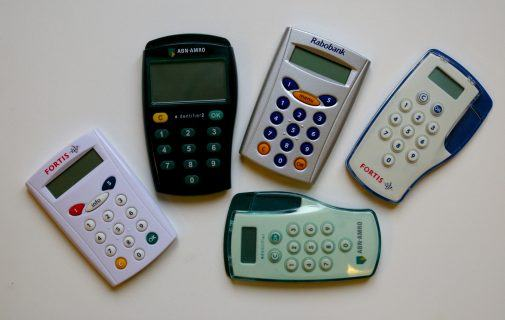
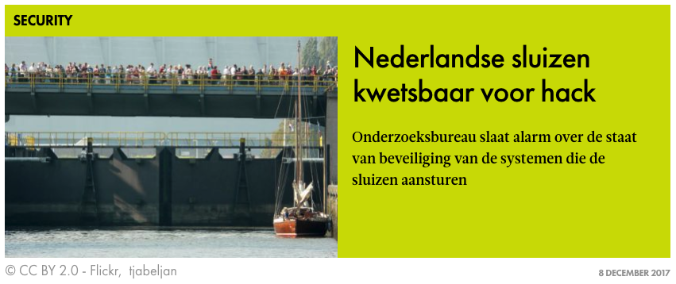
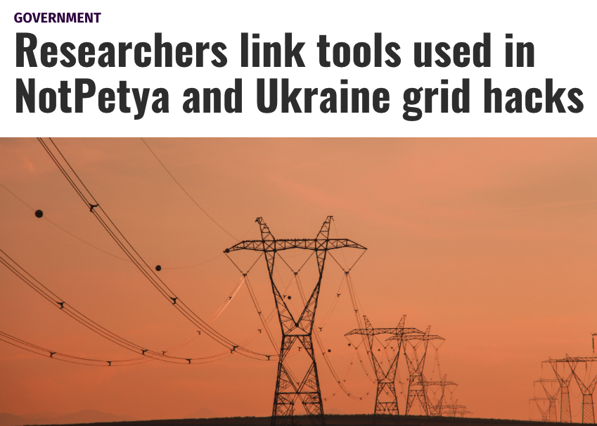

## Security Principles
<hr />

### CIA - Pillars of Security

<!-- .element style="box-shadow:none; position: fixed; top: 160px; right: 200px; width: 575px;"  -->

-- Notes --


--

## Security Principles
<hr />

### CIA - Example format
* Internet banking
* ```SQL```

<!-- .element style="position: fixed; top: 160px; right: 140px; width: 275px; " -->
<!-- .element style="position: fixed; bottom: 100px; right: 20px; width: 225px;" -->
<!-- .element style="position: fixed; top: 350px; right: 280px; width: 250px;" -->

--

## Security Principles
<hr />

### CIA - Confidentiality
*Attackers read my bank-transactions*<!-- .element: class="fragment" data-fragment-index="0" -->

```mysqldump -all-databases > dump.sql```<!-- .element: class="fragment" data-fragment-index="0" -->

<!-- .element style="position: fixed; top: 160px; right: 40px; width: 275px; " class="fragment" data-fragment-index="0" -->

<!-- .element style="position: fixed; bottom: 30px; right: 20px; width: 250px;" class="fragment" data-fragment-index="1" -->
<!-- .element style="position: fixed; top: 450px; left: 40px; width: 275px;" class="fragment" data-fragment-index="1" -->
<!-- .element style="position: fixed; top: 380px; right: 290px; width: 325px;" class="fragment" data-fragment-index="1"  -->

--

## Security Principles
<hr />

### CIA - Integrity
*Attackers empty my bank-account*<!-- .element: class="fragment" data-fragment-index="0" -->

```update accounts set balance = 0;```<!-- .element: class="fragment" data-fragment-index="0" -->

<!-- .element style="position: fixed; top: 160px; right: 120px; width: 275px;" class="fragment" data-fragment-index="0" -->

<!-- .element style="position: fixed; bottom: 10px; right: 220px; width: 375px;" class="fragment" data-fragment-index="1" -->
<!-- .element style="position: fixed; bottom: 180px; right: 0px; width: 375px;" class="fragment" data-fragment-index="1" -->
<!-- .element style="position: fixed; bottom: 170px; left: 150px; width: 375px;" class="fragment" data-fragment-index="1" -->
<!-- .element style="position: fixed; top: 390px; left: -20px; width: 275px;" class="fragment" data-fragment-index="1" -->

--

## Security Principles
<hr />

### CIA - Availability
*Internet-banking is down*<!-- .element: class="fragment" data-fragment-index="0" -->

```SQL drop database the_bank```<!-- .element: class="fragment" data-fragment-index="0" -->

<!-- .element style="position: fixed; bottom: 50px; right: 220px; width: 275px;" class="fragment" data-fragment-index="1" -->
<!-- .element style="position: fixed; top: 140px; right: 90px; width: 275px;" class="fragment" data-fragment-index="1" -->
<!-- .element style="position: fixed; bottom: 70px; left: 10px; width: 375px;" class="fragment" data-fragment-index="1" -->

--

## Security Principles
<hr />

### Extended CIA

<!-- .element style="box-shadow:none; position: fixed; top: 160px; right: 200px; width: 575px; z-index: -100;"  -->


-- Notes --

There is debate on extending CIA, with multiple options, including this diagram.


--

## Security Principles
<hr />

* **S** poofing
* **T**ampering
* **R** epudiation
* **I** nformation disclosure
* **D** enial of Service
* **E** levation of privilege

-- Notes --

* **S** poofing (I): IP / [Caller-ID](https://youtu.be/FO0iG_P0P6M?t=345) / Mail-address / [GPS](https://www.scmagazine.com/home/pokemon-go-cheaters-may-inadvertently-learn-gps-spoofing/)
* **T**ampering (I): Ransomware / Data / Log-file / Cookie / [URL Query string](https://nos.nl/artikel/273011-alle-begrotingsstukken-openbaar.html)
* **R** epudiation (I)
* **I** nformation disclosure (C): Data-breaches: [Information is awesome](https://informationisbeautiful.net/visualizations/worlds-biggest-data-breaches-hacks/) / [HIBP](https://haveibeenpwned.com)
* **D** enial of Service (A): [DDoS-er caught](https://tweakers.net/reviews/6031/een-ddoser-betrapt-hoe-de-aanvaller-tegen-de-lamp-liep.html) (Dutch)
* **E** levation of privilege (C / I): iPhone Jailbreaking / Account takeover / iCloud-hacking

--

## Security Principles
<hr />

* **D** amage
* **R** eproducibility
* **E** xploitability
* **A** ffected users
* **D** iscoverability

-- Notes --

* **D** amage – how bad would an attack be?
* **R** eproducibility – how easy is it to reproduce the attack?
* **E** xploitability – how much work is it to launch the attack?
* **A** ffected users – how many people will be impacted?
* **D** iscoverability – how easy is it to discover the threat?

--

## Security Principles
<hr />

### Pyramid of Pain

<!-- .element style="box-shadow:none; position: fixed; top: 260px; right: 200px; width: 575px; z-index: -100;"  -->


<span>Detection</span><!-- .element style="font-size: 16px; box-shadow:none; position: fixed; top: 230px; left: 340px; z-index: -100;"  -->
<span>Workaround</span><!-- .element style="font-size: 16px; box-shadow:none; position: fixed; top: 230px; right: 240px; z-index: -100;"  -->
<span>Sophistication</span><!-- .element style="font-size: 16px; box-shadow:none; position: fixed; top: 230px; left: 50px; z-index: -100;"  -->
<!-- .element style="box-shadow:none; position: fixed; bottom: 300px; left: 130px; width: 100px; background-color: #ffffff;" class="fragment" data-fragment-index="3" -->
<!-- .element style="box-shadow:none; position: fixed; bottom: 180px; left: 70px; width: 100px; background-color: #ffffff;" class="fragment" data-fragment-index="2" -->
<!-- .element style="box-shadow:none; position: fixed; bottom: 70px; left: 0px; width: 100px; background-color: #ffffff;" class="fragment" data-fragment-index="1" -->


-- Notes --

* Pyramid of Pain contains indicators to detect attacks / attackers on different levels.
* Workarounds for blocking the attacks become harder higher up in the pyramid, indicated by the pain-level. Eg:
  * Hash values of malicious files are trivial to change, so not effective / no pain
  * Changing tools or techniques / procedures are very hard, so detecting and blocking those is very effective

In the pyramid:
* Low level attackers are script kiddies: these poke for fun at what is poke-able
* Mid-level are criminal hackers, financial gain: if there is a more attractive target (in difficulty or potential gains), they will switch targets
* High-level are APT's, with emphasis on P for Persistent. These choose very specific target with clear goals. They don't give up.
