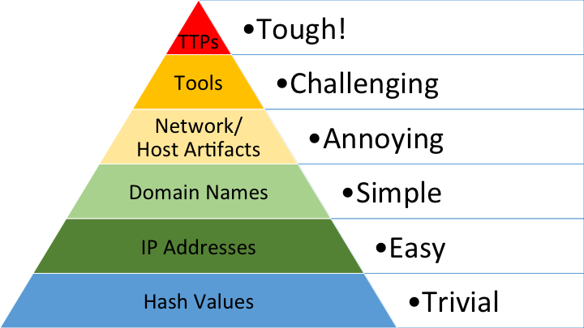

## Security Principles

### CIA - Pillars of Security

<!-- .element style="box-shadow:none; position: fixed; top: 160px; right: 200px; width: 575px;"  -->

-- Notes --

--

## Security Principles

### CIA - Confidentiality
*Hackers can read my bank-transactions*<!-- .element: class="fragment" data-fragment-index="0" -->
* Data leaks<!-- .element: class="fragment" data-fragment-index="1" -->
* Web-cam hacks<!-- .element: class="fragment" data-fragment-index="1" -->
* Bad config<!-- .element: class="fragment" data-fragment-index="1" -->
* SQL-injection (dump)<!-- .element: class="fragment" data-fragment-index="1" -->

<!-- .element style="position: fixed; top: 160px; right: 140px; width: 275px; " class="fragment" data-fragment-index="0" -->

<!-- .element style="position: fixed; bottom: 100px; right: 20px; width: 225px;" class="fragment" data-fragment-index="1" -->
<!-- .element style="position: fixed; top: 450px; left: 40px; width: 275px;" class="fragment" data-fragment-index="1" -->
<!-- .element style="position: fixed; top: 380px; right: 260px; width: 325px;" class="fragment" data-fragment-index="1"  -->

--

## Security Principles

### CIA - Integrity
*Hackers can empty my bank-account*<!-- .element: class="fragment" data-fragment-index="0" -->
* Account takeover<!-- .element: class="fragment" data-fragment-index="1" -->
* Car-hacking<!-- .element: class="fragment" data-fragment-index="1" -->
* SQL injection insert / update<!-- .element: class="fragment" data-fragment-index="1" -->

<!-- .element style="position: fixed; top: 160px; right: 280px; width: 275px;" class="fragment" data-fragment-index="0" -->

<!-- .element style="position: fixed; top: 280px; right: 20px; width: 375px;" class="fragment" data-fragment-index="1" -->
<!-- .element style="position: fixed; top: 140px; right: 190px; width: 375px;" class="fragment" data-fragment-index="1" -->
<!-- .element style="position: fixed; top: 370px; left: 10px; width: 375px;" class="fragment" data-fragment-index="1" -->
<!-- .element style="position: fixed; top: 390px; left: 320px; width: 275px;" class="fragment" data-fragment-index="1" -->

--

## Security Principles

### CIA - Availability
*Internet-banking is down*<!-- .element: class="fragment" data-fragment-index="0" -->
* (D)DOS<!-- .element: class="fragment" data-fragment-index="1" -->
* Ransomware<!-- .element: class="fragment" data-fragment-index="1" -->
* SQL-injection drop table<!-- .element: class="fragment" data-fragment-index="1" -->

<!-- .element style="position: fixed; top: 350px; right: 220px; width: 275px;" class="fragment" data-fragment-index="1" -->
<!-- .element style="position: fixed; top: 140px; right: 90px; width: 275px;" class="fragment" data-fragment-index="1" -->
<!-- .element style="position: fixed; bottom: 70px; left: 10px; width: 375px;" class="fragment" data-fragment-index="1" -->

--

## Security Principles

### Extended CIA

<!-- .element style="box-shadow:none; position: fixed; top: 160px; right: 200px; width: 575px; z-index: -100;"  -->

-- Notes --

There is debate on extending CIA, with multiple options, including this diagram.

--

## Security Principles

* **S** poofing (I): IP / [Caller-ID](https://youtu.be/FO0iG_P0P6M?t=345) / Mail-address / [GPS](https://www.scmagazine.com/home/pokemon-go-cheaters-may-inadvertently-learn-gps-spoofing/)
* **T**ampering (I): Ransomware / Data / Log-file / Cookie / [URL Query string](https://nos.nl/artikel/273011-alle-begrotingsstukken-openbaar.html)
* **R** epudiation (I)
* **I** nformation disclosure (C): Data-breaches: [Information is awesome](https://informationisbeautiful.net/visualizations/worlds-biggest-data-breaches-hacks/) / [HIBP](https://haveibeenpwned.com)
* **D** enial of Service (A): [DDoS-er caught](https://tweakers.net/reviews/6031/een-ddoser-betrapt-hoe-de-aanvaller-tegen-de-lamp-liep.html) (Dutch)
* **E** levation of privilege (C / I): iPhone Jailbreaking / Account takeover / iCloud-hacking

--

## Security Principles

### Pyramid of Pain

<!-- .element style="box-shadow:none; position: fixed; top: 260px; right: 200px; width: 575px; z-index: -100;"  -->

Detection<!-- .element style="font-size: 16px; box-shadow:none; position: fixed; bottom: 60px; left: 340px; z-index: -100;"  -->
Attacker<!-- .element style="font-size: 16px; box-shadow:none; position: fixed; top: 210px; left: 340px; z-index: -100;"  -->
Workaround<!-- .element style="font-size: 16px; box-shadow:none; position: fixed; top: 230px; right: 240px; z-index: -100;"  -->
Sophistication<!-- .element style="font-size: 16px; box-shadow:none; position: fixed; top: 230px; left: 50px; z-index: -100;"  -->
<!-- .element style="box-shadow:none; position: fixed; top: 250px; left: 130px; width: 100px; background-color: #ffffff;" -->
<!-- .element style="box-shadow:none; position: fixed; top: 350px; left: 100px; width: 100px; background-color: #ffffff;" -->
<!-- .element style="box-shadow:none; position: fixed; top: 450px; left: 70px; width: 100px; background-color: #ffffff;" -->

-- Notes --

* Pyramid of Pain shows indicators on different levels to detect attacks / attackers.
* Blocking the attacks based on these indicators is easily circumvented or very hard to do, indicated by the pain-level. Eg:
  * Hash values of malicious files are trivial to change, so not effective / no pain

