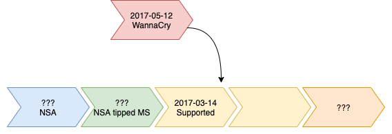

# Software updates

## Bugfree programming

<!-- .element style="box-shadow:none; position: fixed; width: 500px; top: 270px; left: 250px;" -->

-- Notes --

Why do we have updates?
* Because there is no such thing as bug-free software

--

# Software updates

## Bugs

<!-- .element style="box-shadow:none; position: fixed; bottom: 150px; left: 220px; width: 575px;" -->

<!-- .element style="box-shadow:none; position: fixed; bottom: 250px; left: 350px; width: 275px;" class="fragment" data-fragment-index="1" -->

-- Notes --

Timeline:
* Discovery: Vulnerability is found
* Awareness: Producer knows about vulnerability (end of zero day)
* Patch: Producer develops and releases patch
  * Researchers and attackers can reverse the patch to learn details
  * In cycle (normal release schedule, sys admins are prepared)
  * Out-of-cycle (outside release schedule, sys admins are unprepared, often only when actively exploited)
* Patch is installed
* Exploit: Attack scenario developed (optional, somewhere during the lifecycle):
  * Bug is weaponized: bug is exploited to run payload
  * Proof of Concept (white hat, non-damaging)
  * Exploit (black hat)
    * If it's before Awareness date, it's called a Zero day
    * number of days producer knows about vulnerability

--

## Examples

### Equifax

* Apache Struts 
* CVE-2017-5638
* CVSS 10.0

<!-- .element style="box-shadow:none; position: fixed; bottom: 150px; left: 220px; width: 425px;" class="fragment fade-in-then-out" data-fragment-index="0" -->
<!-- .element style="box-shadow:none; position: fixed; bottom: 150px; left: 220px; width: 425px;" class="fragment fade-in-then-out" data-fragment-index="1" -->
<!-- .element style="box-shadow:none; position: fixed; bottom: 150px; left: 220px; width: 683px;" class="fragment fade-in-then-out" data-fragment-index="2" -->

-- Notes --

Conext: Equifax is a big creditcard company that handles creditcard and lots of payment data

* CVE-2017-5638 (CVSS 10.0)
  * Discovered 2017-03-06
* Apache Struts 2.3.5 to 2.3.31 / 2.5 - 2.5.10
  * Alerted on 2017-03-08 by US-CERT
* Patch Apache Struts 2.3.32 / 2.5.10.1
  * Release on 2017-03-06
* Class-action law-suit filed for $70B (that's 70 + 9 zero's) on 2017-09-17
  * Settlement for $575M on 2019-07-22 after many protective measures for Equifax by Trump appointed officials

Sources:
* [Wikipedia](https://en.wikipedia.org/wiki/2017_Equifax_data_breach)

--

## Examples

### EternalBlue

* Windows (all)
* CVE-2017-0144
* CVSS 8.1

<!-- .element style="box-shadow:none; position: fixed; bottom: 325px; left: 250px; width: 575px;" class="fragment fade-in-then-out" data-fragment-index="0" -->
<!-- .element style="box-shadow:none; position: fixed; bottom: 325px; left: 250px; width: 575px;" class="fragment fade-in-then-out" data-fragment-index="1" -->
<!-- .element style="box-shadow:none; position: fixed; bottom: 325px; left: 250px; width: 575px;" class="fragment fade-in-then-out" data-fragment-index="2" -->
<!-- .element style="box-shadow:none; position: fixed; bottom: 325px; left: 250px; width: 575px;" class="fragment fade-in-then-out" data-fragment-index="3" -->
<!-- .element style="box-shadow:none; position: fixed; bottom: 325px; left: 250px; width: 575px;" class="fragment fade-in-then-out" data-fragment-index="4" -->
<!-- .element style="box-shadow:none; position: fixed; bottom: 325px; left: 250px; width: 575px;" class="fragment fade-in-then-out" data-fragment-index="5" -->
<!-- .element style="box-shadow:none; position: fixed; bottom: 325px; left: 250px; width: 575px;" class="fragment fade-in-then-out" data-fragment-index="6" -->
<!-- .element style="box-shadow:none; position: fixed; bottom: 231px; left: 250px; width: 575px;" class="fragment fade-in-then-out" data-fragment-index="7" -->
<!-- .element style="box-shadow:none; position: fixed; bottom: 160.5px; left: 250px; width: 575px;" class="fragment fade-in-then-out" data-fragment-index="8" -->
<!-- .element style="box-shadow:none; position: fixed; bottom: 90px; left: 250px; width: 575px;" class="fragment" data-fragment-index="9" -->

-- Notes --

* Discovery: by NSA in ???
* Exploit: Eternal Blue (by NSA in ???)
* Awareness: NSA tipped Microsoft in ???
  * probably because NSA found out their hacking tools were stolen
    * by Shadow brokers / Vault 7
  * CVE-2017-0144 (CVSS 8.1)
  * Everything using SMBv1 (deprecated in 2013) including:
    * Siemens Ultrasound Medical Equipment
    * SMB: Server Message Block File sharing protocol
* Patch 2017-03-14 (supported Windows)
* Exploit worldwide release 2017-04-14 (Shadow Brokers)
* Attack 2017-05-12 (WannaCry)
* Patch 2017-05-13 (unsupported Windows)
* Attack 2017-06-27 (NotPetya)
* Installed....
  * 2018-12: Millions unpatched
  * 2019-07-17: [800k](https://www.darkreading.com/vulnerabilities---threats/800k-systems-still-vulnerable-to-bluekeep/d/d-id/1335286) unpatched
  * 2020-04-03: [600k](https://www.darkreading.com/vulnerabilities---threats/eternalblue-longevity-underscores-patching-problem/d/d-id/1337233) unpatched
  * 2020-05-12: [Millions](https://www.welivesecurity.com/2020/05/12/wannacryptor-remains-global-threat-three-years-on/) still use SMBv1

--

## FireEye Hack

* Breach at Mandiant (then called FireEye)
* Made public Dec-08, 2020
* Top player in InfoSec
* Red Team Tools stolen
* APT level attack
* No Zero-days
* Released detection-tools for their own Red Team Tools

<!-- .element style="box-shadow:none; position: fixed; bottom: 30px; right: 50px; width: 375px;" -->