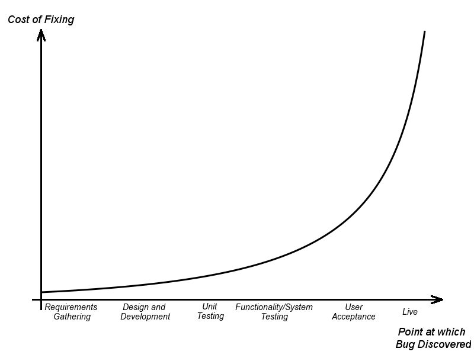
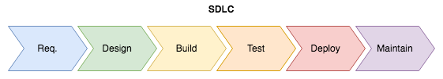
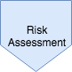
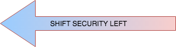
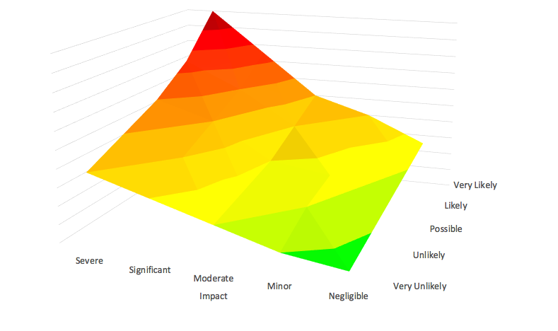
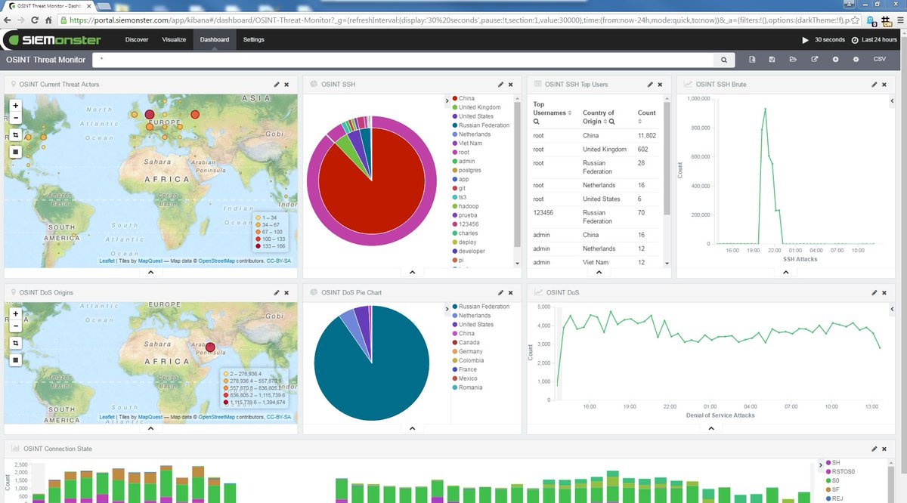

## Secure Software Development
<hr />


--

## Project Trilemma
<hr />

<!-- .element style="box-shadow:none; position: middle; width: 500px;" -->

Pick any 2

-- Notes --

You can control any 2 elements, team / developers control the 3rd:
* functionality for cheap, takes time
* functionality quickly, expensive
* cheap and quickly, not fully functional

--

## Project Trilemma: Test
<hr />

Please:
* Stand if you struggle with Project Trilemma
* Have a seat if you DON'T have clear requirements<!-- .element class="fragment" data-fragment-index="0" -->
* Have a seat if you DO have clear security requirements<!-- .element class="fragment" data-fragment-index="1" -->
* Everyone still standing should have:<!-- .element class="fragment" data-fragment-index="2" -->
  * Clear requirements<!-- .element class="fragment" data-fragment-index="2" -->
  * But no security requirements<!-- .element class="fragment" data-fragment-index="2" -->
  * Struggles with Project Trilemma<!-- .element class="fragment" data-fragment-index="2" -->

Perfect solution for you<!-- .element class="fragment" data-fragment-index="3" -->

--

## Project Trilemma: Solution
<hr />

* Functional
* Fast
* Cheap
* Great UX (for dba-ers)<!-- .element class="fragment" data-fragment-index="0" -->
* Sacrifice some security<!-- .element class="fragment" data-fragment-index="0" -->
  * But that wasn't required<!-- .element class="fragment" data-fragment-index="0" -->

<!-- .element style="box-shadow:none; position: fixed; right: 15px; top: 50px;" class="fragment" data-fragment-index="0" -->

-- Notes --

Web-app that simply performs database-queries.
You can do everything, including:
* create account (insert into users)
* reset passwords (update user)
* add orders (insert into orders)
* etc.

--

## Development class 101
<hr />

```php
<?php
  echo 'Hello, World!';
?>
```

--

## Development class 102
<hr />

```php
<?php
  echo 'Hello ' . $_GET["name"] . '!'; 
?>
```

--

## Secure Software Development class 101
<hr />

### XSS 101

<pre><code>example.com/?name=Bram</code></pre>

<pre class="fragment"><code>example.com/?name=<script>alert('XSS triggered')</script></code></pre>

--

## Secure Software Development class 102
<hr />

### XSS Defense

```php
<?php
  echo 'Hello ' . htmlspecialchars($_GET["name"]) . '!';
?>
```

--

## Secure Software Development
<hr />

### Fixing bugs

<!-- .element style="z-index: -100; box-shadow:none; position: fixed; left: 40px; top: 160px; width: 650px;" -->

Cost increases 30-100x<!-- .element style="z-index: -100; box-shadow:none; position: fixed; bottom: 20px; " -->

-- Notes --

Early discovery leads to lower impact and cost to fix
Late discovery increases cost exponentially

--

## Conventional Security effort
<hr />

<!-- .element style="z-index: -100; box-shadow:none; position: fixed; left: 40px; top: 130px; width: 750px;" class="fragment" data-fragment-index="0" -->
<!-- .element style="box-shadow:none; position: fixed; left: 100px; top: 400px; width: 800px; " -->
<!-- .element style="box-shadow:none; position: fixed; left: 570px; top: 320px;" class="fragment" data-fragment-index="1" -->

-- Notes --

Conventional Security:
* Add pentesting
* Late discovery
* Increased impact & cost
* Lots of low-hanging fruit
* Less time to find hard-to-find security bugs

--

## Conventional Security effort
<hr />

<!-- .element style="box-shadow:none; position: fixed; left: 200px; top: 100px; width: 600px;" -->

-- Notes --
Feels a bit like this

--

## Secure Software Development
<hr />

<!-- .element style="z-index: -100; box-shadow:none; position: fixed; left: 40px; top: 130px; width: 750px;" -->

<!-- .element style="box-shadow:none; position: fixed; left: 100px; top: 400px; width: 800px; " -->

<!-- .element style="box-shadow:none; position: fixed; left: 130px; top: 320px;" class="fragment" data-fragment-index="0" -->
<!-- .element style="box-shadow:none; position: fixed; left: 240px; top: 320px;" class="fragment" data-fragment-index="0" -->
<!-- .element style="box-shadow:none; position: fixed; left: 350px; top: 320px;" class="fragment" data-fragment-index="0" -->
<!-- .element style="box-shadow:none; position: fixed; left: 460px; top: 320px;" class="fragment" data-fragment-index="0" -->
<!-- .element style="box-shadow:none; position: fixed; left: 570px; top: 320px;"  -->
<!-- .element style="box-shadow:none; position: fixed; left: 680px; top: 320px;" class="fragment" data-fragment-index="0" -->
<!-- .element style="box-shadow:none; position: fixed; left: 780px; top: 320px;" class="fragment" data-fragment-index="0" -->

<!-- .element style="box-shadow:none; position: fixed; left: 300px; top: 220px;" class="fragment" data-fragment-index="3" -->


--

## Secure Software Development
<hr />

<!-- .element style="box-shadow:none; position: fixed; right: 40px; top: 10px; width: 120px;" -->


Source: [Security reality](https://xkcd.com/538/)

--

## Secure Software Development
<hr />

<!-- .element style="box-shadow:none; position: fixed; right: 40px; top: 10px; width: 120px;" -->
<!-- .element style="box-shadow:none; position: fixed; right: 0px; top: 210px; width: 620px; z-index: -1;" -->

* Risk = Impact X Probability
* Risk Assessment
* CIA Ratings
* Quality Gates
* Security Specifications
* Security Requirements

--

## Secure Software Development
<hr />

<!-- .element style="box-shadow:none; position: fixed; right: 40px; top: 10px; width: 120px;" -->

### Tools

* OWASP [ASVS](https://www.owasp.org/index.php/Category:OWASP_Application_Security_Verification_Standard_Project)
* OWASP [Cornucopia](https://www.owasp.org/index.php/OWASP_Cornucopia)
* Microsoft [Elevation of Privilege](https://www.microsoft.com/en-us/download/details.aspx?id=20303) cardgame

--

## Secure Software Development
<hr />

<!-- .element style="box-shadow:none; position: fixed; right: 40px; top: 10px; width: 120px;" -->
* Architecture Analysis
* Threat Modelling
* Attack Surface Analysis
* Security Architecture

<!-- .element style="box-shadow:none; position: fixed; right: 0px; top: 210px; width: 620px; z-index: -1;" -->

--

## Secure Software Development
<hr />

### Secure by default

<!-- .element style="box-shadow:none; position: fixed; right: 40px; top: 10px; width: 120px;" -->

<!-- .element style="box-shadow:none; position: fixed; right: 10px; top: 220px; width: 520px;" -->

* No default login credentials
* Block on mechanism fail

--

## Secure Software Development
<hr />

<!-- .element style="box-shadow:none; position: fixed; right: 40px; top: 10px; width: 120px;" -->

### Tool


OWASP [Threat Dragon](https://www.owasp.org/index.php/OWASP_Threat_Dragon)

--

## Secure Software Development
<hr />

<!-- .element style="box-shadow:none; position: fixed; right: 40px; top: 10px; width: 120px;" -->

* Static Code analysis (SAST):
  * QA: SonarQube, FindSecurityBugs, Checkmarx, Fortify, PumaScan, MS SDL for Azure
  * Dependencies & Licensing: OWASP Dependency-check, White-source, Snyk
* Pair programming
* Code review / Pull-requests

<!-- .element style="box-shadow:none; position: fixed; right: 0px; top: 310px; width: 520px; z-index: -1;" -->

--

## Secure Software Development
<hr />

### Whitelist

<!-- .element style="box-shadow:none; position: fixed; right: 40px; top: 10px; width: 120px;" -->

<!-- .element style="box-shadow:none;" -->

--

## Secure Software Development
<hr />

### Secure Coding Tools

<!-- .element style="box-shadow:none; position: fixed; right: 40px; top: 10px; width: 120px;" -->

* OWASP [Cheat Sheet](https://www.owasp.org/index.php/OWASP_Cheat_Sheet_Series) series
* OWASP [Secure Coding](https://www.owasp.org/index.php/OWASP_Secure_Coding_Practices_-_Quick_Reference_Guide) Practices
* OWASP [Top 10 Proactive Controls](https://www.owasp.org/index.php/OWASP_Proactive_Controls)

--

## Secure Software Development
<hr />

### Static Testing Tools

<!-- .element style="box-shadow:none; position: fixed; right: 40px; top: 10px; width: 120px;" -->

* OWASP [Dependency Check](https://www.owasp.org/index.php/OWASP_Dependency_Check)
* OWASP [Top 10 Web Application Risks](https://www.owasp.org/index.php/Category:OWASP_Top_Ten_Project)
* OWASP [Top 10 Mobile Risks](https://www.owasp.org/index.php/OWASP_Mobile_Security_Project#Top_Ten_Mobile_Risks)

--

## Secure Software Development
<hr />

<!-- .element style="box-shadow:none; position: fixed; right: 40px; top: 10px; width: 120px;" -->

* DAST Tools: OWASP ZAP, Nessus, OpenVAS
* Basic Vulnerability scanning
* Internal Red-teaming
* Security Unit Testing
* Security Smoke tests

<!-- .element style="box-shadow:none; position: fixed; right: 0px; top: 310px; width: 520px; z-index: -1;" -->

--

## Secure Software Development
<hr />

### Dynamic Testing Tool


OWASP [ZAP](https://www.owasp.org/index.php/OWASP_Zed_Attack_Proxy_Project): Zed Attack Proxy

--

## Secure Software Development
<hr />

### Unit tests

<!-- .element style="box-shadow:none; position: fixed; right: 40px; top: 10px; width: 120px;" -->


```groovy
class SimpleController {
    def hello() {
        render "Hello ${params.name} !"
    }
}
```

```groovy
@TestFor(SimpleController)
@Unroll
class SimpleControllerSpec extends Specification {

    void 'test param'() {
        given:
        params.name = name
        
        when:
        controller.hello()
        
        then:
        response.text.contains(result)
        
        where:
        name                        || result
        'Bram'                      || 'Hello Bram'
        '<script>alert(1)</script>' || '&lt;script&gt;alert(1)&lt;/script&gt;'
    }
}
```


--

## Secure Software Development
<hr />

<!-- .element style="box-shadow:none; position: fixed; right: 40px; top: 10px; width: 120px;" -->

<!-- .element style="box-shadow:none; position: fixed; left: 50px; top: 170px; width: 500px; " -->
<hr /><!-- .element style="border-top: 3px solid #888888; position: fixed; top: 290px; width: 1000px; " class="fragment" data-fragment-index="1" -->
<hr /><!-- .element style="border-top: 3px solid #888888; position: fixed; top: 390px; width: 1000px; " class="fragment" data-fragment-index="0" -->

Sweet fruit<!-- .element style="position: fixed; left: 600px; top: 210px; " class="fragment" data-fragment-index="2" -->

Bulk fruit<!-- .element style="position: fixed; left: 600px; top: 320px; " class="fragment" data-fragment-index="1" -->

Low hanging fruit<!-- .element style="position: fixed; left: 600px; top: 420px; " class="fragment" data-fragment-index="0" -->

<!-- .element style="box-shadow:none; position: fixed; right: 20px; top: 410px; " class="fragment fade-in-then-out" data-fragment-index="3" -->
<!-- .element style="box-shadow:none; position: fixed; right: 20px; top: 300px; " class="fragment fade-in-then-out" data-fragment-index="4" -->
<!-- .element style="box-shadow:none; position: fixed; right: 20px; top: 410px; " class="fragment " data-fragment-index="4" -->
<!-- .element style="box-shadow:none; position: fixed; right: -20px; top: 410px; " class="fragment " data-fragment-index="4" -->
<!-- .element style="box-shadow:none; position: fixed; right: 20px; top: 200px; " class="fragment " data-fragment-index="5" -->
<!-- .element style="box-shadow:none; position: fixed; right: 20px; top: 300px; " class="fragment " data-fragment-index="5" -->
<!-- .element style="box-shadow:none; position: fixed; right: -20px; top: 300px; " class="fragment " data-fragment-index="5" -->

-- Notes --

* Low hanging fruit:
  * easy security issues
  * script kiddies
* Bulk fruit:
  * intermediate issues
  * blackhat hackers
* Sweet fruit
  * Advanced security issues
  * APT-level hackers
* (Timeboxed) Pentesting catches low hanging fruit
* Enabling devs to do basic or even intermediate Security testing will push Pentesting effort up
* Catches advanced security bugs
  * More value for money
  * More satisfaction for pentesters and client

--

## Secure Software Development
<hr />

<!-- .element style="box-shadow:none; position: fixed; right: 40px; top: 10px; width: 120px;" -->

* Professional Pen-testing
* Risk Assessment Review
* Advanced Code Review
* Fuzz Testing

<!-- .element style="box-shadow:none; position: fixed; right: 0px; top: 310px; width: 520px; z-index: -1;" -->

--

## Secure Software Development
<hr />

<!-- .element style="box-shadow:none; position: fixed; right: 40px; top: 10px; width: 120px;" -->

* Secure Deployment
* Secrets Managements
* Security Configuration
* Server Hardening
* Monitoring with SIEM / Log aggregation:
  * Splunk, ElasticStack, OSSIM, OSSEC, Apache Metron, SIEMonster
* Patching & Updating

<!-- .element style="box-shadow:none; position: fixed; right: 0px; top: 410px; width: 520px; z-index: -1;" -->

--

## Secure Software Development
<hr />

<!-- .element style="box-shadow:none; position: fixed; right: 40px; top: 10px; width: 120px;" -->

* Phase-out Procedures
* Safe removal of:
  * Application
  * Server
  * Connections (to and from)
  * Account
* Data Archiving
* Code Archiving
