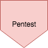
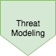
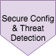
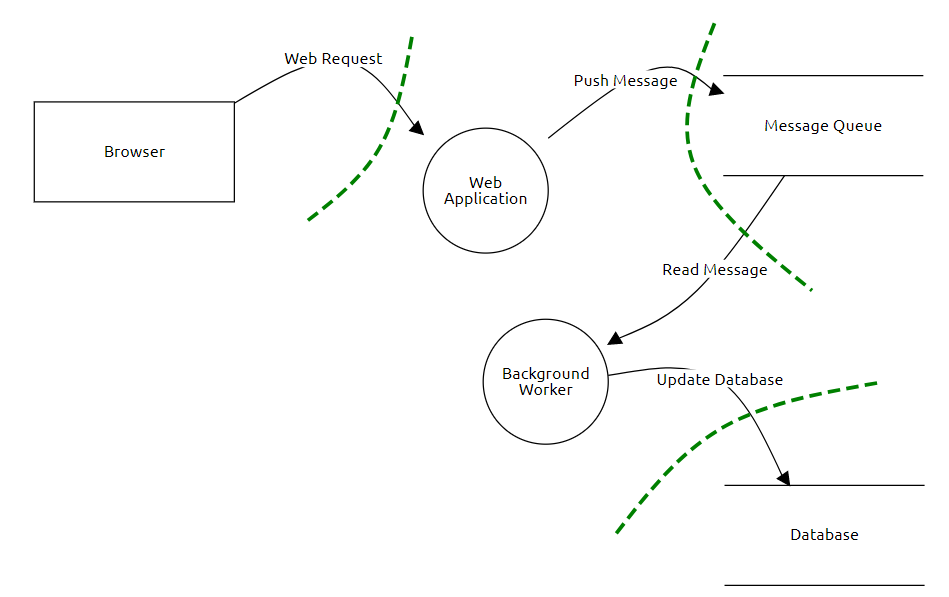
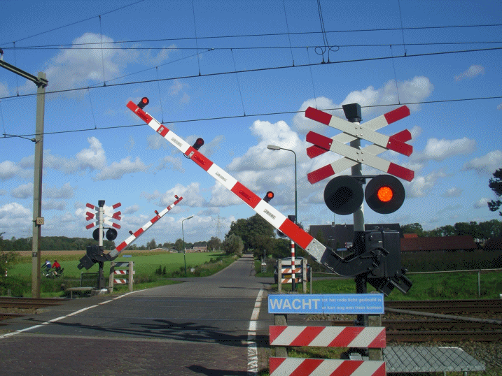
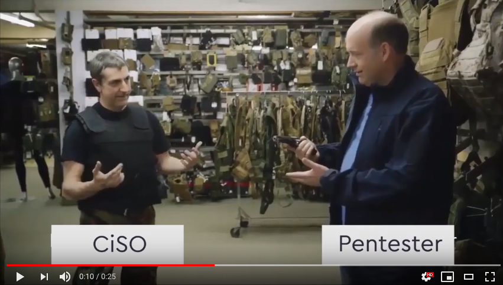

## Secure Software Development

<!-- .element style="box-shadow:none; position: fixed; left: 100px; top: 400px; width: 800px; " -->

--

## Secure Software Development 101

<!-- .element style="z-index: -100; box-shadow:none; position: fixed; left: 40px; top: 130px; width: 750px;" -->
<!-- .element style="box-shadow:none; position: fixed; left: 100px; top: 400px; width: 800px; " class="fragment" data-fragment-index="0" -->
<!-- .element style="box-shadow:none; position: fixed; left: 570px; top: 320px;" class="fragment" data-fragment-index="1" -->

-- Notes --

* Early discovery leads to lower impact and cost to fix
* Late discovery increases cost exponentially
* Cost increases 30-100x

So what do we do?
* Add pentesting

--

## Secure Software Development 101

<!-- .element style="box-shadow:none; position: fixed; left: 200px; top: 100px; width: 600px;" -->

-- Notes --

Feels a bit like this:
* Late discovery
* Increased impact & cost
* Lots of low-hanging fruit
* Less time to find hard-to-find security bugs

--

## Secure Software Development 102

<!-- .element style="z-index: -100; box-shadow:none; position: fixed; left: 40px; top: 130px; width: 750px;" -->

<!-- .element style="box-shadow:none; position: fixed; left: 100px; top: 400px; width: 800px; " -->

<!-- .element style="box-shadow:none; position: fixed; left: 130px; top: 320px;" class="fragment" data-fragment-index="0" -->
<!-- .element style="box-shadow:none; position: fixed; left: 240px; top: 320px;" class="fragment" data-fragment-index="0" -->
<!-- .element style="box-shadow:none; position: fixed; left: 350px; top: 320px;" class="fragment" data-fragment-index="0" -->
<!-- .element style="box-shadow:none; position: fixed; left: 460px; top: 320px;" class="fragment" data-fragment-index="0" -->
<!-- .element style="box-shadow:none; position: fixed; left: 570px; top: 320px;"  -->
<!-- .element style="box-shadow:none; position: fixed; left: 680px; top: 320px;" class="fragment" data-fragment-index="0" -->
<!-- .element style="box-shadow:none; position: fixed; left: 780px; top: 320px;" class="fragment" data-fragment-index="0" -->

<!-- .element style="box-shadow:none; position: fixed; left: 300px; top: 220px;" class="fragment" data-fragment-index="3" -->

--

## Secure Software Development

<!-- .element style="box-shadow:none; position: fixed; right: 40px; top: 10px; width: 120px;" -->

Theoretical risks<!-- .element style="box-shadow:none; position: fixed; left: 30px; top: 430px; width: 160px; font-size: 20px;" -->

Actual risks<!-- .element style="box-shadow:none; position: fixed; left: 270px; top: 430px; width: 160px; font-size: 20px;" -->

Source: [XKCD 538](https://xkcd.com/538/)

-- Notes --

* Risk assessment looks at actual threats
* Attackers don't build supercomputers to crack 4096-bit encryption
* They try the easy ways first, like forcing the user with a wrench

Source: [Security reality](https://xkcd.com/538/)

--

## Secure Software Development

### Impact vs Probability (*)

<!-- .element style="box-shadow:none; position: fixed; right: 40px; top: 10px; width: 120px;" -->
<!-- .element style="box-shadow:none; position: fixed; right: 20px; top: 210px; width: 820px; z-index: -1;" -->

(*) Or D.R.E.A.D.<!-- .element style="box-shadow:none; position: fixed; left: 0px; bottom: 0px;" class="fragment" data-fragment-index="0" -->

-- Notes --

See [DREAD](https://en.wikipedia.org/wiki/DREAD_(risk_assessment_model)) for full risk model 

* Risk Assessment
* CIA Ratings
* Quality Gates
* Security Specifications
* Security Requirements

--

## Secure Software Development

<!-- .element style="box-shadow:none; position: fixed; right: 40px; top: 10px; width: 120px;" -->

<!-- .element style="box-shadow:none; position: fixed; right: 0px; top: 160px; width: 820px; z-index: -1;" -->

-- Notes --

* Architecture Analysis
* Threat Modelling
* Attack Surface Analysis
* Security Architecture

--

## Secure Software Development

### Secure by default

<!-- .element style="box-shadow:none; position: fixed; right: 40px; top: 10px; width: 120px;" -->

<!-- .element style="box-shadow:none; position: fixed; right: 10px; top: 220px; width: 520px;" -->

-- Notes --

* No default login credentials
* Block on mechanism fail

--

## Secure Software Development

### White- vs black- listing

<!-- .element style="box-shadow:none; position: fixed; right: 40px; top: 10px; width: 120px;" -->

<!-- .element style="box-shadow:none;" -->

--

## Secure Software Development

<!-- .element style="box-shadow:none; position: fixed; right: 40px; top: 10px; width: 120px;" -->

<!-- .element style="box-shadow:none; position: fixed; left: 50px; top: 220px; width: 500px; " -->

How Pentesters [think](https://www.youtube.com/watch?v=XKr3Vb9ABHs)

--

## Secure Software Development

<!-- .element style="box-shadow:none; position: fixed; right: 40px; top: 10px; width: 120px;" -->

<!-- .element style="box-shadow:none; position: fixed; left: 50px; top: 170px; width: 500px; " -->

<!-- .element style="border-top: 3px solid #888888; position: fixed; top: 290px; width: 1000px; " class="fragment" data-fragment-index="1" -->

<!-- .element style="border-top: 3px solid #888888; position: fixed; top: 390px; width: 1000px; " class="fragment" data-fragment-index="0" -->

Sweet fruit<!-- .element style="position: fixed; left: 600px; top: 210px; " class="fragment" data-fragment-index="2" -->

Bulk fruit<!-- .element style="position: fixed; left: 600px; top: 320px; " class="fragment" data-fragment-index="1" -->

Low hanging fruit<!-- .element style="position: fixed; left: 600px; top: 420px; " class="fragment" data-fragment-index="0" -->

<!-- .element style="box-shadow:none; position: fixed; right: 20px; top: 410px; " class="fragment fade-in-then-out" data-fragment-index="3" -->
<!-- .element style="box-shadow:none; position: fixed; right: 20px; top: 300px; " class="fragment fade-in-then-out" data-fragment-index="4" -->
<!-- .element style="box-shadow:none; position: fixed; right: 20px; top: 410px; " class="fragment " data-fragment-index="4" -->
<!-- .element style="box-shadow:none; position: fixed; right: -20px; top: 410px; " class="fragment " data-fragment-index="4" -->
<!-- .element style="box-shadow:none; position: fixed; right: 20px; top: 200px; " class="fragment " data-fragment-index="5" -->
<!-- .element style="box-shadow:none; position: fixed; right: 20px; top: 300px; " class="fragment " data-fragment-index="5" -->
<!-- .element style="box-shadow:none; position: fixed; right: -20px; top: 300px; " class="fragment " data-fragment-index="5" -->

Go hack yourself<!-- .element style="box-shadow:none; position: fixed; right: -20px; bottom: 100px; " -->

-- Notes --

* Low hanging fruit:
  * easy security issues
  * script kiddies
* Bulk fruit:
  * intermediate issues
  * blackhat hackers
* Sweet fruit
  * Advanced security issues
  * APT-level hackers
* (Timeboxed) Pentesting catches low hanging fruit
* Enabling devs to do basic or even intermediate Security testing will push Pentesting effort up
* Catches advanced security bugs
  * More value for money
  * More satisfaction for pentesters and client

--

## Secure Software Development

<!-- .element style="box-shadow:none; position: fixed; right: 40px; top: 10px; width: 120px;" -->

* Professional Pen-testing
* Risk Assessment Review
* Advanced Code Review
* Fuzz Testing

<!-- .element style="box-shadow:none; position: fixed; right: 0px; top: 310px; width: 520px; z-index: -1;" -->

--

## Secure Software Development

<!-- .element style="box-shadow:none; position: fixed; right: 40px; top: 10px; width: 120px;" -->

* Secure Deployment
* Secrets Vault
* Server Hardening
* <b>Monitoring / Log aggregation</b>:
  * Splunk, ElasticStack
* Patching & Updating

<!-- .element style="box-shadow:none; position: fixed; right: 0px; top: 210px; width: 500px; z-index: -1;" -->

I'll skip password policies & 2FA, that would take another hour<!-- .element style="box-shadow:none; position: fixed; left: 20px; bottom: 30px; font-size: 15px;" -->
Read [this](https://brampat.github.io/2019-02-20_passwords_fun_with_numbers/README) instead<!-- .element style="box-shadow:none; position: fixed; left: 20px; bottom: 30px; font-size: 15px;" -->

-- Notes --

* Secure Deployment
* Secrets Managements
* Security Configuration
* Server Hardening
* Monitoring with SIEM / Log aggregation:
  * Splunk, ElasticStack, OSSIM, OSSEC, Apache Metron, SIEMonster
* Patching & Updating

--

## Secure Software Development

<!-- .element style="box-shadow:none; position: fixed; right: 40px; top: 10px; width: 120px;" -->

* Phase-out Procedures
* Secure removal
* Data & Code Archiving

-- Notes --

* Phase-out Procedures
* Secure removal of:
  * Application
  * Server
  * Connections (to and from)
  * Account
* Data Archiving
* Code Archiving
