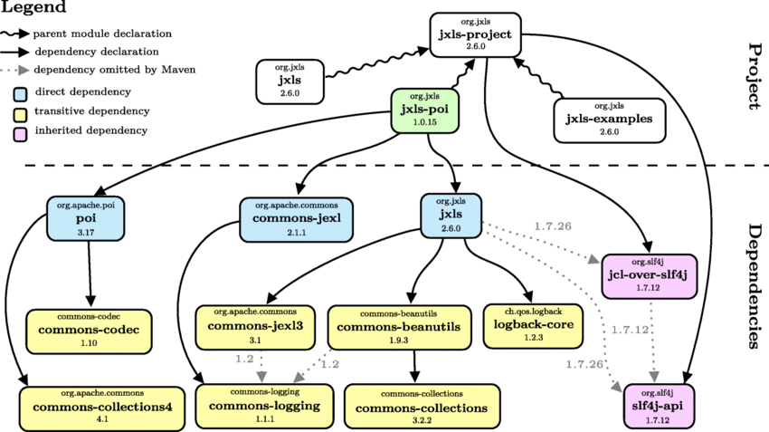
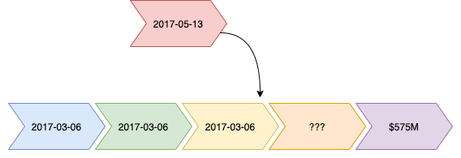

# Supply Chains
<hr />


<!-- .element style="box-shadow:none;" -->
<!-- .element style="box-shadow:none; width: 500px;" -->


-- Notes --

A supply chain is a network between a company and its suppliers to produce and distribute a specific product to the final buyer

The challenges are:
* The path from start to end-product is long with multiple steps for each component
* There are many components, all of which take this long path, some paths merging somewhere in the chain

--

# Software Supply Chain
<hr />

<!-- .element style="box-shadow:none;" -->


* Standard software (MeDoc, MS Exchange, SolarWinds, Kaseya)
* Custom software (Equifax / Struts, HeartBleed, PHP Backdoor)


-- Notes --

Software supply chains can be divided into:
* Using standard software (as-is) as an end user. Example attacks are:
  * MeDoc in Ukraine
  * MS Exchange (Jan 2021)
  * SolarWinds (Mar 2021)
  * Kaseya (Jul 2021)
* Using dependencies in your custom built software. Example attacks are:
  * Equifax (Struts)
  * HeartBleed (OpenSSL)
  * PHP Backdoor (Mar 2021)


--

# Software updates
<hr />

## Standard Software


<!-- .element style="box-shadow:none; position: fixed; bottom: 150px; left: 220px; width: 575px;" -->

<!-- .element style="box-shadow:none; position: fixed; bottom: 250px; left: 350px; width: 275px;" class="fragment" data-fragment-index="1" -->


-- Notes --

Timeline:
* Discovery: Vulnerability is found (Zero day: number of days producer knows about vulnerability), hopefully by an ethical security researcher
* Awareness: Producer is alerted about vulnerability (end of zero day)
* Patch: Producer develops & releases patch
* Install: User installs patch / update

Somewhere in this timeline an exploit may be created, released and used. 

--

# SolarWinds
<hr />

## Targets

* FireEye Cybersecurity firm
* Palo Alto Networks
* Cisco
* Microsoft
* US Treasury
* US Department of Commerce
* ...


<!-- .element style="box-shadow:none; position: fixed; bottom: 150px; right: 20px; width: 275px;" -->
<!-- .element style="box-shadow:none; position: fixed; bottom: 20px; left: 180px; width: 275px;" -->
<!-- .element style="box-shadow:none; position: fixed; bottom: 350px; right: 120px; width: 275px;" -->
<!-- .element style="box-shadow:none; position: fixed; bottom: 10px; right: 220px; width: 225px;" -->


--

# SolarWinds
<hr />

<!-- .element style="box-shadow:none; position: fixed; bottom: -150px; right: 20px; width: 975px;" -->

-- Notes --

* 2017: Github repo password "solarwinds123"
* Sep 4, 2019: Attackers access network
* Sep 12, 2019: Implanted test-code in SolarWinds Orion
* November 22, 2019: Fixed password
* Feb 20, 2020: Implanted backdoor "Solorigate"
* Mar, 2020: Official release includes backdoor
  * Sunburst distribution & target profiling
* May, 2020: Backdoor used
  * Teardrop activated
* Jun 4, 2020: Attackers clean malware from SolarWinds build-servers
* Dec 12, 2020: Solorigate supply chain attack disclosed

--

# Custom Software
<hr />

## Dependency Bugs

<!-- .element style="box-shadow:none; position: fixed; bottom: 375px; left: 20px; width: 275px;" class="fragment fade-in" data-fragment-index="1" -->

<span>Apache Http Core</span><!-- .element style="font-size: 10px; position: fixed; bottom: 450px; left: 110px; width: 210px;" class="fragment fade-in" data-fragment-index="1" -->

<!-- .element style="box-shadow:none; position: fixed; bottom: 375px; left: 300px; width: 210px;" class="fragment fade-in" data-fragment-index="2" -->

<span>Apache Http Client</span><!-- .element style="font-size: 10px; position: fixed; bottom: 450px; left: 360px; width: 210px;" class="fragment fade-in" data-fragment-index="2" -->

<!-- .element style="box-shadow:none; position: fixed; bottom: 375px; left: 515px; width: 210px;" class="fragment fade-in" data-fragment-index="2" -->

<span>Camel Http</span><!-- .element style="font-size: 10px; position: fixed; bottom: 450px; left: 580px; width: 210px;" class="fragment fade-in" data-fragment-index="2" -->

<!-- .element style="box-shadow:none; position: fixed; bottom: 375px; left: 730px; width: 210px;" class="fragment fade-in" data-fragment-index="2" -->

<span>My App</span><!-- .element style="font-size: 10px; position: fixed; bottom: 450px; left: 810px; width: 210px;" class="fragment fade-in" data-fragment-index="2" -->

<!-- .element style="box-shadow:none; position: fixed; bottom: 20px; right: 20px; width: 525px;"  -->


-- Notes --

Timeline:
* Vulnerability is found (Zero day: number of days producer knows about vulnerability)
* Dependency maintainer is alerted about vulnerability (end of zero day)
* Maintainer develops & releases patch
* User upgrades dependency


--

# Dependencies
<hr />


Spring Boot "Hello World"

<!-- .slide: class="table-medium dependency" -->

```java
@RestController
public class Controller {

   @GetMapping("/hello")
   public String hello() {  return "hello"; }
}
```


|         | Own code    | Dependency code |
|---------|------------:|-----------------|
| Lines   | 4           | 518772          |
| Percent | 0.001%      | 99.999%         |


<!-- .element style="box-shadow:none; position: fixed; bottom: 150px; right: 20px; width: 525px;" class="fragment fade-in" data-fragment-index="0" -->


--

# Real-life example
<hr />


Spring Boot - RabbitMQ

<!-- .slide: class="table-medium dependency" -->


|         | Own code    | Dependency code |
|---------|------------:|-----------------|
| Lines   | 5225 lines  |                 |
| KB      | 329 KB      | 73.8 MB         |
| Percent | 0.004%      | 99.996%         |


<!-- .element style="box-shadow:none; position: fixed; bottom: 150px; right: 20px; width: 525px;" -->


--

# Apache Struts - Equifax
<hr />

* Apache Struts
* CVE-2017-5638
* CVSS 10.0

<!-- .element style="box-shadow:none; position: fixed; bottom: 150px; left: 220px; width: 425px;" class="fragment fade-in-then-out" data-fragment-index="0" -->
<!-- .element style="box-shadow:none; position: fixed; bottom: 150px; left: 220px; width: 683px;" class="fragment fade-in-then-out" data-fragment-index="1" -->

-- Notes --

* CVE-2017-5638 (CVSS 10.0)
  * Discovered 2017-03-06
* Apache Struts 2.3.5 to 2.3.31 / 2.5 - 2.5.10
  * Alerted on 2017-03-08 by US-CERT
* Patch Apache Struts 2.3.32 / 2.5.10.1
  * Release on 2017-03-06
* Class-action law-suit filed for $70B (add 9 zero's) on 2017-09-17
  * Settlement for $575M on 2019-07-22 after many protective measures for Equifax by Trump appointed officials

Sources:
* [Wikipedia](https://en.wikipedia.org/wiki/2017_Equifax_data_breach)


--

# Supply chain theory
<hr />

## Harvesting cc's and passwords

* Jan 6, 2018
* Blog describing supply chain attack
  * OpenSource contribution
  * Javascript indirect dependency
  * Highly stealthy attack
  * Stealing Credit-cards & passwords

<!-- .element style="box-shadow:none; position: fixed; bottom: 50px; right: 20px; width: 325px;" -->


Source: [Hackernoon](https://medium.com/hackernoon/im-harvesting-credit-card-numbers-and-passwords-from-your-site-here-s-how-9a8cb347c5b5) by David Gilbertson 

-- Notes --

* Fictive scenario with contributions to popular open-source projects.
* Adds indirect dependencies
* Infect indirect dependencies

Source: [Hackernoon](https://medium.com/hackernoon/im-harvesting-credit-card-numbers-and-passwords-from-your-site-here-s-how-9a8cb347c5b5)
* David Gilbertson


--

# Browse-Aloud
<hr />

## Crypto malware

<!-- .element style="box-shadow:none; position: fixed; bottom: 0px; right: -50px; width: 525px;" -->
<!-- .element style="box-shadow:none; position: fixed; bottom: 100px; right: 420px; width: 175px;" -->


* Feb, 2018
* JavaScript plugin for accessibility
* Malware implanted Crypto-miner


-- Notes --

A month after the fictive story, Browse-aloud browser aid for visually challenged ppl is infected
* may websites using the Browse-aloud plugin directly from its CDN are infected, including
  * Manchester City Council
  * US Courts
  * NHS
  * 

Source: [Wired](https://www.wired.co.uk/article/browsealoud-ico-texthelp-cryptomining-how-cryptomining-work)

--

# Dependency Confusion
<hr />

* Feb 9, 2021: $130k Bug bounty
* Public vs private package-name overriding
* Targets:
  * Shopify $30k
  * Apple $30k
  * Paypal $30k
  * Microsoft $40k

<!-- .element style="box-shadow:none; position: fixed; bottom: 10px; right: 20px; width: 575px;" -->

-- Notes --

Other research:
* Dependency confusion creates infected public libraries in the same namespace (similar to typosquatting) as company private dependencies
* 35+ companies, mostly 1000+ employees
* Total of $130k bounties form 4 companies
* Source: [Medium](https://medium.com/@alex.birsan/dependency-confusion-4a5d60fec610) by Alex Birsan


--

# PHP backdoor
<hr />

* March 28, 2021: Backdoor implanted in PHP's on-premise GIT
* March 29, 2021: Rollback
  * PHP promoted Github to their canonical repo

<!-- .element style="box-shadow:none;" -->

Source: [ArsTechnica](https://arstechnica.com/gadgets/2021/03/hackers-backdoor-php-source-code-after-breaching-internal-git-server/)

--

# OMIGOD
<hr />

Open Management Infrastructure on MS Azure

* CVE-2021-38647 – Unauthenticated RCE as root (Severity: 9.8)
* CVE-2021-38648 – Privilege Escalation vulnerability (Severity: 7.8)
* CVE-2021-38645 – Privilege Escalation vulnerability (Severity: 7.8)
* CVE-2021-38649 – Privilege Escalation vulnerability (Severity: 7.0)


[Source](https://www.wiz.io/blog/secret-agent-exposes-azure-customers-to-unauthorized-code-execution)

--

# Mitigation
<hr />

* Zero Trust Policy
* Secure Software Development
  * Artifact Repositories
  * Dependency Check
  * Content Security Policy
  * Code Signing

--

# Dependency Check
<hr />

<!-- .element style="box-shadow:none;" -->
<!-- .element style="box-shadow:none; position: fixed; right: 10px;" -->
<!-- .element style="box-shadow:none; position: fixed; right: 390px; top: 160px; " -->
<!-- .element style="box-shadow:none; position: fixed; right: 50px; bottom: 100px;" -->
<!-- .element style="box-shadow:none; position: fixed; left: 50px; bottom: 20px;" -->

--

# SigStore
<hr />

* Let's Encrypt for code-signing

<!-- .element style="box-shadow:none; position: fixed; bottom: 10px; right: 20px; width: 425px;" -->
<!-- .element style="box-shadow:none; position: fixed; bottom: 150px; left: 20px; width: 200px;" -->
<!-- .element style="box-shadow:none; position: fixed; bottom: 210px; left: 220px; width: 200px;" -->
<!-- .element style="box-shadow:none; position: fixed; bottom: 310px; left: 120px; width: 200px;" -->
<!-- .element style="box-shadow:none; position: fixed; bottom: 110px; left: 270px; width: 200px;" -->

-- Notes --

Source: [Google Blog](https://security.googleblog.com/2021/03/introducing-sigstore-easy-code-signing.html)


--


# Further reading

<hr />

* OWASP Top 10 A9 (2017): Using Componentns with Known Vulnerabilities
* Security Journey:
  * White Belt lesson 11: Software Supply Chain
  * Yellow Belt lesson 14: OWASP Top 10 part 3
* [Backstabber’s Knife Collection: A Review of Open Source Software Supply Chain Attacks](https://link.springer.com/chapter/10.1007%2F978-3-030-52683-2_2)
* [Hunting Malicious NPM packages](https://duo.com/decipher/hunting-malicious-npm-packages)
* [Software Supply Chain Attacks](https://www.whitesourcesoftware.com/resources/blog/software-supply-chain-attacks/)
* [Fixing vulnerabilities in Maven projects](https://snyk.io/blog/fixing-vulnerabilities-in-maven-projects/)
* [Easy Code Signing & Verification for Supply Chain Integrity](https://security.googleblog.com/2021/03/introducing-sigstore-easy-code-signing.html)


--

Notes:
https://www.wiz.io/blog/secret-agent-exposes-azure-customers-to-unauthorized-code-execution