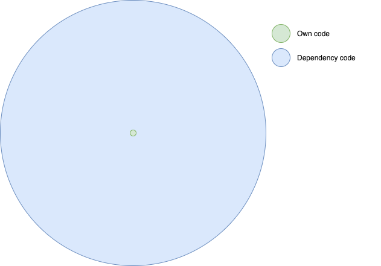

# Software development
<hr />

## Dependencies

<!-- .slide: class="table-medium dependency" -->

```java
@RestController
public class Controller {

   @GetMapping("/hello")
   public String hello() {  return "hello"; }
}
```


|         | Own code    | Dependency code |
|---------|------------:|-----------------|
| Lines   | 4           | 518772          |
| Percent | 0.001%      | 99.999%         |


<!-- .element style="box-shadow:none; position: fixed; bottom: 150px; right: 20px; width: 525px;" -->


--

# Hackernoon
<hr />

## Hypothetical story

* Jan 6, 2018
* Blog describing supply chain attack
  * Javascript indirect dependency
  * Highly stealthy attack
  * Stealing Credit-card & login data

<!-- .element style="box-shadow:none; position: fixed; bottom: 50px; right: 20px; width: 325px;" -->


-- Notes --

Source: [Hackernoon](https://medium.com/hackernoon/im-harvesting-credit-card-numbers-and-passwords-from-your-site-here-s-how-9a8cb347c5b5)
* David Gilbertson


--

# Browse-Aloud
<hr />

## Crypto malware

<!-- .element style="box-shadow:none; position: fixed; bottom: 0px; right: -50px; width: 525px;" -->
<!-- .element style="box-shadow:none; position: fixed; bottom: 100px; right: 420px; width: 175px;" -->


* Feb, 2018
* JavaScript plugin for accessibility
* Malware implanted Crypto-miner


-- Notes --

Source: [Wired](https://www.wired.co.uk/article/browsealoud-ico-texthelp-cryptomining-how-cryptomining-work)


--

# SolarWinds
<hr />

## Targets

* FireEye Cybersecurity firm
* Palo Alto Networks
* Cisco
* Microsoft
* US Treasury
* US Department of Commerce
* ...


<!-- .element style="box-shadow:none; position: fixed; bottom: 150px; right: 20px; width: 275px;" -->
<!-- .element style="box-shadow:none; position: fixed; bottom: 20px; left: 180px; width: 275px;" -->
<!-- .element style="box-shadow:none; position: fixed; bottom: 350px; right: 120px; width: 275px;" -->
<!-- .element style="box-shadow:none; position: fixed; bottom: 10px; right: 220px; width: 225px;" -->


--

# SolarWinds
<hr />

<!-- .element style="box-shadow:none; position: fixed; bottom: -150px; right: 20px; width: 975px;" -->

-- Notes --

* 2017: Github repo password "solarwinds123"
* Sep 4, 2019: Attackers access network
* Sep 12, 2019: Implanted test-code in SolarWinds Orion
* November 22, 2019: Fixed password
* Feb 20, 2020: Implanted backdoor "Solorigate"
* Mar, 2020: Official release includes backdoor
  * Sunburst distribution & target profiling
* May, 2020: Backdoor used
  * Teardrop activated
* Jun 4, 2020: Attackers clean malware from SolarWinds build-servers
* Dec 12, 2020: Solorigate supply chain attack disclosed


--

# Dependency Confusion
<hr />

* Feb 9, 2021: $130k Bug bounty
* Public vs private package-name overriding
* Targets:
  * Shopify $30k
  * Apple $30k
  * Microsoft
  * Paypal

<!-- .element style="box-shadow:none; position: fixed; bottom: 10px; right: 20px; width: 575px;" -->

-- Notes --

* Source: [Medium](https://medium.com/@alex.birsan/dependency-confusion-4a5d60fec610) by Alex Birsan


--

# PHP backdoor
<hr />

* March 28, 2021: Backdoor implanted in PHP's on-premise GIT
* March 29, 2021: Rollback
  * PHP promoted Github to their canonical repo


--

# Mitigation
<hr />

* Zero Trust Policy
* Secure Software Development
  * Artifact Repositories
  * Content Security Policy
  * Code Signing

--

# SigStore
<hr />

* Let's Encrypt for code-signing

<!-- .element style="box-shadow:none; position: fixed; bottom: 10px; right: 20px; width: 425px;" -->
<!-- .element style="box-shadow:none; position: fixed; bottom: 150px; left: 20px; width: 200px;" -->
<!-- .element style="box-shadow:none; position: fixed; bottom: 210px; left: 220px; width: 200px;" -->
<!-- .element style="box-shadow:none; position: fixed; bottom: 310px; left: 120px; width: 200px;" -->
<!-- .element style="box-shadow:none; position: fixed; bottom: 110px; left: 270px; width: 200px;" -->

-- Notes --

Source: [Google Blog](https://security.googleblog.com/2021/03/introducing-sigstore-easy-code-signing.html)


