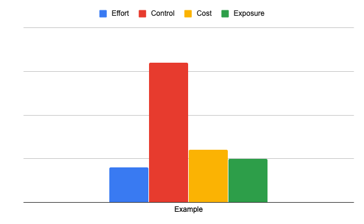
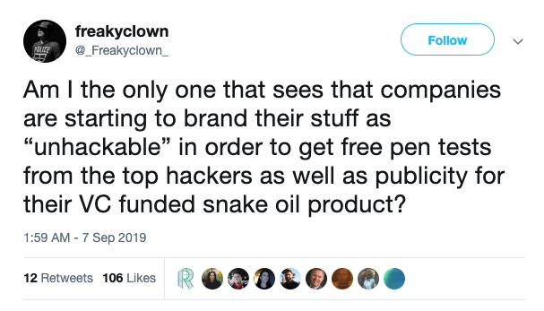
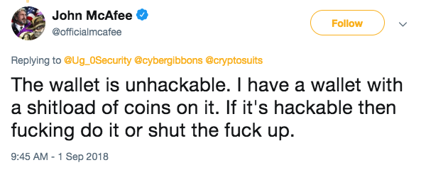
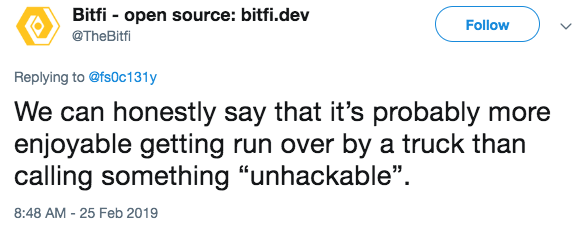
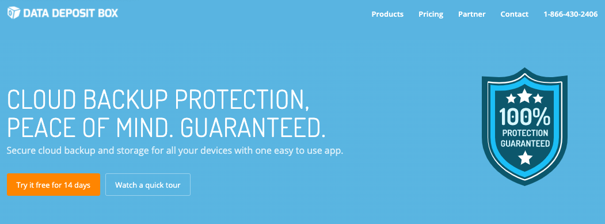
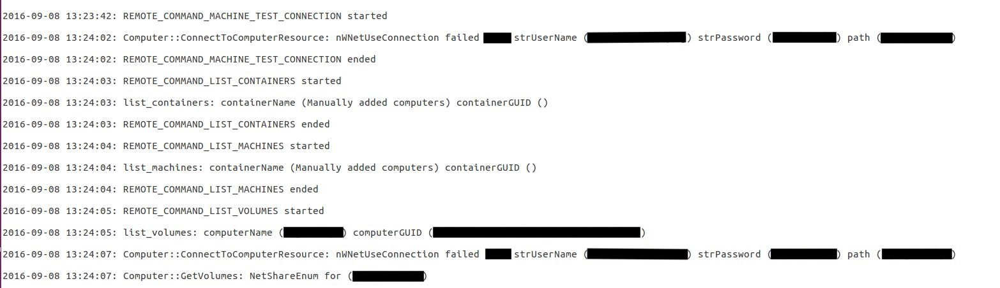
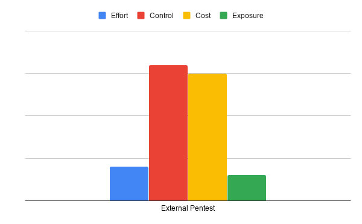
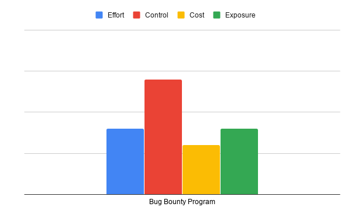
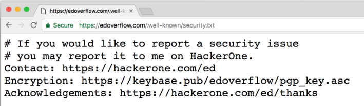
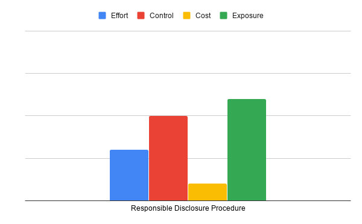

## Testing software

--

## SSDLC

<!-- .element style="box-shadow:none; position: fixed; left: 100px; top: 400px; width: 800px; " -->
<!-- .element style="z-index: -100; box-shadow:none; position: fixed; left: 40px; top: 130px; width: 750px;" class="fragment" data-fragment-index="1" -->

<!-- .element style="box-shadow:none; position: fixed; left: 130px; top: 320px;" class="fragment" data-fragment-index="3" -->
<!-- .element style="box-shadow:none; position: fixed; left: 240px; top: 320px;" class="fragment" data-fragment-index="3" -->
<!-- .element style="box-shadow:none; position: fixed; left: 350px; top: 320px;" class="fragment" data-fragment-index="3" -->
<!-- .element style="box-shadow:none; position: fixed; left: 460px; top: 320px;" class="fragment" data-fragment-index="3" -->
<!-- .element style="box-shadow:none; position: fixed; left: 570px; top: 320px;" class="fragment" data-fragment-index="2" -->
<!-- .element style="box-shadow:none; position: fixed; left: 680px; top: 320px;" class="fragment" data-fragment-index="3" -->
<!-- .element style="box-shadow:none; position: fixed; left: 780px; top: 320px;" class="fragment" data-fragment-index="3" -->

<!-- .element style="box-shadow:none; position: fixed; left: 300px; top: 220px;" class="fragment" data-fragment-index="3" -->

--

## Five ways of testing

1. Internal testing
2. Pentest
3. Bug Bounty Program
4. Responsible Disclosures
5. Say "It's unhackable"

-- Notes --

Five main ways to test your software product:
1. Make developers test their own software
2. Hire pentesters to do this (most common way)
4. Use a bug-bounty platform (private or public)
3. Have a responsible disclosure policy and hope someone (everyone) uses it
5. Say your product or service is unhackable

--

## Criteria

* Effort
* Control
* Cost
* Exposure

<!-- .element style="box-shadow:none; position: fixed; right: 50px; top: 250px;"  -->

-- Notes --

* Effort: How much effort to set up / initiate
* Control: How much control over testing / testers
* Cost: How much cost to set up / initiate including results / consequences
* Exposure: How much exposure to outside it generates

--

## Unhackable

<!-- .element style="box-shadow:none; position: fixed; right: 50px; top: 50px;"  -->

-- Notes --

5. Say your product or service is unhackable

These "promises" are like a red cloth for a horde of bulls: They will storm it and take it down.

--

## Unhackable

<!-- .element style="box-shadow:none; position: fixed; left: 150px; top: 150px; width: 700px;"  -->

Companies are branding their stuff "unhackable" to get free pen-tests & publicity (*)<!-- .element style="box-shadow:none; position: fixed; left: 190px; top: 250px; width: 600px;"  -->

(*) Edited for better reading, source in presentation-notes<!-- .element style="box-shadow:none; position: fixed; left: 10px; bottom: 20px; width: 600px; font-size: 10px;"  -->

-- Notes --

* [Source](https://twitter.com/_Freakyclown_/status/1170260326488715264)
* It does give you free pen-tests, yes, but at what cost?
* Bad PR, no PenTest report, no decent coverage, no handover

--

## Unhackable

### Bitfi

<!-- .element style="box-shadow:none; position: fixed; right: 50px; top: 50px; width: 400px;"  -->
<!-- .element style="box-shadow:none; position: fixed; left: 50px; bottom: 50px;"  -->

-- Notes --

* Example:
  * BitFi launched Cryptocurrency-wallet with no security weaknesses
  * Technically, they didn't say it was unhackable

--

## Unhackable

### Bitfi

-- Notes --
* Until someone else did it for them, backer McAfee (yes, from the security company)

--

## Unhackable

### Bitfi

<!-- .element style="box-shadow:none; position: fixed; right: 50px; top: 50px;"  -->

-- Notes --
And then the expected happened, when the wallet got hacked

--

## Unhackable

### Bitfi

-- Notes --
After which they admitted it wasn't the best idea

--

## Unhackable

### Bitfi

-- Notes --
But they still claim something, except it's not verified for accuracy 

--

## Unhackable

### Data Deposit Box

-- Notes --

Provides Secure Cloud backup protection
100% protection!!!

--

## Unhackable

### Data Deposit Box

-- Notes --

Yep, they leaked their own data, including unencrypted usernames and passwords (in logfiles).
Data was stored in unprotected Amazon S3 bucket

Source: [VPNMentor](https://www.vpnmentor.com/blog/report-datadepositbox-leak/)

--

## Unhackable

### Data Deposit Box (open S3 bucket)

-- Notes --

Don't ever log passwords

Source: [VPNMentor](https://www.vpnmentor.com/blog/report-datadepositbox-leak/)

But only amateurs are so stupid?
* [Twitter](https://www.adweek.com/digital/twitter-corrected-a-bug-that-caused-passwords-to-be-stored-in-plain-text/) did it (May 2018)
* [Facebook](https://krebsonsecurity.com/2019/03/facebook-stored-hundreds-of-millions-of-user-passwords-in-plain-text-for-years/) did it (Mar 2019)
* [Google](https://www.theverge.com/2019/5/21/18634842/google-passwords-plain-text-g-suite-fourteen-years) did it (May 2019)

--

## Unhackable

<!-- .element style="box-shadow:none; position: fixed; left: 150px; top: 150px;"  -->

-- Notes --

* In conclusion, testing by claiming unhackable requires no effort and you get lots of free exposure.
* But it comes at a high cost and you have no control over the process.

--

## Pentest

<!-- .element style="box-shadow:none; position: fixed; right: 50px; top: 150px;"  -->

* Effort: Call us!
* Control: Rules of Engagement
* Cost: $$$
* Exposure: NDA, external
* Extra: Professionals, reporting, advise

-- Notes --

2. Hire pentesters to do this (most common way)

In contrast: a professional pentest can be:
* controlled, with minimal to no exposure (NDA is standard)
* Also requires minimal effort (call a pentest-company, sign a contract, pay some money)
* Does cost a bit, but you get good to excellent pentest-reports with advise on mitigation strategy / actions

--

## Pentest

<!-- .element style="box-shadow:none; position: fixed; left: 150px; top: 150px;"  -->

--

## Internal Testing

* SSDLC (for real)

-- Notes --

1. Make developers test their own software

Doing this with your internal team can decrease the monetary cost, but:
* requires lots of efforts to get your team on the required level
* You have virtually total control and no exposure outside the company (except leaks or if you choose to expose / transparency)

* Effort: Training, doing, improving
* Control: Internal, policy needed
* Cost: Minimal $$$, but time
* Exposure: NDA, internal

--

## Internal Testing

<!-- .element style="box-shadow:none; position: fixed; left: 150px; top: 150px;"  -->

--

## Bug Bounties

<!-- .element style="position: fixed; width: 150px; top: 270px; right: 50px; background-color: #ffffff;" -->
<!-- .element style="position: fixed; width: 150px; top: 340px; right: 210px; background-color: #ffffff;"  -->
<!-- .element style="position: fixed; width: 150px; top: 430px; right: 3px; background-color: #ffffff;"  -->

* Market for testers & companies

<!-- .element style="position: fixed; width: 450px; bottom: 50px; left: 30px; background-color: #ffffff;"  -->

-- Notes --

Platforms:
* HackerOne
* ZeroCopter
* Bugcrowd

4. Use a bug-bounty platform (private or public)

* A bug-bounty program can supply much cheaper pentesting (bug-based payout), but you have to have decent baseline security or you'll still get bombarded with bugs
* You also have to have process in place to respond and mitigate bugs
* Control is reasonable, you could go private or public bounty program. Control follows the quality of mitigation process quality
  * Control is less when dealing with inexperienced bounty-hunters, so learn to deal (in positive ways) with those
  * Learn how these bug-bounty hunters think, extend a hand way forward to them
* Cost is dependent on how many findings & nature you get, and what bounties you set.
  * Better internal testing should get easy finds
  * Better payout should draw in experienced bounty-hunters

* Effort: Have IR, then call BB-platform
* Control: Private or Public, Rules of Engagement
* Cost: Depends on findings & payout
* Exposure: Private or Public

--

## Bug Bounties

<!-- .element style="position: fixed; width: 650px; top: 170px; right: 150px; background-color: #ffffff;" -->

--

## Bug Bounties

<!-- .element style="box-shadow:none; position: fixed; left: 150px; top: 150px;"  -->

--

## Responsible Disclosure

* Contact-info
* Easy to find
* Rules of Engagement
* One-sided promise
* No contract

<!-- .element style="box-shadow:none; position: fixed; width: 500px; right: 150px; bottom: 150px;"  -->

-- Notes --

3. Have a responsible disclosure policy and hope someone (everyone) uses it

* Effort setting up is easy: security.txt and easy to find contact info
  * Effort to handle is dependent on how good you are at incident response
* Control depends on responsible disclosure rules (make them easy to read, though clear on feasible requirements)
  * Make sure you can fix bugs within short time-frame
  * Fixing in very short time-frame is PR bonus
* Cost depends on bounties:
  * Geeky shirts and stickers are cool, but product and $$$ are better. Doesn't have to be $100k budget (unless you're Google / Facebook)
* Exposure depends on product, PR, handling etc.
  * If you handle it badly, you WILL get exposure
  * If you have a security-related product, you WILL get exposure: see BitFi, secure USB's etc.
  * If you handle these effectively AND pay & praise researchers, you could get good PR exposure: see Tesla, Google, Microsoft, Facebook (sometimes)

Tips:
* Setup incident response and mitigation process first (and practice)
* Then add security.txt to your site, add a nicely formatted page as well, and your good to go.
* Control: reasonable, if you respond quickly and reach out to security community, talk THEIR language
* Cost is quite low. If you're a tech-company, think about paying in shirts, stickers or product, if it fits tech-savvy security researchers.
* Understand that you could get exposure, but you indirectly influence whether that will be negative or positive (again, depends on quality of response process)

--

## Responsible Disclosure

<!-- .element style="box-shadow:none; position: fixed; left: 150px; top: 150px;"  -->

--

## Testing

### Control vs exposure

<!-- .element style="box-shadow:none; position: fixed; left: 150px; top: 200px;"  -->

-- Notes --

* With more exposure comes less control
* Saying you're unhackable is basically the bullseye on your head

--

## Testing

### Cost vs effort

<!-- .element style="box-shadow:none; position: fixed; left: 150px; top: 200px;"  -->

-- Notes --

* Effort to say you're unhackable is really low: post on Social media will land with the correct hackers very quickly
  * But costs will be high or gigantic, depending on how ethical they handle it
  * Prepare for PR backlash and bad publicity in news
* Initiating pentest is also easy: phone us, we'll do it for you
  * Running quality pentests that cover both low fruit and advanced attacks is expensive
* Having a responsible disclosure requires very little effort and cost:
  * Security.txt proposed standard at [IETF.org](https://tools.ietf.org/html/draft-foudil-securitytxt-06)
  * Generate one at [securitytxt.org](https://securitytxt.org/)
  * But handling them requires a business process to communicate between external researchers of various levels (in experience and communication) and development teams that should solve the issues
  * Cost could include small thank-you's from acknowledgements / mentions to stickers and t-shirts to products and bounties
* Bug bounties formalize and streamline responsible disclosure
  * Effort is again two parts: setting up and handling
  * Setup is a bit more than just a responsible disclosure, but platforms help with that
  * Handling is similar to responsible disclosure, so reuse that for both
  * Cost will be: fee's to Bug bounty platform and thank-you's mostly in form of bounties, but thank-you's, stickers, t-shirts and product for duplicates or low-level bugs will increase goodwill
  * Private bug-bounties should be aimed at experienced bug-hunters, which will result in more and higher bounty-payouts
  * Cost also depends on how good the base security is of what you like to test
* Internal is all about maturity of SSDLC
  * Start with awareness training for devs
  * Learn them how to [Hack yourself first](https://www.pluralsight.com/courses/hack-yourself-first)
  * That should fix low hanging fruit.
  * Have experienced pentesters test for advanced issues
  * Having automated security (unit-) tests is very helpful

--

## Testing

### Advise

Set up bug-fixing process
  * Test & practice
  * Integrate in SSDLC
  * Make it:
    * Fast
    * Reliable

--

## Testing

### Advise

1. Internal testing<!-- .element class="fragment" data-fragment-index="0" -->
2. External Pentesting<!-- .element class="fragment" data-fragment-index="1" -->
3. Private Bug-bounties<!-- .element class="fragment" data-fragment-index="2" -->
4. Public Bug-bounties<!-- .element class="fragment" data-fragment-index="3" -->

Add Responsible Disclosure whenever IR & SSDLC is mature<!-- .element class="fragment" data-fragment-index="4" -->

--

## Testing

### Advise

Embrace external researchers
* Acknowledge
* Cooperate
* Thank
* Never, EVER claim you're unhackable<!-- .element class="fragment" -->

--

## (Re)Sources

* [DawgyG](https://darknetdiaries.com/episode/60/)
* [XBox Underground](https://darknetdiaries.com/episode/45/)