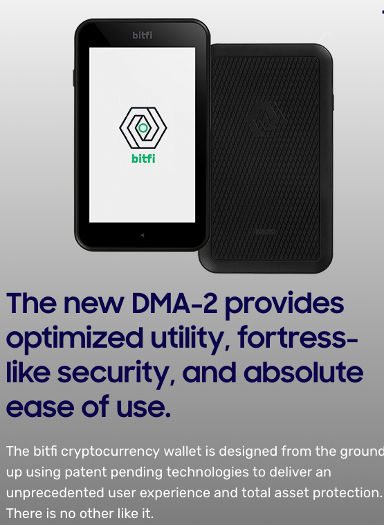
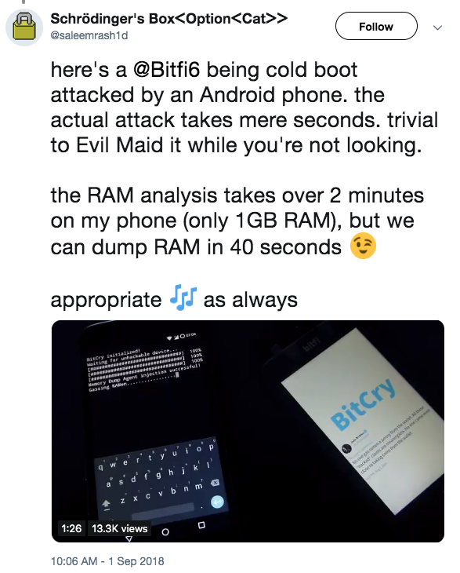
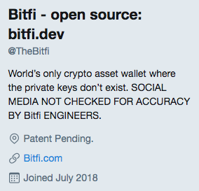

## Testing software

Work in progress

--

## SSDLC

TODO: ADD DECOMMISSION

<!-- .element style="box-shadow:none; position: fixed; left: 100px; top: 400px; width: 800px; " -->

<!-- .element style="box-shadow:none; position: fixed; left: 140px; top: 350px;" -->
<!-- .element style="box-shadow:none; position: fixed; left: 265px; top: 350px;"  -->
<!-- .element style="box-shadow:none; position: fixed; left: 390px; top: 350px;"  -->
<!-- .element style="box-shadow:none; position: fixed; left: 515px; top: 350px;"  -->
<!-- .element style="box-shadow:none; position: fixed; left: 640px; top: 350px;"  -->
<!-- .element style="box-shadow:none; position: fixed; left: 765px; top: 350px;"  -->

<!-- .element style="box-shadow:none; position: fixed; left: 265px; top: 250px;"  -->

--

## Testing

### Five ways

1. Internal testing<!-- .element class="fragment" data-fragment-index="0" -->
2. Pentest<!-- .element class="fragment" data-fragment-index="1" -->
3. Bug Bounty Program<!-- .element class="fragment" data-fragment-index="2" -->
4. Responsible Disclosures<!-- .element class="fragment" data-fragment-index="3" -->
5. Say "It's unhackable"<!-- .element class="fragment" data-fragment-index="4" -->

-- Notes --

Five main ways to test your software product:
1. Make developers test their own software
2. Hire pentesters to do this (most common way)
4. Use a bug-bounty platform (private or public)
3. Have a responsible disclosure policy and hope someone (everyone) uses it
5. Say your product or service is unhackable

--

## Testing

### Criteria

* Effort
* Control
* Cost
* Exposure

--

## Unhackable

<!-- .element style="box-shadow:none; position: fixed; right: 50px; top: 50px;"  -->

--

## Unhackable

### Bitfi

<!-- .element style="box-shadow:none; position: fixed; right: 50px; top: 50px; width: 400px;"  -->
<!-- .element style="box-shadow:none; position: fixed; left: 50px; bottom: 50px;"  -->

--

## Unhackable

### Bitfi

--

## Unhackable

### Bitfi

<!-- .element style="box-shadow:none; position: fixed; right: 50px; top: 50px;"  -->

--

## Unhackable

### Bitfi

--

## Unhackable

### Bitfi

--

## Unhackable

* No effort
* No control
* High cost: PR, damage, recalls / panic fixes
* High exposure

--

## Pentest

* Low effort
* High control
* High cost: expensive to catch all
* Low exposure

--

## Internal Testing

* Low effort
* High control
* High cost: expensive to catch all
* Low exposure

--

## Bug Bounties

* Low effort
* High control
* High cost: expensive to catch all
* Low exposure

--

## Responsible Disclosure

* Medium effort
* Medium control
* Low cost
* Medium exposure

-- Notes --

* Effort setting up is easy: security.txt and fo
  * Effort to handle is dependent on dev-team's ability to communicate with bug-reporters and fix bugs
* Control depends on responsible disclosure rules (make them easy to read, though clear on feasible requirements)
  * Make sure you can fix bugs within short time-frame
  * Fixing in very short time-frame is PR bonus
* Cost depends on bounties:
  * Geeky shirts and stickers are cool, but product and $$$ are better. Doesn't have to be $100k budget (unless you're Google / Facebook)
* Exposure depends on product, PR, handling etc.
  * If you handle it badly, you WILL get exposure
  * If you have a security-related product, you WILL get exposure: see BitFi, but also Tesla, secure USB's etc.

--

## Testing

### Control vs exposure

-- Notes --

* With more exposure comes less control
* Saying you're unhackable is basically the bullseye on your head

--

## Testing

### Cost vs effort

-- Notes --

* Effort to say you're unhackable is really low: post on Social media will land with the correct hackers very quickly
  * But costs will be high or gigantic, depending on how ethical they handle it
  * Prepare for PR backlash and bad publicity in news
* Initiating pentest is also easy: phone us, we'll do it for you
  * Running quality pentests that cover both low fruit and advanced attacks is expensive
* Having a responsible disclosure requires very little effort and cost:
  * Security.txt proposed standard at [IETF.org](https://tools.ietf.org/html/draft-foudil-securitytxt-06)
  * Generate one at [securitytxt.org](https://securitytxt.org/)
  * But handling them requires a business process to communicate between external researchers of various levels (in experience and communication) and development teams that should solve the issues
  * Cost could include small thank-you's from acknowledgements / mentions to stickers and t-shirts to products and bounties
* Bug bounties formalize and streamline responsible disclosure
  * Effort is again two parts: setting up and handling
  * Setup is a bit more than just a responsible disclosure, but platforms help with that
  * Handling is similar to responsible disclosure, so reuse that for both
  * Cost will be: fee's to Bug bounty platform and thank-you's mostly in form of bounties, but thank-you's, stickers, t-shirts and product for duplicates or low-level bugs will increase goodwill
  * Private bug-bounties should be aimed at experienced bug-hunters, which will result in more and higher bounty-payouts
  * Cost also depends on how good the base security is of what you like to test
* Internal is all about maturity of SSDLC
  * Start with awareness training for devs
  * Learn them how to [Hack yourself first](https://www.pluralsight.com/courses/hack-yourself-first)
  * That should fix low hanging fruit.
  * Have experienced pentesters test for advanced issues
  * Having automated security (unit-) tests is very helpful

--

## Testing

### Advise

* Proper bug-fixing process<!-- .element class="fragment" data-fragment-index="0" -->
  * Fast
  * Reliable
* Embrace external researchers<!-- .element class="fragment" data-fragment-index="1" -->
  * Acknowledge
  * Cooperate
  * Thank
* Never, EVER claim you're unhackable<!-- .element class="fragment" data-fragment-index="2" -->
